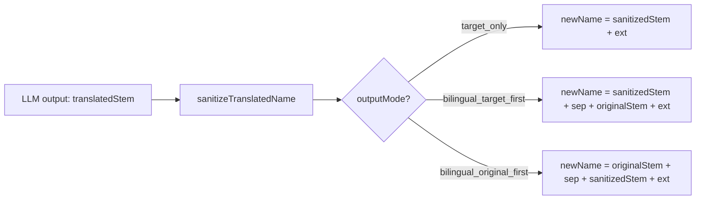

# 文件名翻译工具 — 双语保留输出模式

## 现状分析

当前 Name Translator 工具的翻译流程为：

```
原始文件名 → LLM 翻译 stem → sanitize → newName = translatedStem + extension
```

输出始终是 **纯翻译结果**，不保留原始语言文本。例如 `第01話.srt` → `Episode 1.srt`。

## 目标效果

新增 `outputMode` 选项，支持三种模式：

| 模式 | 示例（`第01話.srt` → EN） |
|------|--------------------------|
| `target_only`（默认，当前行为） | `Episode 1.srt` |
| `bilingual_target_first` | `Episode 1 - 第01話.srt` |
| `bilingual_original_first` | `第01話 - Episode 1.srt` |

分隔符可自定义，默认 ` - `。

## 数据流（不变的部分）

LLM prompt 不需要修改 — 模型仍然只输出纯 `translatedStem`。双语拼接在 sanitize 阶段之后、构建 `newName` 时完成。



## 需要修改的文件

### 1. 类型定义 — [src/services/rename/nameTypes.ts](src/services/rename/nameTypes.ts)

- 新增类型 `NameOutputMode = "target_only" | "bilingual_target_first" | "bilingual_original_first"`
- 在 `NameTranslationOptions` 接口中新增字段：
  - `outputMode: NameOutputMode`（默认 `"target_only"`）
  - `bilingualSeparator: string`（默认 `" - "`）
- 更新 `DEFAULT_NAME_TRANSLATION_OPTIONS` 添加默认值

### 2. Sanitize 逻辑 — [src/services/rename/nameSanitize.ts](src/services/rename/nameSanitize.ts)

- 修改 `sanitizeTranslatedName` 函数：
  - 先对 `translatedStem` 执行现有的清洗逻辑
  - 根据 `options.outputMode` 和 `options.bilingualSeparator` 拼接最终 stem
  - 对 `target.stem`（原始名）不做二次清洗（它本身就是合法文件名）
  - 拼接后再做长度截断校验
- 更新 `SanitizedNameResult` 如有必要保留拼接前后的中间值

### 3. OptionsPanel UI — [src/pages/Tools/Rename/NameTranslator/components/OptionsPanel.tsx](src/pages/Tools/Rename/NameTranslator/components/OptionsPanel.tsx)

- 在「语言」区域下方新增「输出模式」选项组：
  - 三个按钮（仅译文 / 译文在前 / 原文在前）
  - 当选中双语模式时，展示分隔符输入框（`Input`，默认值 ` - `）
- 导入新增的类型

### 4. Agent 工具 Schema — [src/agent/tool-schemas.ts](src/agent/tool-schemas.ts)

- 在 `createNameTranslationPlanSchema` 中新增：
  - `outputMode` 枚举字段（默认 `"target_only"`）
  - `bilingualSeparator` 字符串字段（默认 `" - "`）

### 5. Agent 工具执行器 — [src/agent/tool-executor.ts](src/agent/tool-executor.ts)

- `toNameTranslationOptions` 转换函数中透传新字段

### 6. Store 兼容 — [src/store/tools/rename/useNameTranslatorStore.ts](src/store/tools/rename/useNameTranslatorStore.ts)

- `updateOptions` 中的 "仅 collisionPolicy 变更可就地重建" 逻辑需要扩展，`outputMode` / `bilingualSeparator` 变更也应该可以就地重建（无需重新调用 LLM，因为只是改变拼接方式）

### 7. i18n 文案 — `src/locales/zh/rename.json`、`src/locales/en/rename.json`、`src/locales/ja/rename.json`

- 新增 `options.output_mode_label`、`options.output_mode.target_only`、`options.output_mode.bilingual_target_first`、`options.output_mode.bilingual_original_first`、`options.separator_label`、`options.separator_hint` 等 key

### 8. 测试更新

- `nameSanitize` 单元测试：增加双语模式 case
- Agent schema 测试：验证新字段默认值
- Store 测试：验证 outputMode 变更触发就地重建

## 关键设计决策

1. **LLM prompt 无修改**：模型仍只输出纯翻译文本，双语拼接由代码确定性完成。这保证翻译质量不受模式影响。
2. **就地重建**：切换 outputMode 或修改 separator 时，已有的 `translatedStem` 仍然有效，只需重新计算 `newName` 和 `targetPath`，无需重新调用模型。
3. **长度处理**：双语名可能较长，截断策略优先截断翻译部分（保留原文完整性），若仍超长则同时截断。
4. **separator 安全**：分隔符需要过滤非法文件名字符（`/ \ : * ? " < > |`），但允许 `-`、`_`、空格、`.` 等常见字符。
