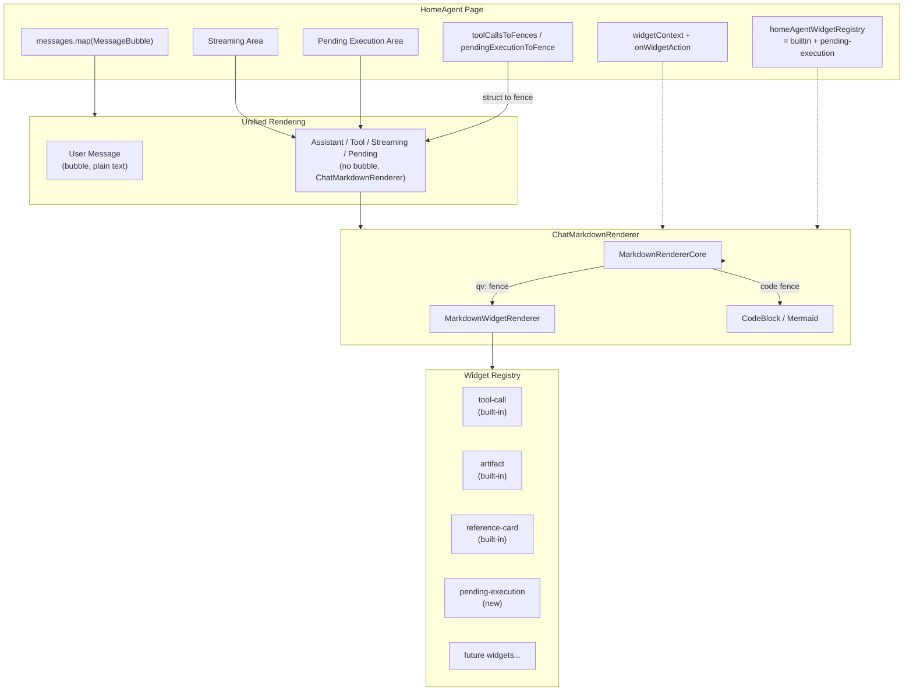
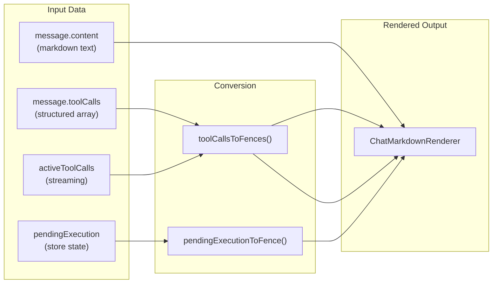

# HomeAgent Markdown 渲染集成方案 (v2)

## 设计理念变更

参考 ChatGPT 等主流 AI 聊天 UI 的做法：

- **用户消息**：保留气泡样式（右对齐，primary 背景）
- **Assistant 消息**：**不使用气泡**，左对齐 + Bot 头像 + 内容区直接渲染

去掉 assistant 气泡后，文本、代码块、Widget 卡片天然地在同一层排布，不会出现"widget 被困在气泡内部"的问题。因此 PendingExecutionCard、ToolCallBubble、StreamingTextContent 可以全部统一到 markdown-renderer 管线中渲染，旧组件可以彻底删除。

---

## 渲染映射关系


| 原组件/区域                           | 新方案                                       | 数据转换                                                         |
| -------------------------------- | ----------------------------------------- | ------------------------------------------------------------ |
| `MessageBubble` assistant 纯文本    | `ChatMarkdownRenderer` 直接渲染 `content`     | 无                                                            |
| `ToolCallBubble`（已提交的 toolCalls） | 内置 `tool-call` Widget                     | `message.toolCalls[]` 转 `qv:tool-call` fences 追加到 content 末尾 |
| `StreamingTextContent`           | `ChatMarkdownRenderer` + 外部脉冲光标           | `streamingText` 直传                                           |
| 流式 `activeToolCalls`             | 内置 `tool-call` Widget（status=running）     | 转 `qv:tool-call` fences 追加到 streamingText 末尾                 |
| `PendingExecutionCard`           | 新建 `pending-execution` Widget             | `pendingExecution` 转 `qv:pending-execution` fence            |
| `MessageBubble` tool 结果          | markdown 格式化文本 via `ChatMarkdownRenderer` | `formatToolContent` 输出改为 markdown 字符串                        |


---

## 核心实现

### 1. 结构化数据 → Widget Fence 转换函数

在 `[src/pages/HomeAgent/index.tsx](src/pages/HomeAgent/index.tsx)` 中新增工具函数，将结构化数据转为 markdown widget 围栏：

```tsx
function toolCallsToFences(
  toolCalls: AgentToolCall[],
  status: "pending" | "running" | "success" = "success",
): string {
  return toolCalls
    .map((tc) => {
      const payload = JSON.stringify({
        name: tc.toolName,
        status,
        input: tc.args,
      });
      return "\n

```qv:tool-call\n" + payload + "\n

```";
    })
    .join("\n");
}

function pendingExecutionToFence(
  pe: PendingExecution,
  t: TFunction,
): string {
  const payload = JSON.stringify({
    stores: pe.stores.map((s) => ({
      name: s,
      labelKey: STORE_LABEL_KEYS[s] ?? s,
      count: pe.taskCounts[s] ?? 0,
      path: STORE_PATH[s],
    })),
  });
  return "

```qv:pending-execution\n" + payload + "\n

```";
}
```

### 2. MessageBubble 重构

```tsx
function MessageBubble({ message, widgetRegistry, widgetContext }) {
  const isUser = message.role === "user";
  const isTool = message.role === "tool";

  // --- User: 保留气泡 ---
  if (isUser) {
    return (
      <div className="flex items-start gap-2.5 flex-row-reverse">
        <UserAvatar />
        <div className="rounded-sm px-4 py-2.5 max-w-[80%] ... bg-primary text-primary-foreground">
          <p className="whitespace-pre-wrap ...">{message.content}</p>
        </div>
      </div>
    );
  }

  // --- Tool result: markdown 格式化 ---
  if (isTool) {
    const formatted = formatToolContentAsMarkdown(message);
    return (
      <div className="pl-10">
        <ChatMarkdownRenderer content={formatted} ... />
      </div>
    );
  }

  // --- Assistant: 无气泡, markdown 渲染 ---
  let content = message.content || "";
  if (message.toolCalls?.length) {
    content += toolCallsToFences(message.toolCalls, "success");
  }

  return (
    <div className="flex items-start gap-2.5">
      <BotAvatar />
      <div className="max-w-[80%] min-w-0">
        <ChatMarkdownRenderer
          content={content}
          widgetRegistry={widgetRegistry}
          widgetContext={widgetContext}
        />
      </div>
    </div>
  );
}
```

### 3. 流式渲染区域

```tsx
{isStreaming && (streamingText || activeToolCalls.length > 0) && (
  <div className="flex items-start gap-2.5 ...">
    <BotAvatar />
    <div className="max-w-[80%] min-w-0">
      <ChatMarkdownRenderer
        content={
          (streamingText || "") +
          toolCallsToFences(activeToolCalls, "running")
        }
        widgetRegistry={widgetRegistry}
        widgetContext={{ ...widgetContext, isStreaming: true }}
      />
      {streamingText && <PulsingCursor />}
    </div>
  </div>
)}
```

### 4. PendingExecutionCard → Widget

```tsx
{pendingExecution && !isStreaming && (
  <div className="pl-10">
    <ChatMarkdownRenderer
      content={pendingExecutionToFence(pendingExecution, t)}
      widgetRegistry={widgetRegistry}
      widgetContext={widgetContext}
    />
  </div>
)}
```

### 5. PendingExecutionWidget 定义

新建 `[src/components/qiuye-ui/markdown-renderer/widgets/PendingExecutionWidget.tsx](src/components/qiuye-ui/markdown-renderer/widgets/PendingExecutionWidget.tsx)`：

```tsx
interface PendingExecutionProps {
  stores: {
    name: string;
    labelKey: string;
    count: number;
    path?: string;
  }[];
}

// 组件复用原 PendingExecutionCard 的视觉设计
// 通过 context.onWidgetAction 触发 "confirm" / "dismiss"
export const pendingExecutionWidget: MarkdownWidgetDefinition<PendingExecutionProps> = {
  type: "pending-execution",
  displayName: "Pending Execution",
  version: 1,
  component: PendingExecutionWidgetComponent,
  parseProps: parsePendingExecutionProps,
  permissions: ["client-action"],
};
```

### 6. widgetRegistry + widgetContext

```tsx
const homeAgentWidgetRegistry: MarkdownWidgetRegistry = {
  ...builtinWidgetRegistry,
  [pendingExecutionWidget.type]: pendingExecutionWidget,
};

const widgetContext = useMemo<MarkdownWidgetContext>(() => ({
  conversationId: session.id,
  role: "assistant",
  density: "compact",
  isStreaming,
  onWidgetAction: (action) => {
    if (action.type === "pending-execution") {
      if (action.action === "confirm") confirmExecution();
      if (action.action === "dismiss") dismissExecution();
    }
  },
}), [session.id, isStreaming, confirmExecution, dismissExecution]);
```

---

## 要删除的旧代码

从 `[src/pages/HomeAgent/index.tsx](src/pages/HomeAgent/index.tsx)` 中移除：

- `ToolCallBubble` 组件（~37 行，L829-L865）
- `PendingExecutionCard` 组件（~66 行，L675-L741）
- `StreamingTextContent` 组件（~36 行，L867-L902）
- `formatToolContent` 工具函数（~25 行，L1183-L1207） — 替换为 `formatToolContentAsMarkdown`
- 无用 import：`CheckCircle2`（仅 ToolCallBubble 使用）、`Play`（仅 PendingExecutionCard 使用）等

---

## 要修改的文件

- `[src/pages/HomeAgent/index.tsx](src/pages/HomeAgent/index.tsx)` — 主要改造：重构 MessageBubble，重构流式区域，构建 registry/context，删除旧组件
- 新建 `[src/components/qiuye-ui/markdown-renderer/widgets/PendingExecutionWidget.tsx](src/components/qiuye-ui/markdown-renderer/widgets/PendingExecutionWidget.tsx)` — 新 Widget 定义

---

## 架构总览




## 数据流




