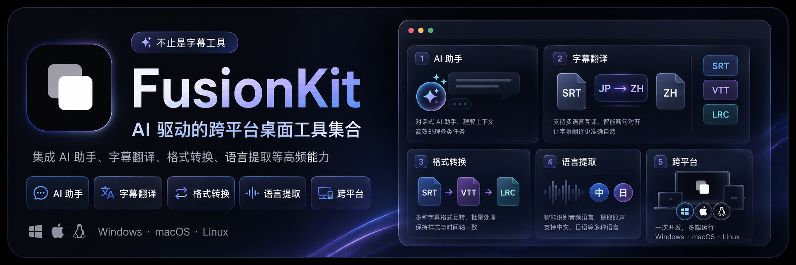

<div align="center">
  
</div>

<div align="center">
  <h1>FusionKit</h1>
  <p>AI 驱动的跨平台桌面工具集合</p>
  <p>
    <a href="https://github.com/QiuYeDx/FusionKit/releases/latest">
      
    </a>
    <a href="https://github.com/QiuYeDx/FusionKit/blob/main/LICENSE">
      
    </a>
    <a href="https://github.com/QiuYeDx/FusionKit/releases">
      
    </a>
    
  </p>
</div>

---

## 简介

**FusionKit** 是一款基于 Electron 的跨平台桌面工具集合应用，旨在将多种实用工具整合在一个优雅的界面中。内置 **FusionKit Agent**，可通过自然语言对话驱动字幕翻译、格式转换、语言提取、历史任务恢复，以及文件名 / 文件夹名翻译等操作；也提供完整的手动工具界面，适合逐项配置、预览和执行。

PS: 使用时可以配合`Faster-Whisper-GUI`音频转文本，然后再用本工具进行 AI 翻译，相关教程[「音频转字幕&人声分离」猴子也能懂的 Faster-Whisper-GUI 使用教程](https://qiuvision.com/notes/1)

## 0.2.10 版本亮点

- **长文本翻译 Beta**：新增面向小说、长文档和多 TXT 项目的翻译工具，Renderer 只传递文件路径，正文由主进程读取、分片和落盘。
- **连贯串行翻译模式**：支持跨分片、跨文件的语义记忆，适合人物关系、术语和文风需要连续保持的长文本。
- **可靠恢复与重翻**：长文本任务会写入独立工作区、事件日志和分片结果，支持暂停、取消、恢复、部分完成和从指定分片后重翻。
- **TXT 输出模式**：支持仅译文、双语简洁模式和 `[Original]` / `[Translation]` 标签模式，并支持多个独立文件队列或有序项目。
- **Markdown 结构保护能力**：已完成 Markdown parser、保护占位符、仅译文组装和 blockquote 双语组装；端到端 Markdown 执行仍处于后续开放范围。

## 0.2.9 版本亮点

- **文件名翻译性能全面优化**：引入翻译去重、快路径跳过、内存缓存、受控并发与自适应批次拆分，大幅缩短大批量文件名翻译的等待时间；新增规划进度可视化与取消入口。
- **文件名翻译双语输出模式**：支持在翻译后的文件名中同时保留原语言和目标语言（如 `Episode 1 - 第01話.srt`），可自定义分隔符和语言顺序。
- **全新启动加载页**：重新设计应用启动画面，新增 Reveal 过渡动画效果。
- **繁体中文支持**：新增繁体中文（zh-Hant）界面语言。
- **安全性增强**：修复 symlink 检测、路径权限错误处理、不完整计划误执行等多项安全与健壮性问题。

## 功能特性

### FusionKit Agent（AI 助手）

内置 AI 对话助手，通过自然语言即可完成字幕处理、历史恢复和名称翻译等任务。

- 基于 **Vercel AI SDK** 的流式对话与工具调用循环
- 自动扫描目录、发现字幕文件并分发到翻译 / 转换 / 提取队列
- 支持扫描 `*.fusionkit.resume.json` 恢复清单，并将可恢复字幕任务加入翻译队列
- 支持检查文件 / 文件夹路径，生成名称翻译 dry-run 预览，并在明确确认后应用重命名
- 三种执行模式：**仅入队** / **确认后执行** / **自动执行**
- 支持拖拽文件或文件夹到输入框，自动识别路径并追加到当前消息
- 输入框草稿缓存，跨页面导航后仍可保留未发送内容
- 会话导出与导入（JSON 格式）
- 实时 Token 用量统计、上下文占用与费用追踪

### 字幕翻译

利用 AI 大模型实现高质量字幕翻译，支持多种模型和灵活配置。

- 支持 **LRC / SRT** 格式字幕文件
- 支持 **9 种语言**：中文、日文、英文、韩文、法文、德文、西班牙文、俄文、葡萄牙文
- 支持 **DeepSeek / OpenAI** 及任意 OpenAI 兼容 API
- 双语对照或仅译文两种输出模式
- 分片并发翻译（最高 5 路并发）
- 可配置分片策略（普通 / 敏感 / 自定义）
- 实时进度显示、分片完成数（n/N）与 Token 用量预估
- 支持编辑任务配置、输出路径选择与重名处理（覆盖 / 自动编号）
- 支持失败恢复与历史任务续跑，自动生成并读取 `*.fusionkit.resume.json` 恢复清单
- 支持源文件不可用时基于恢复清单内的原始分片继续翻译

### 长文本翻译（Beta）

面向整章小说、长文档和多 TXT 文件项目的 AI 翻译工具，重点优化大文本分片、恢复、输出与费用可见性。

- 支持选择单个或多个 **TXT** 文件；多个文件可作为独立任务队列，也可作为有序项目串行翻译
- Renderer 不读取整本正文，创建任务时只向主进程传递文件路径和配置
- 主进程执行编码探测、资源限制检查、分片规划、模型请求、分片结果落盘和最终输出组装
- 支持快速并发与连贯串行两种执行模式；串行模式会携带语义记忆以保持术语、人物关系和文风
- 支持文档背景、翻译要求、风格要求、术语表和指定文件前重置语义记忆
- 支持仅译文、TXT 双语简洁模式和 TXT 双语标签模式
- 支持输出到源文件目录或自定义目录，并提供覆盖 / 自动编号冲突策略
- 支持暂停、取消、恢复、部分完成、打开工作区和打开输出文件
- 页面会显示分片数、输入 token 估算、费用估算和上下文预算校验
- Markdown parser 与输出组装能力已完成，但端到端 Markdown 翻译入口仍处于 Beta 后续开放范围

隐私与费用提示：

- 文件正文会发送到用户配置的 OpenAI Compatible 模型服务；请确认模型服务的隐私和数据保留政策
- API Key 只用于运行时请求，不写入长文本翻译工作区
- 串行语义记忆会增加每个分片的输入 token，费用通常高于并发模式

### 字幕格式转换

在主流字幕格式之间自由转换。

- 支持 **SRT / VTT / LRC** 三种格式互转（6 条转换路径）
- 自定义输出路径与重名处理策略（覆盖 / 自动编号）
- 可选去除媒体类型后缀（如 `song.wav.srt` → `song.srt`）

### 字幕语言提取

从多语言 / 双语字幕中提取指定语言的内容。

- 支持从 **LRC / SRT** 字幕中提取指定语言文本
- 支持 **9 种语言**：中文、日文、英文、韩文、法文、德文、西班牙文、俄文、葡萄牙文
- 基于假名、标点、虚词等多维度启发式语言识别
- 自定义输出路径与重名处理策略

### 文件名 / 文件夹名翻译

面向批量整理文件和目录的安全重命名工具，先预览再执行。

- 支持选择文件、文件夹或混合路径
- 支持翻译所选名称、直接子项或递归子项
- 支持仅处理文件、仅处理文件夹或同时处理两者
- 支持自动识别源语言，并翻译到中文、英文、日文等 9 种语言
- 支持命名风格选择：保留原风格、空格分词、短横线、下划线、Title Case、lowercase
- 支持双语输出模式，翻译后文件名同时保留原语言和目标语言，可自定义分隔符和顺序
- 默认保留文件扩展名，并可保留编号、季集、清晰度等技术标签
- dry-run 预览可编辑、跳过、恢复 AI 建议，并支持冲突检测与重新校验
- 规划过程可视化进度条、阶段提示和取消入口
- 翻译去重、快路径跳过、内存缓存与受控并发，大幅提升大批量翻译速度
- 应用前执行高风险确认，真实重命名会写入 journal，支持尽力回滚

### 更多工具（开发中）

- 付费音乐解密转换

## 其他特性

- 🌓 深色 / 浅色 / 跟随系统主题
- 🌐 多语言界面（简体中文 / 繁體中文 / English / 日本語）
- 🔄 应用内检查更新与自动更新
- 🌍 网络代理配置（无代理 / 系统代理 / 自定义代理）
- 🔔 系统通知提醒（任务完成 / 失败）
- 💤 防休眠管理（翻译等长时任务运行期间自动阻止系统休眠）
- 🧭 工具页分步 Tour 引导
- 🖥 跨平台支持（macOS / Windows）

## 技术栈

| 分类 | 技术 |
| --- | --- |
| 框架 | Electron 33 + React 19 |
| 语言 | TypeScript |
| 构建工具 | Vite 5 |
| 样式 | Tailwind CSS 4 |
| UI 组件 | shadcn/ui (Radix UI) |
| 状态管理 | Zustand |
| AI 集成 | Vercel AI SDK + OpenAI Compatible Provider |
| 国际化 | i18next |
| 动画 | Motion |
| 测试 | Vitest + Playwright |
| 包管理器 | pnpm |

## 快速开始

### 环境要求

- **Node.js** >= 18.0.0
- **pnpm**（推荐使用 [corepack](https://nodejs.org/api/corepack.html) 启用）

### 安装与开发

```bash
# 克隆仓库
git clone https://github.com/QiuYeDx/FusionKit.git
cd FusionKit

# 安装依赖
pnpm install

# 启动开发服务器
pnpm dev
```

### 构建发布

```bash
pnpm build
```

构建产物将输出到 `release` 目录。

## 项目结构

```
FusionKit/
├── electron/                  # Electron 主进程
│   ├── main/                  # 主进程核心逻辑
│   │   ├── index.ts           # 窗口管理与 IPC 注册
│   │   ├── translation/       # AI 翻译引擎
│   │   ├── text-translation/  # 长文本翻译执行、分片、记忆、恢复与输出
│   │   ├── conversion/        # 字幕格式转换
│   │   ├── extraction/        # 字幕语言提取
│   │   ├── rename/            # 文件 / 文件夹重命名扫描、校验、应用与 journal
│   │   ├── fs/                # 文件系统操作（扫描、读取、元数据）
│   │   ├── proxy.ts           # 代理配置
│   │   ├── power.ts           # 防休眠管理
│   │   └── update.ts          # 自动更新
│   └── preload/               # 预加载脚本（Context Bridge）
├── src/                       # 渲染进程（前端）
│   ├── agent/                 # AI 助手核心（orchestrator、工具定义、会话管理）
│   ├── pages/                 # 页面组件
│   │   ├── HomeAgent/         # AI 助手主页
│   │   ├── Tools/             # 工具页（字幕工具 / 重命名工具）
│   │   ├── Setting/           # 设置页（通用 / 代理 / 模型）
│   │   └── About/             # 关于页
│   ├── components/            # UI 组件库
│   │   ├── ui/                # shadcn/ui 基础组件
│   │   └── qiuye-ui/          # 自定义组件
│   ├── services/              # 业务服务（字幕队列、名称翻译计划、冲突处理等）
│   ├── store/                 # Zustand 状态管理
│   ├── locales/               # i18n 多语言资源
│   ├── constants/             # 常量定义
│   ├── type/                  # TypeScript 类型
│   └── utils/                 # 工具函数
├── docs/                      # 开发文档
├── build/                     # 应用图标资源
├── public/                    # 静态资源
└── test/                      # E2E 测试
```

## 配置说明

### AI 模型配置

在设置页面可分别配置**字幕翻译**和 **AI 助手**所用的模型参数：

- **API Endpoint** — OpenAI 兼容的 Chat Completions 端点
- **API Key** — 访问密钥
- **Model** — 模型名称
- **Token 价格** — 输入/输出单价（每百万 token），用于费用预估

可创建多个模型配置，并在“模型分配”中分别指定 **Agent 模型** 与 **任务执行模型**。内置 DeepSeek 和 OpenAI 预设，也支持任意 OpenAI 兼容 API；配置 API Key 后可从接口拉取可用模型列表，或手动填写自定义 Model Key。

### 翻译分片策略

翻译时会将字幕按 Token 上限拆分为多个分片，每个分片独立调用一次 LLM。

| 模式 | 分片上限 | 适用场景 |
| --- | --- | --- |
| 普通模式 | ~3000 tokens | 大多数字幕文件 |
| 敏感模式 | ~100 tokens | 特殊内容，需更精细控制 |
| 自定义模式 | 用户指定 | 按需调整 |

### 字幕恢复清单

字幕翻译过程中会保存恢复清单与分片进度，任务失败、中断或应用退出后，可通过“恢复历史任务”重新加入队列。

- 扫描当前输出目录：适合恢复当前工具页配置的输出位置
- 选择目录扫描：适合批量查找某个目录下的历史恢复清单
- 导入恢复清单：适合直接选择单个 `*.fusionkit.resume.json`
- 源文件一致时优先基于源文件续跑；源文件缺失或变化时，可基于恢复清单内的分片继续处理

### 名称翻译安全机制

文件名 / 文件夹名翻译遵循“先生成计划，再确认执行”的流程：

1. 选择路径并配置范围、目标类型、语言和命名风格
2. 生成 dry-run 预览，检查新旧路径、冲突、警告和跳过项
3. 必要时手动编辑预览项或重新校验
4. 通过高风险确认后应用重命名
5. 需要时可基于 journal 尝试回滚已执行的重命名

## 贡献指南

欢迎任何形式的贡献！

1. Fork 本仓库
2. 创建特性分支 (`git checkout -b feature/your-feature`)
3. 提交更改 (`git commit -m 'feat: add your feature'`)
4. 推送到分支 (`git push origin feature/your-feature`)
5. 发起 Pull Request

## 许可证

本项目采用 [PolyForm Noncommercial License 1.0.0](LICENSE) 发布，仅允许非商业使用，禁止用于任何商业目的。

## 相关链接

- **项目主页**：[github.com/QiuYeDx/FusionKit](https://github.com/QiuYeDx/FusionKit)
- **问题反馈**：[Issues](https://github.com/QiuYeDx/FusionKit/issues)
- **版本发布**：[Releases](https://github.com/QiuYeDx/FusionKit/releases)
- **更新日志**：[CHANGELOG.md](CHANGELOG.md)
- **作者主页**：[qiuvision.com](https://qiuvision.com)
