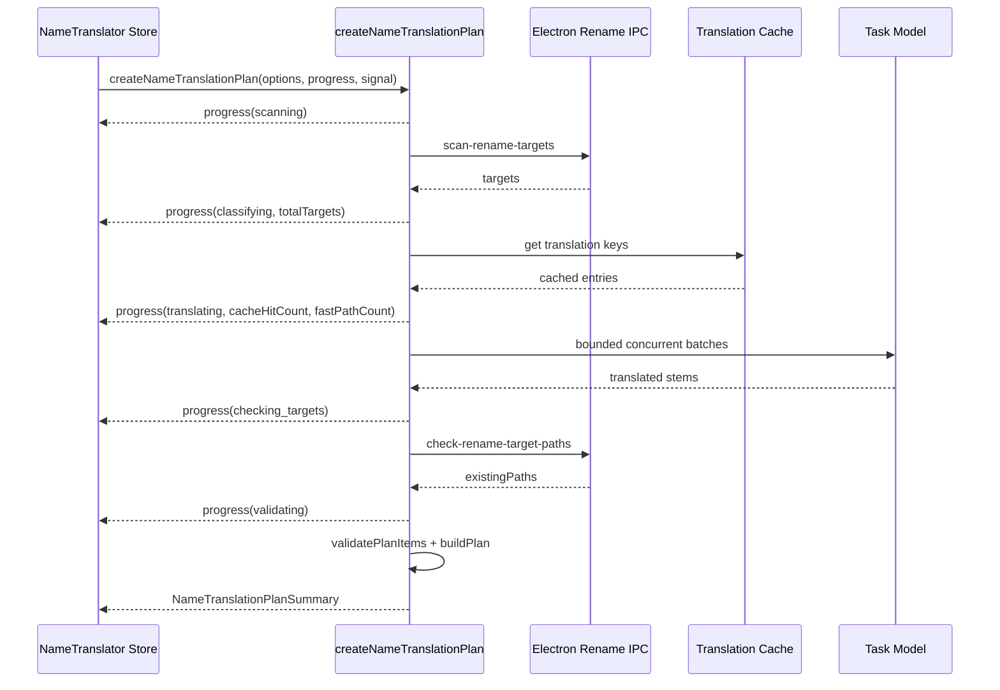

# 文件名翻译工具任务处理性能优化 Final Design

> 日期：2026-06-17  
> 范围：梳理现有文件名 / 文件夹名翻译工具的任务处理链路，定位速度慢和效率低的原因，并给出可落地的性能优化设计方案。  
> 关联文档：`docs/batch-name-translation-tool/batch-name-translation-tool-final-design.md`、`docs/batch-name-translation-tool/implementation-notes/2026-05-21_final-implementation-status.md`

## 1. 结论先行

文件名翻译工具当前的慢，主要慢在“生成预览计划”，不是最终 `fs.rename` 应用阶段。

现有链路是：

```text
工具页 createPreview
  -> renderer planner createNameTranslationPlan
  -> Electron main scan-rename-targets 扫描目标
  -> renderer 按 25 个目标一批调用任务模型
  -> renderer 为每个目标构造 plan item
  -> renderer 逐目标检查目标路径是否已存在
  -> renderer 本地冲突检测并缓存 plan
  -> 工具页一次性展示完整预览
```

关键代码位置：

- `src/store/tools/rename/useNameTranslatorStore.ts:264`：工具页 `createPreview` 入口，等待 `createNameTranslationPlan` 完成后才更新 plan。
- `src/services/rename/nameTranslationPlanner.ts:67`：`createNameTranslationPlan` 总入口。
- `src/services/rename/nameTranslationPlanner.ts:115`：先通过 IPC 扫描目标。
- `src/services/rename/nameTranslationPlanner.ts:117`：扫描完成后进入模型翻译。
- `src/services/rename/nameTranslationPlanner.ts:199`：`translateTargets` 按固定批次翻译。
- `src/services/rename/nameTranslationPlanner.ts:207`：每 25 个目标一批，并在 `for` 循环中串行等待每批模型结果。
- `src/services/rename/nameTranslationPlanner.ts:370`：目标路径存在性检查逐路径发起。
- `electron/main/rename/scanner.ts:249`：递归扫描目录时逐条目录项读取路径信息。
- `electron/main/rename/planner-validation.ts:90`：最终 apply 前验证已并行检查 ready items，但仍是逐 item 文件系统检查。

最主要瓶颈：

1. **模型批次完全串行**：默认 `TRANSLATION_BATCH_SIZE = 25`。如果有 500 个目标，就是 20 次模型请求串行；如果每次 2 秒，光模型调用就接近 40 秒。
2. **模型失败恢复也串行**：批次失败后拆成左右两半，但左右递归仍按顺序等待，错误批次会进一步放大耗时。
3. **缺少翻译去重和缓存**：同名、同 stem、重复剧集模板、重新生成预览、切换本地可重算选项时都可能重复请求模型。
4. **没有快路径分类**：纯数字、纯技术 token、明显无需翻译的目标仍会进入模型请求。
5. **目标路径存在性检查缺少批量 IPC**：当前用 `Promise.all` 并发，但每个路径都是一次 renderer -> main IPC 往返。
6. **递归扫描是深度优先逐项 await**：每个目录项都会 `lstat` + `stat`，大目录树下扫描时间会线性增长。
7. **UI 无阶段进度**：用户只看到 `isPlanning`，无法知道卡在扫描、翻译第几批、重试、还是冲突校验，因此体感更慢。

本方案建议优先优化“预览生成”的 planner，不改变真实重命名的两阶段 rename、journal、rollback 安全契约。apply 阶段保持保守串行。

## 2. 目标与非目标

### 2.1 目标

1. 大幅缩短批量目标生成预览的耗时，尤其是 100 到 5000 个目标的场景。
2. 保持 dry-run preview、用户确认、validate、journal、rollback 的安全边界不变。
3. 为规划任务增加阶段进度、批次进度、缓存命中、重试状态和取消能力。
4. 降低模型请求数量：去重、缓存、快路径跳过。
5. 降低模型请求墙钟时间：受控并发、动态批大小、退避重试。
6. 降低 IPC 往返：批量路径存在性检查，扫描侧减少不必要 stat。
7. 保持现有 `createNameTranslationPlan(options)` 返回 `NameTranslationPlanSummary` 的兼容性。

### 2.2 非目标

1. 不并发执行真实 `fs.rename`。真实文件系统变更仍按现有两阶段 journal 流程执行。
2. 不改变 HomeAgent 的高风险确认原则。Agent 仍只能先生成预览，不能自动 apply。
3. 不在本阶段实现 `path_segments` 可应用重命名。
4. 不把完整路径或 plan 长期持久化到磁盘。缓存以“名称翻译结果”为主，不保存用户完整路径。
5. 不为所有模型提供商强制同一并发上限。默认保守，并允许后续暴露配置。

## 3. 当前逻辑梳理

### 3.1 手动工具页入口

`src/store/tools/rename/useNameTranslatorStore.ts:264` 的 `createPreview` 会：

1. 从 `selectedPaths` 取 roots。
2. 设置 `isPlanning = true`。
3. 调用 `createNameTranslationPlan(options)`。
4. 从 renderer memory plan store 读取完整 plan。
5. 一次性写入 `currentPlan`、`history`、`originalSuggestions`。
6. 最后设置 `isPlanning = false`。

这个入口目前没有 progress state，也没有 cancel handle。只要 planner 还没返回，UI 只能显示整体 planning 状态。

### 3.2 planner 生成计划

`src/services/rename/nameTranslationPlanner.ts:67` 的 `createNameTranslationPlan` 当前流程：

1. 标准化 options。
2. 对 `path_segments` 做澄清或延期返回。
3. 调用 `scanNameTranslationTargets` 扫描目标。
4. 调用 `translateTargets` 翻译所有 scan targets。
5. 将模型输出映射为 plan item。
6. 调用 `collectExistingTargetPaths` 检查目标路径是否已存在。
7. 调用 `validatePlanItems` 做本地冲突检测。
8. `buildPlan` 后写入 memory plan store。
9. 返回 summary。

这里的慢点集中在第 3、4、6 步，其中第 4 步通常占绝对大头。

### 3.3 模型翻译批处理

`src/services/rename/nameTranslationPlanner.ts:37` 固定批大小为 25。

`src/services/rename/nameTranslationPlanner.ts:207`：

```text
for start in targets by 25:
  await translateBatchWithRecovery(batch)
```

这意味着批次之间没有重叠。对 500 个目标，至少 20 个模型请求串行；对默认上限 5000 个目标，最坏是 200 个模型请求串行。

`src/services/rename/nameTranslationPlanner.ts:413` 先调用 `generateObject`，失败后 `src/services/rename/nameTranslationPlanner.ts:431` 再调用 `generateText` 兜底。这个策略提高了兼容性，但当错误来自网络、鉴权、限流或模型不可用时，兜底请求往往不会成功，只会额外消耗一次请求时间。

`src/services/rename/nameTranslationPlanner.ts:235` 的 recovery 会在批次失败后拆分；但 `src/services/rename/nameTranslationPlanner.ts:268` 和 `src/services/rename/nameTranslationPlanner.ts:274` 是顺序等待左右两半，失败批次的耗时会继续叠加。

### 3.4 扫描目标

`electron/main/rename/scanner.ts:115` 的 `scanRenameTargets` 按 root 顺序处理。

`electron/main/rename/scanner.ts:249` 的 `scanDirectoryLevel`：

1. `fs.readdir(directoryPath, { withFileTypes: true })` 读取目录项。
2. 对每个 entry 调用 `getPathInfo`。
3. `getPathInfo` 内部先 `fs.lstat`，再 `fs.stat`。
4. 递归目录时继续深度优先 `await scanDirectoryLevel`。

`withFileTypes` 已经能判断大多数普通文件和目录，但当前仍对每个目录项执行 `lstat` + `stat`。这样安全但偏重，尤其在机械硬盘、网络盘、云同步目录和超大目录下会明显变慢。

### 3.5 目标路径存在性检查

planner 阶段 `src/services/rename/nameTranslationPlanner.ts:370` 会收集目标路径后 `Promise.all` 并发调用 `checkRenameTargetExists`。

store 重新校验阶段 `src/store/tools/rename/useNameTranslatorStore.ts:612` 也有一份类似逻辑。

虽然这里不是完全串行，但每个路径都是一次 `check-path-exists` IPC。大量目标时会产生几百到几千次 renderer/main 往返。

### 3.6 apply 和 rollback

`electron/main/rename/apply.ts` 使用两阶段 rename：

1. stage one：原路径改到临时路径。
2. stage two：临时路径改到最终路径。
3. 每步写 journal。
4. 目录 rename 后重写子操作路径。

这是安全性设计，不建议作为本轮性能优化主方向。真实文件变更应该保守、可追踪、可恢复。

## 4. 性能目标

性能目标以“生成预览”为主，具体数值会受模型提供商、网络和目录所在磁盘影响，因此这里定义相对目标和可测指标。

### 4.1 指标

新增内部指标：

```text
scanDurationMs
classifyDurationMs
translationDurationMs
translationRequestCount
translationBatchCount
translationConcurrencyPeak
translationCacheHitCount
translationFastPathCount
pathCheckDurationMs
pathCheckRequestCount
planBuildDurationMs
totalPlanningDurationMs
```

### 4.2 目标值

在 fake model 延迟固定为 1000ms/request 的测试环境中：

| 目标数 | 当前理论耗时 | 优化后目标 |
| --- | --- | --- |
| 100 | 4 批串行，约 4s | 并发 3 路后约 1.5s 到 2s |
| 500 | 20 批串行，约 20s | 去重/快路径后并发，约 4s 到 8s |
| 5000 | 200 批串行，约 200s | 默认仍建议截断或用户确认；启用并发、缓存、进度后可持续可见地处理 |

真实模型场景不承诺绝对秒数，但应做到：

1. 100 个目标不再表现为长时间无反馈。
2. 500 个目标至少减少 50% 以上墙钟时间。
3. 重复生成同一目录预览时，缓存命中后接近“扫描 + 冲突校验”的耗时。

2026-06-18 实现收口状态：

- 默认翻译批大小为 50，并发上限为 3，限流后降级到 1 并退避重试。
- fake model 性能回归测试已固定 500 targets 场景：同样 10 个 batch、每批 30ms 延迟下，并发 3 的墙钟耗时必须低于串行耗时的 85%，同时校验峰值并发不超过 3。
- 重复预览通过 renderer 内存缓存回避模型请求；高置信快路径继续在 plan item warning 中留下 `model_note:fast_path:<reason>`。
- 真实模型性能仍不写入 CI 断言，发布前按 10.3 手工验收记录。

## 5. 目标架构

### 5.1 总体设计

将当前 monolithic planner 拆为可观测的流水线：

```text
Planning Job
  phase: scanning
    -> scan targets
  phase: classifying
    -> fast-path detect
    -> dedupe translation keys
    -> memory cache lookup
  phase: translating
    -> promise pool with bounded concurrency
    -> dynamic batch size
    -> batch split recovery
    -> backoff on rate limit
  phase: checking_targets
    -> batch IPC check target existence
  phase: validating
    -> validatePlanItems
  phase: storing
    -> rememberNameTranslationPlan
```

公共契约保持：

```ts
createNameTranslationPlan(options): Promise<NameTranslationPlanSummary>
```

新增可选能力通过 deps 扩展，不破坏旧调用：

```ts
interface CreateNameTranslationPlanDeps {
  scanTargets?: ...
  translateBatch?: ...
  checkPathExists?: ...
  checkPathsExist?: (paths: string[]) => Promise<Set<string>>;
  progress?: (progress: NameTranslationPlanningProgress) => void;
  signal?: AbortSignal;
  translationCache?: NameTranslationCache;
  batchConfig?: NameTranslationBatchConfig;
}
```

### 5.2 Planning Progress 模型

新增进度类型：

```ts
type NameTranslationPlanningPhase =
  | "idle"
  | "scanning"
  | "classifying"
  | "translating"
  | "checking_targets"
  | "validating"
  | "storing"
  | "done"
  | "failed"
  | "cancelled";

interface NameTranslationPlanningProgress {
  phase: NameTranslationPlanningPhase;
  message?: string;
  totalTargets?: number;
  scannedTargets?: number;
  translatableCount?: number;
  translatedCount?: number;
  cacheHitCount?: number;
  fastPathCount?: number;
  activeBatchCount?: number;
  completedBatchCount?: number;
  totalBatchCount?: number;
  retryCount?: number;
  warningCount?: number;
}
```

store 增加：

```ts
planningProgress: NameTranslationPlanningProgress | null;
cancelPlanning: () => void;
```

UI 上仍使用现有布局，只在生成预览按钮附近和预览空态中显示阶段进度。不要新增解释性长文案，只展示简短状态、进度条和取消按钮。

### 5.3 翻译任务去重

引入中间结构：

```ts
interface TranslationWorkItem {
  key: string;
  modelInput: NameTranslationModelInputItem;
  targetIds: string[];
  sourceTargets: NameTranslationTarget[];
}
```

key 规则：

```text
version
kind
sourceLang
targetLang
namingStyle
preserveTechnicalTokens
stem normalized by NFC + trim
extension presence
```

不把完整 `contextPath` 放入默认 key，避免路径隐私进入缓存。对于确实依赖上下文的模式，后续可加 `contextHash`，只保存 hash。

多个 target 共享同一个 key 时，只请求一次模型，然后把输出 fan-out 回所有 target id。

### 5.4 快路径分类

在模型调用前做 deterministic classification：

```ts
interface FastPathResult {
  translatedStem: string;
  reason: "empty" | "numeric" | "technical_only" | "target_language_likely" | "no_natural_language";
}
```

可直接跳过模型的例子：

- 空 stem。
- 纯数字、日期、季集号：`01`、`2024`、`S01E02`。
- 纯技术 token：`1080p`、`x265`、`WEB-DL`。
- 已经明显是目标语言且 namingStyle 为 `preserve`。
- 仅符号和括号，不含自然语言。

快路径只应处理高置信规则。低置信情况仍交给模型，避免误跳过真实需要翻译的名称。

### 5.5 翻译缓存

新增 renderer 内存缓存：

```ts
interface NameTranslationCacheEntry {
  key: string;
  translatedStem: string;
  confidence?: "high" | "medium" | "low";
  createdAt: number;
  modelKey: string;
}

interface NameTranslationCache {
  get(key: string): NameTranslationCacheEntry | null;
  set(entry: NameTranslationCacheEntry): void;
  clearExpired(now?: number): void;
}
```

默认策略：

- 仅内存缓存，不写磁盘。
- TTL：24 小时。
- 最大条数：5000。
- key 不含完整路径。
- modelKey 参与 entry 元数据，但默认不强制隔离。若用户切换模型后希望重新翻译，可提供“忽略缓存重新生成”。

缓存命中时仍会重新执行 sanitize、目标路径构造和冲突检测，因为这些依赖当前 options 与文件系统状态。

### 5.6 受控并发翻译

新增 promise pool：

```ts
interface NameTranslationBatchConfig {
  batchSize: number;
  concurrency: number;
  minBatchSize: number;
  maxBatchSize: number;
  rateLimitBackoffMs: number;
}
```

默认值：

```text
batchSize: 50
concurrency: 3
minBatchSize: 5
maxBatchSize: 80
rateLimitBackoffMs: 1500
```

行为：

1. 将未缓存、非快路径的 work items 按 batchSize 分批。
2. 用 promise pool 跑最多 3 个并发模型请求。
3. 任何批次成功后立即写入 translationMap 并上报 progress。
4. schema 解析失败时拆分批次重试。
5. 429 / rate limit 时降低全局并发到 1，并按退避等待后重试。
6. 鉴权、模型不存在、quota、网络不可达等非可恢复错误直接失败，不再额外走 text fallback。

### 5.7 structured output 兜底优化

当前 `generateObject` 失败后总是尝试 `generateText`。优化为按错误类型决定：

```text
schema / repair / parse 失败 -> 允许 text fallback 或 batch split
429 / rate limit -> backoff，不立即 fallback
401 / 403 / quota / model not found -> fail fast
network unavailable -> fail fast，提示检查代理或模型配置
```

这样可以减少无意义的第二次模型请求。

### 5.8 批量目标路径存在性 IPC

新增 IPC：

```text
check-rename-target-paths
```

入参：

```ts
interface CheckRenameTargetPathsParams {
  paths: string[];
}
```

出参：

```ts
interface CheckRenameTargetPathsResult {
  existingPaths: string[];
  errors: Array<{ path: string; message: string }>;
}
```

renderer planner 优先调用批量 IPC；测试或旧环境仍可 fallback 到现有单路径 `check-path-exists`。

主进程内部用有限并发检查，建议并发 64，避免一次性 `Promise.all` 几千个 `lstat` 造成 IO 抖动。

### 5.9 扫描优化

扫描保持 `scan-rename-targets` IPC 不变，内部优化：

1. 利用 `Dirent` 判断普通文件 / 目录，减少每个 entry 的 `fs.stat`。
2. 只有以下情况才 `lstat`：
   - entry 可能是 symlink。
   - 需要精确识别 other。
   - 需要文件 size / mtime 且该信息被 UI 或 planner 使用。
3. 对目录读取使用有限并发队列，而不是完全深度优先串行。
4. 保留稳定排序：同一目录内仍按 name 排序；最终 targets 可按 absolutePath 排序，保证 plan 预览稳定。
5. 大扫描每处理固定数量目标上报内部 progress，后续如需要可通过新的 job progress 暴露给 renderer。

注意：扫描优化不能绕过 protected path、hidden path、symlink directory skip 等安全规则。

### 5.10 取消任务

store 在 `createPreview` 时创建 `AbortController`：

```ts
currentPlanningAbortController: AbortController | null;
```

planner 在以下位置检查 signal：

- scan 完成后。
- classifying 循环中每 N 个 work items。
- 每个 batch 开始前。
- batch retry/backoff 前。
- path check 前。

如果底层模型请求支持 abort signal，则传入；如果不支持，则至少阻止新批次启动，并在当前 in-flight 请求结束后丢弃结果。

取消后：

- 不写入新的 plan。
- `planningProgress.phase = "cancelled"`。
- 保留用户已选路径和 options。

## 6. 数据流细化

### 6.1 优化后的预览生成



### 6.2 Agent 入口

HomeAgent 当前复用同一个 planner，因此优化对 Agent 自动生效。Agent 结果仍只展示 summary / widget，不把完整 plan 放进 LLM 上下文。

若后续需要把进度显示到 HomeAgent 工具调用卡片，可复用同一 progress 类型，但这不是第一阶段必须项。

## 7. 兼容性与安全规则

### 7.1 保持不变

1. `NameTranslationPlan` 结构保持兼容。
2. `NameTranslationPlanSummary` 结构保持兼容。
3. `planId` memory store 仍是 renderer 内存，默认 30 分钟 TTL。
4. apply 前仍必须调用 `validate-rename-plan`。
5. apply 仍由 `electron/main/rename/apply.ts` 两阶段执行，并写 journal。
6. rollback 行为不变。

### 7.2 新增但可选

1. `progress` callback。
2. `signal` cancellation。
3. `translationCache`。
4. `checkPathsExist` 批量路径检查。
5. `batchConfig`。

所有新增能力必须有 fallback，保证现有单元测试依赖的 deps 注入不需要一次性全部更新。

## 8. 风险与处理

### 8.1 并发导致模型限流

风险：并发请求可能触发 429。

处理：

- 默认并发 3，保守起步。
- 捕获 429 后全局降级到并发 1。
- 记录 `rate_limit_backoff` warning。
- UI 显示“模型限流，正在降速重试”。

### 8.2 大 batch 导致 JSON 失败

风险：batchSize 从 25 提到 50 后，部分模型输出 JSON 更容易不完整。

处理：

- schema/parse 失败时按 batch split 重试。
- 连续失败时降低动态 batchSize。
- 保留 text fallback，但只针对结构化输出问题。

### 8.3 缓存返回过时或不符合用户期望

风险：用户换模型或想要不同风格时，缓存可能让结果看起来“不重新思考”。

处理：

- cache key 包含 sourceLang、targetLang、namingStyle、preserveTechnicalTokens。
- 输出模式只影响 recomposition，不影响 translatedStem。
- 提供“忽略缓存重新生成”开关作为后续 UI 增强。
- 内存 TTL 到期自动清理。

### 8.4 快路径误判

风险：把应该翻译的名字当成无需翻译。

处理：

- 快路径只覆盖高置信、低语义目标。
- 对 `target_language_likely` 仅在 namingStyle 为 `preserve` 时启用。
- 所有快路径结果在 plan item warning 中标记 `fast_path:<reason>`，便于排查。

### 8.5 扫描并发破坏稳定顺序

风险：并发扫描可能导致 plan items 顺序不稳定。

处理：

- 每个目录 entries 保持 localeCompare 排序。
- 最终 targets 按 `(anchorRoot, depthFromRoot, absolutePath)` 稳定排序。
- 测试覆盖同一目录树多次扫描顺序一致。

### 8.6 取消后的脏状态

风险：取消时已有部分模型结果返回，可能写入半成品 plan。

处理：

- signal aborted 后禁止 `rememberNameTranslationPlan`。
- in-flight 结果只写临时 map，不 commit 到 store。
- store 取消后保留 options，不保留 partial plan。

## 9. 分阶段实施计划

### Phase 1：可观测性和 UI 进度

目标：先让慢在哪里可见。

修改点：

- `src/services/rename/nameTranslationPlanner.ts`
  - 增加 progress callback。
  - 增加阶段耗时统计。
  - 不改并发策略，只上报 scanning / translating / checking / validating。
- `src/store/tools/rename/useNameTranslatorStore.ts`
  - 增加 `planningProgress`。
  - `createPreview` 传入 progress callback。
- `src/pages/Tools/Rename/NameTranslator/*`
  - 展示简短进度和取消按钮预留位。

验证：

- 使用 mock `translateBatch` 延迟，确认 progress 按顺序更新。
- 原有 rename planner/store 测试保持通过。

### Phase 2：翻译去重、快路径、内存缓存

目标：减少模型请求数量。

修改点：

- 新增 `src/services/rename/nameTranslationCache.ts`。
- 新增 `src/services/rename/nameTranslationFastPath.ts`。
- `translateTargets` 前先构造 work items，执行快路径、dedupe、cache lookup。
- 模型返回后写 cache，再 fan-out 到所有 target。

验证：

- 重复 stem 只调用一次 `translateBatch`。
- 快路径目标不调用模型。
- 切换 `outputMode` 不重新请求模型，只 recomposition。
- 缓存 TTL 和容量淘汰测试。

### Phase 3：受控并发和错误分类

目标：减少模型请求墙钟时间。

修改点：

- 新增 promise pool helper，或在 planner 内实现小型队列。
- 将 `for await batch` 改为 bounded concurrency。
- 错误分类前置，非可恢复错误 fail fast。
- 429 降速退避。
- schema 失败 batch split。

验证：

- fake model 10 批、并发 3 时，最大并发不超过 3。
- 429 后并发降为 1。
- schema 失败时拆分并最终补齐 outputs。
- 取消后不写 plan。

### Phase 4：批量路径检查 IPC

目标：减少 renderer/main 往返。

修改点：

- `electron/main/rename/ipc.ts`
  - 新增 `check-rename-target-paths`。
- `electron/main/rename/*`
  - 新增批量检查实现，内部有限并发。
- `src/services/rename/nameTargetResolver.ts`
  - 新增 `checkRenameTargetsExist(paths)`。
- planner 和 store revalidate 优先使用批量接口。

验证：

- existingPaths 返回准确。
- permission/missing 错误不会让预览生成失败。
- 旧单路径 fallback 测试保留。

### Phase 5：扫描器优化

目标：降低大目录扫描耗时。

修改点：

- `electron/main/rename/scanner.ts`
  - 使用 `Dirent` 快速构造 PathInfo。
  - 对必要项才 lstat/stat。
  - 引入有限并发目录扫描。
  - 最终排序保证稳定。

验证：

- 现有 `test/rename/scanner.test.ts` 全部通过。
- 新增大目录 fixture，比较目标数量、顺序、skip warning。
- symlink directory、hidden、protected path 行为不变。

## 10. 验证策略

### 10.1 单元测试

新增或扩展：

```text
src/services/rename/nameTranslationPlanner.test.ts
src/store/tools/rename/useNameTranslatorStore.test.ts
test/rename/scanner.test.ts
test/rename/apply.test.ts
```

重点覆盖：

- progress 阶段顺序。
- dedupe fan-out。
- cache hit / miss。
- fast path 不请求模型。
- promise pool 并发上限。
- rate limit backoff。
- batch split recovery。
- cancellation。
- batch path exists IPC。

### 10.2 性能回归测试

已新增 fake benchmark 测试，不依赖真实模型：

```text
test/rename/nameTranslationPlanner.performance.test.ts
```

覆盖范围：

1. 构造 500 个 targets，对比串行 batch 与并发 3 batch 的相对耗时，阈值保持宽松以避免 CI 抖动。
2. 校验 `translationRequestCount`、`translationBatchCount`、`translationConcurrencyPeak` 和 `pathCheckRequestCount`。
3. 组合验证缓存命中与快路径：500 targets 二次生成时不再调用 fake model。
4. 验证取消后不继续启动 queued work，且不写入半成品 plan。
5. 验证 recoverable parse 失败会按 batch split 恢复，并记录重试指标。

### 10.3 手工验收

场景：

1. 选择 100 个文件，生成中文预览。
2. 选择 500 个文件，确认进度持续更新。
3. 同一目录连续生成两次，第二次缓存命中明显更快。
4. 模拟模型 429，确认 UI 显示降速重试。
5. 点击取消，确认不会生成半成品 plan。
6. apply 和 rollback 行为与当前一致。

RN-PERF-007 只固化 fake model 回归测试和发布前手工验收清单；真实模型供应商、网络、限流策略的绝对耗时不进入自动化断言。

## 11. 推荐优先级

优先做 Phase 1 到 Phase 3。

原因：

1. 最大耗时来自模型批次串行，Phase 2/3 能直接改善墙钟时间。
2. Phase 1 能马上解释“卡在哪里”，降低用户体感焦虑，也方便后续调参。
3. 批量 IPC 和扫描优化有价值，但通常不是第一大瓶颈，可放在第二轮。
4. apply 阶段不建议为速度牺牲安全性。

推荐第一轮工作包：

```text
RN-PERF-001 planner progress instrumentation
RN-PERF-002 translation dedupe/cache/fast-path
RN-PERF-003 bounded concurrent translation batches
```

完成这三项后，再根据真实用户目录规模决定是否继续做批量 IPC 和扫描器优化。
