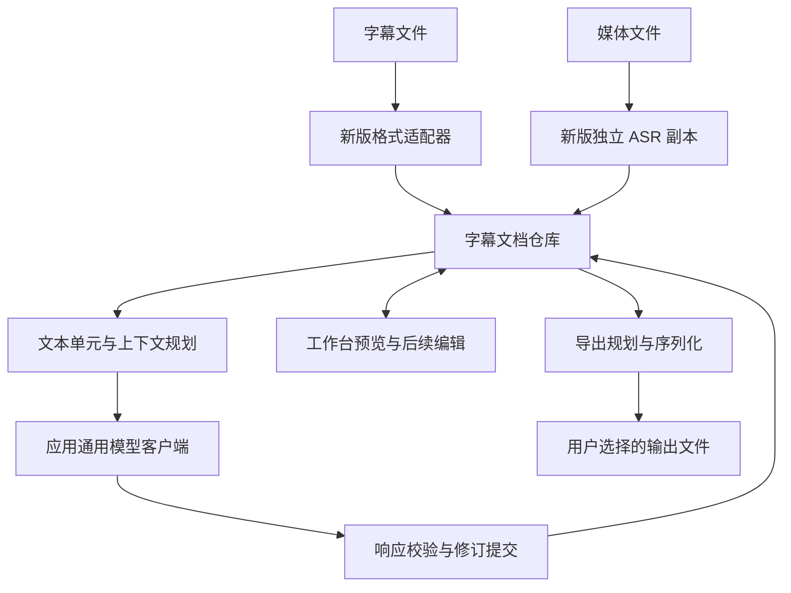

# 字幕工作台整体架构

本文件定义长期边界和关键契约；I1 的可执行范围以模块需求为准。拟议字段不表示对应 UI 已实现。

## 1. 数据流与工具边界



v1 不在生产依赖链中。SubtitleDocument 是内部版本化数据契约，不是行业标准；AI 请求、IPC DTO、磁盘结构和字幕格式分别版本化，不使用一个巨大类型贯穿全部边界。

## 2. 新版所有权

| 能力 | 拟议位置/身份 |
| --- | --- |
| 纯类型、校验、格式适配与投影 | `src/subtitle-studio/` |
| 主进程服务与仓库 | `electron/main/subtitle-studio/` |
| 原生 ASR 副本 | `electron/main/subtitle-studio/transcription/native/` |
| preload | `electron/preload/subtitle-studio-api.ts`、`subtitle-studio-channel-policy.ts` |
| 页面 | `src/pages/Tools/Subtitle/SubtitleStudio/` |
| 服务与偏好 | `src/services/subtitle-studio/`、`src/store/tools/subtitle-studio/` |
| 测试/脚本/资源 | `test/subtitle-studio/`、`scripts/subtitle-studio/`、`resources/subtitle-studio/` |
| 用户数据 | `app.getPath('userData')/subtitle-studio/` |
| I2 原生资源打包目标 | `process.resourcesPath/subtitle-studio/` |
| 偏好 key / IPC / bridge | `fusionkit.subtitle-studio.preferences.v1` / `subtitle-studio:*` / `window.subtitleStudio` |

可复用经检查的 UI 基础组件、i18n、应用模型档案、`electron/main/ai/` 通用客户端；检查覆盖传递依赖、事件注册和初始化副作用。`src/utils/subtitleCueProtocol.ts` 虽在 utils 仍属 v1，新工具不能直接 import；有价值的策略复制后独立维护。

禁止依赖 `electron/main/translation/`、`electron/main/local-subtitle/`、旧字幕类型/Store/服务/页面/preload、v1 资源路径和恢复文件。类型导入、动态 import、IPC 字符串、资源 URL、测试 helper、脚本调用均算依赖。

应用壳可同时注册两套工具，新版只导出自己的 register/start/dispose；不反向查询旧实例。新版初始化失败不得阻止 v1，关闭时只清理自有任务与进程。

## 3. 统一文档与身份

```ts
// 关键概念示意；完整字段与判别联合以 src/subtitle-studio/domain.ts 为准。
type SubtitleDocument = TextSubtitleDocument | MediaSubtitleDocument;
type DocumentCore = {
  id: string;
  revision: number;
  origin: SourceDescriptor;
  cues: SubtitleCue[];
  translationTracks: TranslationTrack[];
};
type TextSubtitleDocument = DocumentCore & {
  schemaVersion: 1;
  preservation: FormatPreservation;
};
type MediaSubtitleDocument = DocumentCore & {
  schemaVersion: 2;
  preservation: { schemaVersion: 1; kind: 'transcription'; transcript: CanonicalTranscript };
};

type SubtitleCue = {
  id: string;
  sourceRevision: number;
  timingRevision: number;
  timing: { startMs: number; endMs: number | null; provenance: TimingProvenance };
  source: SubtitleText;
  sourceLabel?: string;
  speaker?: string;
  extensions?: CueExtensions;
};

type TranslationTrack = {
  id: string;
  language: string;
  revision: number;
  entries: Record<string, {
    sourceRevision: number;
    sourceHash: string;
    text: SubtitleText;
    origin: 'ai' | 'human' | 'imported';
    reviewStatus: 'unreviewed' | 'reviewed';
  }>;
};
```

字幕SourceDescriptor保存来源格式、显示名、编码及原文件摘要。T04媒体来源保存format=media、显示名、可选时长与transcriptDigest；该摘要只证明规范转录内容，不是媒体文件hash。媒体未复制进文档仓库，preserveSource=false；完整模型/语言/词时间等已存在证据保存在canonical transcript，cue以segmentId按原顺序对应。路径不是文档身份，源文件消失不影响已导入文本的预览、翻译和SRT/LRC投影。

SubtitleText 表达文本、受支持的内联 span 和换行，不是可执行 HTML。源换行和标签有到原节点的映射；模型结果不能直接执行或插入 HTML。preservation 保存格式元数据、原节点、原始内容与 cue 映射，有 schema 和大小限制。只保存 rawText 而没有对应关系不足以支持编辑后保真导出。

媒体preservation保存严格转录结构，没有伪造字幕raw节点或编码；文档保持100000 cues和128MiB快照上限，超限整体拒绝。T04内部生产者在task清理和batch pin释放后调用绑定owner/task/generation的sink。创建发布返回同一文档身份；迟到取消不反转已发布结果，同步故障以durability=uncertain保留事实。任务准入/调度及转写UI尚未接入。

不变量：

1. cue ID 在文档内稳定，不以数组下标、时间戳或文本 hash 单独生成。同时间、同文本可有不同 cue；显示序号单独计算。
2. 时间为有限安全整数毫秒。允许重叠，不能沿用转写产物专用的“不重叠”校验拒绝外部字幕。未知结束时间用 null；零时长诊断可见；结束早于开始拒绝。
3. LRC 多标签展开为多个播放事件并保留源行分组；只有同一源行的明确分组允许复用一次翻译请求，结果仍映射到各 cue。不得按相同文本自动去重。
4. LRC offset 保存原值与归一化策略，只应用一次。负偏移造成负时间时保留源表示并诊断；导出不能静默截成 0。
5. 文档 revision 用于提交控制；译文有效性比较 cue 源修订/hash，不用全局 revision 让无关字幕过期。说话人等翻译相关语义改变时更新相关源修订。
6. 时间或视觉折行通常不使译文过期；拆分合并改变对应关系时创建新 cue、保留父关系并使相关译文待复核。
7. 字词时间只适用于对应源文本修订，不可套到译文词序。扩展为版本化命名空间，不能成为任意对象垃圾桶。
8. 新 schema 从 1 开始，与产品“v2”或旧 schemaVersion 无关；未知版本拒绝写入。

### 双语文件解释

导入解析先忠实保留格式，再按用户确认的解释形成原文 cue 与 imported 译文轨。相邻相同时间双节点和单块双正文行只是候选；字种的全文件稳定顺序用于推荐，不能作为语言真值。单行混排必须显式启用、选择/复核空格边界；保持原样的条目不被截掉。详情/预览有分页，不把整份文件交给模型识别。

双方源节点及 rawText UTF-16 半开范围记录在 cue.importedPair；source 仍只拥有一个 nodeId，目标节点原始区间保留但不重复登记同一 cueId。原cue顺序和时间不排序、不估算；源文本变化时提升 sourceRevision。新轨 origin=imported，entry 默认 unreviewed。清轨保留原文件及 importedPair，不能把导入者视为人工审核者。

## 4. 文档、任务、产物与持久化

| 对象 | 生命周期 |
| --- | --- |
| 文档 | 原文、时间、译文轨和保留结构；任务结束后仍保留 |
| 执行任务 | 引用文档/轨道，保存配置快照、批次、尝试与用量；清理任务不删文档 |
| 导出产物 | 指定文档修订与导出选项的文件；删除文档不自动删除用户导出的文件 |

I1 用主进程拥有的版本化 JSON 仓库，不先引入数据库或完整事件溯源。每文档存不可变 generation 快照，文档与对应任务检查点为同一提交单元；串行写临时文件、校验并持久写入，再原子发布 current 指针。保留上一有效 generation；未提交孤立文件可回收。列表索引是可重建缓存，不是唯一数据源。Windows 替换失败必须保留上一有效提交，通过故障注入确认行为，不仅凭 rename 名称承诺抗断电。

任务完成仅清理临时请求、过期快照和临时输出，不删除有效文档。显式删除文档时先取消/失效任务并持久化墓碑，再回收自有文件，迟到请求不能复活文档。清理任务与删除文档是不同 UI 操作。

重启把未完成运行标记 interrupted，用户继续后只处理未提交批次。供应商已执行但本地未提交的请求不能保证仅收费一次；重试和未知 usage 如实记录，不承诺网络 exactly-once。

密钥、能力 token、租约、AbortController 和 PID 不进入持久快照。保存模型档案 ID 与非密钥执行配置，执行时主进程重新解析凭据；配置缺失/不兼容进入 needs_configuration，不能暗换模型。

## 5. 翻译计划与结果提交

固定源修订 → 规划文本单元 → 按完整请求预算组批 → 调用模型 → 校验 → 写入译文轨。I1 默认顺序批次，提供有界相邻原文和已提交前文译文，明确 provenance。后续并发模式使用派发时冻结的上下文，不让完成顺序决定提示内容。

请求示意 `{"items":[{"id":"u1","text":"原文"}]}`，响应 `{"items":[{"id":"u1","text":"译文"}]}`。短 ID 到 cue/run 的映射与源修订留在本地。不传字幕编号、时间轴、双语副本及文件元数据。受支持内联结构可使用有界保护标记，不把整个文件格式交给模型。

校验完整 ID 集、重复/未知 ID、文本类型、大小、控制字符与标记结构；不按响应顺序或换行猜对应。I1 一个请求批次原子验收，失败批次整体不提交；仅重试该批次，已提交批次不重跑。逐项部分提交以后再设计。

提交检查文档存在、任务 generation、目标轨道 revision、源修订/hash；取消后停止派发，迟到结果不提交。I1 同一文档只允许一个活动翻译任务，不同文档仍受有界全局请求调度管理。

只允许一个重试拥有者：可重试传输/限流、配置失败和协议错误分类处理，退避有界且可取消。先核对通用客户端是否已重试，避免嵌套放大请求。

预算计入指令、ID、保护标记、上下文和输出预留。超长单元先缩减可选上下文，仍超限则明确报告，不截断或硬发请求。预估与执行共用序列化和规划逻辑；记录实际 usage，缺失记未知。真实样本报告输入/输出/上下文与请求数，不预设节省百分比。

## 6. 格式适配与导出

解析输出 document、diagnostics、capabilities；导出先计划再序列化。编码可选择，解码失败不静默写替换字符。分别声明可解析、可展示、可翻译、可保真导出；保留未知结构不代表能正确套到译文。

限制覆盖文件字节、cue 数、单条文本、扩展和模型响应，在 I1 以统一常量与边界测试落实；不能把 ASR 生成器的严格产物规则直接用于外部导入。

导出选项为格式、轨道、original/source/target/bilingual、双语顺序、折行、编码/换行、文件名。original 是未经修改的原文件证据；source 是当前原文轨，双语整理后两者不同。选项不进入翻译身份；导出固定文档 revision 快照，不能混入导出中途的新结果。

- SRT 双语默认同一时间块先原文后译文；LRC 默认同标签两行。后者重复时间是本地格式表达，不消耗模型 token。
- LRC 转 SRT 缺结束时间时默认方案为下一个严格更晚的起点，最后一组 +2000ms；这是可调整的导出估算，必须展示并由用户接受，不是声学证据。已知媒体结尾仅在晚于起点时用于约束。估算不回写为源测量时间。
- original 导出使用原始内容，保留编码、BOM、换行与不连续编号；source 按当前原文 cue 序列化，只有证明内容投影一致时才能复用原节点，不得夹回已分离/清除的旧译文。跨格式默认 UTF-8，精度量化列入诊断。
- 缺失/过期译文默认阻止完整 target/bilingual 导出；用户可明确选择仅导出已完成条目或未完成处回退原文，导出记录保留策略，不能报告为完整翻译。
- 格式降级显示类别和数量，例如估算时间、内联样式降级、未知标签。已选择的无损再导出不反复确认。复杂结构未支持时拒绝对应翻译操作并保留源文档。

ASS 需分离 Script Info、Styles、Events、绘图和卡拉 OK。译文词序改变后源音节时间不能直接复用；I3 定义完整兼容矩阵。[Aegisub ASS 标签说明](https://aeg-dev.github.io/AegiSite/docs/3.0/ASS_Tags/)

## 7. UI、IPC 与授权

文档列表展示来源、语言、条目数和执行摘要；详情展示序号、时间、原文、译文和状态。翻译配置与导出配置独立，模型完成不代表人工复核。大文档按页/窗口读取，不每条事件复制全量内容。I1 只读预览，I4 才提供真实编辑入口。

新版 IPC 固定 allowlist 并在主进程校验，不走旧字幕 generic invoke 分支。renderer 提交 docId、版本和经原生选择授权的输入/输出引用；按 sender 授权，docId 本身不是凭证。持久文档身份和临时外部路径权限分开，重启失去租约不丢文档。

字幕、模型输出、样式标签均按数据渲染，不能执行脚本或自动请求外部资源。默认索引文件名避免隐式覆盖；主动覆盖经原生保存选择和新版自有发布实现，不借旧转写 exporter/addon。I2 如需 addon，则复制完整资源闭包后独立验证。

## 8. 独立维护

独立覆盖源码、类型、初始化、数据、原生资源、打包、测试，不是将旧 import 藏进 adapter。允许复制成熟代码，代价是缺陷修复需分别评估；新版 provenance 记录来源和后续手工移植。构建不得动态从 v1 生成新版，禁止符号链接/共享可写副本。具体删除演练见 [transcription-fork.md](transcription-fork.md)。
