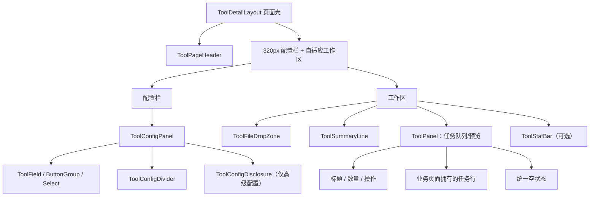

# FusionKit 工具详情页 UI 统一与长文本翻译页迁移最终设计

## 0. 评审结论

本次应当做通用化，但通用化的方向必须是：

1. 以“字幕 AI 翻译”详情页的实际 UI 为唯一视觉基准；
2. 从字幕翻译、字幕格式转换、字幕语言提取三个同族页面中提取已经被反复验证的布局和面板模式；
3. 先让三个基准页面使用共享组件且视觉不变，再迁移长文本翻译页；
4. 只抽象稳定的视觉语法和交互容器，不创建由 JSON 配置驱动的万能工具页，也不把各工具的业务状态塞进共享组件。

当前 `src/pages/Tools/_shared/ui` 中除 `ToolOutputPathPicker` 外的大部分组件，是围绕长文本翻译页当前实现建立的另一套视觉体系。它包含 340px 配置栏、默认 `CardHeader`/`CardContent` 大间距、16px 卡片标题、独立指标小卡和两层操作区，不能作为本次统一工作的基准。

原有未跟踪文档 `docs/tool-detail-page-ui-spec.md` 也把上述非基准实现定义为全局标准，与本次产品决策相反，因此删除，由本文档取代。

最终采用“两层抽象”：

- 全部工具页共享：页面壳、紧凑面板、配置字段、分隔、帮助提示、状态条等基础语法；
- 文件任务型工具共享：文件拖放区、参数摘要行、任务面板头、任务行和统计条等组合模式。

批量文件名翻译等不同工作流只复用第一层及适用的第二层组件，不被强制套入字幕任务队列的数据模型。

---

## 1. 背景

FusionKit 当前存在五个稳定工具详情页：

| 工具 | 入口文件 | 当前情况 |
|---|---|---|
| 字幕 AI 翻译 | `src/pages/Tools/Subtitle/SubtitleTranslator/index.tsx` | 本次唯一视觉基准 |
| 字幕格式转换 | `src/pages/Tools/Subtitle/SubtitleConverter/index.tsx` | 与字幕翻译页高度一致 |
| 字幕语言提取 | `src/pages/Tools/Subtitle/SubtitleLanguageExtractor/index.tsx` | 与字幕翻译页高度一致 |
| 批量文件名翻译 | `src/pages/Tools/Rename/NameTranslator/index.tsx` | 内部面板已基本使用基准风格，外栏宽度仍为 340px |
| 长文本翻译 | `src/pages/Tools/Text/TextTranslator/index.tsx` | 使用另一套布局和组件体系，视觉漂移明显 |

三个字幕工具页虽然大量复制了 JSX 和 Tailwind class，但它们已经形成稳定且一致的产品语言：

- `max-w-7xl` 页面容器；
- 320px 左侧配置栏和自适应右侧工作区；
- 左栏 sticky；
- 无默认 Card 大内边距的紧凑面板；
- 11px 配置标签、13.5px 工作面板标题；
- 横向文件拖放区；
- 参数摘要行；
- 带任务计数和操作按钮的紧凑任务卡头；
- `divide-y` 任务列表和行内操作；
- 可选的边到边统计条。

长文本翻译页虽然业务能力完整，但当前 UI 将上传、任务状态、文件信息、操作按钮全部包在一个默认 Card 内，并引入了另一套字号、间距、折叠结构和指标卡，导致与其余工具页的密度、层级和操作位置不一致。

---

## 2. 目标

### 2.1 产品目标

- 长文本翻译页在页面宽度、左右栏比例、面板结构、间距、字号、按钮层级和状态展示上与字幕 AI 翻译页保持同一视觉语言。
- 保留长文本翻译特有能力：多文件顺序、独立文件/有序项目、准备与启动两阶段、上下文预算、语义记忆、术语表、任务恢复、工作区和输出目录。
- 新增工具详情页时可以直接组合共享组件，不再复制一整页 Tailwind class。
- 字幕转换、字幕提取等基准页面迁移到共享组件后不发生可见回归。

### 2.2 工程目标

- 将视觉规则从页面级 class 复制提升为共享组件契约。
- 共享组件只管理布局和视觉，不读取具体 Zustand store，不发起 IPC，不翻译业务状态。
- 业务页面继续拥有状态、事件、i18n key、任务数据结构和弹窗。
- 删除只服务于旧长文本视觉体系、迁移后无引用的组件和冲突文档。
- 降低后续调整配置栏宽度、卡头密度、字段标签字号时的多页面修改成本。

---

## 3. 非目标

- 不修改字幕、长文本或重命名工具的后端处理流程、IPC 协议、任务持久化格式和恢复数据。
- 不重写长文本翻译的 store、service 或任务类型。
- 不把所有工具业务建模成统一的 `ToolTask` 类型。
- 不使用 JSON schema 自动渲染完整工具页。
- 不在本次顺带重做工具列表页、全局导航、主题 Token 或基础 shadcn 组件。
- 不要求所有工具拥有完全相同的内容模块；统一的是视觉语法，而不是业务信息架构。
- 不把 `docs/archrive/` 中的历史设计参考当成当前规范，也不为本次目的清理无直接冲突的归档资料。

---

## 4. 当前实现分析

## 4.1 已有共同基础

以下能力已经被多页面复用，可以保留：

- `ToolPageHeader`
  - 路径：`src/pages/Tools/_shared/ToolPageHeader.tsx`
  - 已统一工具图标、标题、描述和右侧状态区域。
- `ToolBadge`、`toolMeta`
  - 路径：`src/pages/Tools/_shared/ToolBadge.tsx`
  - 路径：`src/pages/Tools/_shared/toolMeta.ts`
  - 已统一工具身份色和图标。
- `ToolOutputPathPicker`
  - 路径：`src/pages/Tools/_shared/ui/ToolOutputPathPicker.tsx`
  - 已被字幕三个页面和长文本页共同使用，职责边界合理。
- shadcn 基础组件
  - `Card`、`Button`、`ButtonGroup`、`Select`、`Input`、`Progress` 等继续作为底层原子组件。

## 4.2 三个字幕页面的稳定视觉契约

三个页面重复出现下列完全相同或近似相同的 class：

```text
页面容器
px-4 sm:px-8 pt-6 pb-[100px] max-w-7xl mx-auto

双栏
grid grid-cols-1 lg:grid-cols-[320px_minmax(0,1fr)] gap-4 items-start

左栏
lg:sticky lg:top-10

右栏
flex flex-col gap-3 min-w-0

紧凑 Card
overflow-hidden p-0 gap-0

配置面板头
flex items-center gap-2 px-4 py-3 bg-muted/40 border-b

配置面板标题
text-[11px] font-semibold uppercase tracking-[0.08em] text-foreground/80

配置内容
p-4 space-y-5

字段标签
text-[11px] font-medium text-muted-foreground

字段间距
space-y-1.5

区段分隔
h-px bg-border -mx-4

上传区
relative flex items-center gap-4 rounded-xl border-2 border-dashed px-5 py-5

任务卡头
flex flex-row items-center justify-between gap-3 px-4 py-3 space-y-0 border-b

任务卡标题
text-[13.5px] font-semibold

任务行
px-4 py-3

空状态
text-center py-10 text-sm text-muted-foreground
```

这些样式不是偶然相似，而是已经在字幕翻译、转换、提取和文件名翻译内部面板中重复验证的事实标准。

## 4.3 长文本翻译页的主要漂移

| 维度 | 基准页 | 长文本页当前实现 | 影响 |
|---|---|---|---|
| 左栏宽度 | 320px | 340px | 主工作区比例不一致 |
| Card 容器 | `p-0 gap-0` | 默认 `py-6 gap-6` | 垂直密度明显更松 |
| Card 内容 | `p-4` | 默认 `px-6` | 横向边距更大 |
| 配置标题 | 11px 大写紧凑栏 | 16px CardTitle + 描述 | 层级和气质不同 |
| 字段标签 | 11px muted | 13px foreground | 信息密度不同 |
| 配置组织 | 连续字段 + 必要分隔 | 多个大号折叠组 | 视觉碎片化 |
| 上传区 | 工作区顶层横向区域 | Card 内纵向居中区域 | 页面首屏结构不同 |
| 任务操作 | 任务卡头集中操作 | Card 内容底部两层操作区 | 操作入口位置不一致 |
| 状态指标 | 行内状态、进度和边到边统计条 | 多个独立圆角指标小卡 | 卡片嵌套和视觉重量偏大 |
| 工作区标题 | 13.5px 紧凑卡头 | 16px 标题 + 描述 | 与其他工具不一致 |

## 4.4 现有 `_shared/ui` 的处理结论

| 组件 | 处理 |
|---|---|
| `ToolOutputPathPicker` | 保留，必要时只调整 `size="sm"` 和紧凑尺寸 |
| `InfoHint` | 保留，调整触发器尺寸以匹配 11px 标签 |
| `ToolDetailLayout` | 重写为基准页的 320px 双栏契约 |
| `ToolField` | 重写为基准页的 11px 标签与 `space-y-1.5` |
| `ToolSection` | 不再作为默认配置结构；改造成可选的紧凑高级配置 Disclosure，或由新组件替代 |
| `ToolStat` / `ToolStatGrid` | 被边到边 `ToolStatBar` 取代后删除 |
| `ToolActionBar` / `TooltipIconButton` | 任务操作迁入紧凑面板头或任务行；无引用后删除 |

删除必须以 `rg` 确认无生产引用为前提。

---

## 5. 最终信息架构



### 5.1 两层抽象边界

第一层“详情页视觉语法”适用于所有工具：

- `ToolDetailLayout`
- `ToolConfigPanel`
- `ToolPanel`
- `ToolField`
- `ToolConfigDivider`
- `ToolConfigDisclosure`
- `InfoHint`
- `ToolStatBar`

第二层“文件任务型组合件”适用于字幕翻译、转换、提取、长文本翻译，以及未来类似工具：

- `ToolFileDropZone`
- `ToolSummaryLine`
- `ToolTaskEmptyState`
- 可选的 `ToolTaskRowShell`

共享层不提供：

- 通用任务 store；
- 通用任务状态枚举；
- 通用 IPC 调用；
- 通用“准备/开始/取消”状态机。

---

## 6. 共享组件设计

建议继续放在：

```text
src/pages/Tools/_shared/ui/
```

避免再建立一层仅改变 import 路径的目录。

## 6.1 `ToolDetailLayout`

职责：

- 统一页面容器；
- 统一双栏比例和 gap；
- 统一 sticky 行为；
- 提供 header、aside、children 三个区域；
- 不关心配置或任务内容。

建议 API：

```tsx
type ToolDetailLayoutProps = {
  header: React.ReactNode;
  aside: React.ReactNode;
  children: React.ReactNode;
  asideClassName?: string;
  mainClassName?: string;
  className?: string;
};
```

固定视觉契约：

```text
container: px-4 sm:px-8 pt-6 pb-[100px] max-w-7xl mx-auto
columns: grid grid-cols-1 lg:grid-cols-[320px_minmax(0,1fr)] gap-4 items-start
aside: min-w-0 lg:sticky lg:top-10
main: flex min-w-0 flex-col gap-3
```

不再允许页面通过普通参数选择 320/340/360 等宽度。确有例外时必须以明确 class 覆盖，并在设计文档中说明。

## 6.2 `ToolConfigPanel`

职责：

- 提供基准页左侧配置卡；
- 统一配置栏头部和内容内边距；
- 标题支持图标、右侧 Badge 或操作。

建议 API：

```tsx
type ToolConfigPanelProps = {
  icon?: LucideIcon;
  title: React.ReactNode;
  action?: React.ReactNode;
  children: React.ReactNode;
  className?: string;
  contentClassName?: string;
};
```

固定结构：

```text
Card: overflow-hidden p-0 gap-0
header: flex items-center justify-between gap-2 px-4 py-3 bg-muted/40 border-b
title: text-[11px] font-semibold uppercase tracking-[0.08em] text-foreground/80
content: p-4 space-y-5
```

标题文字由页面通过 i18n 传入，共享组件不内置文案。

## 6.3 `ToolPanel`

职责：

- 统一任务队列、预览、应用摘要等右侧工作面板；
- 提供紧凑标题、计数 Badge、操作区域和 body；
- 支持无 header 图标和有 header 图标两种场景。

建议 API：

```tsx
type ToolPanelProps = {
  title: React.ReactNode;
  icon?: LucideIcon;
  badge?: React.ReactNode;
  actions?: React.ReactNode;
  children: React.ReactNode;
  footer?: React.ReactNode;
  className?: string;
  bodyClassName?: string;
};
```

固定结构：

```text
Card: overflow-hidden p-0 gap-0
header: flex flex-wrap items-center justify-between gap-3 border-b px-4 py-3
title: text-[13.5px] font-semibold
actions: flex flex-wrap items-center justify-end gap-1.5
body: 默认不加 padding，由任务行/空状态/业务模块自行决定
```

在 786px 最小窗口宽度附近，actions 允许自然换行，不得造成横向滚动。

## 6.4 `ToolField`

职责：

- 统一左栏字段标签、帮助提示、右侧小操作和控件间距。

建议 API 可沿用现有设计，但视觉调整为：

```text
wrapper: space-y-1.5
label row: flex min-h-4 items-center justify-between gap-2
label: text-[11px] font-medium text-muted-foreground
help icon: size-3.5
```

默认控件应使用紧凑尺寸：

- `SelectTrigger size="sm"`
- `Button size="sm"`
- `Input className="h-8 text-xs"`，需要用户输入长文本的 Textarea 除外。

## 6.5 `ToolConfigDivider`

职责：

- 替代各页面重复的 `<div className="h-px bg-border -mx-4" />`。

```tsx
<ToolConfigDivider />
```

固定样式：

```text
h-px bg-border -mx-4
```

## 6.6 `ToolConfigDisclosure`

长文本翻译的提示工程字段数量较多，不能简单全部常驻首屏；但折叠组件也不能继续使用当前大号 section 标题。

职责：

- 只承载高级、低频、可安全隐藏的配置；
- 保持与字幕翻译“定时开始”相同的紧凑 bordered disclosure 语言；
- 支持摘要、受控/非受控展开和 reduced-motion。

建议视觉：

```text
trigger: flex w-full items-center justify-between gap-3 rounded-lg border border-dashed p-3
title: text-[12.5px] font-medium
summary: text-[10.5px] text-muted-foreground
content: pt-3 space-y-3
```

不得把源语言、目标语言、输出方式、执行模式等核心配置默认折叠。

## 6.7 `ToolFileDropZone`

职责：

- 统一文件任务型工具的顶层拖放入口；
- 只负责显示和 DOM 事件，不读取文件、不校验格式、不写 store；
- 支持单文件/多文件描述、拖拽态、已选态和禁用态。

建议 API：

```tsx
type ToolFileDropZoneProps = {
  inputRef?: React.Ref<HTMLInputElement>;
  accept: string;
  multiple?: boolean;
  dragging?: boolean;
  disabled?: boolean;
  title: React.ReactNode;
  description: React.ReactNode;
  actionLabel: React.ReactNode;
  icon?: React.ReactNode;
  onFiles: (files: FileList) => void;
  onDraggingChange?: (dragging: boolean) => void;
  secondaryAction?: React.ReactNode;
  id?: string;
};
```

桌面固定视觉：

```text
relative flex items-center gap-4 rounded-xl border-2 border-dashed px-5 py-5
icon: h-12 w-12 rounded-xl border bg-muted/40
title: text-sm font-semibold
description: mt-0.5 text-xs text-muted-foreground
action: Button variant="outline" size="sm"
```

窄屏允许内容换行，但不能回到长文本页当前的大面积纵向居中上传卡。

## 6.8 `ToolSummaryLine`

职责：

- 在上传区和任务卡之间展示当前关键参数；
- 统一 11px、弱化色和点分隔；
- 接收 ReactNode 数组，不解释业务值。

```tsx
<ToolSummaryLine
  items={[
    <>3 files</>,
    <>Ordered project</>,
    <>Sequential context</>,
  ]}
/>
```

固定样式：

```text
flex flex-wrap items-center gap-1.5 px-1 text-[11px] text-muted-foreground
```

## 6.9 `ToolStatBar`

职责：

- 替代长文本页当前的独立 `ToolStat` 小卡网格；
- 对齐字幕翻译页的边到边统计条；
- 用于任务数、状态、阶段、分段、Token、成本等紧凑指标。

建议 API：

```tsx
type ToolStatBarItem = {
  label: React.ReactNode;
  value: React.ReactNode;
  tone?: "default" | "success" | "warning" | "danger" | "muted";
  help?: React.ReactNode;
  loading?: boolean;
};

<ToolStatBar title={...} icon={Cpu} items={items} columns={4} />
```

固定视觉：

```text
container: Card p-0
header: px-4 py-3 border-b（可选）
grid: grid-cols-2 md:grid-cols-4 gap-0 divide-x divide-y md:divide-y-0
item: px-4 py-3
label: text-[10.5px] uppercase tracking-[0.05em] text-muted-foreground
value: font-mono text-lg font-semibold
```

对于正在运行的单个任务，进度条仍应贴近任务行或任务详情，不应只依赖统计条表达进度。

## 6.10 `ToolTaskRowShell` 的约束

任务行的公共部分可以抽取，但应保持轻量：

- 状态点；
- 主标题与 Badge；
- 次级摘要；
- 右侧操作 slot；
- 进度 slot；
- 展开详情 slot。

禁止在共享组件中写死字幕或长文本任务状态枚举。若 API 变得比页面 JSX 更复杂，则暂不抽取任务行，只共享 `ToolPanel`。

---

## 7. 长文本翻译页最终布局

## 7.1 页面顶层

```tsx
<ToolDetailLayout
  header={<ToolPageHeader ... />}
  aside={<TextTranslatorConfigPanel ... />}
>
  <ToolFileDropZone ... />
  <ToolSummaryLine ... />
  <TextTranslatorTaskPanel ... />
  <ToolStatBar ... />
</ToolDetailLayout>
```

`TextTranslator/index.tsx` 继续负责：

- store 读取和派生状态；
- IPC service 调用；
- 文件选择和排序；
- prepare/start/cancel/recovery 等 handler；
- 弹窗状态；
- 向展示组件传递已经格式化或可翻译的数据。

## 7.2 左侧配置栏

使用一个 `ToolConfigPanel`，标题与字幕翻译页一致为紧凑配置栏头。

字段顺序：

1. 语言与输出内容
   - 源语言 → 目标语言；
   - 仅译文 / 双语；
   - 双语标签模式仅在双语时出现。
2. 分隔线。
3. 翻译执行
   - 并行 / 连贯上下文；
   - 独立文件 / 有序项目；
   - 切片 Token；
   - 并发数；
   - 上下文预算条。
4. 提示工程高级配置
   - 只在“连贯上下文”下显示；
   - 使用 `ToolConfigDisclosure`，默认收起；
   - 包含语义记忆、重置序号、文档背景、翻译要求、风格要求、术语表。
5. 分隔线。
6. 输出设置
   - 与源文件同目录 / 自定义目录；
   - 输出路径；
   - 重名策略。

配置内容仍由 `ConfigPanel.tsx` 负责，组件拆分不改变 preferences 数据结构。

## 7.3 右侧工作区

### 顶部文件入口

上传区移出任务 Card，改为与字幕工具一致的横向 `ToolFileDropZone`。

已选择文件后：

- 标题显示单文件名或“已选择 N 个文件”；
- 描述显示单文件路径或项目顺序提示；
- 保留“选择文件”和“移除文件”操作；
- 文件顺序列表不塞回上传区，放入任务面板 body 顶部。

### 参数摘要行

至少展示：

- 文件数；
- 独立文件 / 有序项目；
- 并行 / 连贯上下文；
- 输出目录模式；
- 当前模型或“未配置模型”。

预算超限不只显示在摘要行，应在配置栏预算条和任务面板中保留明确错误提示。

### 任务面板头

标题使用“任务队列”，显示任务数量 Badge。

操作建议：

- 主要操作：准备任务、开始翻译；
- 运行中操作：取消；
- 次要操作：恢复历史、打开工作区、清空；
- 完成后可显示打开输出。

所有按钮使用 `size="sm"`，主要动作使用 default variant，其余使用 outline。操作数量导致空间不足时允许换行，不额外创建当前 `ToolActionBar` 的第二层底部按钮区。

### 任务面板 body

顺序：

1. 无模型、预算超限、Markdown 限制或任务错误提示；
2. 已选文件顺序列表；
3. 批量任务列表或当前任务行；
4. 当前任务进度；
5. 可展开的编码、置信度、工作区路径等详情。

任务行视觉遵循字幕任务行：

- `px-4 py-3`；
- 左侧状态点；
- 13px 主标题；
- 10px 状态 Badge；
- 11px 次级信息；
- 右侧 ButtonGroup 图标操作；
- 运行时下方 1px 高进度条；
- 详情区使用顶部细分隔和两列 label/value。

### 统计条

有任务或已完成 prepare 后显示 `ToolStatBar`，建议四项：

- 状态；
- 阶段；
- 文件数；
- 分段数。

Token、成本、编码等信息按重要程度放在：

- 任务行次级信息；
- 展开详情；
- 或第二个统计条。

不再展示七个独立小 Card。

---

## 8. 页面状态设计

## 8.1 空状态

- 上传区可用；
- 任务面板显示统一 `py-10` 空状态；
- 准备、开始、取消、打开输出按业务条件禁用；
- 恢复历史可用；
- 未配置模型时在任务面板显示 Alert，并提供进入设置按钮。

## 8.2 已选择文件、未准备

- 上传区显示文件数量；
- 摘要行出现；
- 任务面板列出文件顺序；
- “准备任务”为主操作；
- “开始翻译”禁用；
- 明确显示“请先准备任务”的弱提示，但不创建大块额外卡片。

## 8.3 准备中

- 准备按钮显示 loading 文案或旋转图标；
- 禁止重复选择文件和修改会破坏任务一致性的配置；
- 保留错误 Alert 的位置，避免错误出现时布局跳到页面底部。

## 8.4 已准备/等待

- 状态 Badge 显示等待；
- 显示分段数、Token 估算、成本估算；
- “开始翻译”为主操作；
- 允许打开工作区和清空。

## 8.5 运行中

- 当前任务行显示进度；
- 卡头主要操作切换为取消；
- 会改变任务输入的控件禁用；
- 工作区、任务详情可查看；
- 不使用整页 loading 遮罩。

## 8.6 完成/部分完成

- 状态使用成功或警告 tone；
- 显示输出路径；
- “打开输出”为可见操作；
- 部分完成必须保留失败文件和错误入口。

## 8.7 失败

- 任务行显示 destructive 状态点/Badge；
- 展示错误摘要；
- 保留恢复、重启或重新准备入口；
- 错误详情继续使用现有数据和弹窗，不进入共享组件。

---

## 9. 响应式与桌面窗口约束

应用默认窗口为 1080×786，最小窗口为 786×540。验收必须以 Electron 窗口为准，因为普通浏览器环境没有 preload 提供的 `window.ipcRenderer`。

### `lg` 及以上

- 320px 固定左栏；
- 右栏自适应；
- 左栏 sticky；
- 上传区横向；
- 面板操作尽量单行，必要时换行。

### `lg` 以下

- 单列布局；
- 左栏取消 sticky；
- 配置面板在工作区之前；
- 上传区允许文字和按钮换行；
- 任务卡头 actions 可以占据下一行；
- 任务行右侧操作过多时优先换行或收敛为图标按钮，禁止横向页面滚动。

### 最小窗口

- 页面只允许应用主 ScrollArea 纵向滚动；
- 不新增嵌套的整页纵向滚动容器；
- 表格或超长任务详情可以局部横向滚动；
- Select/Popover/Tooltip 必须通过 Portal 正常显示，不被折叠容器裁剪。

---

## 10. i18n 与可访问性

- 所有新增用户可见文案继续进入现有 `text`、`subtitle`、`rename` 等 namespace。
- 同步维护 `zh`、`zh-Hant`、`en`、`ja` 四种语言。
- 共享组件只接收 ReactNode，不内置中文默认文案。
- 图标按钮必须有 `aria-label` 或可访问 tooltip。
- 文件拖放区必须可以通过内部按钮使用键盘选择文件，不能只支持 drag/drop。
- 折叠高级设置必须设置 `aria-expanded`。
- 状态不能只靠颜色表达，必须同时有文本 Badge。
- 长文本和路径必须可截断，并可通过 tooltip、详情区或 title 查看完整值。

---

## 11. 文件与模块变更设计

## 11.1 计划修改

```text
src/pages/Tools/_shared/ui/
  ToolDetailLayout.tsx
  ToolField.tsx
  InfoHint.tsx
  ToolOutputPathPicker.tsx
  index.ts
```

```text
src/pages/Tools/Subtitle/SubtitleTranslator/index.tsx
src/pages/Tools/Subtitle/SubtitleConverter/index.tsx
src/pages/Tools/Subtitle/SubtitleLanguageExtractor/index.tsx
src/pages/Tools/Rename/NameTranslator/index.tsx
src/pages/Tools/Rename/NameTranslator/components/*.tsx
src/pages/Tools/Text/TextTranslator/index.tsx
src/pages/Tools/Text/TextTranslator/components/ConfigPanel.tsx
src/pages/Tools/Text/TextTranslator/components/TaskPanel.tsx
```

## 11.2 计划新增

```text
src/pages/Tools/_shared/ui/ToolConfigPanel.tsx
src/pages/Tools/_shared/ui/ToolPanel.tsx
src/pages/Tools/_shared/ui/ToolConfigDivider.tsx
src/pages/Tools/_shared/ui/ToolConfigDisclosure.tsx
src/pages/Tools/_shared/ui/ToolFileDropZone.tsx
src/pages/Tools/_shared/ui/ToolSummaryLine.tsx
src/pages/Tools/_shared/ui/ToolStatBar.tsx
```

`ToolTaskRowShell.tsx` 仅在迁移至少两个任务页面后确认 API 足够简单时新增。

## 11.3 计划删除

迁移完成且 `rg` 无引用后删除：

```text
src/pages/Tools/_shared/ui/ToolSection.tsx
src/pages/Tools/_shared/ui/ToolStat.tsx
src/pages/Tools/_shared/ui/ToolActionBar.tsx
```

如果 `ToolSection` 的折叠实现被 `ToolConfigDisclosure` 复用，应移动内部逻辑后再删除，不能同时保留两个语义相近但视觉不同的公开组件。

## 11.4 不变内容

```text
src/store/tools/text/useTextTranslatorStore.ts
src/services/text/textTranslatorExecutionService.ts
src/type/textTranslation.ts
src/type/textTranslationIpc.ts
electron/main/text-translation/**
```

除非迁移过程中发现纯 UI 所需字段缺失，否则不修改数据合同。

---

## 12. 推荐迁移顺序

### Phase 1：建立基准组件

1. 从字幕 AI 翻译页提取 `ToolDetailLayout`、`ToolConfigPanel`、`ToolPanel`、`ToolField`、`ToolConfigDivider`。
2. 字幕 AI 翻译页改用这些组件。
3. 对比迁移前后截图，要求视觉无变化。

这是抽象正确性的第一道门：如果基准页为了适配组件而发生明显变化，说明组件设计错误。

### Phase 2：用同族页面验证复用

1. 迁移字幕格式转换页。
2. 迁移字幕语言提取页。
3. 提取三页共同的 `ToolFileDropZone`、`ToolSummaryLine`。
4. 只有在三页任务行 API 明显收敛时才提取 `ToolTaskRowShell`。

### Phase 3：收敛文件名翻译页

1. 外层改用统一 `ToolDetailLayout`，将 340px 收敛为 320px。
2. `PathPickerPanel`、`OptionsPanel`、`PlanPreviewTable`、`ApplySummaryPanel` 改用共享紧凑面板。
3. 保留预览表格和风险确认的业务专属结构。

### Phase 4：迁移长文本翻译页

1. `ConfigPanel` 改为紧凑配置面板和字段。
2. 上传区移到工作区顶层。
3. `TaskPanel` 改为紧凑任务面板。
4. 独立指标卡改为任务行信息和 `ToolStatBar`。
5. 底部两层 `ToolActionBar` 迁入面板头和任务行。
6. 保留所有业务状态和操作能力。

### Phase 5：清理

1. `rg` 检查旧组件和旧 class 复制。
2. 删除无引用旧组件。
3. 删除无引用 i18n key；不能仅凭命名判断。
4. 更新本设计文档中与实际实现不符的文件清单。

---

## 13. “不可违反”的实现约束

- 字幕 AI 翻译页是设计基准，不允许在抽象过程中由长文本页反向改造基准页。
- 不允许共享组件读取任一工具 store。
- 不允许共享组件调用 `window.ipcRenderer`。
- 不允许通过大量 boolean props 构造万能面板；优先使用 slot 和 children。
- 不允许为了“复用率”把字幕、转换、提取和长文本任务强制转换成同一业务类型。
- 不允许继续新增与 `ToolPanel`、`ToolField` 语义重叠但视觉不同的页面私有组件。
- 不允许在页面中重新写一套 340px/大 CardHeader 风格作为“例外”。
- 不允许只改长文本页而继续让三个基准页保留复制 class；否则未来仍会漂移。
- 不允许在组件迁移中顺带改变任务执行、恢复、输出和错误处理语义。
- 删除旧组件前必须确认无生产引用和无测试引用。

---

## 14. 风险与处理

| 风险 | 表现 | 处理 |
|---|---|---|
| 过度抽象 | 共享组件 props 比原 JSX 更复杂 | 降级为共享 Panel，任务行留在业务页 |
| 基准页视觉回归 | padding、Card 默认 gap、标题字号被 shadcn 默认值覆盖 | 组件根节点显式写 `p-0 gap-0` 和紧凑 class |
| 长文本配置过长 | 320px 左栏高度增加 | 只折叠高级提示工程，核心配置常驻 |
| 任务头按钮过多 | 786px 窗口下溢出 | `flex-wrap`，次要操作使用图标按钮和 tooltip |
| Portal 被裁剪 | Select/Popover 在 disclosure 内不可见 | 内容展开后允许 overflow visible，Portal 组件保持现状 |
| 业务回归 | UI 拆分误改 handler 或禁用条件 | 迁移前后对照状态矩阵，原 handler 原样下传 |
| 多语言撑破布局 | 英文/日文按钮更长 | 卡头允许换行，摘要行可换行，禁止固定文本宽度 |
| 暗色模式层级不清 | muted 背景或边框对比不足 | 使用现有主题 Token，不写固定浅色背景 |
| 旧规范继续误导 | 两份规范结论冲突 | 只保留本文档作为当前最终设计 |

---

## 15. 验证策略

## 15.1 静态验证

```bash
pnpm run i18n:check
pnpm test
pnpm build
```

如完整 Electron build 耗时过长，开发阶段至少执行 TypeScript/Vite 构建和相关测试；合并前执行完整命令。

使用：

```bash
rg "ToolSection|ToolStatGrid|ToolActionBar" src
rg "lg:grid-cols-\\[340px_minmax\\(0,1fr\\)\\]" src/pages/Tools
rg "CardTitle className=\"text-base\"" src/pages/Tools
```

确认旧视觉组件和漂移 class 已按计划消失或仅存在于有明确理由的非详情页场景。

## 15.2 Electron 视觉验证

普通浏览器缺少 preload 注入，可能在 `window.ipcRenderer` 初始化阶段失败。因此视觉验收必须在开发 Electron 窗口中完成。

至少验证：

- 1080×786 默认窗口；
- 786×540 最小窗口；
- 1440px 宽窗口；
- Light / Dark；
- `zh` / `en` / `ja` 中至少各检查一次长文本或按钮较长的页面。

截图对比页：

1. 字幕 AI 翻译；
2. 字幕格式转换；
3. 字幕语言提取；
4. 批量文件名翻译；
5. 长文本翻译。

## 15.3 长文本状态验收

| 场景 | 验收点 |
|---|---|
| 无文件、无模型 | 空状态、设置入口、按钮禁用正确 |
| 无文件、有模型 | 上传区和恢复入口可用 |
| 单 TXT | 文件名、路径、准备按钮、项目模式正确 |
| 多 TXT | 文件顺序、上下移动、数量摘要正确 |
| Markdown | 限制提示存在且布局不跳变 |
| 预算超限 | 配置栏和任务区都有明确反馈，不能准备 |
| Prepare 中 | 配置和文件操作禁用正确 |
| Waiting | Start 可用，统计数据正确 |
| Running | 进度、取消、工作区操作正确 |
| Completed | 输出路径和打开输出可用 |
| Failed | 错误摘要、恢复/重启路径完整 |
| Recovery | 恢复弹窗及任务切换不受布局重构影响 |

---

## 16. 完成标准

- 三个字幕基准页面已使用共享页面壳和紧凑面板组件，视觉与迁移前一致。
- 文件名翻译页外层宽度及面板语法与基准统一。
- 长文本翻译页不再使用 340px 左栏、默认大 CardHeader、大号配置标题、独立指标小卡和底部两层操作区。
- 所有工具详情页共享 320px 双栏、紧凑配置面板、紧凑工作面板和统一字段标签。
- 长文本翻译全部现有业务能力和状态仍可用。
- 旧的冲突规范和无引用旧视觉组件已删除。
- i18n、测试、构建通过。
- Electron 默认窗口、最小窗口、亮暗主题下无明显布局回归。
- 新工具开发者只需阅读本文档和共享组件 API，即可建立与字幕 AI 翻译页一致的详情页。
