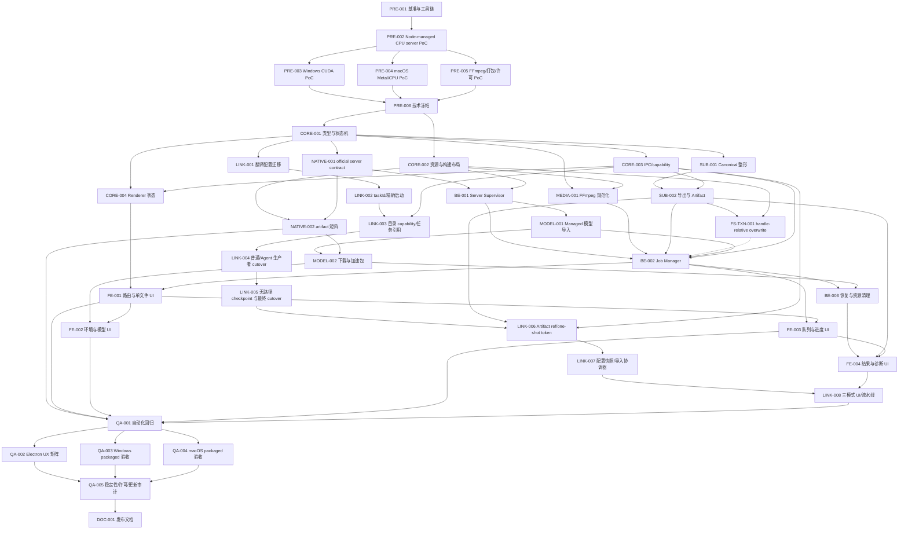

# 本地字幕转写工具 Execution Plan

> 创建日期：2026-07-16；最近更新：2026-08-04
>
> Feature Slug：`local-subtitle-transcriber`
>
> 对应设计文档：`docs/v0.2.11/local-subtitle-transcriber/local-subtitle-transcriber_final_design.md`
>
> 当前状态：39个顶层包中20个已完成、17个未开始、2个进行中。`MODEL-002A`～`MODEL-002D`已接通model/VAD/CUDA managed lifecycle与受控root启动孤儿清理；`FE-002`已完成环境/resource UI、main-only identity-bound backend resolution proof、开始前path/hash-free preview、macOS arm64 Metal production admission及用户确认CPU新generation代码闭环。macOS页面按selected model显示main返回的`auto -> metal`，enqueue仍在capability commit前重新解析并冻结exact runtime/server/model identity，Supervisor在exact child进入ready前完成main-only positive attestation；GPU失败后只有main签发资格的exact generation可由用户确认创建显式CPU新generation，普通retry不改变backend。Windows CUDA继续`backend_unverified`且不回退。顶层`MODEL-002`仍等待真实大文件下载与目标环境证据；`FE-002`仍等待Windows CUDA production admission及目标机证据，均不提前标完成。真实模型/VAD/CUDA archive Electron产品E2E、NSIS生命周期、目标GPU与M2 packaged验收仍按QA边界处理
>
> 发布门禁：M0 已解除；正式实现必须遵守 `poc/pre006-production-decision.json`，不得静默更换引擎、平台、模型或 runtime acquisition policy
>
> 2026-07-16 审查修订：补齐部分导出、会话 revision 重同步、resource job、runner 取消、无模型入队与 Agent/恢复消费者迁移；修正 pnpm/工具链事实，并把过大的 LINK 包拆为8个；2026-07-22新增`FS-TXN-001`后总计39个工作包；2026-07-23～2026-07-29完成`FS-TXN-001A`～`FS-TXN-001J` component checkpoints，2026-07-28完成`NATIVE-002A` macOS arm64 official runtime assembly及`NATIVE-002A1` unrestricted Metal production-model复验，2026-07-29完成`NATIVE-002B` Windows CPU/CUDA/media canonical assembly与target smoke，2026-07-30完成`NATIVE-002C` macOS arm64 packaged component，2026-08-01完成`NATIVE-002D` Windows x64 packaged consumption（app/NSIS/packaged validator/CPU+CUDA smoke/NTFS overwrite+recovery回归），均不增加顶层工作包数量；2026-08-03补齐production overwrite条件化接线并关闭`NATIVE-002`、`FS-TXN-001`与`BE-002`，随后完成`FE-001`的用户可见单文件CPU→SRT纵向实现

> 2026-08-03 `FE-002`环境/资源管理checkpoint：LocalSubtitleTranscriber新增server contract、runner、FFmpeg、platform/arch与CPU/CUDA/Metal probe摘要，缺失或失败只显示稳定状态/error code；managed model/VAD/accelerator列表接通fixed `resourceId` install/cancel/delete与File-only GGML copy/move import，显示ready占用、预计导入占用、ResourceJob阶段/bytes/失败和可操作重试。页面只消费共享SPA runtime的revisioned `resourceJobs`并在终态重读manifest，离页返回由既有subscribe-before-snapshot reconciliation补齐；长错误、code与文件名使用block wrapping surface。打开页面只probe/list/snapshot，不自动下载或启动带模型server。production admission仍固定CPU/no-VAD，因此开始前如实显示CPU task profile，auto GPU resolution与确认式CPU新generation未伪装完成，`FE-002`保持进行中。
>
> 2026-08-04 `FE-002` main auto-backend checkpoint：新增main-only branded backend resolution proof，绑定requested preference、resolved backend、managed model hash、runtime generation/target/root与exact server artifact完整identity。Job Manager在batch capability reserve/commit前解析并验证proof，immutable snapshot保存`devicePreference=auto`与`resolvedBackend=cpu`；Production Executor在加载模型时重新验证runtime与artifact没有漂移，并让batch pin消费proof中的artifact/backend。renderer不接收path/hash/flag authority。显式CUDA/Metal因production verifier尚未接通返回`backend_unverified`，不会CPU fallback；`FE-002`继续等待pre-start preview、GPU admission和确认式CPU新generation。
>
> 2026-08-04 `FE-002` pre-start backend preview checkpoint：新增fixed public `previewBackend({ modelId, devicePreference })`，preload无generic transport；Job Manager只读复用managed model、runtime admission与同一backend resolver，返回`devicePreference/resolvedBackend/modelId/serverArtifactId/serverVersion`，不公开path/hash/runtime generation/flag/proof，不reserve capability、不发布batch、不启动带模型server。页面只按selected ready model消费main summary，以generation与response identity guard阻止旧响应覆盖，preview未就绪或失败时禁止开始；enqueue仍重新解析并冻结最终proof。当前`auto -> cpu`如实展示，显式Metal/CUDA仍为`backend_unverified`。`FE-002`继续等待GPU admission和确认式CPU新generation。

> 2026-08-04 `FE-002` macOS Metal production admission checkpoint：production composition安装只声明`darwin/arm64`的main-only attestor；resolver要求attestor capability与verified exact `metal_cpu` artifact后才把`auto`/显式Metal冻结为Metal，显式CPU继续唯一注入`--no-gpu`。Supervisor为exact child建立绑定epoch/PID/runtime/artifact的opaque evidence，stdout/stderr分别有界保留并只解析初始化/device/failure布尔证据，观察窗、startup deadline、abort与close均fail closed；raw marker不进入IPC/renderer/snapshot。Job Manager/Executor与queue-admission pin接通branded Metal proof。聚焦4 files / 185 tests与TypeScript/diff通过；未执行restricted Metal或目标机QA。`FE-002`继续等待Windows CUDA与确认式CPU新generation。
>
> 2026-08-04 `FE-002` confirmed CPU retry generation checkpoint：task summary新增main-only资格位，只有固定GPU/runtime错误白名单命中的失败非CPU generation可展示确认入口；fixed public IPC只接受`taskId + generation`。Job Manager保存generation-scoped execution binding，普通retry沿用原backend，确认CPU retry则重新验证capability、model、runtime与显式CPU proof，创建`generation + 1`及全新queue admission/runtime slice；Session Registry只允许该受控GPU→CPU相邻generation变更。pending retry绑定owner、可abort、计入idle/shutdown并阻止准备期间删除模型；页面提供明确性能确认，renderer不接收path/hash/proof/flag authority。聚焦6 files / 160 tests、完整local-subtitle 60 files / 1182 tests（2个real-native skip）、TypeScript、i18n、manifest、三段Vite test build与diff通过。`FE-002`继续等待Windows CUDA及目标机证据。
>
> 2026-07-16 范围变更：macOS 只支持 arm64，删除 x64 产物/验收；FFmpeg/ffprobe 作为安装包内置运行时，系统 PATH 仅用于 PRE/开发 PoC
>
> 2026-07-16 证据修正：Windows PRE-001 改用固定官方预编译资产；CMake/MSVC/`nvcc` 独立记录为可选 `sourceBuild` 能力，不再误作 PRE-001、PRE-002 或最终用户运行前置
>
> 2026-07-16 范围收口：PRE-001 是产品开发启动门禁，不是科研 benchmark；现有 3 个真实样本即为完整范围，不要求独立真值、语料权利审计、FasterWhisperGUI 快照/配置、CTranslate2 模型 hash、英文或额外声学场景
>
> 2026-07-17 PRE-002 架构修正：官方预编译 `whisper-server` 已覆盖模型驻留、`/health`、`verbose_json` 和基于连接断开的 abort；首版改为 Node-managed official server，不再预设自写 C++/JSONL runner 或 Windows 本地 CMake/MSVC
>
> 2026-07-17 PRE-004 证据修正：精确 `whisper.cpp v1.9.1 / f049fff` 的 thin arm64、Metal-library-embedded server 已通过 backend、RTF/RSS、复用、取消和 packaged-like 检查；但原始 `verbose_json` 存在最长 347 段连续重复与越界时间戳，parse-back 只证明序列化结构。Developer ID/Gatekeeper 不再是 PRE-004 门禁，未来公开无警告分发由 `QA-004` 验收
>
> 2026-07-17 PRE-004 完成：一次性规范化为 PCM16，按 30 秒窗口/5 秒 overlap 独立推理；raw gate 覆盖重复、非法/越界时间轴、超长段和窗口执行覆盖，退化窗口受控拆短。VAD 开启时禁用 token timestamps，只使用已映射回原媒体的 segment 时间。SUB-001 随后把 production v1 进一步收口为 VAD/非 VAD 均使用 `segment_only_v1`，不向 post processor 暴露 words。3 样本 Metal/CPU 最终矩阵均通过，Gatekeeper rejected 继续仅归 `QA-004`
>
> 2026-07-17 PRE-005 macOS 阶段记录：固定 FFmpeg 8.1.2 最小 LGPL arm64 build recipe、macOS 11 target、stable logical prefix、license/source offer；nested signing 后生成 runtime manifest，`extraResources`/`${arch}`/`beforePack`、外层签名 hash 不变、9 格式/多音轨/长路径/no-PATH/fault matrix 均通过。当日尚待 Windows 子矩阵，已由下方 2026-07-18 完成记录闭环
>
> 2026-07-18 PRE-005 完成：Windows 已固定 immutable BtbN LGPLv3 x64 candidate，官方 FFmpeg 8.1.2 detached signature 的完整 fingerprint 验证通过；15 个 unsigned x64 PE staging、x64 `dir` builder 正反向门禁、9 格式/多音轨/长路径/no-PATH/9 类 fault matrix 均实跑通过。未创建证书、未改信任库；公开 Windows installer 信任/timestamp 仅归未来可选 `QA-003`
>
> 2026-07-18 PRE-006 完成：五项 production 决策全部为 `go`；固定 `whisper.cpp v1.9.1 / f049fff`、Node-managed HTTP contract v1、Windows CPU base/CUDA on-demand、macOS arm64 Metal/CPU、macOS x64 unsupported、平台化 FFmpeg 8.1.2、`large-v3-q5_0` + Silero v6.2.0 首发资源和有界窗口/体积门禁。Windows BtbN build 被接受为 initial personal baseline，不要求本地 source-build 或 Authenticode；QA-005 只保留分发前精确 notices/source-offer/NVIDIA DLL 复核

> 2026-07-21 CORE-001 完成：新增独立 domain/IPC runtime schema，冻结 PRE-006 pins、v1 上限、immutable batch snapshot、10×10 状态迁移、full/partial/none-success、post-action、error manifest、canonical transcript 与 revision/generation 合同；普通 request/event 与 session snapshot 分别使用 256 KiB / 4 MiB UTF-8 frame gate，strict schema 拒绝 raw path、任意 executable/args/backend flags、未知字段和未发布 Vulkan。57 项定向 Vitest、TypeScript、manifest drift 与 Audio IPC 回归通过；channel/owner/native HTTP/resource resolver 未跨包实现

> 2026-07-21 CORE-002 完成：新增 production strict/deep-frozen runtime manifest、显式 dev/packaged resolver、完整 Windows base artifact/evidence profile、symlink/containment/size/SHA/arch/execute/signature gate，以及共享 versioned staging contract/canonical preflight。CORE-002 定向 42 项、CORE+Audio 117 项、全量 918 项 Vitest 与 TypeScript/manifest/Node gate 通过；正式 `extraResources`、真实 artifact 和 launch/HTTP probe 未跨包实现

> 2026-07-21 CORE-003 完成：新增完整 fixed preload API、15 public / 6 internal / 2 event exact channel、main-issued document owner session、独立 input/output/artifact/import registry、draft→task/batch atomic lease 与双向 runtime schema gate；legacy bridge 不再暴露 raw Electron event，子窗口不能绕过 private channel。真实业务 handler 与 cleanup retry 没有跨包伪实现

> 2026-07-21 CORE-004 完成：新增安全偏好 Store、task/resource shared-revision reducer、SPA 级 runtime singleton 与 bounded capability cleanup retry；subscribe-before-snapshot 保留 identity/generation observation，覆盖 gap/overflow/tombstone/stale generation/epoch/observer failure。9 files / 132 tests 定向、全量 109 files / 1034 tests、TypeScript、Vite test build 与 manifest gate 通过

> 2026-07-21 NATIVE-001 完成：新增 pinned v1.9.1 HTTP/schema、`node:http` streaming multipart、opaque verified bundle + artifact ID launch/load contract、strict environment 与 bounded redacted diagnostics。startup readiness/runtime health 分相且与 inference 共用 single-active ticket；inference deadline 覆盖 open/stat、HTTP exchange 与 bounded FileHandle close，mid-request/timeout/HTTP/schema/transport/cleanup failure 均要求新 generation。4 files / 75 tests 定向、全量 113 passed + 1 skipped files / 1109 passed + 1 skipped tests、TypeScript 与 real CPU two-request/same-PID smoke 通过；child/session/port/process epoch/restart/kill/owner cleanup 的独占 owner 为 `BE-001`，现已完成

> 2026-07-21 BE-001 完成：新增 opaque/identity-bound `0700` server session、`unloaded → starting → ready → stopping/faulted/disposed` Supervisor、owner/load lease、独立 process epoch、同步 request ticket、fresh startup retry、runtime health restart、backend attestation、AbortController → SIGTERM → SIGKILL 与 close-gated 单次 finalization；接通同步 owner release、`before-quit` 和 update install 的共享有界 shutdown。聚焦 3 files / 37 tests、显式 real CPU 1/1、全量 116 passed + 2 skipped files / 1146 passed + 2 skipped tests、TypeScript、三段 Vite test build 与 manifest gate 通过。PCM window 仍属 `MEDIA-001`，raw quality/retry 属 `SUB-001`，Job Manager 属 `BE-002`，启动 orphan scan 属 `BE-003`

> 2026-07-21 SUB-001 完成：新增 segment-only v1 policy、16 kHz structural root plan、main-only attempt graph、stable root/window/parent + attempt/epoch/request lineage、exact retry children、verified no-speech evidence、PRE-004 raw gate、owned-boundary merge与 grapheme-safe canonical shaping。正常 split 保持内部结构化 control，逐窗 retry 只有 exhausted/unsplittable 映射质量失败；`estimatedTiming` 进入 canonical strict schema并与 words 互斥。processing warning 保持 main-only，public completion warning v1 不扩张。聚焦 4 files / 174 tests、全量 117 passed + 2 skipped files / 1223 passed + 2 skipped tests、TypeScript、三段 Vite test build、manifest 0/0 与 validator 17/17 通过。PCM/WAV authority 仍属 `MEDIA-001`，SRT/LRC/atomic artifact 仍属 `SUB-002`，非 VAD words 等待 versioned server capability。

> 2026-07-21 MEDIA-001 完成：新增 shell-free/close-confirmed native process contract、fixed bundled FFmpeg/ffprobe version attestation、task-private source snapshot、owner/file/runtime/track-table stream binding、decode-time `-t`/`-fs` 与 disk guard、RIFF/RF64 exact-frame PCM/window/SHA-256 proof，以及 owner fault/release/shutdown cleanup；`probeMedia` 接入 app-scoped composite runtime。聚焦 4 files / 84 tests、全量 121 passed + 2 skipped files / 1312 passed + 2 skipped tests、TypeScript、三段 Vite test build、manifest 0/0、validator 17/17 与 diff gate 通过。final packaged bytes/`extraResources`/builder/signing/no-PATH smoke 仍属 `NATIVE-002`，BE binding/orphan 分别留 `BE-002` / `BE-003`。

> 2026-07-22 SUB-002 完成：新增 strict SRT/LRC formatter/parser/round-trip、同目录 private partial、index hard-link no-clobber、standalone overwrite atomic rename、目录对象 mutex、共享 terminal resolver 与 app-scoped Artifact Registry；read/reveal fixed IPC 已接通，每次操作重验 owner/op/TTL/generation、目录/文件 identity、size/hash、UTF-8 与 parser。partial 稳定 identity 与 mutable size 已分离，required cleanup failure 不再吞掉，hard-link detach/Registry activation 失败会回滚 final 且不激活 ref。后续审计确认 path-only overwrite 不能恢复 replacement directory 中被覆盖的 victim，因此当前 production 只放行 index，overwrite 等待目录句柄相对事务。聚焦 5 files / 94 tests、local-subtitle 23 passed + 2 skipped files / 431 passed + 2 skipped tests、全量 124 passed + 2 skipped files / 1383 passed + 2 skipped tests、TypeScript、三段 Vite test build、manifest 0/0、validator 17/17 与 diff gate 通过。handoff/one-shot token 仍属 `LINK-006`。
>
> 2026-07-22 MODEL-001 完成：新增 strict/deep-frozen model manifest、abortable GGML header/size/SHA verifier、app-scoped Session Registry/ResourceJob、managed copy/move staging、CPU no-VAD load smoke 与 fixed model IPC/main lifecycle。managed/models/staging 使用 `0700` 与 dev/inode/birthtime/realpath proof；commit no-clobber，list/resolve 复验 exact metadata，owner/app shutdown 禁止 late cache write并重试 identity-bound cleanup。move 删除异常会保留最后一份 verified managed copy直到源恢复；quarantine rediscovery 只有在当前事务已持有 creation receipt 时才允许。聚焦 4 files / 50 tests、local-subtitle 29 passed + 2 skipped files / 504 passed + 2 skipped tests、全量 130 passed + 2 skipped files / 1456 passed + 2 skipped tests、TypeScript、三段 Vite test build、manifest 0/0、validator 17/17 与 diff gate 通过。默认 2 个真实 server tests 保持 skipped，target packaged 证据仍属 `NATIVE-002`。

> 2026-07-22 BE-002 production executor slice 完成：在既有 Job Manager/revision/capability foundation 上接通单文件 CPU/transcribe/no-VAD/custom/SRT/export-only production executor 与 main IPC。入队 capability commit 前执行 owner-bound bundled media runtime admission；执行期绑定 normalization、完整 structural window、windowAttempt、processEpoch、单调 request/response generation 与前后 exact file identity，完成 raw gate、精确拆窗 retry、canonical post-processing、cleanup 后 SRT export。新增 `cleanup_failed`，只有存在取消证据才使用 `cancel_failed`；owner/app lifecycle 固定 Job/Model quiesce → Media/Supervisor cleanup → Session Registry finalize，前序失败不短路后续清理。local-subtitle 33 passed + 2 skipped files / 602 passed + 2 skipped tests、全量 134 passed + 2 skipped files / 1554 passed + 2 skipped tests、TypeScript、三段 Vite test build、manifest 0/0、validator 17/17 与 diff gate 通过；2 个 skip 均为未启用的真实 native server 测试，Vite 仅有既有 warning。多文件/source/LRC/CUDA/Metal/VAD/translate/translation handoff/FE/native E2E 尚未完成，因此 `BE-002` 继续为进行中。

> 2026-07-22 BE-002 multi-file checkpoint：custom CPU/no-VAD/SRT/export-only 入队已放开到 schema 上限 100 文件，整批 capability transaction 与连续 revision 原子发布，批内有序并遵守 app-global FIFO；task scope 失败只影响当前文件，batch/session scope 在首个失败发布前 fence 同批 queued sibling，后续 batch 继续。batch/task ID 在异步 admission 前预留，输入按 exact file identity 去重；enqueue/retry/terminal publication 的同步重入、pending admission release、共享 output lease 与 owner 分区 capability renewal 均已闭环。入队冻结 main-only media runtime generation，executor 拒绝 admission 后 runtime 漂移。Supervisor 的最后 task lease release 保留 compatible warm epoch，owner/timer-token aware idle policy 支持顺序任务复用并在最后 resident owner、identity 切换或 app shutdown 时清理；background idle cleanup failure 锁存 fault 并由 shutdown 重试。local-subtitle 33 passed + 2 skipped files / 630 passed + 2 skipped tests；全量 134 passed + 2 skipped files / 1582 passed + 2 skipped tests；TypeScript、三段 Vite test build、manifest 0/0、validator 17/17 与 diff gate 通过。warm epoch 只证明无干扰顺序复用，严格“同批只加载一次”仍需 batch pin/shared admission，故 `BE-002` 保持进行中。

> 2026-07-22 BE-002 batch runtime pin：Job Manager 为同一 batch、同一 queue admission 的连续 execution wave 持有 opaque runtime slice；Production Executor 在首个任务 media normalization 和逐任务 runtime revalidation 成功后才 lazy acquire Supervisor pin。pin 绑定 owner、batch 与完整 exact load identity，活动期间阻止 model smoke、不兼容 identity 切换和 idle retirement；每个任务仍独立获取/释放 pinned task lease。当前任务取消或 task-scope `cleanup_failed` / `cancel_failed` 后，只要同 admission 仍有 queued sibling 就继续持 pin；安全取消可退役 process epoch，但下一任务只能在同一 pin authority 下恢复相同 identity。batch/session failure fence sibling 后释放；failed terminal 保留的 retry capability authority 不持 pin，显式 retry 领取新 admission 并在实际执行时重新 lazy acquire。owner release 和 app shutdown fence work 后幂等关闭 pin。聚焦 3 passed + 1 skipped files / 125 passed + 1 skipped tests、local-subtitle 33 passed + 2 skipped files / 654 passed + 2 skipped tests、全量 134 passed + 2 skipped files / 1606 passed + 2 skipped tests、TypeScript、三段 Vite test build、PRE manifest 0/0、validator 17/17 与 diff gate 通过。2 个 skip 仍是未启用的真实 native server 测试；额外 canonical runtime staging 检查因 Git 忽略的 native runtime 目录不存在而 fail closed，因此没有 native/packaged E2E 结论。

> 2026-07-22 BE-002 source output parent isolation：source admission 同时要求 task input 的 `transcribe` 与 `derive_source_output`，不创建 batch output lease。main 在 input authorization 时冻结 canonical parent object identity，后续逐边界重验；Executor 在 media/pin 前 fail-fast，只跨阶段保留无路径 identity proof，导出时重新解析且必须匹配该 proof。输入文件 identity 变化保留 `media_changed/preparing_media`，父目录 availability/identity 失败为 task-scope `output_write_failed/exporting`，TTL 失效保留 `authorization_expired/preflight`；terminal capability renewal failure 不覆盖 executor 已返回的执行错误。custom/source 均为 index-only，overwrite 在 capability 消费前拒绝。不同父目录同名文件独立提交，一个父目录失败不阻断 sibling；public snapshot/event/IPC 不含 capability 或 raw path。聚焦 5 files / 160 passed；local-subtitle 33 passed + 2 skipped files / 681 passed + 2 skipped tests；全量 134 passed + 2 skipped files / 1633 passed + 2 skipped tests；TypeScript、三段 Vite、manifest 0/0、validator 17/17 与 diff check 通过。canonical runtime staging 因 canonical path 缺失而按合同 fail closed。

> 2026-07-22 BE-002 LRC/multi-format/partial-output：Production gate 放行 `[SRT]`、`[LRC]`、`[SRT,LRC]` 与 `[LRC,SRT]` 并保留请求顺序；custom/source 两种 index-only 路径均支持 full、普通第二格式失败 partial 和首格式 commit 后取消 partial。普通 partial 不带 warning，只有 artifact cancellation marker 产生 `cancelled_after_partial_commit`；跨格式 all-failed 时 cleanup/cancel failure 优先，取消下逐 artifact 规范化 cleanup code。Job Manager、Session Registry 与 IPC schema 统一按 artifact evidence 结算，late cancel、lease renewal abort 和 invalid cancellation fallback 不再覆盖 committed artifact 或丢失逐格式结果。聚焦 4 files / 176 passed；local-subtitle 33 passed + 2 skipped files / 700 passed + 2 skipped tests；全量 134 passed + 2 skipped files / 1653 passed + 2 skipped tests；TypeScript、三段 Vite、manifest 0/0、validator 17/17 与 diff check 通过。canonical runtime staging 仍因 canonical path 缺失按合同 fail closed。

> 2026-07-22 FS-TXN-001 checkpoint：新增 strict/deep-frozen overwrite request、branded synchronous Coordinator/receipt、thenable/reentrancy fence，并把 Exporter 接到 `begin → Registry activate → finalize/rollback`。无 backend 时在目录解析/partial 写入前 fail closed；legacy rename 只作为显式 test adapter。existing/absent victim、真实 Registry 连续 read、activation/finalize/revoke/rollback 故障、late cancellation 与 production partial cleanup 组合回归通过。聚焦 3 files / 138 passed；local-subtitle 34 passed + 2 skipped files / 768 passed + 2 skipped tests；全量 135 passed + 2 skipped files / 1721 passed + 2 skipped tests；TypeScript、三段 Vite、manifest 0/0、validator 17/17、diff check 通过。native 两平台 backend、hostile replacement、rollback failure recovery、victim recovery 与 packaged validation 未完成，production 双重 index gate 未解除，`FS-TXN-001`/`BE-002` 继续进行中。
>
> 2026-07-23 FS-TXN-001B macOS arm64 component checkpoint 完成：production addon 升级为 protocol v2 exact `protocolVersion/platform/architecture/begin/recover` exports，以 `<partialLeaf>.fusionkit-overwrite.open|rollback` journal 持久化 exact request 与 rollback direction；fresh process 只重放 `rollback_pending`，合法且仍存在的 `.open` journal 返回 `decision_required`。finalize-crash recovery 未支持或宣称，若 crash 发生在 journal unlink 后则可能返回 `not_found`。TypeScript receipt 增加 `finalize_pending`/`rollback_pending`，backend 真正开始后抛错只允许同 receipt 同方向重试；Exporter finalize 重试一次仍失败时保留 Registry commit 方向。native 11/11、聚焦 4 files / 190 passed、local-subtitle 35 passed + 2 skipped files / 820 passed + 2 skipped tests、全量 136 passed + 2 skipped files / 1773 passed + 2 skipped tests、TypeScript、三段 Vite、manifest 0/0、validator 17/17 与 diff check 通过。该 checkpoint 不宣称 non-cooperative writer、finalize crash、power-loss、main composite owner、Windows 或 packaged safety，production 双重 index gate 不变。
>
> 2026-07-23 FS-TXN-001C composite recovery owner checkpoint完成：native升级为protocol v3/journal v2，exact `transactionId`绑定canonical partial leaf，recover只接收ID、重新授权目录及其identity。新增branded single-claim recovery authority、path/capability/token-free file repository、directory-object mutex/fence、main/Registry composite owner与Exporter prepared handoff；owner release、shutdown及shutdown后late adoption会重试未收敛authority。`decision_required`与`not_found`都保留pending record、durable direction和已选目录fence，shutdown返回`recovery_pending`；只有native与Registry authority真正收敛后才删除record并释放fence。prepared handoff只在进程内`WeakMap/Map`预留ID/metadata，不是durable preclaim，未关闭begin后、adopt持久化前的进程退出窗口。native 11/11、focused 7 files / 257 passed、local-subtitle 37 passed + 2 skipped files / 883 passed + 2 skipped tests、全量138 passed + 2 skipped files / 1836 passed + 2 skipped tests、TypeScript、三段Vite test build、manifest 0/0、validator 17/17与diff check通过；production main和gate不变。
>
> 2026-07-24 FS-TXN-001D Windows x64 component checkpoint完成：plain Node-API production addon与macOS保持protocol v3/journal v2 parity，输出目录只打开一次no-follow HANDLE，child lookup/mutation全部使用`RootDirectory`-relative NT operations；existing/absent victim、reparse/no-follow、hard-link/identity/size/case-collision拒绝、same-receipt terminal retry与fresh-process exact rollback recovery均通过。Windows identity固定为8位volume serial + 32位FileId小写hex，不经过JS safe-number且不绑定会受NTFS tunneling影响的creation time。native Node tests 6/6；production 4 terminal + 5 recovery + 6 rejection；test-only 3 begin crashes + 14 rollback crashes + 14 rollback error/retries + 5 finalize error/retries + 2 finalize-crash boundary cases；identity/loader focused Vitest 3 files / 147 passed，TypeScript通过。production main、双重index gate、durable preclaim/finalize decision、Registry/authorization identity composition、staging/builder和packaged validation均不变。
>
> 2026-07-26 FS-TXN-001E cross-platform composition checkpoint完成：新增统一filesystem object identity采集器，Windows只从bigint stats生成8位volume serial + 32位FileId；输出目录authorization、Artifact Registry、Exporter partial/overwrite activation、recovery selection与Executor directory proof均接受strict POSIX/Windows联合类型。Registry独立保存exact file object identity与内容快照，移除001D的Windows Registry边界回滚。定向10 files / 330 passed、TypeScript、三段Vite test build、manifest 0/0与validator 17/17通过。production main、durable decision、staging/builder、双重index gate与packaged范围均不变。

> 2026-07-27 FS-TXN-001F durable recovery decisions checkpoint完成：native升级为protocol v4/journal v3，production exact exports增加`acknowledge`；main在native begin前持久化schema-v2 path-free `rollback_unpublished + not_started` preclaim，Registry activation后持久化`finalize_committed`。finalize decision写盘只允许首次加一次完全相同payload的有界重试；两次失败时保留receipt、Registry activation与directory fence，不进入native finalize或回退rollback。native terminal先发布`.finalize`/`.rollback` marker再收敛namespace，receipt/fresh-process recovery保留marker并进入pending acknowledgement；main只有在`nativeState=settled`持久化成功后才ack，最后删除record并释放directory fence。native finalizer对`.open`保持方向中立，只续跑已armed方向且不自行ack；abandoned-open existing/absent × finalize/rollback fresh-process矩阵已覆盖。001F当时允许not-started rollback preclaim按`not_found`完成；001I已将该边界收紧为所有recovery `not_found`均保留record/fence，只有已有settled proof后的acknowledgement可幂等完成。macOS native 11/11、Windows contract 6 passed + 真实Windows 1 skipped、local-subtitle 38 passed + 2 skipped files / 914 passed + 2 skipped tests、全量139 passed + 2 skipped files / 1867 passed + 2 skipped tests、TypeScript、三段Vite、manifest 0/0与validator 17/17通过。production main/IPC/UI、verified staging/builder、packaged validation、真实Windows矩阵与双重index-only gate在001F checkpoint时仍未闭环，因此顶层`FS-TXN-001`继续进行中。

> 2026-07-27 FS-TXN-001G verified native-addon staging/load + builder contract checkpoint完成：独立staging schema固定两目标N-API v8/protocol v4/journal v3、build receipt与签名/hash phase，addon以最终签名后SHA命名并原子发布到`overwrite/v1`；main verifier返回不可结构伪造、generation-bound的opaque proof，并在load前后重验root/manifest/receipt/artifact identity。正式builder只允许一个canonical `extraResources` mapping，beforePack强制process/context target一致并以`launch:false`同时执行official runtime与overwrite addon gate；macOS outer signing忽略已nested-signed并冻结hash的runtime subtree。staging/builder 21/21、overwrite-native 29 passed + 1真实Windows skipped、loader focused 2 files / 79 passed、相关4 files / 160 passed、local-subtitle 39 passed + 2 skipped files / 922 passed + 2 skipped tests、全量140 passed + 2 skipped files / 1875 passed + 2 skipped tests、TypeScript、三段Vite、manifest 0/0、validator 17/17与diff通过；真实macOS production build→ad-hoc sign→stage→fresh load通过。runtime Node为58 passed + 1 skipped + 1个既有fabricated Windows `where.exe` fixture失败，不是本次回归，因此不记为全绿。该checkpoint不注入production main、不接reauthorization IPC/UI、不解除双重index gate，也不替代真实Windows或两平台packaged验证。

> 2026-07-27 FS-TXN-001H production overwrite main composition checkpoint完成：新增只接受canonical verified proof的production bootstrap，固定versioned repository为`<userData>/local-subtitle/recovery/overwrite-recovery.v2.json`；已知resource/backend错误映射为`unavailable`，已知repository/recovery错误映射为`blocked`且不重写invalid state，未知错误继续rethrow。ready分支把同一native runtime/recovery owner成对注入Exporter和SessionLifecycle；非ready分支在`app_quit/fatal`时noop、`update`时返回`recovery_pending`。focused 11 files / 313 passed、local-subtitle 40 passed + 2 skipped files / 931 passed + 2 skipped tests、全量141 passed + 2 skipped files / 1884 passed + 2 skipped tests，overwrite-native 29 passed + 1 skipped，manifest 0/0、validator 17/17、TypeScript、三段Vite与diff通过。Job Manager/Executor双重`index-only`及IPC/UI不变；下一步001I接入reauthorization IPC/UI，并先关闭新的reauthorization admission再等待已有recovery tails收敛；真实Windows和两平台packaged范围仍未完成。

> 2026-07-27 FS-TXN-001I reauthorization IPC/UI checkpoint完成：新增strict app-scoped list/recover合同、100项tuple-cursor分页与renderer 64页上限（`64 x 100 = 6400`，覆盖1 MiB repository约4100条最小记录容量）、stable 12-hex `displayCode`、跨窗口per-recovery picker admission coordinator、目录锁内TTL验证、temporary capability finally revoke及pending `not_found` fail-closed。App全局恢复prompt提供四语言、可辨识path-free列表、task failure/focus/visibility刷新、自动聚焦及safe Date fallback；begin throw形成且无法证明journal状态的孤立preclaim仍保留，未来只能由显式验证的discard合同清除，不能自动删除。focused 9 files / 175 passed；local-subtitle 42 passed + 2 skipped files / 951 passed + 2 skipped tests；全量145 passed + 2 skipped files / 1921 passed + 2 skipped tests；overwrite-native 29 passed + 1 skipped；manifest 0/0、validator 17/17、四语言各1522 keys、TypeScript、三段Vite与diff通过。001A～001I均为component checkpoints；顶层状态与双重`index-only` gate不变。

> 2026-07-29 FS-TXN-001J Windows x64 protocol v4 real-matrix checkpoint完成：固定LLVM-MinGW 20260407、Node 24.14.0 headers与Windows x64 `node.lib`，真实编译/加载N-API v8 production/test-only addon。`NtCreateFile`最小权限journal改用`NtFlushBuffersFile`持久化；rollback/finalize在zero-link proof后显式关闭delete-pending HANDLE，再执行named absence/identity proof。production 4/4 terminal、9/9 recovery/open-decision、6/6 rejection；fresh-process 4/4 abandoned-open、4/4 begin crash、4/4 open-recovery arm crash、12/12 rollback crash、12/12 rollback error retry、7/7 finalize error retry、7/7 finalize crash、4/4 acknowledgement crash、4/4 acknowledgement error retry、2/2 conflict。production/test artifact分别为847,360 bytes / `40c666c...c5b2`与849,920 bytes / `fd4eeee8...f82`；build/load test 7/7、overwrite focused Vitest 220/220、TypeScript、三段Vite与manifest validator通过。报告保持`productionGateChanged=false`、`powerLossSafetyClaimed=false`；artifact仍为ignored developer evidence，未stage/package。

---

## 1. 每次开发会话的使用方式

### 1.1 开始前

每次实现会话必须按顺序完成：

1. 阅读 `docs/v0.2.11/README.md` 和 `docs/v0.2.11/v0.2.11_iteration_execution_plan.md`。
2. 完整阅读 Final Design 和本 Execution Plan，不能只依赖聊天摘要。
3. 阅读 `.agents/skills/fusionkit-pitfall-guard/references/index.md`，至少检查 `FK-PIT-0021`、`FK-PIT-0022` 与 `FK-PIT-0023`；实现本地推理/字幕合并时还必须检查 `FK-PIT-0027`、`FK-PIT-0028`、`FK-PIT-0031`、`FK-PIT-0032`；涉及 native build/staging/signing 时检查 `FK-PIT-0029`、`FK-PIT-0033`～`FK-PIT-0035`；涉及Windows native journal/recovery时检查`FK-PIT-0068`、`FK-PIT-0069`；涉及 child close、process epoch、startup retry、warm epoch 或 session finalization 时必须检查 `FK-PIT-0039`、`FK-PIT-0053`；涉及多 owner admission/capability renewal 时检查 `FK-PIT-0052`；涉及持久化、preload、capability、i18n、Electron 视觉验证时，再读取对应条目。
4. 检查第 7 节进度台账，只认领一个可在单次会话闭环的工作包；跨两个包时必须说明它们为何不可拆分。
5. 运行 `git status --short`，确认用户已有改动并限定本次文件范围；不得用 `git add -A` 混入无关修改。
6. 在编辑前明确本次工作包、预期改动文件、验证命令、不涉及范围和已知外部依赖。
7. 原生相关工作先执行与工作包匹配的预检 scope：官方预编译 PoC 只以固定资产、运行依赖和目标驱动为 blocker；CMake/编译器/`nvcc` 只在工作包明确选择 source-build artifact 时成为 required，不得因为设计习惯提前设为 blocker。签名、目标硬件和 packaged 验收仍须真实证据。
8. 若需要变更 JS 依赖或 lockfile，必须先确认 `pnpm --version`；本仓库当前兼容基线为 pnpm `8.7.0`、lockfile v6。优先直接使用 `node_modules/.bin/*` 做验证；版本不是 8.x 时使用 `corepack pnpm@8.7.0 ...`，不得让新 pnpm 改写 `pnpm-lock.yaml`。

### 1.2 实施中

- Final Design 是产品与架构合同，本计划是工作包与交接合同；实现发现两者不可同时满足时先停下，更新设计或新增 `feat/` / `fix/` 文档。
- 每个工作包优先形成可运行的纵向切片，不留下无消费者的空接口、永远返回 mock 的“已验证”状态或只在开发目录可运行的路径。
- 原生模型、下载缓存、构建产物、测试媒体、用户路径和真实 API Key 不进入 Git；只提交源码、固定版本/哈希的 manifest、可再分发许可证、脱敏 fixture 和结果摘要。
- 所有外部进程必须由 Electron main 持有句柄；禁止 shell 拼接命令，禁止 renderer 提交 executable/path/backend flags。
- 新增用户可见文案必须同步四种 locale，并同时通过 locale parity 与 source-usage 检查。
- 本地字幕工具与现有 `/tools/audio/transcriber` 的 route、Store、type、IPC、runtime、配置和测试必须保持独立。

### 1.3 结束前

1. 运行工作包定义的验收命令，并记录精确命令、通过数量、目标平台和未覆盖项。
2. 更新第 7 节台账的状态、日期、文件、验证、实施记录和未决问题。
3. 在 `local-subtitle-transcriber_implementation_records/` 新增实施记录；没有记录不得标为 `已完成`。
4. 如改变产品合同，同步更新 Final Design；验收新增需求写入 `feat/`，回归或缺陷写入 `fix/`。
5. 检查 `git diff --check`、`git status --short`，确认没有模型、二进制、媒体、路径、令牌或临时文件被纳入提交。
6. 若启动 Vite、Electron、runner、FFmpeg、测试服务器或下载任务，结束前逐一关闭并确认无残留进程。
7. 只有实现、测试、文档、台账和实施记录全部闭环时才标记 `已完成`；真实硬件/签名验收未完成时不得用 mock 或开发机构建替代。

---

## 2. 状态规则

工作包状态只允许使用：

- `未开始`
- `进行中`
- `已完成`
- `阻塞`
- `废弃`

定义：

- `未开始`：尚未产生该包的实现或验证产物；阅读和计划不算实施。
- `进行中`：已产生代码、PoC 或验证结果，但尚未满足全部验收口径。
- `已完成`：代码/PoC、测试、文档、实施记录和全部必需平台验证已经闭环。
- `阻塞`：存在明确外部阻塞，例如缺少目标硬件、签名身份、可分发许可结论或关键上游能力；必须写明解除条件。
- `废弃`：设计更新后明确不再实施，台账必须记录替代工作包或终止原因。

禁止因为“代码已写完”“本机能运行”或“测试使用 fake server 通过”就把需要真实 GPU、packaged app、签名/公证或许可证结论的工作包标为完成。

---

## 3. 当前基线与前置事实

计划建立时确认的仓库事实：

| 项目 | 当前状态 | 对计划的影响 |
| --- | --- | --- |
| Electron 打包 | 正式 `electron-builder.json` 已接入唯一canonical `extraResources` mapping、固定 `beforePack`、macOS arm64 / Windows x64 target、`${arch}` artifact name与macOS runtime `signIgnore`；001G冻结official runtime + overwrite addon的`launch:false`双verifier消费合同，002C/002D已用正式配置生成真实macOS `.app`与Windows x64 app/NSIS并完成packaged component验证 | 两平台exact packaged component、production-model target smoke、media no-PATH与fault matrix已闭环；NSIS真实安装/更新/卸载和特殊安装路径属于`QA-003`。builder只能消费版本化staging，不能提交machine path或在electron-builder期间联网 |
| 原生源码 | 仓库当前无 CMake/native runner 目录；PRE-002 已证明 Windows CPU 路径无需新增该目录 | 优先固定和校验官方 server artifact；只有真实能力缺口或目标平台缺产物时才建立 source-build 目录 |
| 已采集工作站 | macOS arm64：Apple M5 10-core CPU/GPU、16 GB，Node 20.19.5、pnpm 8.7.0、CMake 4.4.0、Apple Clang 21.0.0、Xcode 26.6/Metal compiler、FFmpeg/ffprobe 8.1.2；Windows 11 x64：Node 20.19.4、pnpm 8.7.0、lockfile v6、FFmpeg/ffprobe、CUDA 12.4 与 NVIDIA driver 610.62 | Windows PRE-003 与 macOS PRE-004 开发 PoC 均已用 `large-v3-q5_0` 和 3 个真实样本验证；两台机器的系统 FFmpeg 仍只作开发 PoC。macOS 当前无 Developer ID，ad-hoc runner 不能替代签名、公证或 Gatekeeper 发布证据 |
| Windows/CUDA 工具链 | 当前 Windows x64 目标机为 i5-13600KF + RTX 4070 Ti SUPER 16 GB；CPU 固定官方 `whisper-bin-x64.zip`，CUDA 固定官方 `whisper-cublas-12.4.0-bin-x64.zip`；`large-v3-q5_0` CPU/CUDA 实测完成，`sourceBuild.ready=false` | PRE-006 选择官方预编译 server：无需 CMake/MSVC/C++ runner。默认包保留 CPU runtime，CUDA 是约 1.2 GB 的按需包；personal profile 用固定来源+size/SHA+逐文件清单，不要求 Authenticode |
| PRE-001 真实语料 | 3 段用户提供的本机语料均为 medium：日文/中文视频各一段、日文 WAV 一段；FFprobe、完整音轨解码、size/SHA-256、非 ASCII 路径和对应 SRT/LRC 时间轴检查通过 | 这 3 个样本就是开发启动的完整范围；媒体、字幕和绝对路径只在 `.local` inventory，SRT/LRC 只作格式、时间轴与后续人工对照，不要求独立真值、权利审计或复刻其生成应用 |
| 发布版媒体运行时 | macOS arm64 固定 FFmpeg 8.1.2 最小 LGPL source build；Windows x64 固定 immutable BtbN LGPLv3 initial personal baseline；两者均有 builder/no-PATH/fault 证据 | PRE-006 已冻结来源、体积 guard、许可证与 acquisition policy；CORE-002/NATIVE-002 实现正式打包门禁。Windows 不需 source-build 工具链；packaged 模式禁止 PATH/用户 executable fallback |
| 包管理器 | 当前 `pnpm --version` 为 `8.7.0`，lockfile 为 v6；`package.json` 尚未声明 `packageManager` | 依赖变更固定使用 pnpm 8.7.0；普通验证优先使用 `node_modules/.bin/*`，PRE-001 记录是否需要单独工作包固化 Corepack 元数据 |
| CI | 当前没有 `.github/workflows/` | PRE-006 选择先使用可审计本地 release/acquisition scripts；NATIVE-002 不因缺少 GitHub Actions 阻塞，未来 CI 只能复用同一固定合同 |
| Electron 实例模型 | `electron/main/index.ts` 已持有 single-instance lock，但同一进程可创建多个 `BrowserWindow/webContents` | ResourceJob/model/runner/GPU queue 使用 app 级单例和全局锁；task/capability/event 仍须按 owner session 隔离 |
| Audio IPC | 已有 sender-bound capability、固定 preload helper 和 channel policy | 复用安全模式与测试方法，不复用 `audio:*` namespace 或 registry |
| 字幕翻译配置/路径 | 配置分散于 Store、页面 state、localStorage 和 `useModelStore`；现有任务直接携带 `originFileURL`/`targetFileURL` | LINK-001～005 必须收敛配置所有权、引入无路径 source/target/checkpoint ref，并分阶段切换所有生产者/消费者；自动交接不能跨页偷读状态，也不能把 token 换回 renderer raw path 迁就旧字段 |
| 字幕翻译任务身份 | 现有队列主要以 `fileName` 定位 | LINK-002 必须引入稳定 `taskId` 和明确 import receipt，避免启动同名旧任务 |
| Agent/恢复消费者 | `src/agent/tool-executor.ts`、`src/agent/recovery-batch.ts`、`RecoveryDialog.tsx`、`src/renderer/subtitle.ts` 与 `electron/main/translation/*` 仍直接消费 `outputURL`、`originFileURL`、`targetFileURL` 或 `checkpointPath` | LINK-003 先加 capability/ref 与 legacy adapter；LINK-004 迁移新建任务生产者，LINK-005 完成恢复消费者和回滚测试后才可删除旧路径值 |

这些事实不是永久假设。任何工作包修改它们时，必须把结果写回台账和实施记录。

---

## 4. 不得违反的实施约束

1. 新工具固定为字幕分类的 `/tools/subtitle/local-transcriber`，不得塞进现有 AudioTranscriber 或 `audio:*` IPC。
2. 本地模型、GPU backend 和 sidecar 不得表示为远端 Audio API profile/provider/assignment。
3. `window.localSubtitleApi` 只暴露固定方法和精确 public allowlist；preload-only 授权 channel 留在私有闭包。
4. renderer 不得获得或提交真实媒体路径、模型绝对路径、临时 WAV 路径、任意 executable 或任意命令行参数。
5. capability 绑定 `webContents.id` + preload 私有 `ownerSessionId`、资源类型、允许操作和过期时间；reload/navigation/frame destroy 立即失效，SPA 卸载失败的 revoke 必须保留句柄并有界重试。
6. 正式 runtime 必须使用固定 official server release 与版本化 HTTP JSON contract：loopback 临时端口、随机私有 request path、`/health` readiness、`/inference` `verbose_json`、单活动请求、AbortController、kill fallback、超时和结构化错误；不得解析 stock CLI/server 人类日志作为结果或进度合同。
7. GPU 队列首版并发固定为 1，同批次复用模型；不得每个文件重新启动并加载大模型。
8. 时间轴只使用整数毫秒；SRT/LRC 必须由自有 formatter 生成、parse-back 验证并原子提交。
9. 模型不进安装包，必须下载或导入到 `userData`，经过大小、SHA-256 和 runner load smoke 后才是 ready。
10. renderer 只持久化 `modelId`；main 把它解析为 managed file。已有 GGML `.bin` 必须经校验后复制或显式移动到 managed models 目录，不得把任意外部绝对路径登记为运行时模型。
11. 安装、应用启动和打开工具页不得急切下载或加载推理模型；只有下载/导入 load smoke 或批次开始可启动带目标 model/backend 的 server，smoke 后关闭，任务进程按 model/backend 跨任务驻留并在切换、空闲、资源不足、最后一个活动 owner 结束、应用退出或更新时关闭。单窗口结束不得误杀其他 owner 的任务。
12. 内置下载清单由版本化 allowlisted manifest 控制。PRE-006 首发只允许 exact `large-v3-q5_0`；`large-v3`、`large-v3-turbo`、`large-v3-turbo-q5_0` 保持 deferred，在补齐精确 hash 与跨平台证据前不得宣称可一键下载。
13. 模型、VAD 与可选 accelerator pack 不进默认安装包；packaged app 内的 official server、动态依赖和经 PRE-006 审计的 FFmpeg/ffprobe 必须位于 asar 外，由版本化、声明平台签名/unsigned integrity profile 且含 platform/arch/size/SHA-256/licenseRef 的 manifest 校验。packaged 模式不能回退 PATH、Homebrew、Chocolatey、注册表或用户选择的 executable。
14. 推理默认离线；除模型/加速包下载外不发网络请求，普通 Store/session/log/crash artifact 不记录媒体/字幕内容、完整路径、API Key、下载 header 或完整命令行；翻译恢复内容的唯一例外严格按第 29 条处理。
15. 参考 AGPL 项目只做 clean-room 行为研究，不复制其 GUI、输出器、字幕切分器、WhisperX 或配置代码。
16. 自动翻译默认关闭；只有当前批次明确选择 `enqueue_and_start_translation` 才可产生 API 费用。
17. 自动翻译只能启动本次 `SubtitleTranslationImportReceipt.addedTaskIds`；`fileName` 只用于展示，幂等去重使用 main 签发的 opaque `handoffKey`，禁止调用 `startAllTasks()` 影响旧队列。
18. 翻译配置、导入或执行失败不得回滚已导出的字幕，也不得把本地转写 `completed` 改成 `failed`。
19. 生成任务的 artifact、导入和输出目录 capability 必须在翻译运行时保持不透明；不得为了填充旧 `originFileURL`/`targetFileURL` 而在 renderer 解包为 raw path。
20. 用户可见长诊断必须可换行并约束内部 ScrollArea；含长内容的弹窗使用 `ScrollableDialog`。
21. Electron 视觉证据必须等待 preload loading 完全退出，并检查 1080×786、786×540、明暗主题和四语言。
22. 工作包结束不得遗留 Vite/Electron/runner/FFmpeg/下载进程、`.partial`、临时 WAV 或未撤销 capability。
23. 多格式导出至少一个成功时统一为 `completed + partial`，全部失败才是 `failed`；取消不得删除已 commit artifact，不能另造未进入共享 schema 的“部分完成”状态。
24. draft capability 在 batch commit 时原子转移为 task lease；SPA 路由切换不取消 committed task。renderer task/resource channel 必须共用单调 revision cursor，subscribe-before-snapshot 期间保留带 revision/generation 的实体 observation，仅对 snapshot 已覆盖的缺失实体建立 tombstone；buffer overflow 必须提高 snapshot revision floor 且不得丢失 identity observation。reload/window owner 结束才按合同取消。
25. 模型/VAD/accelerator 安装只能提交 allowlisted `resourceId`，并有可查询/取消/重同步的 resource job；renderer 不得提交 URL、下载路径或可执行参数。
26. `enqueue_translation` 无 profile 时必须创建显式 `needs_configuration` task binding；所有 start 入口只接受 ready binding，禁止用空 API 字段伪装可执行任务。
27. LINK-003 完成后仍保留只供既有消费者使用的 legacy path adapter；LINK-004 迁移普通/Agent 新建任务，只有 LINK-005 再迁移 RecoveryDialog、renderer events 和 main recovery 后，才可删除旧 `outputURL`/`checkpointPath` 暴露。
28. 不得因 `requestSingleInstanceLock()` 已存在就省略 owner 校验或资源并发锁；同一 app 内多个 webContents 共享 app-scoped model/download/runner manager，但 task、token、snapshot 和 event 必须 owner-bound。
29. 本地转写 Store/session/log/crash artifact 不得保存字幕正文；已显式启动翻译的 v2 `manifest_fragments` 是唯一内容持久化例外，只保存恢复所需字幕分片且不得含媒体字节、raw path、token/capability 或密钥。enqueue-only 不创建 checkpoint。
30. official server/FFmpeg/ffprobe 必须使用 allowlisted 最小 environment 与受控 cwd，不继承 Electron/Agent 的 API Key、authorization header、代理凭据或其他 secret；自定义模型 load smoke 使用短生命周期 server。
31. macOS 只生成和加载 arm64 runtime；macOS x64 在资源解析前返回 `unsupported_architecture`，不提供 Rosetta、CPU artifact 或用户自备 runner fallback。
32. builder staging 缺 runner、FFmpeg、ffprobe、manifest 或 license/source-offer 证据时必须失败；运行时缺失、损坏或启动失败分别返回 `media_runtime_missing` / `media_runtime_invalid` / `media_runtime_launch_failed`，在 batch commit 前禁用入队并保留草稿、设置、模型与已导出字幕。
33. 长媒体必须按有界独立窗口推理，并在任何整形/导出前通过 raw segment 的重复、时间轴、窗口/媒体边界和执行覆盖门禁；HTTP 200、schema 合法、parse-back 或开头抽查不能替代内容有效性，禁止用全局删除重复行掩盖 decoder loop。
34. `whisper.cpp v1.9.1` production v1 的 VAD/非 VAD 请求均固定 `token_timestamps=false` 与 `segment_only_v1`，post processor 不消费 words。未来 word timeline 必须先升级 versioned server capability/provenance；不能靠可选 `words` 属性提前开启。
35. `windowAttempt` 是 root-plan-local 唯一正整数 dispatch ID；child ID 必须大于 parent但允许有间隔。每个 attempt 必须绑定 Supervisor `processEpoch`，dispatch `requestGeneration` 必须与 response generation 完全一致，`processEpoch:requestGeneration` 不得复用。
36. SUB-001 structural planner 不拥有媒体 authority。`MEDIA-001` 必须生成 immutable main-only branded PCM/WAV window，`BE-002` 再把 brand 绑定到 exact structural window、attempt/epoch/generation 与 response；window swap、stale/reused brand 或 stale response 必须拒绝。
37. shared `LocalSubtitleCompletionResult.warnings` v1 只有 `cancelled_after_partial_commit`；`timeline_boundary_clamped` / `estimated_timing_used` 只属于 main processing report。公开它们必须升级 CORE contract，不能由后续包临时扩展 v1 payload。

---

## 5. 推进顺序与依赖图

### 5.1 总体原则

1. 先证明“能准确、稳定、可合法分发地运行”，再冻结 production 架构。
2. 再冻结类型、状态机、协议、资源路径和 IPC 安全边界。
3. 先关闭单文件 CPU → 标准 SRT 的最小闭环，再扩展 GPU、模型下载、LRC、批量 UX。
4. 字幕翻译配置迁移和精确入队可在本地 runtime 稳定后并行，但最终只能通过 typed artifact handoff 集成。
5. 自动化和 Electron UI 验收先于真实 packaged GPU/Metal 矩阵；所有门禁通过后才同步发布文档。

### 5.2 依赖图



### 5.3 允许并行的范围

- `PRE-003`、`PRE-004`、`PRE-005` 可在 `PRE-002` 后由不同目标机并行，但必须使用同一 engine/model/sample/metrics manifest。
- `CORE-001` 与 `CORE-002` 可在 `PRE-006` 后并行。
- `MEDIA-001`、`SUB-001`、`LINK-001` 可在 shared contract 冻结后并行，禁止彼此直接导入私有模块。
- `FE-001` 可先搭可测试壳层，但不能用 mock ready 状态冒充 runtime 已完成。
- `QA-003` 与 `QA-004` 可并行；`QA-005` 必须等二者和 Electron UX 矩阵都有真实结果。

---

## 6. 里程碑与最小闭环

### 6.1 里程碑

| 里程碑 | 达成条件 | 未达到时禁止 |
| --- | --- | --- |
| M0 技术可行性冻结 | `PRE-001`～`PRE-006` 完成，official server release/contract、模型格式、FFmpeg/加速包来源和平台结论已记录 | 禁止开始 production runtime、完整页面或发布配置 |
| M1 合同与安全骨架 | `CORE-001`～`CORE-004`、`NATIVE-001` 完成，fake server/IPC/capability 测试通过 | 禁止让 renderer 直接访问路径或任意 channel |
| M2 单文件最小闭环 | `BE-001`、`MEDIA-001`、`SUB-001`、`SUB-002`、`MODEL-001`、`BE-002`、`FE-001` 完成，本地导入模型 → 单音频 → CPU server → SRT 原子导出 → reveal 成功 | 禁止宣称批量/GPU/LRC/自动翻译可用 |
| M3 本地转写功能完整 | `FS-TXN-001`、`NATIVE-002`、`MODEL-002`、`BE-003`、`FE-002`～`FE-004` 完成，批量、取消、模型管理、SRT/LRC、两种冲突策略和错误隔离闭环 | 禁止接入自动外部翻译 |
| M4 烤肉流水线闭环 | `LINK-001`～`LINK-008` 完成，三种模式和精确启动合同通过 | 禁止默认或范围不明地启动翻译队列 |
| M5 自动化与 UX 候选 | `QA-001`、`QA-002` 完成，TS/native tests、四语言、宽窄窗口、明暗主题和 a11y 通过 | 禁止进入真实 packaged/installer 矩阵 |
| M6 发布候选 | `QA-003`～`QA-005`、`DOC-001` 完成，Windows/macOS packaged app、许可、更新、稳定性和发布文档闭环 | 禁止合并发布分支或对外标记 stable |

### 6.2 第一个端到端纵向切片

第一个可运行切片只包含：

```text
用户选择 1 个音频文件
  → preload 授权为 sender-bound file token
  → main 使用受控 FFmpeg 规范化为 16 kHz mono PCM16
  → 按 PCM frame 生成约 30 秒有界窗口与小幅 overlap
  → 已导入且验证过的 PRE-006 allowlisted 模型由 persistent CPU runner 加载
  → 每窗独立 inference，raw quality gate 后按绝对毫秒合并
  → 返回 canonical segments
  → 自有 formatter 生成标准 SRT
  → parse-back + 原子写入
  → renderer 显示 completed 并可在文件夹中显示
```

该切片明确不包含模型联网下载、CUDA/Metal、LRC、逐词字幕、批量并发、翻译交接或完整视觉精修。纯 server 合同测试可继续使用公开小模型降低成本，但产品纵向切片必须使用 PRE-006 首发清单中的 `large-v3-q5_0`，不能把小模型 fixture 冒充产品质量证据。先验证权限、协议、进程、时间轴和文件提交，再扩展功能。

截至 2026-08-03，以上切片的 Electron main production code、IPC wiring、renderer `FE-001` 与 unit/contract harness 已接通：页面可探测环境、选择ready managed model、授权单文件、提交冻结的CPU/no-VAD/SRT/index/export-only请求、订阅阶段进度并reveal committed artifact。本轮未使用真实 FFmpeg、official server 与 PRE-006 模型执行Electron产品E2E，因此仍不宣称M2 packaged/目标机验收完成；该证据归后续QA，不反向阻塞`FE-001`代码职责结项。

### 6.3 首版发布闭环

首版发布必须额外具备：

- Windows x64 NVIDIA CUDA/CPU fallback 与 macOS arm64 Metal/CPU fallback 的真实 packaged 验收；macOS x64 只验证稳定拒绝，不生成发布产物。
- exact `large-v3-q5_0` 与 Silero v6.2.0 的下载/续传/校验/删除和本地 GGML 导入；deferred 型号不构成首版门禁。
- 音频与视频批量处理、模型复用、取消、runner crash、OOM、磁盘不足和逐文件失败隔离。
- 有界窗口、overlap 合并、raw transcript quality gate 和退化窗口有界重试；不得让结构合法但内容锁死的结果进入导出。
- 标准 SRT、标准行级 LRC、parse-back、原子写与冲突策略。
- `export_only`、`enqueue_translation`、`enqueue_and_start_translation` 三种模式。
- 完整许可证清单、selected distribution profile 的完整性/签名或公证验收、更新兼容、模型保留和隐私说明；Windows personal profile 允许 unsigned。

---

## 7. 进度台账

| ID | 状态 | 完成日期 | 依赖 | 标题 | 关键变更文件 | 验证 | 实施记录 | 未决问题 |
| --- | --- | --- | --- | --- | --- | --- | --- | --- |
| PRE-001 | 已完成 | 2026-07-16 | — | 3 样本开发启动基线与目标环境就绪 | `docs/v0.2.11/local-subtitle-transcriber/poc/*`、`scripts/local-subtitle/benchmark/*` | 三份 scoped target report ready；3 段 real media + SRT/LRC inventory 通过；CPU 官方预编译包 SHA/help smoke 通过；Node tests 19/19；结构与严格清单均 0 error/0 warning | `docs/v0.2.11/local-subtitle-transcriber/local-subtitle-transcriber_implementation_records/2026-07-16_PRE-001_evidence-baseline.md`、`2026-07-16_PRE-001_windows-x64-toolchain-preflight.md`、`2026-07-16_PRE-001_real-corpus-and-prebuilt-readiness.md`、`2026-07-16_PRE-001_scope-reduction-and-completion.md` | 无；`PRE-002` 已完成且证明不需要 CMake/MSVC/C++ runner |
| PRE-002 | 已完成 | 2026-07-17 | PRE-001 | Node-managed official CPU server PoC | `scripts/local-subtitle/whisper-server/*`、Final Design/decision record | Node tests 5/5；同一 PID/一次模型加载完成 3 样本；RTF 0.0318～0.0512；5 秒取消返回 `aborted` 后仍健康；无 orphan/temp/partial | `docs/v0.2.11/local-subtitle-transcriber/local-subtitle-transcriber_implementation_records/2026-07-17_PRE-002_node-managed-whisper-server.md` | 无；PRE-006 已接受阶段式 progress，首版不建 native bridge |
| PRE-003 | 已完成 | 2026-07-17 | PRE-002 | Windows x64 CPU/CUDA 功能与性能 PoC | `scripts/local-subtitle/whisper-server/*`、PoC report、Final Design | 3 个中/日样本 CPU/CUDA RTF < 1；CUDA exact-PID 显存约 2.12 GB；CPU RAM 约 2.50 GB；语言识别、复用、取消、SRT/LRC 回读与缺 DLL backend 门禁通过；Node tests 8/8 | `docs/v0.2.11/local-subtitle-transcriber/local-subtitle-transcriber_implementation_records/2026-07-17_PRE-003_windows-cpu-cuda.md` | 无开发阻塞；用户在产品实现后做最终使用验收；诱发 OOM 留 QA，不作为 PRE 门禁 |
| PRE-004 | 已完成 | 2026-07-17 | PRE-002 | macOS arm64 Metal/CPU fallback PoC | `scripts/local-subtitle/whisper-server/*`、`poc/pre004-macos-arm64-results.json`、Final Design、`fix/2026-07-17_local-subtitle-transcriber_whole-file-decoder-repetition.md` | exact v1.9.1 arm64 build；30 s PCM 窗口/5 s overlap、VAD mapped-segment timeline、raw gate/受控拆短在 3 样本 Metal/CPU 全通过；Metal RTF 0.0698～0.0821、CPU 0.1954～0.2811；连续重复最多 2 cue、raw 时间轴错误 0、结构回读/复用/取消/packaged-like 通过 | `docs/v0.2.11/local-subtitle-transcriber/local-subtitle-transcriber_implementation_records/2026-07-17_PRE-004_macos-arm64-metal-cpu.md` | 无开发阻塞；Developer ID/Gatekeeper accepted 仍归未来 `QA-004`；`PRE-005` 已完成 |
| PRE-005 | 已完成 | 2026-07-18 | PRE-002 | Bundled FFmpeg、native runtime staging、完整性与许可证 PoC | `scripts/local-subtitle/runtime/*`、`resources/local-subtitle/licenses/*`、`electron-builder.json`、`poc/pre005-{macos-arm64,windows-x64}-results.json` | runtime Node tests 38/38；FFmpeg 8.1.2 fixed-fingerprint PGP；macOS minimal LGPL build/signed staging；Windows immutable LGPLv3 audit/15-PE unsigned staging；两平台 builder positive + missing-ffmpeg negative、9 格式、多音轨、非 ASCII/225 字符路径、no-PATH 与 9 fault 全通过 | `docs/v0.2.11/local-subtitle-transcriber/local-subtitle-transcriber_implementation_records/2026-07-17_PRE-005_bundled-runtime-packaging.md` | 无；PRE-006 已选择 broad Windows build 为 initial personal baseline，分发前 exact notices closure 归 `QA-005` |
| PRE-006 | 已完成 | 2026-07-18 | PRE-003/004/005 | PoC 评审与 production 技术冻结 | `poc/pre006-production-decision.json`、`poc/third-party-candidates.json`、manifest validator/tests、Final Design、license records | 五项 decision 全部 `go`；manifest 0 error/0 warning；validator 17/17、PRE benchmark 26/26、runtime 38/38；exact pins/URL/platform/profile/model/media/quality/evidence drift tests 通过 | `docs/v0.2.11/local-subtitle-transcriber/local-subtitle-transcriber_implementation_records/2026-07-18_PRE-006_production-technology-freeze.md` | 无 PRE blocker；M0 已解除，`CORE-001`～`CORE-002` 已完成；QA-005 保留分发前 notices/source-offer/NVIDIA DLL 复核 |
| CORE-001 | 已完成 | 2026-07-21 | PRE-006 | domain、状态机、事件、错误与 runtime schema | `src/type/localSubtitle.ts`、`src/type/localSubtitleIpc.ts`、两份 tests、Final Design | 定向 Vitest 2 files / 57 tests、全量 95 files / 876 tests；10×10 transition、full/partial/none-success、取消后 commit、revision/generation、post-action/status 跨字段约束、strict injection/UTF-8 limits/round-trip/PRE drift/Audio 隔离；tsc、manifest validator、diff check 通过 | `docs/v0.2.11/local-subtitle-transcriber/local-subtitle-transcriber_implementation_records/2026-07-21_CORE-001_domain-state-schema.md` | 无；channel/owner capability 留 `CORE-003`，native HTTP 留 `NATIVE-001`，resource manifest/resolver 留 `CORE-002`；已知 PRE-005 跨平台 PATH fixture 红灯单独处理 |
| CORE-002 | 已完成 | 2026-07-21 | PRE-006 | 资源 manifest、路径 resolver 与构建 staging 合同 | `electron/main/local-subtitle/resource-{manifest,path}.ts`、`resources/local-subtitle/manifests/local-subtitle-staging.v1.json`、staging/runtime scripts、tests、`.gitignore` | CORE-002 Vitest 2 files / 42 tests；CORE+Audio 5 files / 117 tests；全量 97 files / 918 tests；staging/runtime Node 35 tests（34 pass / 1 Windows-only skip）；完整 Node 104 tests（102 pass / 1 fail / 1 skip）；tsc、manifest 0/0、PRE validator 17/17 | `docs/v0.2.11/local-subtitle-transcriber/local-subtitle-transcriber_implementation_records/2026-07-21_CORE-002_resource-manifest-resolver-staging.md` | 无；正式 artifact、`extraResources` / `beforePack` / sign ignore 留 `NATIVE-002`，server/media launch probe 留 `NATIVE-001` / `MEDIA-001`；既有 PRE-005 PATH fixture 红灯单独修复 |
| CORE-003 | 已完成 | 2026-07-21 | CORE-001 | preload、IPC、文件/目录 capability 安全边界 | `src/type/localSubtitleIpc.ts`、`electron/preload/local-subtitle-*`、`electron/main/local-subtitle/{ipc-security,authorizations,ipc}.ts`、tests | CORE-003/domain/Audio isolation 10 files / 134 tests；全量 103 files / 975 tests；tsc、Vite test build、manifest 17/17、diff check | `docs/v0.2.11/local-subtitle-transcriber/local-subtitle-transcriber_implementation_records/2026-07-21_CORE-003_preload-ipc-capability-boundary.md` | 真实 media/model/task/artifact handler 留后续 owner 包；旧工具 raw-path bridge 不能换取 local authority，待全消费者迁移后删除 |
| CORE-004 | 已完成 | 2026-07-21 | CORE-001/003 | Renderer 偏好 Store、事件 reducer 与 cleanup retry | `src/store/tools/subtitle/{localSubtitleTranscriberConfig,useLocalSubtitleTranscriberStore}.ts`、`src/services/local-subtitle/*`、shared cleanup queue、domain/IPC schema/tests | 9 files / 132 tests 定向、全量 109 files / 1034 tests；TypeScript、Vite test build、manifest 0/0、validator 17/17、diff check | `docs/v0.2.11/local-subtitle-transcriber/local-subtitle-transcriber_implementation_records/2026-07-21_CORE-004_renderer-store-session-runtime.md` | 无；真实 snapshot/event handler 留 `BE-002`，runtime singleton 暂不在 app startup 急切启动；`NATIVE-001` 与 `BE-001` 已完成 |
| NATIVE-001 | 已完成 | 2026-07-21 | PRE-006/CORE-001/002 | 正式 official server runtime contract | `electron/main/local-subtitle/server-{contract,http-client,process-contract,diagnostics}.ts`、CORE-002 opaque verifier proof、5 tests、Final Design | 4 files / 75 tests 定向；全量 113 pass + 1 skip files / 1109 pass + 1 skip tests；TypeScript、Vite test build、manifest/validator、real CPU two-request/same-PID、diff/process cleanup | `docs/v0.2.11/local-subtitle-transcriber/local-subtitle-transcriber_implementation_records/2026-07-21_NATIVE-001_official-server-runtime-contract.md` | 无；真实 session FS、child/port/epoch/restart/kill/owner cleanup 已由 `BE-001` 完成，PCM branded identity 留 `MEDIA-001`；后续确认历史Metal失败来自restricted sandbox，并已由`NATIVE-002A1` unrestricted复验收敛，不影响PRE-004或当前Metal状态 |
| NATIVE-002 | 已完成 | 2026-08-03 | NATIVE-001/CORE-002 | 三类 official server artifact、runtime manifest 与 builder 接线 | staging/source-build/smoke/packaged verifier、resource manifests、`electron-builder.json`、可选 workflow | 001G完成canonical builder/addon消费合同；002A/002A1完成macOS canonical与CPU/Metal target smoke；002B完成Windows canonical CPU/CUDA target smoke；002C/002D分别完成真实macOS `.app`与Windows x64 app/NSIS的exact packaged runtime/addon消费、production-model smoke和fail-closed矩阵；Windows NTFS overwrite/recovery全矩阵通过。本轮以Exporter真实commit authority接通production overwrite，聚焦4 files / 174 tests与TypeScript通过 | `docs/v0.2.11/local-subtitle-transcriber/local-subtitle-transcriber_implementation_records/2026-07-27_FS-TXN-001G_verified-native-addon-staging-load-and-builder-contract.md`、`docs/v0.2.11/local-subtitle-transcriber/local-subtitle-transcriber_implementation_records/2026-07-28_NATIVE-002A_macos-arm64-official-runtime-assembly.md`、`docs/v0.2.11/local-subtitle-transcriber/local-subtitle-transcriber_implementation_records/2026-07-28_NATIVE-002A1_macos-arm64-metal-production-model-verification.md`、`docs/v0.2.11/local-subtitle-transcriber/local-subtitle-transcriber_implementation_records/2026-07-29_NATIVE-002B_windows-x64-official-runtime-assembly.md`、`docs/v0.2.11/local-subtitle-transcriber/local-subtitle-transcriber_implementation_records/2026-07-30_NATIVE-002C_macos-arm64-packaged-consumption.md`、`docs/v0.2.11/local-subtitle-transcriber/local-subtitle-transcriber_implementation_records/2026-08-01_NATIVE-002D_windows-x64-packaged-consumption.md`、`docs/v0.2.11/local-subtitle-transcriber/local-subtitle-transcriber_implementation_records/2026-08-03_NATIVE-002_FS-TXN-001_BE-002_production-overwrite-closure.md` | 本包无未决实现；NSIS真实生命周期与非ASCII路径归`QA-003`，Developer ID/公证/Gatekeeper归`QA-004`，CUDA delivery/notice归`MODEL-002`/`QA-005` |
| BE-001 | 已完成 | 2026-07-21 | NATIVE-001/CORE-001/002 | Server Supervisor、私有 session、process epoch 与 app lifecycle | `electron/main/local-subtitle/server-{session,supervisor,app-lifecycle}.ts`、`electron/main/{index,update}.ts`、4 tests、Final Design | 聚焦 session/supervisor/lifecycle 3 files / 37 tests；默认 real 1 skip、显式 CPU real 1/1；全量 116 pass + 2 skip files / 1146 pass + 2 skip tests；tsc、renderer/main/preload Vite test build、manifest 0/0、validator 17/17、diff/process cleanup | `docs/v0.2.11/local-subtitle-transcriber/local-subtitle-transcriber_implementation_records/2026-07-21_BE-001_server-supervisor.md` | 无 BE-001 blocker；PCM window=`MEDIA-001`、raw quality/retry=`SUB-001`、model=`MODEL-001` 均已完成，Job Manager=`BE-002`，startup orphan scan=`BE-003` |
| MEDIA-001 | 已完成 | 2026-07-21 | CORE-001/002/003 | FFprobe/FFmpeg 媒体规范化、exact PCM 窗口与 main-only proof | `electron/main/local-subtitle/{media-process,pcm-window,media-normalizer,main-runtime,authorizations,ipc-security,ipc}.ts`、`electron/main/index.ts`、metadata schema、tests、pitfall/docs | 聚焦 4 files / 84 tests；全量 121 pass + 2 skip files / 1312 pass + 2 skip tests；TypeScript、三段 Vite test build、manifest 0/0、validator 17/17、diff check | `docs/v0.2.11/local-subtitle-transcriber/local-subtitle-transcriber_implementation_records/2026-07-21_MEDIA-001_media-normalization.md` | 无 MEDIA service blocker；final artifact/`extraResources`/builder/signing/packaged no-PATH=`NATIVE-002`，dispatch binding=`BE-002`，startup orphan=`BE-003` |
| SUB-001 | 已完成 | 2026-07-21 | CORE-001 | Raw transcript gate、窗口合并与 canonical 字幕整形 | `electron/main/local-subtitle/{subtitle-post-processor,server-contract}.ts`、`src/type/localSubtitle.ts`、`src/type/localSubtitleIpc.{ts,test.ts}`、`test/local-subtitle/{subtitlePostProcessor,serverContract}.test.ts`、Final Design | 聚焦 4 files / 174 tests；全量 117 pass + 2 skip files / 1223 pass + 2 skip tests；TypeScript、renderer/main/preload Vite test build、manifest 0/0、validator 17/17、diff/process cleanup | `docs/v0.2.11/local-subtitle-transcriber/local-subtitle-transcriber_implementation_records/2026-07-21_SUB-001_subtitle-post-processing.md` | 无设计 blocker；PCM branded identity=`MEDIA-001`，SRT/LRC/atomic artifact=`SUB-002`，immutable brand/window/generation orchestration=`BE-002`，word timeline=未来 versioned capability |
| SUB-002 | 已完成 | 2026-07-22 | SUB-001/CORE-003 | SRT/LRC 导出、原子写和 Artifact Registry | `electron/main/local-subtitle/{subtitle-formats,subtitle-exporter,subtitle-artifact-registry,ipc,authorizations}.ts`、`electron/main/index.ts`、shared terminal/schema、3 个新 tests、IPC/authorization tests、pitfall/docs | 聚焦 5 files / 94 tests；local-subtitle 23 pass + 2 skip files / 431 pass + 2 skip tests；全量 124 pass + 2 skip files / 1383 pass + 2 skip tests；TypeScript、renderer/main/preload Vite test build、manifest 0/0、validator 17/17、diff/process cleanup | `docs/v0.2.11/local-subtitle-transcriber/local-subtitle-transcriber_implementation_records/2026-07-22_SUB-002_subtitle-export-artifact-registry.md` | read/reveal 已接通；handoff/one-shot token=`LINK-006`，跨重启只清理受控 temp，用户输出目录不持久化/全局扫描 |
| FS-TXN-001 | 已完成 | 2026-08-03 | SUB-002/CORE-002 | 目录句柄相对 overwrite transaction | branded Coordinator/Exporter、两平台protocol v4/journal v3、schema-v2 durable preclaim/decision、terminal marker + acknowledgement、composite owner/exact reauthorization、cross-platform identity、verified addon staging/load/builder、production main composition、strict recovery IPC/picker admission与app-scoped UI、真实Windows compile/load/crash/retry矩阵 | 001J Windows protocol-v4矩阵、002C macOS packaged addon完整性、002D Windows packaged NTFS overwrite/recovery全矩阵均通过；本轮以Exporter/Executor capability query完成production admission，native authority不可用时仍在capability消费前fail closed；聚焦4 files / 174 tests与TypeScript通过 | `docs/v0.2.11/local-subtitle-transcriber/local-subtitle-transcriber_implementation_records/`中的001A～001J、`2026-07-30_NATIVE-002C_macos-arm64-packaged-consumption.md`、`2026-08-01_NATIVE-002D_windows-x64-packaged-consumption.md`及`2026-08-03_NATIVE-002_FS-TXN-001_BE-002_production-overwrite-closure.md` | 本包无未决实现；完整产品E2E、电源故障安全与发布验收仍按既有FE/QA边界处理，不扩大当前保证 |
| MODEL-001 | 已完成 | 2026-07-22 | BE-001/CORE-002 | 模型 manifest、managed 本地导入与 load smoke | `resources/local-subtitle/manifests/local-subtitle-models.v1.json`、`electron/main/local-subtitle/{model-manifest,ggml-model,model-manager,model-ipc,resource-job,session-registry,main-runtime,ipc,server-process-contract,server-supervisor}.ts`、`electron/main/index.ts`、tests/pitfall/docs | 聚焦 4 files / 50 tests；local-subtitle 29 pass + 2 skip files / 504 pass + 2 skip tests；全量 130 pass + 2 skip files / 1456 pass + 2 skip tests；TypeScript、三段 Vite test build、manifest 0/0、validator 17/17、diff/process cleanup | `docs/v0.2.11/local-subtitle-transcriber/local-subtitle-transcriber_implementation_records/2026-07-22_MODEL-001_managed-model-import.md` | 无 MODEL-001 blocker；下载/VAD/delete/accelerator=`MODEL-002`，final packaged bytes=`NATIVE-002`，Job Manager 依赖已解除 |
| MODEL-002 | 进行中 | 2026-08-03 | MODEL-001/NATIVE-002 | 下载续传、VAD、删除、磁盘和 accelerator pack | `MODEL-002A`完成model下载/删除；`MODEL-002B1`～`B2`完成CUDA archive guard与资源生命周期；`MODEL-002C`完成冻结VAD manifest、private roots、ResourceJob install/delete/resolve与CPU load smoke；`MODEL-002D`完成合法resume保留、invalid part/metadata/tmp identity-bound cleanup、production staging quarantine cleanup及main启动门禁 | 聚焦5 files / 73 tests；local-subtitle 49 passed + 2 skipped files / 1016 passed + 2 skipped tests；TypeScript、diff通过；未跑真实1.08 GB model/885 KB VAD/678 MB CUDA archive或目标GPU | `docs/v0.2.11/local-subtitle-transcriber/local-subtitle-transcriber_implementation_records/2026-08-03_MODEL-002A_model-download-delete.md`、`docs/v0.2.11/local-subtitle-transcriber/local-subtitle-transcriber_implementation_records/2026-08-03_MODEL-002B1_accelerator-archive-guard.md`、`docs/v0.2.11/local-subtitle-transcriber/local-subtitle-transcriber_implementation_records/2026-08-03_MODEL-002B2_accelerator-resource-lifecycle.md`、`docs/v0.2.11/local-subtitle-transcriber/local-subtitle-transcriber_implementation_records/2026-08-03_MODEL-002C_vad-resource-lifecycle.md`、`docs/v0.2.11/local-subtitle-transcriber/local-subtitle-transcriber_implementation_records/2026-08-03_MODEL-002D_resource-startup-orphan-cleanup.md` | 真实网络/packaged/目标GPU验收未完成；unknown旧版本叶名不猜测删除；exact NVIDIA DLL与notice仍由QA-005复核 |
| BE-002 | 已完成 | 2026-08-03 | BE-001/MEDIA-001/SUB-002/MODEL-001/CORE-003 | Job Manager、批量队列、进度、取消和失败隔离 | `src/type/{localSubtitle,localSubtitleIpc}.ts`、`electron/main/local-subtitle/{authorizations,job-manager,job-ipc,session-ipc,session-registry,production-executor,session-lifecycle,server-supervisor}.ts`、media/server/export/runtime identity contract、main wiring、tests | 既有LRC/multi-format/partial、批量隔离和runtime pin矩阵通过；本轮补充custom/source conditional-overwrite、unsupported pre-consumption rejection与IPC无路径回归，聚焦4 files / 174 tests、TypeScript、diff check通过 | `docs/v0.2.11/local-subtitle-transcriber/local-subtitle-transcriber_implementation_records/2026-07-22_BE-002_job-manager-foundation.md`、`docs/v0.2.11/local-subtitle-transcriber/local-subtitle-transcriber_implementation_records/2026-07-22_BE-002_production-executor-slice.md`、`docs/v0.2.11/local-subtitle-transcriber/local-subtitle-transcriber_implementation_records/2026-07-22_BE-002_multi-file-batch-runtime-reuse.md`、`docs/v0.2.11/local-subtitle-transcriber/local-subtitle-transcriber_implementation_records/2026-07-22_BE-002_batch-runtime-pin.md`、`docs/v0.2.11/local-subtitle-transcriber/local-subtitle-transcriber_implementation_records/2026-07-22_BE-002_source-output-parent-isolation.md`、`docs/v0.2.11/local-subtitle-transcriber/local-subtitle-transcriber_implementation_records/2026-07-22_BE-002_lrc-multi-format-partial-output.md`、`docs/v0.2.11/local-subtitle-transcriber/local-subtitle-transcriber_implementation_records/2026-08-03_NATIVE-002_FS-TXN-001_BE-002_production-overwrite-closure.md` | 本包范围内的custom/source CPU/no-VAD批次、SRT/LRC、index/conditional-overwrite与失败隔离已完成；CUDA/Metal/VAD/translate/handoff/FE/native产品E2E归各自后续包；不支持中途断点续跑，SPA离页不取消committed batch |
| BE-003 | 未开始 | — | BE-002/MODEL-002 | 会话 manifest、启动清理、资源水位和诊断 | cleanup/recovery/diagnostics modules、tests | crash restart、orphan temp、OOM、disk full、app quit/update | — | 只恢复诊断摘要，不伪装续跑 |
| FE-001 | 已完成 | 2026-08-03 | CORE-004/BE-002 | 工具注册、route、i18n 与单文件 SRT 纵向 UI | `App.tsx`、router、toolMeta、locales、`LocalSubtitleTranscriber` page/model/tests、既有store/session runtime | 独立route/meta与Audio隔离；ready managed model选择；opaque单文件/目录授权；CPU/no-VAD/SRT/index/export-only frozen request；session阶段进度、取消、completed artifact reveal；5 files / 28 tests、TypeScript、四语言各1577 keys及usage、三段Vite test build、diff check通过 | `docs/v0.2.11/local-subtitle-transcriber/local-subtitle-transcriber_implementation_records/2026-08-03_FE-001_single-file-srt-ui.md` | 未运行真实模型Electron产品E2E，不提前声明M2 packaged/目标机验收；批量/GPU/VAD/model lifecycle/LRC/translation分别归FE-002/003、MODEL-002与LINK包 |
| FE-002 | 进行中 | 2026-08-04 | FE-001/MODEL-002/BE-001 | 环境探测、设备与模型管理 UI | 已接环境/resource UI、main-only branded backend proof、开始前fixed preview、macOS arm64 Metal production admission及确认式CPU新generation；resolver/load/pin/attestor冻结并复核exact runtime/artifact/model/backend identity，普通retry不换backend，显式CPU保持`--no-gpu`，Windows CUDA继续fail closed | auto-backend 5 files / 139 tests；preview 6 files / 142 tests；Metal admission 4 files / 185 tests；CPU retry聚焦6 files / 160 tests、完整local-subtitle 60 files / 1182 tests（2 skip）；TypeScript、三段Vite test build、四语言i18n、manifest与diff check通过 | `docs/v0.2.11/local-subtitle-transcriber/local-subtitle-transcriber_implementation_records/2026-08-03_FE-002_environment-resource-management-ui.md`；`docs/v0.2.11/local-subtitle-transcriber/local-subtitle-transcriber_implementation_records/2026-08-04_FE-002_main-auto-backend-resolution.md`；`docs/v0.2.11/local-subtitle-transcriber/local-subtitle-transcriber_implementation_records/2026-08-04_FE-002_prestart-backend-preview.md`；`docs/v0.2.11/local-subtitle-transcriber/local-subtitle-transcriber_implementation_records/2026-08-04_FE-002_macos-metal-production-admission.md`；`docs/v0.2.11/local-subtitle-transcriber/local-subtitle-transcriber_implementation_records/2026-08-04_FE-002_confirmed-cpu-retry-generation.md` | Windows CUDA server/DLL identity与exact-PID attestation、unrestricted Metal/CUDA目标机证据未闭环；不展示虚假GPU执行或静默fallback |
| FE-003 | 未开始 | — | FE-001/BE-002 | 文件授权、批量队列、进度与取消 UI | drop zone、queue/task components、store/tests | identity 去重、音轨 probe、SPA remount snapshot、stale event、cancel race、窄窗口、键盘操作 | — | GPU 并发固定 1 |
| FE-004 | 未开始 | — | FE-003/BE-003/SUB-002 | 预览、结果操作、错误详情与手动交接入口 | preview/result/error dialogs、tests | reveal/copy/retry、partial outputs、ScrollableDialog、overflow | — | 手动交接由 LINK-007 接通 |
| LINK-001 | 未开始 | — | CORE-001 | 字幕翻译当前配置 Store 与分阶段无损迁移 | `useSubtitleTranslatorConfigStore.ts`、translator page/legacy adapter、migration tests | 双 import order、幂等、失败重试、live rehydrate、raw path 保留到 LINK-005 全消费者切换 | — | API Key 仍归 `useModelStore`；旧 `outputURL` 不是授权 |
| LINK-002 | 未开始 | — | LINK-001 | 稳定 taskId、execution binding、批量回执与精确启动 | subtitle types、queue service/store/tests | taskId、ready/needs_configuration、handoffKey 幂等、同名隔离、start ids only、late event、日志脱敏 | — | 本包不改目录授权；禁止自动调用 `startAllTasks()` |
| LINK-003 | 未开始 | — | LINK-002/CORE-003 | 字幕翻译目录 capability 与无路径任务引用 | main adapter/picker/registry、subtitle types/tests | capability 引入、registry authority、target ref resolve/rotate、generated/legacy schema isolation | — | 建立新合同但保留 legacy adapter 和 `outputURL` 到 LINK-005 |
| LINK-004 | 未开始 | — | LINK-003 | 普通页面与 Agent 新建任务生产者 cutover | translator page/store、`src/agent/tool-executor.ts`、task factories/tests | 新任务 target ref、taskId queue ops、Agent queue 回归、legacy new-entry isolation | — | 恢复扫描仍保留旧适配到 LINK-005；不得删除 `outputURL` |
| LINK-005 | 未开始 | — | LINK-004 | 无路径 checkpoint、恢复消费者兼容与最终 cutover | checkpoint/recovery discovery、Agent recovery tools、RecoveryDialog、renderer events、main translation/types/tests | v2 manifest_fragments、checkpointRef、Agent recovery/page import、v1 conversion、atomic recovery、legacy rollback/remove | — | 全消费者通过前不得删除 `outputURL`/旧 path；恢复 target 必须重新授权 |
| LINK-006 | 未开始 | — | LINK-005/SUB-002/CORE-003 | Artifact ref 与 one-shot import token | local artifact handoff service、main/preload contracts、tests | ref read/reveal/handoff、safe ref rotation、token TTL/one-shot、content snapshot/clear | — | 不创建 taskId/target handle，不导入翻译 Store |
| LINK-007 | 未开始 | — | LINK-006/LINK-002 | 翻译配置快照、任务级 capability、导入协调器与回执闭环 | `generatedSubtitleImportCoordinator.ts`、candidate factory、translator queue/store、tests | readiness、ready/needs_configuration、ID/key/handle binding、snapshot secrecy、receipt/ownership、release retry、exact start | — | 私有快照/capability 不持久化 |
| LINK-008 | 未开始 | — | LINK-007/FE-004/BE-002 | 三种后处理模式和逐文件流水线 | local page/store/coordinator wiring、i18n/tests | 三模式、格式选择、费用提示、partial failure、exact start | — | 默认必须为 `export_only` |
| QA-001 | 未开始 | — | NATIVE-002/BE-003/FE-001～004/LINK-008 | 自动化、边界与现有 Audio/Subtitle/Agent 回归矩阵 | `test/local-subtitle/*`、现有 audio/subtitle/translation/agent tests | tsc、i18n、目标回归与全量 vitest、Vite test build、runtime contract tests | — | 依赖链隐含全部 CORE/MEDIA/SUB/MODEL/LINK 包；fake server 不能替代 packaged 验收 |
| QA-002 | 未开始 | — | QA-001 | Electron 四语言/主题/宽窄窗口/a11y 验收 | e2e、截图与验收记录 | loading 完全退出、无 overflow、radio/keyboard/dialog/diagnostics | — | 结束前清理所有进程 |
| QA-003 | 未开始 | — | QA-001/NATIVE-002/MODEL-002 | Windows x64 packaged CUDA/CPU 验收 | Windows release artifacts、验收记录 | 无系统依赖 smoke、auto 预解析 CPU/禁止静默 fallback、长任务、安装/卸载/更新 | — | 需要目标 NVIDIA 硬件与真实 installer；personal profile 允许 unsigned，公开 profile 才要求受信任签名/timestamp |
| QA-004 | 未开始 | — | QA-001/NATIVE-002/MODEL-002 | macOS arm64 Metal/CPU packaged 验收 | mac arm64 release artifacts、验收记录 | 签名、公证、Gatekeeper、Metal/CPU、bundled FFmpeg、可执行位、更新、x64 稳定拒绝 | — | 需要 arm64 签名/公证身份；不再需要 x64 目标机 |
| QA-005 | 未开始 | — | QA-002/003/004 | 稳定性、隐私、许可、更新与回滚审计 | soak reports、license notices、privacy/update docs | 1h+ 媒体、批量 crash/OOM/disk、资源清理、日志扫描、升级降级 | — | 所有第三方二进制必须有来源/版本/哈希/许可 |
| DOC-001 | 未开始 | — | QA-005 | README、CHANGELOG、隐私、第三方清单与发布说明 | docs、README、CHANGELOG、notices | links、版本/能力声明与真实 QA 一致、`git diff --check` | — | 不把未验收 backend 写成已支持 |

---

## 8. 工作包详情

### PRE-001：3 样本开发启动基线与目标环境就绪

目标：用当前 3 个真实样本和目标环境事实确认后续 runner 开发可以启动。

实施范围：

- 建立 3 段中/日真实样本的脱敏 manifest；媒体、字幕和绝对路径不提交，只记录稳定 hash、大小、时长、探测摘要和字幕时间轴摘要。
- 将现有 SRT/LRC 作为格式/时间轴 smoke 与后续人工对照材料，不复刻 FasterWhisperGUI，也不建立独立真值或文本准确率门禁。
- 定义语言检测、RTF、RAM/VRAM、首次/再次加载、取消延迟、包体和 SRT/LRC parse-back 的轻量采集 schema。
- 新增工具链预检脚本，报告 CMake、编译器、CUDA、Xcode/Metal、FFmpeg、架构和可用磁盘，不自动安装或修改系统。
- 预检同时记录 Node、`pnpm --version`、lockfileVersion 和 `package.json.packageManager`；当前兼容基线为 pnpm 8.7.0 + lockfile v6，检查脚本不得运行 install 或改写 lockfile。
- 建立第三方候选清单：whisper.cpp、模型、VAD、FFmpeg、CUDA runtime；每项记录来源、版本候选、许可证和待确认问题。

验收口径：3 个真实样本及其 SRT/LRC inventory 通过；macOS arm64、Windows x64 CPU/CUDA 报告 ready；macOS x64 返回稳定 `unsupported_architecture`；仓库不含媒体、字幕正文、模型、二进制、绝对路径或凭据。该口径已于 2026-07-16 完成。

### PRE-002：Node-managed official CPU server PoC（已完成）

目标：在不写 C++ runner 的前提下，证明 Node 可以用官方预编译 runtime 加载一次模型、连续转写多个文件并可取消。

实施范围：

- 检查固定 `whisper.cpp v1.9.1 / whisper-bin-x64.zip` 的完整 executable/DLL inventory，而不是只看 `whisper-cli`。
- 实现 Node supervisor PoC：`shell:false` spawn、loopback 临时端口、192-bit 私有 request path、空 public 目录、最小 environment、`/health`、`/inference` `verbose_json`、AbortController、kill fallback 和退出清理。
- stdout/stderr 只作有界脱敏诊断；结果由独立 JSON parser 校验并转换为整数毫秒，不解析 stock CLI/server 文案。
- 用公开 multilingual `ggml-base.bin` 和同一 CPU server 进程处理现有 3 样本；对长日文音频执行取消探针并继续后续请求。
- 把模型、媒体、绝对路径和正文结果留在 ignored local 目录，只提交代码、汇总指标和设计决策。

验收口径：Node 合同测试通过；同一 PID/一次模型加载连续完成至少两个样本；取消返回稳定 `aborted` 且进程仍健康；所有结构化输出可解析；退出后无 child、temp 或 `.partial`。该口径已于 2026-07-17 完成。

### PRE-003：Windows x64 CPU/CUDA PoC

目标：验证 Windows NVIDIA 加速、CPU fallback 和可分发依赖边界。

实施范围：

- 沿用同一 Node-managed official server contract，分别 staging 官方 CPU/CUDA 候选，使用同一目标 `large-v3`/量化候选和样本 manifest。
- 记录 GPU 型号、驱动、CUDA 依赖、实际 backend、RTF、RAM/VRAM、语言检测、加载时间和取消，并保留中/日输出供人工验收。
- 用一个缺失 CUDA DLL 的快速探针验证可识别的 `backend_unverified` 与显式 CPU fallback，不允许假 GPU 成功；16 GB 目标卡上量化模型峰值仅约 2.12 GB，人工制造 OOM 留到 QA，不作为本工作包门禁。
- 比较 CUDA runtime 随包、可选 accelerator pack、系统前置依赖三种路径的包体、许可、签名和失败面。

验收口径：声明支持的 NVIDIA 机器 RTF < 1；现有中/日样本在 CUDA 与显式 CPU fallback 上可生成可回读字幕；开发阶段抽查内容合理，最终产品质量由用户在实现完成后实际验收；形成明确分发建议。该口径已于 2026-07-17 完成。

### PRE-004：macOS arm64 Metal 与 CPU fallback PoC

目标：证明 macOS arm64 优先使用 Metal，并在同一架构内给 CPU fallback 定义诚实边界。

实施范围：

- 在 arm64 packaged-like bundle 中验证 Metal backend、模型加载、转写、取消和模型复用。
- 在同一 arm64 runner 中禁用/不可用 Metal 后验证显式 CPU fallback、性能提示和 backend 证据；显式 Metal 或 commit 后故障不得静默回退。
- 验证 packaged-like runner 的资源路径、可执行位和动态库解析；ad-hoc/Gatekeeper 状态只记录当前发行能力，不作为 PRE-004 功能门禁。Developer ID、公证和 Gatekeeper accepted 由 `QA-004` 在未来真实发布产物上验收。
- 验证 macOS x64 在资源解析前返回 `unsupported_architecture`，且构建目录和发行清单均不存在 x64 artifact。
- 使用与 Windows 相同的样本与指标 schema；除语言、RTF、资源和 parse-back 外，必须在 raw segment 层检查连续重复、零/负时长、倒退/重叠、媒体越界和覆盖缺口。

验收口径：arm64 日志和 probe 明确显示实际 Metal/CPU backend；Metal 不可用时 auto 在 commit 前可见地解析 CPU，显式 Metal 不降级；macOS x64 稳定拒绝且无发布产物；性能不足必须进入产品提示。3 个真实样本的 raw transcript validity 与 SRT/LRC parse-back 必须同时通过，禁止把 formatter round-trip 当作字幕有效性。

截至 2026-07-17，本工作包已完成。整段单请求的历史失败仍保留：Metal 日文长音频曾从 405.52 s 起连续重复 347 段，Metal/CPU 中文曾重复 77/43 段，CPU 长音频曾越界 27.89 s；删除重复行、beam、关闭 flash attention 或增大 max length 都不是修复。最终策略一次性规范化为 PCM16，使用 30 秒窗口/5 秒 overlap、owned-core 合并、raw gate 和有界拆短重试，并启用 VAD。v1.9.1 的 VAD segment 时间已映射回原媒体，而 word 时间仍是压缩时间轴；SUB-001 最终把 production v1 收口为 VAD/非 VAD 均关闭 token timestamps，并由 segment-only post processor 统一处理。相同 3 样本最终 Metal RTF 0.0698～0.0821、CPU RTF 0.1954～0.2811；所有 raw 时间轴错误为 0、最长连续重复最多 2 cue，600～630 s 静音窗口为空，后续台词与媒体尾部恢复，语言、SRT/LRC 回读、复用、取消和清理均通过。Gatekeeper rejected 只记录为当前未采用的公开分发能力，由 `QA-004` 处理，不阻塞 PRE-004。

### PRE-005：Bundled FFmpeg、sidecar staging、完整性与许可证 PoC

目标：证明开发态与 packaged app 都能使用受控资源，而不是偶然调用系统 PATH。

实施范围：

- 筛选可再分发 FFmpeg/ffprobe 构建，记录 configure flags、许可证、源码获取方式、版本和 SHA-256。
- 用 `extraResources` spike 验证 Windows x64/macOS arm64 资源布局、`${arch}` 产物名、可执行位、macOS 签名顺序和 Windows explicit unsigned profile。
- 定义版本化 runtime manifest，覆盖 official server/动态依赖/ffmpeg/ffprobe 的 `kind`、platform、arch、backend、相对路径、size、SHA-256、版本、licenseRef 和 integrity profile；当前 Windows personal distribution 不要求应用代码签名。
- builder 前置门禁验证目标平台的 server、ffmpeg、ffprobe、manifest、许可证与源码获取证据，缺一项即失败，不生成残缺安装包。
- 覆盖 mp3/wav/flac/aac/m4a/mp4/mkv/mov/webm、多个音轨、非 ASCII/长路径、损坏/零时长输入。
- packaged smoke 临时移除/隔离系统 FFmpeg/CUDA PATH，证明资源解析没有隐式依赖；再分别模拟缺文件、错 hash、错架构和无法启动，验证入队前返回三个稳定 `media_runtime_*` error。
- 错误 UI/合同只允许检查更新、repair/reinstall 和脱敏详情，保留草稿、设置、模型与已导出字幕；禁止 PATH 修改指引和任意 executable picker。

验收口径：能在没有系统 FFmpeg 的机器从安装产物内启动 official server、ffmpeg 与 ffprobe；build-time 缺件会失败，runtime 损坏在 batch commit 前被阻断且修复行为可操作；许可清单可审计；当前 GPL/full 系统 FFmpeg 不被直接当作发行资源或用户前置条件。

截至 2026-07-17，本工作包已完成 macOS arm64 当前环境子矩阵。FFmpeg 8.1.2 从固定 source archive 构建为 thin arm64、macOS 11、LGPL-2.1-or-later 最小能力集，GPL/nonfree/version3/network/external libraries 均关闭，system-only dependency 与 private-path scan 通过；source/license/notice/build recipe 已进入资源证据。nested executable 在最终 staging 中签名后才冻结 size/SHA-256；ignored builder spike 的正向构建通过，配置生成后删除 `ffmpeg` 的反向构建由 `beforePack` 以 `media_runtime_missing` 拒绝且没有 `.app`。外层 ad-hoc deep/strict 校验通过且 runtime hash 不变；packaged no-PATH 的 9 格式、真实视频轨、多音轨、非 ASCII/225 字符路径、损坏/零时长输入、progress 与 9 类 fault matrix 全通过。

截至 2026-07-18，Windows x64 已固定 BtbN immutable LGPLv3 candidate，并对 archive、两个 x64 PE、license、exact version/config 与 51 个 external-library flag 完成审计；官方 FFmpeg 8.1.2 detached signature 已由 Windows `gpgv` 返回完整 `VALIDSIG FCF986EA15E6E293A5644F10B4322F04D67658D8`。15 个 x64 PE 使用显式 `unsigned_personal_distribution` staging，全部 size/SHA/architecture 与 3 个 program launch gate 通过；runtime manifest 为 `c4a44b9cb3326639afe9cae5589c25959dc041c8210ed32235f297df3dfeae64`。x64 `dir` positive build 成功，删除 frozen `ffmpeg.exe` 的 negative build 以 `media_runtime_missing` 失败且无 runnable app；packaged no-PATH 的 9 格式、真实视频轨、多音轨、非 ASCII/225 字符路径、损坏/零时长输入、progress 与 9 类 fault matrix 全通过。runtime tests 38/38 通过。

PRE-005 已完成。Windows 未创建证书、未修改 `CurrentUser` 信任库，外层 `FusionKit.exe` 保持 `NotSigned`；这是用户本人/朋友安装范围的明确选择，不影响 runtime 功能，但分享时可能出现 Unknown Publisher / SmartScreen 提示，受管设备策略或安全软件也可能阻止。当时留给 PRE-006 的 789 MB baseline、source-build acquisition、第三方许可证策略与 production builder 合同已由下一节闭环；公开受信任 Windows installer 签名/timestamp 仅归未来可选 `QA-003`，Developer ID、公证和 Gatekeeper accepted 归 `QA-004`，均不回溯为 PRE-005 blocker。

### PRE-006：PoC 评审与 production 技术冻结

目标：把 PoC 证据转成唯一 production 决策；这是后续全部实现的硬门禁。

实施范围：

- whisper.cpp official server release/source commit、HTTP runtime contract v1、artifact 获取方式，以及仅在 source-build 路径适用的编译器/build flags。
- Windows x64 CUDA/CPU、macOS arm64 Metal/CPU 的支持矩阵和 fallback 文案；macOS x64 固定为 unsupported。
- FFmpeg 来源/许可、资源 staging、签名/公证和 artifact naming。
- 模型/VAD manifest schema、首发模型集合、下载源、大小和 SHA-256 获取流程。
- 性能/准确度/包体结果，以及未达门槛时的 go/no-go 或设计变更。

验收口径：Final Design 与 decision record 无矛盾；五项推荐问题都有证据。失败时标记 `阻塞` 并提出设计变更，不得静默切换到 Python faster-whisper 或弱化 macOS GPU 目标。

截至 2026-07-18，本工作包已完成，结论为 `go`：

- engine 固定 `whisper.cpp v1.9.1 / f049fff` 和 Node-managed official server HTTP contract v1；阶段式进度足够，首版不建 native bridge。Windows CPU/CUDA 取 exact 官方预编译包，macOS arm64 取 exact-commit source build flags。
- 支持矩阵固定 Windows x64 CPU base + CUDA on-demand、macOS arm64 Metal default + 显式 CPU、macOS x64 `unsupported_architecture`；Windows driver 保守要求 `>= 551.61`（真实验证 610.62），不要求 CUDA Toolkit。auto 在 commit 前可见解析，显式/commit 后 GPU 故障不静默降级。
- media 固定 macOS minimal FFmpeg 8.1.2 LGPL source build 与 Windows immutable BtbN LGPLv3 initial personal baseline；先 acquire/audit/hash、后离线 staging，正式 builder 只消费版本化输入。Windows 不要求 source-build 工具链或代码签名。
- model manifest v1 首发只收 `large-v3-q5_0`，VAD 固定 Silero v6.2.0；exact revision/URL/size/SHA 已记录，其他 large-v3/turbo 型号保持 deferred。
- 30 秒窗口/5 秒 overlap、raw gate、最多 3 层重试和 RTF < 1 门禁保留。接受 Windows 789,147,424-byte unpacked baseline、1,209,487,872-byte CUDA pack、1,081,140,203-byte model 与 8,970,336-byte macOS native runtime，并设置 guard/磁盘提示。

机器记录 `poc/pre006-production-decision.json` 无 PRE blocker并解锁 `CORE-001` / `CORE-002`。`QA-005` 仍在把 artifact 分享给他人前核对 exact notices/source offers/NVIDIA DLL；它不要求 Windows certificate 或 trust-store 修改。

### CORE-001：domain、状态机、事件、错误与 runtime schema

目标：先冻结跨 renderer/main/runner 的共享语义，防止各层重复解释状态和参数。

实施范围：

- 定义 immutable local batch config snapshot、model/backend、batch/task、canonical transcript、分离的 import/start post-action 状态、artifact、错误、进度事件和 IPC result。
- 定义 `completed + full|partial` 及逐格式 artifact result：至少一个格式 commit 为 completed，全部失败才 failed，首个 commit 后取消不得回滚产物。
- 事件 envelope 固定 `batchId/taskId/generation/revision`，session snapshot 与事件来自同一权威状态；错误 code 使用一个版本化 manifest，至少收敛 backend/media/artifact/configuration 等文档中已出现的 code。
- 区分 runner `runtime_*` 与 bundled FFmpeg/ffprobe `media_runtime_missing`、`media_runtime_invalid`、`media_runtime_launch_failed`；media runtime 错误必须在 batch commit 前返回并阻止入队。
- 为 request/event 建立运行时 schema，拒绝未知字段、任意 path、任意 executable 和未知 backend flag。
- 冻结 IPC frame、媒体/字幕 artifact 字节数、cue/segment 数、diagnostics 长度和 batch 文件数上限；首版单文件 duration/cue end 上限固定为 `99:59:59.999`，更长输入返回 `limit_exceeded`。错误返回稳定 code，UI 在选择/启动前展示可操作限制。
- 状态机以纯函数实现并测试全部允许/拒绝迁移；事件携带 task generation，旧事件必须丢弃。
- 错误分为用户稳定 code 与受控 diagnostics；定义单文件错误、批次级错误和可重试性。

验收口径：types、schema、full/partial/none-success、稳定 error manifest、revision/generation、state transition 和序列化 round-trip 测试通过；`audio:*` 类型不被导入或扩展。

截至 2026-07-21，本工作包已完成。实现集中在 `src/type/localSubtitle.ts` 与 `src/type/localSubtitleIpc.ts`：普通 renderer/main metadata frame 上限为 256 KiB，session snapshot 为 4 MiB；request/event/snapshot/transcript 递归 strict，renderer request 不接受 model hash、resolved backend、path、executable、args 或 backend flags。公开 task generation 与 main-private window retry 明确分离，旧 generation late event 只推进 session revision、不覆盖 task。v1 实际 backend 仅为 CPU/CUDA/Metal；resource artifact capability label 使用独立后续合同。preload channel/owner handshake、official server HTTP parser 和 resource resolver 没有提前进入本包。

### CORE-002：资源 manifest、路径 resolver 与构建 staging 合同

目标：统一开发态和 packaged 路径，确保模型/二进制/许可证不会误进 asar 或 Git。

实施范围：

- 建立 `resolveLocalSubtitleResourcePath()` 和只读、版本化 runtime artifact manifest；manifest 覆盖 kind/platform/arch/backend/relativePath/byteSize/SHA-256/version/licenseRef/integrityProfile，并由选定平台 profile 约束（Windows personal profile 可明确 unsigned）。
- 设计 `build/local-subtitle-resources/` 临时 staging；`.gitignore` 精确忽略构建/下载产物，保留 manifest 与许可证源码。
- 冻结未来 `electron-builder.extraResources` 的 staging 输入和 `${arch}` artifact naming，但本包不启用依赖尚不存在二进制的正式映射；实际 builder 接线由 NATIVE-002 在 artifact 可生成后完成。
- 验证 manifest version、protocol、platform/arch/backend、文件大小、SHA、声明的签名/unsigned integrity profile、licenseRef 与可执行位；packaged resolver 只能从 `process.resourcesPath` 解析，禁止 PATH 和任意 executable fallback。
- staging/build preflight 要求目标平台 runner、ffmpeg、ffprobe、manifest 和许可证/源码获取证据齐全，缺失、错误架构或 hash 不符时让打包命令失败。

验收口径：dev/packaged resolver 单测通过；缺失/错架构/错 hash/无许可引用立即失败；macOS x64 返回 `unsupported_architecture`；系统安装或用户选择的同名工具无法绕过校验；业务代码无散落 `process.cwd()` 或相对资源路径。

截至 2026-07-21，本工作包已完成。production TS 只接受显式 `development + appRoot` 或 `packaged + resourcesPath`，按 versioned staging contract 返回 main-only verified artifact lookup；manifest 递归 strict/deep-frozen，并对完整 target artifact/evidence 集、integrity profile、全局路径唯一、symlink/realpath containment、size/SHA、native format/arch、执行位和签名声明做静态门禁。manifest/artifact 由同一 no-follow FileHandle 完成 stat/hash/header/stat 与最终 path identity，外部签名后重跑静态门禁。verified bundle 是带 `runtimeGeneration = manifestSha256` 的时点快照，每次 batch commit 必须重新执行完整验证并比对 generation。canonical staging validator 同时锁定 builder `${arch}` 命名并固定 `point_in_time_static` / `launch:false`，但没有提前添加 `extraResources`。42 项 CORE-002 Vitest、35 项 staging/runtime Node 定向、TypeScript 和 manifest gate 通过；完整 Node 套件 104 项中唯一红灯仍为已记录的 `FK-PIT-0030`。

### CORE-003：preload、IPC 与 capability 安全边界

目标：建立独立 `local-subtitle:*` 信任边界。

实施范围：

- 新增 exact public channel policy；legacy generic `ipcRenderer` 拒绝整个受保护 namespace。
- main/preload 私有握手为当前 document/frame 签发 `ownerSessionId`，只保存在 preload 闭包；固定方法用 `webUtils.getPathForFile()` 获取路径并通过私有 channel 授权，公共调用只能传 token，不能自填 owner/session。
- 文件、输出目录、artifact ref/import token 分 registry，绑定 owner/TTL/allowed operations；路径 resolve 后检查 containment，并覆盖 symlink/junction/reparse 风险。batch commit 原子把 draft capability 转为 task lease，普通页面 cleanup 不能撤销 active lease。
- 固化首版完整 fixed API：media probe、input/output revoke、managed resource list/install/cancel/delete、session snapshot、enqueue/retry、batch/task cancel、remove、artifact read/reveal/handoff 和 task/resource event；resource install 只接受 manifest `resourceId`，不接受 URL/path。
- revoke result 固定为 strict `{ revoked: boolean }`，其中 `revoked:false` 是幂等成功且不能撤销 active lease；处理 rejected Promise、`ok:false` 与 SPA 卸载重试的 renderer cleanup queue 由 `CORE-004` 实现。

验收口径：首版 UI 承诺的 fixed API 均有 schema/policy 测试；内部/prefix-confusable channel 和任意 resource URL/path 均被拒绝；跨 webContents/session、reload/navigation 后重放、过期、重复消费、draft→task lease 半提交、目录逃逸和幂等 revoke 测试通过。

截至 2026-07-21，本工作包已完成。preload 只暴露 fixed `localSubtitleApi`，owner session 留在闭包；main 对 request 与 handler result 双向执行 strict/byte-budget schema，future manager 只能按 exact channel 注入。owner registry 绑定 top document/frame，lifecycle release 只通知一次；input/output capability 使用 kind prefix、owner/TTL/op/filesystem identity 与 reserve/commit/rollback，显式短 lease 过期后不能提交。artifact ref/import token 只提供后续包所需的 owner/TTL/op/one-shot dispose/quota 骨架。main 默认返回稳定 unavailable error，不把尚未实现的 media/model/task/artifact 能力伪装为成功。

同包修复了两个会绕过边界的既有入口：`open-win` 不再启用 Node integration，legacy event bridge 丢弃 raw `IpcRendererEvent`、不返回底层 transport，并能按同一 wrapper 正确 `off`。现有 Subtitle/Text/Rename/HomeAgent 仍使用全局 raw-path compatibility bridge；它不能提交 path/owner 到 local namespace，也不能调用 private channel，但 app-wide path confidentiality 仍需按 `FK-PIT-0022` 在全部旧消费者迁移后收口，不能在本包直接删除造成回归。真实 enqueue 与 lease 集成留 `BE-002`，media/runtime/model/artifact/handoff handler 分别留其 owner 包，cleanup retry 留 `CORE-004`。

### CORE-004：Renderer 偏好 Store、事件 reducer 与 cleanup retry

目标：只持久化安全偏好，把会话任务和权限句柄留在内存。

实施范围：

- Store 仅 partialize 模型 ID、device preference、语言/VAD/质量/整形/格式和安全显示名；初始提示词等自由文本只进入当前 draft/batch 内存，不持久化。
- task queue、File、真实路径、token、segments、stderr 和临时路径不持久化。
- renderer runtime service 先订阅再读取 session snapshot，用 revision 合并离页期间事件；事件 reducer 处理 generation、重复/乱序 revision、取消 race、partial completion 和 post-action 独立状态。
- capability 清理由 renderer service 持有，不依赖单一页面组件生命周期。

验收口径：rehydration 不恢复任务/token；subscribe→snapshot 期间发生事件、SPA 离页终态、重复/倒序 revision 和旧 generation 无法覆盖新任务；cleanup 重试和 TTL 结束行为可测。

截至 2026-07-21，本工作包已完成。Store key 固定为 `fusionkit-local-subtitle-transcriber`，只 partialize 经 sanitize 的模型/设备/语言/VAD/质量/数值整形/输出偏好和安全目录显示名；prompt、post-action、File、capability、task、artifact、正文、路径、诊断与 revision state 不进入持久化。enqueue 与 batch summary 显式携带 `vadEnabled`，batch status 统一从 task summaries 派生并由 snapshot schema 复核。

renderer runtime singleton 在页面之外共享 task/resource revision cursor，先订阅再取 snapshot，缓冲/replay 事件并保留 identity/generation observation；处理 duplicate/stale/gap、旧 generation、covered omission tombstone、buffer overflow floor、snapshot retry、epoch invalidation 和 observer failure。shared cleanup queue 支持权威最早 expiry；rejected Promise、`ok:false`、timeout 重试，`ok:true`（含 `revoked:false`）、`owner_released`、`authorization_expired` 结束。真实 handler 未完成前不从应用入口急切启动。定向 9 files / 132 tests、全量 109 files / 1034 tests、TypeScript、Vite test build、manifest/validator 与 diff check 全部通过。

### NATIVE-001：正式 official server runtime contract

目标：把 PRE-002 PoC 收敛为最小、可测试、可维护的 production runtime 合同，而不预设 FusionKit C++ 层。

实施范围：

- 固定 official server release/build、engine metadata 与 Node adapter contract version；runtime manifest 只允许受信 executable、DLL、backend 和参数模板。
- 固定 loopback/private request path、空 static directory、`/health` readiness、multipart `/inference`、`verbose_json` schema、最大 response/diagnostic 大小、超时和结构化错误。
- client 强制 single-active readiness/health/inference，并冻结 model/backend/runtime/artifact/process flags 的 load reuse identity；真实跨任务驻留、普通页面不加载、健康失败 restart 已由 `BE-001` 消费该合同。
- AbortController 取消当前连接并把已开始的 inference 标成 `restart_required`；父进程 kill fallback、process epoch、late response 丢弃与 session cleanup 已由 `BE-001` 完成。
- 首版阶段式进度进入共享 task schema，不解析 server stdout/stderr 百分比。PRE-006 已明确不需要 native bridge；未来若出现真实硬缺口，另建带证据的工作包，不能在本包暗中扩张。

验收口径：Node unit/integration tests 覆盖 endpoint 隔离、readiness/runtime health、status/schema mismatch、single-active operation、load reuse identity、abort disposition、deadline/close、diagnostics 限长脱敏；真实 official server 在同一 PID 完成两次请求。kill/crash/late response/当前进程 session cleanup 已由 `BE-001` 验收，应用启动时的历史 orphan scan 仍属 `BE-003`。

截至 2026-07-21，本工作包已完成。NATIVE-001 只实现 upstream/transport/process descriptor/load identity/diagnostics，不持有 child handle、端口、process epoch、restart/kill 或 owner/app cleanup。HTTP client 将 startup `probeReadiness()` 与 ready-state `health()` 分开，所有 readiness/health/inference 在首个 `await` 前同步领取 single-active ticket；ready 后任何 health failure 以及 inference 已开始后的 abort/timeout/HTTP/schema/transport/close failure都会把 client 标成 `restart_required`。上传使用 `O_NOFOLLOW + FileHandle/fstat`、fixed `window.wav` 和 1 MiB 上限；response 使用 strict UTF-8/JSON/schema 与 64 MiB 上限；diagnostics 只收 stdout/stderr 并先脱敏后按 byte/line bounds 截断。

Process descriptor 只接受完整 CORE-002 `LocalSubtitleVerifiedRuntimeBundle + serverArtifactId`，不能拼装脱离 artifact map 的 selection。它冻结 exact argv、minimal environment 和 load reuse identity；session 可以位于 `<userData>/local-subtitle/temp`，但 synchronous descriptor 只验证词法 containment。`BE-001` 已原子创建/复核 `0700`、no-follow、realpath-contained、empty public/tmp 并持有 identity 后再 spawn；`MEDIA-001` 仍须为 16 kHz mono PCM16 窗口提供 main-only branded identity，HTTP client 的 regular/non-empty/file-identity 门禁不替代 WAV 语义验证。ownership 修正记录见 `fix/2026-07-21_local-subtitle-transcriber_split-native-contract-and-supervisor-ownership.md`。

### NATIVE-002：原生构建矩阵与 artifact manifest（已完成）

目标：生成可重复的 win-x64 CPU、win-x64 CUDA、mac-arm64 Metal/CPU 三类 official server artifact。

实施范围：

- staging/build script 固定 upstream release/source commit、toolchain（仅 source-build 路径）、flags 和输出目录；禁止从开发机随机复制 DLL。
- 每个 artifact 生成版本、平台、架构、backend、依赖、大小、SHA-256 和 license manifest；macOS arm64 artifact 明确声明 Metal 与 CPU capability，不生成 x64 artifact。
- PRE-006 选择先提供可审计本地 release script 和复核清单；未来采用 CI 时必须复用同一固定合同，新增最小权限 workflow，签名凭据只来自 secrets。
- 在 staging 后执行 server launch + private `/health` smoke，再交给 electron-builder。
- 正式 `electron-builder.json` 只消费canonical versioned staging；打包前置脚本必须同时检查runner、FFmpeg/ffprobe、overwrite addon、manifest和license/source-offer证据，不能生成缺runtime的“成功安装包”。

验收口径：三类 artifact 均可复现并与 manifest 匹配；macOS x64 和其他错误架构不会被打包或加载。

截至2026-08-03，本工作包已完成。001G冻结唯一canonical `extraResources` mapping、固定beforePack与official runtime + overwrite addon消费合同；`NATIVE-002A`/`NATIVE-002A1`完成macOS arm64 canonical assembly及CPU/Metal production-model target smoke；`NATIVE-002B`完成Windows x64 CPU/media/addon canonical assembly与独立CUDA 12.4 candidate；`NATIVE-002C`完成真实macOS arm64 `.app` packaged component；`NATIVE-002D`完成真实Windows x64 app/NSIS、packaged validator、CPU/CUDA production-model smoke与NTFS overwrite/recovery矩阵。本轮条件化production gate只在verified transaction authority存在时放行overwrite。Developer ID、公证/Gatekeeper、NSIS安装/更新/卸载与特殊安装路径、完整product E2E仍分别归`QA-004`、`QA-003`和FE/QA；CUDA delivery仍由`MODEL-002`实现，`QA-005`完成NVIDIA分发复核前candidate不得分享。

### BE-001：Server Supervisor（已完成）

目标：Electron main 安全地管理 official server 的私有 session、process epoch、模型驻留、故障恢复与 app 终止生命周期。

已完成范围：

- `server-session.ts` 在 `<userData>/local-subtitle/temp/server-*` 创建 opaque session proof；managed root、temp root、session/public/tmp 均拒绝 symlink，POSIX 要求 mode `0700`，并绑定 `realpath + dev + inode + birthtime + mode`。launch 前复核 containment、root 只含 `public/tmp` 且二者为空；cleanup 先复核持有 identity，再原子 quarantine rename、复核后递归删除，失败可按 exact proof 续清理。未知 missing root fail-closed，只有已知成功删除的同一 proof 才幂等返回 `removed:false`；structural copy、替换路径或权限变化均不能获得删除权限。
- Supervisor 保持 `unloaded / starting / ready / stopping / faulted / disposed` 状态；opaque owner/load lease 允许同一 verified runtime/model/VAD/backend/process flags 复用同一 PID，不同 load identity 在 lease 存续期间返回 `resource_busy`。load/inference 的可变输入在首个 `await` 前做 immutable snapshot；process epoch 与公开 `requestGeneration` 分离，`beginInference()` 同步占用唯一 request ticket，取消、owner release、child close 与 late result 都以 epoch fence 判定。
- 每次 launch 重新创建 session、loopback port、192-bit private path 与 process epoch；starting 仅对 reusable transport/timeout/503 继续 `probeReadiness()`，schema 等合同错误立即失败。pre-readiness child close 最多在同一 startup deadline 内以全新 session/endpoint/epoch 重试一次；ready 后每次复用前调用 `health()`，任何 runtime health failure 都退役旧 epoch 后再启动新进程。
- 只消费 CORE-002 opaque verified bundle 和 NATIVE-001 descriptor/client，直接 `spawn()` 且 `shell:false`。CPU attestation 要求 descriptor 中恰有一个 `--no-gpu`；Metal/CUDA 必须由注入的 main-only verifier 返回与 exact epoch/PID/backend/runtime generation/artifact 完全一致的证明，缺失、超时、未知字段或不一致分别稳定映射为 `backend_unverified` / `backend_mismatch`，不做静默 CPU fallback。
- mid-request cancel 先同步 fence epoch 再 abort transport；未在 grace 内结算则 SIGTERM、再 SIGKILL。只有 child `close` 这个 stdio-drain 边界之后才能 finish diagnostics 和删除 identity-bound session；unconfirmed close、pre-spawn session cleanup failure 或 closed-session cleanup failure 都会锁存 `faulted`、保留 session proof 并阻止 respawn，只有显式后续 shutdown 可重试 cleanup。epoch retirement/finalization 共享幂等 promise，遵守 `FK-PIT-0039`。
- `releaseOwner()` 保持同步以适配 `LocalSubtitleIpcService`，异步 cancel/retire 纳入 Supervisor background cleanup；其他匹配 lease 仍可在新 epoch 继续。app `before-quit` 首次拦截并等待有界 shutdown 后重试 quit；瞬时 failure 可重试，timeout wrapper 不遗失仍在运行的底层 cleanup。update `quitAndInstall` 必须先等待成功 shutdown。lifecycle 和 updater listener 注册均幂等，应用启动或只打开页面不会 acquire/load server。
- snapshot 与错误诊断只暴露受控 state/epoch/PID/load summary 和 bounded redacted stderr/stdout；endpoint、port、private path、argv、environment、模型路径与正文不进入 renderer 或日志。

明确不属于本包：

- 16 kHz mono PCM16 的规范化、frame-aligned window 与 main-only branded window identity 属于 `MEDIA-001`。
- raw transcript quality gate、overlap merge 与退化窗口有界拆短/retry 属于 `SUB-001`。
- 窗口/任务排序、批量队列、revision event、任务取消编排和失败隔离属于 `BE-002`；BE-001 完成时这些依赖尚未齐，现已由 `MEDIA-001`、`SUB-002` 与 `MODEL-001` 解除，可进入 Job Manager 纵向切片。
- 应用启动时扫描并清理历史 orphan `server-*` / temp，以及 crash 摘要和资源水位属于 `BE-003`；BE-001 只清理本进程持有 opaque identity 的 session。

验收结果：session/supervisor/lifecycle 聚焦 3 files / 37 tests；default real test 1 skipped，显式 exact v1.9.1 CPU real test 1/1 通过，同一 PID 连续两次 inference 后 private session 为空。全量 Vitest 116 passed + 2 skipped files / 1146 passed + 2 skipped tests；TypeScript、renderer/main/preload Vite test build、manifest 0 error / 0 warning、validator 17/17、diff check 与进程清理通过。

### MEDIA-001：FFprobe/FFmpeg 媒体规范化（已完成）

目标：把声明支持的音视频稳定转换为 runner 唯一 PCM 输入。

实施结果：

- 使用 manifest 解析的 ffprobe/FFmpeg；禁止 packaged 模式回退 PATH。
- 工具页 probe 与 batch commit 前验证 bundled media runtime generation；缺失、manifest/arch/hash/signature 无效、启动失败分别映射三个稳定 `media_runtime_*` code，阻止新任务入队并保留草稿与用户数据。
- probe 时长/音轨/codec，返回受控 streamId + default/language/title/codec/channels 摘要；容器字符串去控制字符并限制字段/总长度，不返回原始 selector。`auto` 优先唯一 default，否则首轨并提示，用户可逐文件覆盖。main 在执行前把 streamId 与同一 authorized file identity/最新流表重新校验，再转 16 kHz mono PCM16 WAV。
- 解析 `-progress`，关闭 stdin；使用 UUID 临时名、超时、取消、输出 WAV header/采样率/通道/时长校验。
- 从已验证 PCM 按 frame 边界生成约 30 秒窗口和小幅 overlap；首窗、中间窗、短尾窗连续覆盖 source duration，累计取整不得留下缺口。原始媒体只解码一次，每窗临时文件与绝对范围均由 main 管理。
- 为每个实际窗口生成 immutable main-only brand，绑定 PCM owner/file identity、frame range、duration 和 structural window descriptor；普通对象、路径字符串或旧 generation brand 均不能取得媒体 authority，供 `BE-002` 原子绑定 dispatch/response。
- 失败/取消/启动清理删除 temp；错误区分 probe/decode/unsupported/disk/cancel。

验收结果：service-level tests 覆盖 exact bundle/version/no-PATH、无音轨/default/多音轨、bounded metadata、伪造/陈旧/cross-owner streamId、task/file token mismatch、源文件与 snapshot 替换、进度 CRLF/大 chunk/`total_size` fallback、decode timeout/abort/late close、`-t`/`-fs`/duration/byte/disk guard、RIFF/RF64 rounded frame boundary、窗口 hash/header/source 失真永久撤权、symlink/junction 无外部副作用、owner fault/release 与 all-settled shutdown retry。聚焦 4 files / 84 tests、全量 121 passed + 2 skipped files / 1312 passed + 2 skipped tests；TypeScript、renderer/main/preload 三段 Vite test build、manifest 0/0、validator 17/17 与 diff check 通过。

职责边界：本包完成 media service、PCM/window proof 与当前进程持有 identity proof 的 cleanup。目标平台 final FFmpeg/ffprobe bytes、正式 manifest/`extraResources`、builder/signing 与真实 packaged no-PATH 格式/fault matrix 仍由 `NATIVE-002` 验收，详见 `fix/2026-07-21_local-subtitle-transcriber_split-media-service-and-packaged-runtime-ownership.md`；因此 MEDIA focused/full tests 不作为发行产物证据。

### SUB-001：Canonical transcript 与字幕整形（已完成）

目标：在任何格式化前拦截退化 raw transcript，并建立与引擎无关的稳定字幕时间轴。

实施范围：

- 以 half-open frame interval `[0,totalFrames)` 生成受 CORE duration/frame 上限约束的 structural root plan；`durationMs` 只能是 `Math.round(totalFrames * 1000 / 16_000)`，不得用毫秒反向取整重建 frame coverage。`windowAttempt` 为 root-plan-local 唯一正整数 dispatch ID，child 大于 parent但允许有间隔；root/window/parent lineage、exact retry children、leaf frame coverage、Supervisor `processEpoch` 和 request/response generation 必须一致。
- 逐窗验证 strict segment-only response 后检查正时长、单调/重叠、窗口与媒体边界、同文连续重复的 cue 数/首尾 wall-clock span，以及 window plan 执行覆盖。空结果只有在 server duration 为正、与窗口在 100 ms 内一致且顶层/segment text 同时为空时才是 verified no-speech；0ms 空响应不能填覆盖。
- quality threshold provenance 分层：PRE-006 只拥有 30,000/5,000/depth 3 策略；100 ms、15,000 ms、8 cue + 15,000 ms span、4,000/2,000/1.25 retry 和 500 ms + CJK 2 / Latin 4 来自 PRE-004 oracle；300 ms short-cue merge 与 fingerprint/grapheme 规则属于 SUB-001 policy v1。
- 将相对时间转换为绝对整数毫秒，并按窗口核心区所有权、时间和边界 token/text 相似度确定性合并 overlap；不做全文件字符串去重，合法重复台词不得被静默删除。
- v1 只消费 segment；因 cue duration/text limit 必须拆分时按 grapheme-safe 比例估时并标记 `estimatedTiming: true`，该标志与 `words` 互斥。未来 words 必须等待 versioned server capability/provenance。
- 文本把 CRLF/CR/U+2028/U+2029 统一为 LF，拒绝 unpaired surrogate 与不受支持/结构破坏的 C0/C1 控制字符，并限制 cue 内换行/字符数；canonical schema 要求 LF-only，保留其他合法 Unicode。
- 丢弃 trim 后空 cue；整个 transcript 无非空 cue 时返回 `no_speech_detected`，不导出空文件、不触发 handoff。
- 强制 `start>=0`、`end>start`、单调；轻微重叠裁剪，无法修复则结构化失败。
- 对照 source duration 验证 cue；100 ms tolerance 内 clamp 并记 main-only `timeline_boundary_clamped`，超限或 clamp 后非正时长结构化失败，不能被静默丢弃后变成 no-speech。
- 正常 split 是内部 control；逐窗 quality retry 仅 `retry_exhausted` / `unsplittable` 映射 `transcript_quality_failed`，contract invalid 映射 protocol mismatch。merge/shaping/canonical 的全局质量失败仍可独立返回 `transcript_quality_failed`。
- main-only processing warning 固定为 `timeline_boundary_clamped` / `estimated_timing_used`；shared completion warning v1 只有 `cancelled_after_partial_commit`，未来公开扩展必须升级 CORE contract。
- 记录整形 preset 和参数，使用 clean-room golden fixtures。

验收结果：root/recursive retry graph、odd-half-millisecond retry、lineage/generation/task mode/response binding、missing root identity、数十段同文 decoder loop、合法短重复、零/负时长、倒退/重叠、窗口/媒体越界、遗漏窗口、边界半句/双窗重复观测、retry 耗尽，以及 0、59.999、1h+、`99:59:59.999`、越界 100h、duration 尾差阈值内 clamp/阈值外/零时长拒绝、CRLF/CR/U+2028/U+2029、unpaired surrogate、不受支持/结构破坏 C0/C1、部分空 segment、全静音/全空 transcript、长 grapheme、estimated timing 和多语言 fixtures 通过。聚焦 4 files / 174 tests；全量 117 passed + 2 skipped files / 1223 passed + 2 skipped tests（119 files / 1225 tests）；TypeScript、三段 Vite test build、manifest 0/0 与 validator 17/17 通过。

### SUB-002：SRT/LRC 导出、原子写与 Artifact Registry（已完成）

目标：从同一 canonical transcript 独立提交可回读产物。

实施范围：

- SRT `HH:MM:SS,mmm`、UTF-8 no BOM；标准行级 LRC 为首版交接格式，`startMs` 固定向下量化到 10ms，同标签 cue 保序且不合并/丢失，parse-back 比较量化值。
- 每种格式写 `.partial`、flush/close、parse-back、冲突策略、atomic rename；一格式失败不删除另一格式。
- 目录级 reservation/mutex 在 commit 前重新决定 leaf；index 使用 hard-link no-clobber。overwrite 不能先删除旧文件，且 production 启用前必须由目录句柄相对的 native transaction 证明校验、victim 备份、替换与回滚锚定同一目录对象。覆盖全部成功、部分成功、全部失败，以及首个 artifact commit 前后取消的终态合同。
- Artifact Registry 仅 main 保存真实路径、file identity、size 和 SHA-256，发放 owner-bound、operation-checked、可撤销的 session `artifactRef`；result clear/window destroy/app exit/TTL 时回收。
- 增强逐词 LRC 标记为不可自动交接。

验收口径：SRT/LRC golden（含 9/10/11ms、分钟进位、1h+、重复 LRC 标签）/parse-back/冲突、index no-clobber、full/partial/none-success、commit 前后取消和原子失败测试通过；standalone overwrite 仅证明未发生 parent replacement 时的组件行为，不作为 production 或 hostile filesystem 安全证据。artifactRef 跨 owner、过期、撤销、文件替换/symlink、hash/size 变化、重复 read/reveal/main-only handoff snapshot 和清理受控，renderer 无路径。公开 `handoffArtifact` 与 one-shot token 仍按依赖图由 `LINK-006` 验收。

截至 2026-07-22，本工作包已完成：

- `subtitle-formats.ts` 严格生成/解析 SRT 与标准行级 LRC，逐块执行 16 MiB UTF-8 限额；SRT 保留整数毫秒、LF-only、no BOM，LRC 固定 `floor(startMs / 10)`、重复标签保序、多行文本投影为空格。parse-back 对比 canonical transcript 或其 LRC 投影，不把结构回读冒充 raw transcript 质量证明。
- `subtitle-exporter.ts` 使用同目录 exclusive `0600` partial、sync/close/reopen/parse-back。partial ownership 只绑定 stable device/inode/birthtime，内容大小独立校验；index 通过 hard-link no-clobber，先同步 unlink partial 再冻结 final `ctime`。required cleanup failure 不被吞掉，取消清理失败优先成为 `failed(cancel_failed)`，hard-link detach 或 Registry activation 失败会撤销 reservation、按 identity 同步回滚 final 且绝不激活 ref。standalone overwrite 通过 atomic rename 且不先删除旧目标；Registry activation 可事后拒绝 prepared file/directory identity 漂移，但无法恢复 replacement directory 中已被覆盖的同名 victim，故不接入 production。目录对象 mutex 后重新解析 lease，格式独立提交并复用 shared terminal resolver，覆盖 full/partial/none-success 与 commit 前后取消。
- `subtitle-artifact-registry.ts` 只在 main 持有路径、directory/file identity、size/hash 和 parser authority，ref 绑定 owner/task/generation/TTL/operation。每次 read/reveal/main-only snapshot 都重新 no-follow 打开并验证；高 generation 原子撤销旧 ref，低 generation late reserve 拒绝，owner/task release 永久 fence 当前 session。
- `readArtifactText` 与 `revealArtifact` 已接入 app-scoped `LocalSubtitleIpcService`，响应无路径；公开 `handoffArtifact` 保持 stable unavailable，等待 `LINK-006`。`rawText + plainText` 必须共同满足 frozen 16 MiB result schema，超出时返回 `content_too_large`。
- 正常失败、取消和未 commit 分支会清理 user-output `.partial`。由于真实用户输出路径不持久化，进程崩溃后的任意输出目录不能在重启时全局扫描；`BE-003` 的启动清理只覆盖受控 temp 根，未来扩大必须使用 main-only 授权 cleanup receipt。

验收结果：聚焦 5 files / 94 tests，shared terminal/schema 2 files / 83 tests；local-subtitle 23 passed + 2 skipped files / 431 passed + 2 skipped tests；全量 124 passed + 2 skipped files / 1383 passed + 2 skipped tests；TypeScript、renderer/main/preload 三段 Vite test build、manifest 0 error / 0 warning、validator 17/17 与 diff/process cleanup 通过。未启动 Vite dev server、Electron 或 native server。

### FS-TXN-001：目录句柄相对 Overwrite Transaction（已完成）

> 2026-07-23 `FS-TXN-001B` 已完成 macOS arm64 developer component checkpoint：冻结 Darwin child-leaf 并发威胁模型与可证明边界，建立仅测试构建可用的 deterministic terminal/crash fault harness，并实现 output-directory exact journal + fresh-process rollback recovery 纵切。Darwin 没有按期望 vnode 对 child name 执行 compare-and-swap 的公开原语；`fstatat/openat` recheck 后的 `renameatx_np/unlinkat` 仍是 name-based syscall。因此本纵切只承诺 FusionKit cooperative writer 已由 directory-object mutex 串行化，并在 terminal 窗口独占相关 leaf；它不承诺对非协作同目录 writer 的线性化保护，也不把 namespace absence 当成外部 writer 不存在的证明。本 checkpoint 只重放已经持久化 `rollback_pending` 决定的事务；`finalize` crash、尚未作出 terminal 决定的 abandoned/open receipt 与 Registry durable commit decision 明确延期。本包不包含 Windows、verified staging/load、resource builder、main injection、packaged validation 或 production overwrite 放行。

> 2026-07-23 `FS-TXN-001C` 已完成composite recovery owner component checkpoint：protocol v3/journal v2与exact transaction ID消除caller-supplied recovery metadata；branded owner统一持有native receipt/journal、Registry reservation/activation与owner/task/generation/format，file repository只保存path-free records。Exporter的prepared handoff只保证同进程预留ID/metadata、single-claim和明确`prepared/claimed/discarded`状态，不是durable/atomic handoff；begin已修改namespace后、正式adopt持久化前退出的窗口仍未关闭。production main仍未实例化native runtime/repository/owner，reauthorization IPC/UI也未接线。
>
> 2026-07-24 `FS-TXN-001D` 已完成Windows x64 native component：protocol v3/journal v2、directory HANDLE与RootDirectory-relative NT child operations、reparse/no-follow、lossless volume/FileId、existing/absent terminal、same-receipt retry与fresh-process exact rollback recovery全部闭环；production/test PE只作developer proof且未提交。Windows creation time因NTFS tunneling不进入identity，128-bit FileId不压成JS safe-number。本checkpoint仍不扩张durable preclaim/finalize decision、Registry/authorization composition、staging/builder、production main/IPC/UI或packaged范围。
>
> 2026-07-26 `FS-TXN-001E` 已完成cross-platform filesystem identity composition：统一采集器在Windows使用bigint stats生成固定宽度lowercase volume/FileId，在POSIX保留safe dev/ino/birthtime；输出目录authorization、Artifact Registry exact file/directory proof、Exporter partial/overwrite activation、recovery selection与Executor directory proof已贯通联合类型。001D的Windows Registry边界回滚已移除，但production gate、main injection与durable decision范围不变。

> 2026-07-27 `FS-TXN-001F` 已完成durable recovery decisions component checkpoint：protocol v4 / journal v3 + schema-v2 preclaim/decision关闭begin前durable ownership与finalize cross-process decision缺口；terminal marker保留到main持久化settled后再ack，persistence uncertainty与pending `not_found`继续保留record/fence。production main/IPC/UI、verified staging/builder、真实Windows及两平台packaged范围不变。

> 2026-07-27 `FS-TXN-001G` 已完成verified native-addon staging/load + builder contract component checkpoint：两平台独立versioned staging contract冻结N-API/protocol/journal、target、build receipt、signature/hash phase和content-addressed artifact leaf；stager在ignored canonical runtime root内no-clobber原子发布final-byte manifest，Node/Electron verifier返回不可结构伪造且generation-bound的opaque proof并在load前后复核exact identity。正式builder只允许一个canonical runtime mapping，beforePack强制当前process与builder context target一致并同时执行official runtime与addon verifier，固定`launch:false`；macOS runtime subtree在nested signing后冻结hash并排除外层递归重签。production main/reauthorization、真实Windows和packaged范围不变。

> 2026-07-27 `FS-TXN-001H` 已完成production overwrite main composition component checkpoint：production bootstrap只消费canonical verified addon proof并建立同generation native transaction/recovery runtime，versioned file repository固定为`<userData>/local-subtitle/recovery/overwrite-recovery.v2.json`。已知resource/backend failure映射为`unavailable`且不打开repository，已知repository/recovery failure映射为`blocked`且不重写invalid state，未知异常rethrow。同一runtime/recovery owner成对注入Exporter与SessionLifecycle；non-ready target在`app_quit/fatal`时noop，在`update`时返回`recovery_pending`。Job Manager/Executor双重`index-only`及public IPC/UI保持不变；下一步001I接入reauthorization IPC/UI，关闭新reauthorization admission后等待已有recovery tails收敛。

> 2026-07-27 `FS-TXN-001I` 已完成reauthorization IPC/UI component checkpoint：strict list/recover schema、app-scoped bridge/preload、stable `displayCode`、100项tuple-cursor分页与renderer `64 x 100 = 6400` 项上限、per-recovery picker admission、锁内TTL、临时目录authority回收、pending `not_found` fail-closed与app-scoped四语言prompt均已接通。shutdown/owner-release先关闭新admission，再等待已有recovery tails；begin throw形成且无法证明journal状态的孤立preclaim仍不能自动删除，未来需显式validated discard合同。

> 2026-07-29 `FS-TXN-001J` 已完成Windows x64 protocol-v4 real-matrix component checkpoint：真实构建/加载production与test-only addon，修复NT-specific journal HANDLE误用`FlushFileBuffers`及POSIX delete后delete-pending HANDLE未关闭即按名称复查两个问题。production terminal/recovery/rejection与fresh-process abandoned-open、begin/terminal/acknowledgement crash、same-receipt retry、conflict矩阵全部通过；artifact仍为ignored developer evidence，未stage/package，production gate与power-loss claim均不改变。

> 2026-07-28 `NATIVE-002A` 已完成macOS arm64 official runtime assembly component checkpoint：exact clean upstream source build/receipt与private-path scan绑定server staging，canonical root同时包含nested ad-hoc signed server、FFmpeg/ffprobe、license/source evidence与protocol-v4 addon。beforePack `launch:false` static双门禁、CPU + production large model private `/health`、media decode/no-PATH通过；当时restricted sandbox中的Metal production-model health因7.33 MiB allocation后SIGSEGV未通过，该环境性失败已由下方002A1 unrestricted复验收敛。Windows与两平台packaged范围仍未完成，顶层状态与双重`index-only`不变。

> 2026-07-28 `NATIVE-002A1` 已完成macOS arm64 Metal production-model verification component checkpoint：确认002A失败来自restricted sandbox仅7.33 MiB Metal allocation并在private health前触发SIGSEGV，不是canonical artifact或production模型不可用；在unrestricted环境中复用runtime manifest `19271b1f...22530`与production模型`d75795ec...ad1`，hardened Metal private health/media decode/no-PATH约8秒通过。独立backend probe记录model load 531～547 ms、peak RSS 1,516,158,976～1,535,049,728 bytes、initialization/device=true、failure=false且`backendVerified=true`；CPU hardened smoke也通过。该checkpoint只撤销Metal resource blocker，不替代Windows或两平台packaged矩阵，不改变顶层状态或双重`index-only` gate。

> 2026-07-29 `NATIVE-002B` 已完成Windows x64 official runtime assembly component checkpoint：官方CPU release与BtbN FFmpeg/ffprobe、6份evidence及protocol-v4 addon进入canonical base root；独立CUDA 12.4 candidate固定20个x64 PE并保持on-demand/非默认`extraResources`。CPU/CUDA使用同一production模型通过private health、media decode/no-PATH与cleanup，CUDA取得exact-PID正VRAM证据。packaged、`MODEL-002` delivery与`QA-005` license closure不在本checkpoint，顶层状态和双重`index-only` gate不变。

> 2026-07-30 `NATIVE-002C` 已完成macOS arm64 packaged consumption component checkpoint：正式`electron-builder.json`生成真实`.app`且beforePack runtime/addon双门禁通过；新增platform-neutral packaged verifier只接受exact resource布局与真实`app.asar`，启动official runtime、fresh-process加载content-addressed addon并执行9类fail-closed fault。外层ad-hoc签名前后同时冻结runtime和addon generation/hash/receipt，system deep/strict codesign通过；CPU与unrestricted Metal production-model health、bundled media/no-PATH通过。Developer ID/公证/Gatekeeper、DMG、完整UI product E2E与Windows仍未声明，顶层状态和双重`index-only` gate不变。

> 2026-07-30 cross-platform runtime fixture fix：只修改3个测试文件，分别使用宿主原生绝对路径、真实临时`where.exe`和canonical `os.tmpdir()`；生产校验不变。加入002C packaged tests后的完整runtime Node为123 passed / 0 failed / 1 expected Windows-only skip。

> 2026-08-01 `NATIVE-002D` 已完成Windows x64 packaged consumption：正式builder生成真实app与NSIS installer，packaged validator、CPU/CUDA production-model smoke、NTFS production overwrite 15 cases与recovery全矩阵通过。NSIS安装/卸载/更新和特殊安装路径未执行，转由`QA-003`手工验收。

> 2026-08-03 顶层结项：Exporter公开真实conflict-policy capability，Job Manager与Production Executor只在同一verified native transaction authority存在时放行overwrite；unavailable/blocked runtime仍在draft capability消费前fail closed。聚焦4 files / 174 tests与TypeScript通过，`FS-TXN-001`按transaction/recovery/production composition职责完成。

目标：以跨平台 native directory-handle-relative transaction 完成可恢复 overwrite，并以真实transaction authority控制production fail-closed admission。

当前已完成：

- 新增 main-private strict request：只传绝对目录路径、预期目录 identity、partial/final leaf、partial identity 与 byte size；Coordinator 对 exact keys 做 detached deep-freeze snapshot。
- Coordinator 使用不可被结构对象、原型伪造或 subclass 代替的实例品牌；`begin/finalize/rollback` 均为同步合同。pending/resolved/rejected thenable 立即拒绝并吸收晚 rejection，terminal 同方法/跨方法同步重入返回 `invalid_state`。backend method 真正开始后抛错分别进入单向 `finalize_pending` / `rollback_pending`，只允许同 receipt 同方向重试；backend 调用前的 reentry rejection 不会误写 pending 状态。
- Exporter 对缺失 native transaction 在首次目录解析和 partial 写入前 fail closed；显式 legacy `commitOverwrite` 只服务组件测试，不能与 transaction 同时配置，也没有 production fallback。
- transaction路径在一个同步段执行`durable preclaim → begin → Artifact Registry activate → durable finalize decision → terminal marker → settled persistence → acknowledge`。activation失败调用rollback；finalize decision持久化只允许首次写入加一次同handoff/artifactRef payload retry，两次失败时保留receipt、Registry activation与fence，不进入native finalize、不回退rollback也不无界重试；terminal或Registry authority未收敛时由Exporter移交给branded composite owner，同一receipt只能被claim一次。owner release、shutdown与shutdown后late adoption沿原方向重试，未收敛则保留record并返回稳定failure，禁止丢弃receipt或反向terminal。
- component/real Registry 测试覆盖 existing/absent victim、连续 read、activation/finalize/rollback 故障、两种 pending 状态与反向 terminal 拒绝、同方向重试、同payload decision持久化重试、partial cleanup、late cancel、abandoned-open existing/absent × finalize/rollback fresh-process矩阵，以及 Production Executor 已提交 SRT 后 LRC commit/cleanup 失败的保留语义。
- `FS-TXN-001A` 新增 macOS arm64 plain Node-API developer component。absolute path 只用于打开并验证 retained directory fd；child lookup/rename/unlink 均使用该 fd，existing victim 采用 `RENAME_SWAP`，absent victim 采用 `RENAME_EXCL`。partial 要求 identity/size/regular-file/single-link 全匹配，rollback 通过 pinned fd 验证 link count 收敛为 0。
- native begin在`napi_wrap`后commit失败时会同步detach/delete transaction；64次permission-denied begin的`/dev/fd` delta为0。strict loader只接受absolute `.node`、protocol v4 production exact exports `protocolVersion/platform/architecture/begin/recover/acknowledge`与当前target，并把transaction authority和single-claim recovery/acknowledgement authority分离；多出`testFaultInjection: true`的test-only artifact会被拒绝。
- shell-free developer build 固定当前 Node exact headers、N-API v8、C++17、arm64 与 macOS 11.0，真实构建得到 thin/loadable Mach-O 且保留 `LC_UUID`。journal v3以checksummed `.open` 保存exact transaction snapshot；terminal在首次namespace mutation前将其原子发布为`.finalize`或`.rollback` marker，并按durable decision收敛namespace。terminal成功只进入`*_pending_ack`，marker保留到main持久化settled并调用`acknowledge`；ack后的sync/proof fault以marker absence和已持久化settled proof幂等续跑。
- `FS-TXN-001G` 新增独立`local-subtitle-overwrite-staging.v1.json`及Node/main双解析合同，目标精确限定darwin-arm64与win32-x64，staging subtree固定为`overwrite/v1`。production addon按最终签名后SHA-256命名，manifest与build receipt绑定exact size/hash/target/N-API/protocol/journal/build provenance；test-only fault addon、expanded manifest、private build path、错arch/format/signature、非content-addressed leaf或已有publication均fail closed。
- main resource verifier只从development/packaged canonical root解析addon，持有root/manifest/receipt/artifact exact identity与generation。load path必须消费真实WeakSet-branded proof；structural copy/proxy、旧generation、load前后replace、symlink、inode或hash漂移均拒绝，不能从裸absolute path、PATH或模块名取得production authority。
- 正式`electron-builder.json`包含唯一`build/local-subtitle-resources/local-subtitle -> local-subtitle` mapping、固定beforePack、mac arm64与win x64 target及mac runtime sign-ignore。beforePack先验证mapping/target/process一致性，再以`launch:false`执行完整official runtime与overwrite addon gate；任何缺件、未显式`ready`、mapping/filter/artifact-name/arch/sign-ignore漂移都在builder消费前失败。
- production main在`app.whenReady()`内只初始化一次overwrite runtime：先获取canonical verified proof，再创建native runtime、versioned schema-v2 repository与composite owner。ready分支将同一个transaction coordinator/recovery owner成对交给Exporter，并把同一个owner交给SessionLifecycle；unavailable/blocked分支只交付fail-closed lifecycle target，不能把不同generation或不同owner拼接。
- bootstrap严格分类已知边界：native resource/backend错误为`unavailable`，repository/recovery错误为`blocked`，未知异常直接rethrow。repository损坏时不得清空、重写或伪装成无pending recovery；启动也不得扫描用户目录或在没有重新授权时调用native recovery。

native backend 必须满足：

- `begin` 用一个已验证并持续持有的目录 handle 执行 no-follow child 检查、victim receipt、原子替换和 final identity 获取；不得在 child syscall 中重新使用绝对路径。`begin` 抛错或产生非法 receipt 前必须已恢复 victim/partial 并释放所有 backup/handle。
- `rollback` 在同一 handle 下恢复原 victim 或原先不存在，并由该 retained handle 删除 exact new inode；若删除失败则保持可重试的 cleanup-pending receipt。只有仍能证明授权路径绑定同一目录对象的 adapter 才可把 new inode 恢复到 partial leaf 交给 Exporter 做 identity-bound cleanup；hostile parent replacement 下不得依赖绝对路径清理。`finalize` 只在相同 handle/object proof 下释放 victim。任一 terminal failure 必须保留可重试恢复 authority，不能把 path recheck 当目录绑定证明。
- Darwin child-leaf threat model 区分 cooperative 与 non-cooperative writer：同一 FusionKit 进程/未来恢复 manager 必须按 directory object 串行化，并在 terminal 窗口独占相关 partial/final/journal leaf。外部 writer、恶意进程或不遵守该 mutex 的程序可在任何 check/use 间改名，完全不在成功语义保证范围；额外 identity recheck 只能发现部分竞态，既不是 CAS，也不能保证 foreign vnode 零 mutation。当前开发证据只覆盖宿主本地 APFS 与 `RENAME_SWAP`/`RENAME_EXCL`；HFS+、可移动盘、网络文件系统和不报告所需 volume capability 的文件系统均未验收，production 必须 fail closed。
- crash 合同分开记录：test harness 必须让 fresh child 在精确 syscall checkpoint 真正 `_exit`/被强杀，再由另一个 fresh process 恢复；普通 throw/rejection 只算 terminal fault，不算 process crash。断电、kernel panic 与硬盘写缓存丢失不由 process-crash 测试代替，只有 journal/file 与 directory durability ordering、`F_FULLFSYNC` 能力和真实 power-loss 矩阵另行闭环后才能宣称 power-loss safety。
- fault controls 只能由显式 test-only compile flag 进入测试 addon，并让测试 artifact 的 export/protocol surface 与 production exact surface 可区分；production build、strict loader、resource manifest 和 packaged artifact 不得接受环境变量或导出任何 fault control。
- persistent discovery 采用 output-directory exact journal + 用户重新授权后的 lazy recovery：main 使用schema-v2 repository，只持久化 opaque transaction id、owner fingerprint、task/generation/format、`rollback_unpublished | finalize_committed` decision、native state与时间戳，不保存 user-output raw path、capability、token、leaf或Registry ref，也不在启动时扫描任意用户目录。只有 output capability 再次解析并证明 directory object 后，recovery manager 才可用 exact id 打开该目录内 journal；不得按 prefix 扫描并认领未知 journal。
- durable preclaim必须在native begin前以`rollback_unpublished + not_started`落盘；Registry activation后必须先持久化`finalize_committed`，fresh-process recovery只按该decision发布/续跑`.finalize`或`.rollback` terminal marker。任何recovery `not_found`都必须保留record/fence并写`retry_failed`；只有已有durable settled proof后的acknowledgement返回`not_found`时才可幂等完成。孤立not-started preclaim未来若需清理，必须新增显式validated discard合同。
- recovery owner只有在native terminal收敛后才能把schema-v2 record写为`settled`；settled持久化成功前禁止receipt/module acknowledgement。持久化结果不确定时保留record/fence并重试exact state；ack成功或幂等`not_found`后才删除record并释放所有directory fence。file repository使用0600 temp、fsync、atomic rename与exact payload read-back，但不构成power-loss声明。001I已完成IPC/UI与reauthorization；2026-08-03起Job Manager/Executor通过Exporter capability只对ready transaction放行overwrite。
- native finalizer对仍为`.open`的receipt必须方向中立，不得隐式选择rollback/finalize，也不得acknowledge；只允许best-effort续跑已经持久化的`.finalize`/`.rollback` terminal intent，open journal原样保留给main durable decision。
- main只有在native backend及其resource manifest/load protocol通过时才把同一generation的Coordinator/recovery owner成对注入Exporter与SessionLifecycle；验证失败时不注入transaction。Job Manager与Production Executor查询同一Exporter authority：`index`始终可用，`overwrite`只在transaction ready时可用。

初始 TypeScript checkpoint 验收结果：聚焦 3 files / 138 passed；local-subtitle 34 passed + 2 skipped files / 768 passed + 2 skipped tests；全量 135 passed + 2 skipped files / 1721 passed + 2 skipped tests；TypeScript、renderer/main/preload 三段 Vite test build、manifest 0 error / 0 warning、validator 17/17 与 diff check 通过。canonical runtime staging 缺失并按合同 fail closed；未启动 Vite dev server、Electron 或 native server。

`FS-TXN-001A` checkpoint 验收结果：native build/load/integration 9/9；聚焦 4 files / 188 passed；local-subtitle 35 passed + 2 skipped files / 818 passed + 2 skipped tests；全量 136 passed + 2 skipped files / 1771 passed + 2 skipped tests；TypeScript、renderer/main/preload 三段 Vite test build、manifest 0 error / 0 warning、validator 17/17 与 diff check 通过。开发产物为 78,368-byte thin arm64 Mach-O、minimum macOS 11.0.0，真实 `require()`、`LC_UUID` 和 retained-dir integration 通过；未启动 Vite dev server、Electron 或 native server。

`FS-TXN-001B` checkpoint 验收结果：native 11/11；production integration 为 4 terminal、1 retained-parent、1 open-decision、1 hard-link retry、6 rejection、8 journal validation；test-only matrix 为 2 begin crash、14 rollback crash、14 rollback error/same-receipt retry、5 finalize error/same-direction retry 与 1 unsupported checkpoint proof。聚焦 4 files / 190 passed；local-subtitle 35 passed + 2 skipped files / 820 passed + 2 skipped tests；全量 136 passed + 2 skipped files / 1773 passed + 2 skipped tests；TypeScript、三段 Vite、manifest 0/0、validator 17/17 与 diff check 通过。production artifact 为 114,720 bytes、SHA-256 `4ab530ed377b6fd7f0b8fe740f458383a43bfa92cfd86e05f5e09356ff476bb6`；test-only artifact 为 115,024 bytes、SHA-256 `a2e7a7e86e66f2f1fff38a557de9519b8854a05d5aaad272fe09516e97491505`。报告明确 `finalizeCrashRecoveryClaimed=false`、`powerLossSafetyClaimed=false`；未启动 Vite dev server、Electron 或 native server。

`FS-TXN-001C` checkpoint验收结果：native 11/11；focused 7 files / 257 passed；local-subtitle 37 passed + 2 skipped files / 883 passed + 2 skipped tests；全量138 passed + 2 skipped files / 1836 passed + 2 skipped tests；TypeScript、三段Vite test build、manifest 0/0、validator17/17与diff check通过。该证据包含同一`recoveryId`跨目录并发串行化，以及native已回滚但首次repository删除失败时排队请求只重试持久化的回归覆盖。

`FS-TXN-001F` checkpoint验收结果：macOS native 11/11；Windows contract 6 passed，真实Windows compile/load/integration 1 skipped；local-subtitle 38 passed + 2 skipped files / 914 passed + 2 skipped tests；全量139 passed + 2 skipped files / 1867 passed + 2 skipped tests；TypeScript、renderer/main/preload三段Vite test build、manifest 0/0与validator 17/17通过。该证据覆盖schema-v2 durable preclaim/decision、protocol v4 / journal v3、finalize/rollback terminal marker、receipt/fresh-process acknowledgement、settled persistence failure、同payload finalize decision有界持久化重试、`not_found` fence语义与abandoned-open existing/absent × finalize/rollback fresh-process矩阵；不替代真实Windows、verified staging/builder或packaged矩阵。

`FS-TXN-001G` checkpoint验收结果：new staging/builder 21/21；overwrite-native 29 passed + 1真实Windows skipped；loader focused 2 files / 79 passed，相关4 files / 160 passed；local-subtitle 39 passed + 2 skipped files / 922 passed + 2 skipped tests；全量Vitest 140 passed + 2 skipped files / 1875 passed + 2 skipped tests；TypeScript、renderer/main/preload三段Vite、manifest 0/0、validator 17/17与diff gate通过。真实macOS production build→ad-hoc sign→stage→fresh load通过。runtime Node为58 passed + 1 skipped + 1个既有fabricated Windows `where.exe` fixture失败，该失败不是本次引入，因此整体结果不记为全绿。真实Windows与两平台packaged验证仍单独保留。

`FS-TXN-001H` checkpoint验收结果：focused 11 files / 313 passed；local-subtitle 40 passed + 2 skipped files / 931 passed + 2 skipped tests；全量Vitest 141 passed + 2 skipped files / 1884 passed + 2 skipped tests；overwrite-native 29 passed + 1 skipped；manifest 0 error / 0 warning、validator 17/17、TypeScript、renderer/main/preload三段Vite与diff gate通过。该证据覆盖proof-only bootstrap、versioned repository、path-free pending load、已知错误分类、未知错误rethrow、production export surface与main成对注入；不替代001I reauthorization、真实Windows或两平台packaged验证。

`FS-TXN-001I` checkpoint验收结果：focused 9 files / 175 passed；local-subtitle 42 passed + 2 skipped files / 951 passed + 2 skipped tests；全量Vitest 145 passed + 2 skipped files / 1921 passed + 2 skipped tests；overwrite-native 29 passed + 1 skipped；manifest 0 error / 0 warning、validator 17/17、四语言各1522 keys、TypeScript、renderer/main/preload三段Vite与diff gate通过。

`FS-TXN-001J` checkpoint验收结果：真实Windows addon build/load 7/7且0 skipped；production为4/4 terminal、9/9 recovery/open-decision、6/6 rejection；fresh-process为4/4 abandoned-open、4/4 begin crash、4/4 open-recovery arm crash、12/12 rollback crash、12/12 rollback error retry、7/7 finalize error retry、7/7 finalize crash、4/4 acknowledgement crash、4/4 acknowledgement error retry、2/2 conflict。production/test artifact分别为847,360 bytes / `40c666c...c5b2`与849,920 bytes / `fd4eeee8...f82`。overwrite focused Vitest 4 files / 220 passed；TypeScript、renderer/main/preload三段Vite test build、manifest 0/0、validator 17/17与diff check通过。报告明确`productionGateChanged=false`、`powerLossSafetyClaimed=false`；未stage/package。

该结项checkpoint结果：`NATIVE-002C`关闭macOS arm64真实`.app` component consumption，`NATIVE-002D`关闭Windows x64真实app/NSIS packaged component、CPU/CUDA smoke与NTFS回归，`FS-TXN-001J`关闭真实Windows protocol v4矩阵，并关闭production admission。该checkpoint当时`FE-001`尚未开始，M2/M3未提前完成；其后的`FE-001`状态以顶层进度表和2026-08-03实施记录为准。NSIS实际安装生命周期、非ASCII路径和用户数据保留仍转入`QA-003`。

### MODEL-001：模型 manifest、managed 导入与 load smoke

目标：在联网下载前先建立可信 `modelId → managed file` 关系，服务 M2 纵向切片。

实施范围：

- 定义 model manifest version、engine compatibility、size/hash、语言能力、量化说明和 VAD 依赖。
- 本地导入 GGML 时检查 header/架构/大小/磁盘；默认复制，选择移动需显式确认，但仍先受管临时复制、SHA 校验、runner load smoke 并释放、原子提交，全部成功后才删除源文件，失败保留源文件。
- 导入立即返回可查询/取消的 `ResourceJob`，通过 session revision event 报告 copy/verify/load-smoke/commit；SPA 离页可重同步，取消或 owner 结束不留下受管临时副本。MODEL-002 复用并扩展同一 job primitive，不另造下载状态机。
- 原子提交后只持久化 `modelId` 并只从 managed file 运行；导入前展示默认复制造成的预计新增磁盘占用，原始外部路径不进入 Store、任务 snapshot 或运行时合同。
- 明确拒绝 faster-whisper/CTranslate2 目录、损坏模型、未知架构和任意运行时路径。
- list/probe 不能仅凭文件存在返回 ready。

验收口径：成功复制、显式移动、移动提交前任一失败仍保留源文件、原文件在成功复制导入后移动/删除、损坏、hash 错、空间不足、取消、同名冲突和 CTranslate2 误选测试通过；renderer/persisted state 只出现 `modelId`，load smoke 后无驻留模型。

截至 2026-07-22，本工作包已完成：

- `local-subtitle-models.v1.json` 与 `model-manifest.ts` 冻结唯一首发 `large-v3-q5_0` 的 exact engine/revision/download/size/hash/GGML header/语言/量化信息；catalog 输入执行 strict 运行时深校验、去重、深冻结和跨平台安全叶名检查，拒绝 traversal、Windows ADS/保留名/尾点空格与构造后 mutation。
- `ggml-model.ts` 通过 no-follow handle、path/handle identity recheck、48-byte GGML header、exact byte size 与 abortable chunked SHA-256 验证模型，返回值必须与 canonical metadata 和被验证文件 identity 一致。
- `model-manager.ts` 建立 app-private `0700` managed/models/staging roots，持续绑定 dev/inode/birthtime/mode/realpath 和 containment；导入执行磁盘预检、exclusive staging、copy progress/cancel、CPU no-VAD load smoke、hard-link no-clobber commit 与 cleanup retry。空 model 目录、symlink/替换 root、同名冲突、late verifier/cache write 和 metadata drift 均 fail closed。
- 显式 move 只有 managed commit 完成后才删除源。源删除结果不明确时保留 identity-bound source receipt 与最后一份 verified managed copy，shutdown 先恢复源再回滚 managed copy；quarantine prefix scan 仅在当前事务曾成功记录 exact quarantine path 后启用，`EEXIST` 不能凭 same-inode 认领既有链接。
- `SessionRegistry` 与 `ResourceJob` 统一 per-owner revision/snapshot/event、取消、release 和 shared shutdown；model IPC 与 app-scoped main runtime 已接入 list/import/cancel/resource event。Supervisor/process contract 严格区分 `inference` 和 `model_load_smoke`，后者只接受 CPU、`managed_staging`、无 VAD且 readiness 后立即 retire，不能执行 inference。

验收结果：MODEL 聚焦 4 files / 50 tests；local-subtitle 29 passed + 2 skipped files / 504 passed + 2 skipped tests；全量 130 passed + 2 skipped files / 1456 passed + 2 skipped tests。TypeScript、renderer/main/preload 三段 Vite test build、manifest 0 error / 0 warning、validator 17/17、diff check 与进程清理通过。未启动 Vite dev server、Electron 或 native server；默认 2 个真实 server tests 未启用，不能替代 `NATIVE-002` 的 packaged/target-hardware 证据。

### MODEL-002：下载、VAD、删除与 accelerator pack

目标：完成数 GB 资源的可靠生命周期。

实施范围：

- 提供由用户单次操作发起的内置模型下载 CTA；安装、首次启动和只打开工具页不得自动下载。
- HTTPS allowlisted manifest、每跳 redirect 重新校验 scheme/host/上限且不跨 host 转发敏感 header；Range 续传绑定 URL + ETag/Last-Modified/expected size，validator 变化或不支持 Range 时丢弃旧 `.part` 安全重头开始；完成后做大小、SHA、load smoke、释放模型、原子提交。
- manifest v1 首发只提供 exact `large-v3-q5_0`；`large-v3`、`large-v3-turbo` 与 `large-v3-turbo-q5_0` 保持 deferred。其他型号只有在 manifest 来源/哈希、runner 兼容和跨平台质量验收完成后才能显示为内置支持。
- 下载并发锁、进度、取消、重试、磁盘预检和启动时孤儿 `.part` 清理；模型/VAD/accelerator 共用可查询的 ResourceJob 状态机和 revision event，SPA 离页/返回可重同步，owner session 结束按 commit 边界取消或安全完成/回滚。
- VAD 与 accelerator pack 使用独立资源类型/manifest；可执行 pack 必须验证固定来源、archive size/SHA、逐文件 manifest 与安全解包，只有所选 distribution profile 要求时才增加签名校验。
- accelerator archive 在不可执行 staging 中按内置文件 manifest 解包；拒绝 absolute/`..`/symlink/junction/reparse/重复 leaf/未知文件、zip bomb 和单项/总量超限，每个文件复核 hash，probe smoke 后原子提交，验证前不得进入 DLL search path。
- busy model 不可删除；删除失败不把 manifest 标记为已删除；不静默删除更新后仍兼容的模型。

验收口径：冷安装/首次启动/打开页面无隐式下载；用户发起后 Range/no-Range、ETag/size 变化、恶意/循环 redirect、断网、篡改、同/跨 webContents 并发锁、`resource_busy` 不泄露他方 job、owner event 隔离、job cancel/commit 边界、SPA snapshot 重同步、磁盘不足、busy delete、pack profile/hash/签名（若适用）失败、archive traversal/symlink/duplicate/zip-bomb/unknown-file 和旧 pack 回滚测试通过；下载 UI 只展示当前发布 manifest 的型号且准确说明量化/速度取舍。

截至2026-08-03，本工作包已完成`MODEL-002A`代码checkpoint：首发model manifest新增exact redirect host allowlist；main-only下载器实现HTTPS逐跳校验、Range/If-Range续传、no-Range/validator安全重启、part/meta fsync绑定、字节上限与取消清理。ModelManager复用既有ResourceJob接通download→GGML verify→CPU load smoke→atomic commit及fixed install/delete IPC；app-scoped同步claim、JobManager pending/queued usage和Supervisor resident model共同关闭跨owner竞态与busy delete。聚焦7 files / 145 tests、local-subtitle 43 passed + 2 skipped files / 968 passed + 2 skipped tests、TypeScript、manifest 0/0与validator 17/17通过。真实1.08 GB下载、VAD、accelerator安全解包/probe、update/rollback、启动孤儿清理和FE-002未完成，顶层状态保持`进行中`。

`MODEL-002B1`继续关闭了CUDA archive的高风险component边界：source manifest新增exact GitHub redirect allowlist，production parser以独立digest锁定20个selected artifact和24个excluded leaf；main-only guard在同一已打开archive句柄上先做完整SHA，再以两遍central-directory流程确保所有entry通过后才创建不可执行staging。absolute/`..`/unknown/case-insensitive duplicate/symlink/reparse/unsupported compression/单项与总量越界/zip bomb均fail closed，只写出selected file并逐项复核size/SHA、fsync、no-clobber和取消清理。聚焦2 files / 14 tests、runtime/manifest Node 32/32、TypeScript、manifest 0/0通过。该checkpoint不接public ResourceJob/install，不执行真实678 MB archive、PE/probe、原子版本提交/旧pack回滚，也不改变CUDA分发许可`QA-005`边界；`MODEL-002`保持`进行中`。

`MODEL-002B2`已接通CUDA pack代码生命周期：Windows x64才创建manager并通过既有managed-resource API列出、安装和删除accelerator；复用共享ResourceJob/session registry、MODEL-002A downloader与B1 archive guard，在独立private roots做archive+展开占用预检、exact tree与20个PE x64/full-hash复核、最小环境下shell-free有界`--help` probe、versioned directory no-clobber publication和post-commit verification。失败只清理新pack并保留旧known version；新pack验证成功后才隔离旧pack，清理失败保留identity receipt重试；不同版本按同一pack family同步串行，commit后取消继续验证/清理，shutdown幂等。accelerator manager 13/13、local-subtitle 46 passed + 2 skipped files / 995 passed + 2 skipped tests、TypeScript、三段Vite test build、manifest 0/0、runtime Node 25 passed + 1 skipped与diff通过。真实678 MB archive、约1.2 GB展开、Windows executable/CUDA backend/GPU memory与许可closure未验证；VAD、启动孤儿清理和FE-002仍未完成，因此顶层`MODEL-002`保持`进行中`。

`MODEL-002C`已接通VAD代码生命周期：新增strict/deep-frozen manifest，固定Silero v6.2.0 GGML的source revision、allowlisted URL、885,098 bytes、SHA-256、MIT、`tokenTimestampsAllowed=false`与`mapped_segment_timestamps_only`。独立VAD manager复用共享ResourceJob与下载器，在private `vad`/`vad-staging`/`downloads` roots完成磁盘预检、exact two-file tree、no-follow size/SHA、同步跨owner claim、busy delete、identity-bound quarantine cleanup、atomic directory commit及post-commit不可取消复验。`vad_load_smoke`只接受verified CPU server、ready managed首发模型和staged pinned VAD，追加`--vad-model --no-gpu`，readiness后立即退役且不能执行inference；缺少ready主模型时下载前失败并可重试。既有managed-resource API已聚合VAD list/install/delete/resolve，未新增public IPC，也未放开production `vadEnabled=true`。VAD manager 7/7、server process/supervisor 71/71、local-subtitle 48 passed + 2 skipped files / 1008 passed + 2 skipped tests、TypeScript、manifest 0/0与diff通过。真实VAD公网下载/native load smoke、启动孤儿清理和FE-002仍未完成，因此顶层`MODEL-002`保持`进行中`。

`MODEL-002D`已关闭受控资源root启动孤儿清理：新增共享layout/startup cleaner，model/VAD/accelerator只处理冻结manifest的exact下载叶名和production完整staging命名。合法`.part + metadata`续传对保留；单边、schema/URL/expected size/bytesCompleted/validator不匹配状态及exact metadata temporary按稳定文件对象身份清理；unknown、symlink、hard-link与replacement不凭前缀删除。staging先在同root隔离rename，再比较dev/ino/birthtime与realpath containment后递归删除；多候选all-settled，Windows `rm`固定`maxRetries/retryDelay`。ModelManager新增幂等`initialize()`，production在IPC/window前等待，cleanup失败锁存并使managed-resource API fail closed但不阻断其他应用功能。聚焦5 files / 73 tests、local-subtitle 49 passed + 2 skipped files / 1016 passed + 2 skipped tests、TypeScript与diff通过。真实1.08 GB模型、885 KB VAD、678 MB CUDA archive下载和目标机smoke仍未执行，因此顶层`MODEL-002`保持`进行中`。

### BE-002：Job Manager、批量队列与失败隔离（已完成）

目标：串联授权、媒体、模型、runner、整形和导出，形成单 GPU 串行批处理。

完成状态（2026-08-03）：Job Manager/revision/capability foundation、最多100文件的CPU/transcribe/no-VAD、custom或source、export-only批次和逐文件失败隔离已完成；Production Executor已串联MEDIA normalization、Supervisor pinned task lease、逐窗identity-bound inference、SUB-001 raw gate/retry/canonical processing、cleanup boundary与SUB-002 SRT/LRC exporter。output conflict policy通过Exporter真实authority支持`index`和conditional `overwrite`，两层在同一能力源上校验，unsupported overwrite在draft capability消费前拒绝。VAD、translate、handoff、UI、packaged product E2E和启动恢复属于其他工作包，不再作为BE-002未决范围。

实施范围：

- task identity 使用 UUID + authorized file identity，不按文件名去重。
- 对每次窗口 inference 原子持有 `MEDIA-001` immutable branded window request，并绑定 exact structural descriptor、`windowAttempt`、Supervisor `processEpoch`、dispatch/response `requestGeneration` 和 response。window/brand swap、旧 brand 复用、frame identity 不匹配或 restart 后 stale response 在进入 SUB-001 前拒绝。
- 批次启动时冻结成员列表、model manifest/hash、device/language/preset/VAD/整形/输出/冲突/handoff 设置；custom 模式持有 main-owned batch output lease，source 模式在 input authorization 时从 canonical file path 冻结 parent object identity，后续每次解析同时重验 file identity、canonical containment 与同一 parent proof。Executor preflight 丢弃 raw path，只把无路径 identity proof 交给后续 export-time resolution 比对。commit 在同一事务中把 draft input/output refs 转成 task leases；失败时保持 draft 所有权或逆序回滚。等待任务只读 snapshot，运行中新增文件进入新 draft batch，配置中途修改只影响新批次。
- 状态机逐阶段发事件和 stageProgress；总体权重只供 UI，不反写真实阶段。
- 每个 queue admission 的连续 execution wave 使用一个 main-only opaque runtime slice。首个实际运行任务完成 media normalization、managed model/runtime revalidation 后才 lazy acquire Supervisor pin；pin 精确绑定 owner、batch、runtime root/generation/target、server artifact path/hash/version/signature、managed model identity、backend 和 process options。每个 task 只获取短生命周期 pinned task lease，不能替换或放宽 pin identity。
- task-scope failure、当前 task cancel、`cleanup_failed` 或 `cancel_failed` 只结算当前文件；同 admission 仍有 queued sibling 时继续持 pin。取消为保证安全可 retire 当前 process epoch，但 pin authority 保留，下一 sibling 只能恢复相同 exact load identity。batch/session scope error 先 fence waiting sibling，再关闭 slice。
- failed terminal 只保留仍有效的 input/output retry capability authority，不保留 runtime pin；显式 retry 使用新的 admission sequence和新的 source parent resolution，只有进入实际 execution wave 后才重新 lazy acquire。输入文件 identity 变化为 `media_changed/preparing_media`，父目录 availability/identity 失败为 task-scope `output_write_failed/exporting`，TTL 失效为 `authorization_expired/preflight`；terminal capability renewal failure 不得覆盖 executor 已返回的稳定执行错误。pending/hung retry preflight 不得占用 server。owner release 和 app shutdown 同步 fence admission/run，关闭匹配 slice并等待既有执行收敛。
- cancel 继续处理 media/runner/export race；旧 generation 事件丢弃；普通 partial 与 artifact marker cancellation partial 分开结算。跨格式 all-failed 时 cleanup/cancel failure 高于普通 write failure，取消下逐 artifact 规范化 cleanup code；invalid cancellation fallback 覆盖全部 requested formats。
- owner/window lifecycle 只释放该 owner 的 input/output token、task temp 和任务；app lifecycle 再统一关闭 child process。若其他 owner 仍有活动任务，单窗口 cleanup 不得关闭共享 runner。
- Job Manager 提供 revisioned session snapshot；SPA route unmount 不取消 committed batch，renderer reload/ownerSession 结束才取消。页面返回后的 subscribe→snapshot reconcile 不得漏掉终态。

验收口径：单文件和批量、draft→task lease 各失败点、配置中途修改、原 snapshot 重试/当前配置新 generation、模型 hash/custom lease 失效、source 多父目录与单目录不可写隔离、失败隔离、取消 race、模型切换、batch-level failure、app-scoped FIFO 跨 owner 隔离、单 owner 关闭不影响其他任务、SPA 离页/返回 revision reconcile、reload owner cleanup 测试通过。格式结算覆盖 SRT-only、LRC-only、`SRT→LRC`、`LRC→SRT`、full、普通第二格式失败 partial、source/custom 两格式间目录解析失败、首格式 commit 后 cancel、异构 all-failed cleanup precedence、late cancel、lease renewal abort、多格式 cancel_failed 保留和全 requestedFormats fallback。batch pin 还必须覆盖正常 sibling 单次 acquire/release、task cancel/task-scope cleanup 后继续 sibling、batch failure、retry 新 admission、pending acquire、同步 terminal listener 重入、owner release、shutdown、exact load identity drift、active pin 阻止 smoke/identity switch/idle callback，以及安全 epoch restart 后仍受原 pin identity 约束。

结项边界：本包完成Job Manager/Production Executor职责内的CPU/no-VAD批次、SRT/LRC、custom/source、index/conditional-overwrite、失败隔离和session cleanup。Windows packaged component证据已由`NATIVE-002D`完成；NSIS生命周期归`QA-003`。VAD、translate与非export-only路径分别留在MODEL/LINK工作包，完整renderer产品E2E留在FE/QA，均不阻塞本包结项。

### BE-003：会话摘要、启动清理、资源水位与诊断

目标：补齐长任务在 crash、OOM、磁盘不足和重启后的诚实行为。

实施范围：

- 会话 manifest 只保存 version、task/batch id、脱敏 display name、阶段/终态、格式、backend/build、时间与稳定错误 code；不得保存 source/output/model/temp path、token/capability、字幕内容、segment/word、命令行或 API Key。未完成任务标记 interrupted，不声称断点续跑；重启摘要不提供 reveal/自动交接。
- 启动只扫描受控 `<userData>/local-subtitle` roots，清理 orphan temp/`.part`/过期 token/download；已成功 artifact 保留。任意 user-output 目录不持久化 raw path，因此不能在重启后全局发现其中的 `.partial`；正常失败/取消清理由 SUB-002 保证，未来跨重启回收必须新增 main-only 授权 cleanup receipt。
- 监控可用磁盘、进程退出、模型占用和内存水位；错误详情限制长度并隐藏路径/内容。
- app quit/update/window destroyed 的 cleanup 可重入且有超时。

验收口径：模拟 crash、强杀、OOM、disk full、cleanup 再入和启动恢复；manifest/log 扫描无 path/token/content/key，受控 temp 根清理不接受 manifest 任意路径，重启摘要无失效 artifact action，且无进程/临时文件/capability 泄漏。

### FE-001：工具注册、route、i18n 与单文件 SRT 纵向 UI

目标：新增独立字幕工具入口，不改变现有远端 ASR 行为。

实施范围：

- 新增 tool key/meta/tone/route/menu/locales 和 `LocalSubtitleTranscriber` 页面目录。
- 复用仓库实际存在的 `ToolDetailLayout`、`ToolConfigPanel`、`ToolField`、`ToolFileDropZone`、`ToolRadioButtonGroup`；目录输入可复用 `ToolOutputPathPicker` 视觉壳，但不复用 raw-path 行为，不复制视觉 CSS。
- 页面先展示可执行 runtime probe 结果；未实现能力不显示虚假 ready。
- 接通 M2 所需的最小单文件流程：选择文件、选择已 managed-import 的模型、开始、阶段/进度、completed、reveal；批量和完整结果面板留给 FE-003/FE-004。
- 新增 route/meta 测试和四语言 source-usage coverage。

验收口径：新路由独立；AudioTranscriber 代码与 `audio:*` 合同无变化；四语言无 raw key，宽窄页面无横向溢出。

### FE-002：环境、设备与模型管理 UI

目标：让用户知道当前真实 backend、模型状态和下一步操作。

实施范围：

- 展示 server/runtime contract/FFmpeg/platform/arch/backend probe；区分 CUDA/Metal/CPU 与 fallback 原因。
- 开始前展示 auto 的 `resolvedBackend`；GPU commit 后失败只提供用户确认的 CPU 新 generation，不把失败任务静默显示为 CPU 成功。
- 模型下载/导入/校验/取消/删除/磁盘占用；下载由用户单次操作发起，默认复制导入前展示预计新增占用，错误 CTA 可操作。
- resource job 的进度/取消/失败/commit 状态由 fixed API 驱动；离页返回后从 snapshot 补齐，不能只靠页面内 Promise 或 toast。
- 质量预设、模型说明和量化取舍不夸大；CTranslate2 目录给明确格式提示。
- 长 hash/path/error 在 block surface 换行；长内容弹窗使用 ScrollableDialog。

验收口径：真实 probe 驱动 UI；打开/离开页面只检查 resource manifest、不下载且不启动带模型的 server；所有异步状态可取消/重试；内置型号与 manifest 一致，自定义导入不被误标为内置支持；长诊断不撑破 Radix ScrollArea。

截至2026-08-04，确认式CPU新generation已完成代码checkpoint：失败task只有在main根据真实`resolvedBackend`与固定GPU/runtime错误白名单签发`cpuRetryAvailable`时才显示入口；用户确认后fixed IPC只提交`taskId + generation`。main重新验证owner、exact failed generation、capability、managed model、runtime与显式CPU proof，创建相邻新generation和全新queue admission/runtime slice；普通retry保留当前execution binding，Session Registry拒绝其他backend变更。pending准备操作可abort并纳入owner idle/shutdown/model busy。renderer只显示明确性能影响确认，不持有backend proof或运行时身份。Windows CUDA production admission与目标机证据仍未完成，故`FE-002`保持`进行中`。

### FE-003：文件授权、批量队列、进度与取消 UI

目标：完成多媒体批量操作与逐任务状态展示。

实施范围：

- 多文件选择/拖拽、授权中/失败、identity 去重、输出目录 capability。
- 多音轨任务显示 main probe 摘要和逐文件 Radio 选择；默认选择有明确提示，键盘可操作，不能输入任意 FFmpeg stream selector。
- 任务卡显示文件名、时长、阶段、stageProgress、总进度、backend、格式、耗时和错误摘要。
- 取消当前、移除等待、重试失败、清理完成；GPU 并发不提供无效调节。
- 路由卸载时 token 进入 cleanup retry queue，不能只清 UI。
- 路由卸载只回收 draft refs；已提交 task lease 和任务继续运行。返回页面先重同步 session snapshot，再展示增量事件。

验收口径：普通点击/键盘、批量部分授权失败、stale event、cancel race 和窄窗口通过 Electron 测试。

### FE-004：预览、结果、错误详情与手动交接入口

目标：完成产物操作并让失败可诊断、可恢复。

实施范围：

- 预览分页/摘要、复制纯文本、在文件夹中显示、按格式展示 partial success；纯文本由 shared parser 的 `ArtifactTextResult.plainText` 提供，不在组件内正则剥标签。
- 手动“一键送入字幕翻译”先提供入口和状态，实际 coordinator 由 LINK-007 接通。
- 错误主文案、CTA、折叠技术详情、重试；不得展示完整路径/命令/header。
- 长列表/详情使用 ScrollableDialog，验证 Header/Footer 固定和内部无水平溢出。

验收口径：artifact 过期、reveal 失败、partial format、copy/retry 和超长 diagnostics 场景可用。

### LINK-001：字幕翻译当前配置 Store 与分阶段无损迁移

目标：先收敛字幕翻译配置所有权，并为后续目录 capability 切换准备可回滚迁移；本包结束时现有字幕翻译行为不能中断。

实施范围：

- 新建 translator-owned config Store，收敛 slice/custom length、语言、输出模式/目录展示值、冲突策略、并发分片和双语模式；Store 不持久化 capability token 或 raw path。
- 在 Store hydrate 前执行幂等迁移，读取现有 `subtitle-translator-*` key；对 `useSubtitleTranslatorStore.outputURL` 只派生脱敏 label 和 `needsDirectoryAuthorization`，不得复制 raw path。
- 为避免本包单独落地时破坏现有手动翻译，旧 `outputURL` 暂由显式 legacy adapter 继续提供当前行为；只有 LINK-003 完成新 target ref、LINK-004 切换普通/Agent 新建任务，且 LINK-005 把 RecoveryDialog、renderer events、checkpoint/recovery 和 main translation 消费者全部切换并通过回滚测试后，才能删除该源值。旧路径在任何阶段都不能被自动交接当成授权。
- API Key/model assignment 仍由 `useModelStore` 管理，绝不复制到持久化 config Store。
- SubtitleTranslator 页面除 legacy output-path adapter 外迁移为该 Store 的唯一 UI 消费者，行为和默认值不变；此时 `custom` 自动交接仍保持禁用。
- 提供显式 `ensureHydrated()`/readiness 读取合同；消费者在 migration 完成前只能得到 `configuration_not_ready`，不能读初始化默认值。

验收口径：两种 module import order、hydrate 前读取、旧数据缺失/损坏、写失败、二次迁移、same-session retry/live rehydrate 全覆盖；新 Store 无 token/raw path，迁移失败保留旧行为且不误标完成，字幕翻译原回归通过。旧 `outputURL` 的最终清理由 LINK-005 在全消费者 cutover 后验收，不能提前宣称完成安全切换。

### LINK-002：稳定 taskId、批量回执与精确启动

目标：先消除 `fileName` 身份歧义，并建立可被后续安全交接调用的幂等批量入队和精确启动合同。

实施范围：

- `SubtitleTranslatorTask` 增加稳定 `taskId`；普通/历史恢复任务由受控 factory 创建 ID，内部导入 API 可接收后续由 main 签发的候选 ID。UI 继续显示 fileName，但 queue operation、取消、进度和 active-task tracking 全部使用 ID。
- 把当前必填的 `apiKey/apiModel/endPoint` 收敛为 `ready | needs_configuration` discriminated execution binding。enqueue-only 可以无 profile 入队并展示待配置；所有单个/批量/Agent/自动 start 入口在发 effect 前统一验证 ready，不能让空字符串任务进入 main。
- 批量 add 接受带 opaque `handoffKey` 的内部候选任务，以它做同一交接的幂等去重；key reservation 与 queue insert 原子提交，入队前失败不占 key，已提交但回执丢失时同 owner/snapshot 的精确重试返回原始不可变回执且不再次 start，同 key 不同 task/content/owner 则拒绝。`fileName`、source label 和 target label 都不得作为身份。当前包用受控 fixture 验证该合同，真实 handoffKey 由 LINK-007 签发；删除任务不能在同一 receipt/snapshot scope 内清除幂等记录。
- 批量 add 返回 added/skipped/duplicate receipt；`startTasks(taskIds)` 只处理 receipt 中的 NOT_STARTED 任务并遵守并发/WAITING，返回 started/waiting/not-started/start-failure 明细。三个状态 ID 集合必须两两不交且并集等于 `addedTaskIds`，failure 只能引用 not-started 项。
- 保留用户手动 `startAllTasks()` 行为，但内部自动交接入口在类型和测试上只能调用 `startTasks(taskIds)`。
- 移除完整 task/translator 对象日志，对 API Key、字幕内容和错误详情做结构化脱敏。

验收口径：同名不同任务、ready/needs_configuration、所有 start 入口拒绝待配置任务、绑定 profile 后启动、同一 taskId/handoffKey 重试、入队前失败重试、commit 后回执丢失、删除后自动重试、receipt 集合不变量、partial add、精确 start、并发满、取消/进度 late event、旧恢复任务和原队列不被启动测试通过；日志扫描无完整 task、API Key 或字幕内容。本包不改目录授权，现有字幕翻译回归必须保持通过。

### LINK-003：字幕翻译目录 capability 与无路径任务引用

目标：在不依赖自动交接 coordinator 的前提下，先让字幕翻译运行时支持 main-only 目录解析、generated source 标记和显式 legacy adapter；本包只建立底层合同，不切换全部生产者，也不删除旧值。

实施范围：

- 新目录选择器由 main 直接签发 sender-bound capability，renderer 只保存内存 token 与 label；定义供后续生产者使用的 `authorized_directory` target ref。target handle 绑定 owner/taskId/写操作/会话租约，终态、删除、窗口销毁或超时撤销。
- 增加不带 token/path 的 `generated_content` source marker 和互斥 schema。main 维护 authoritative task-ref registry；已登记 generated `taskId` 的 source/target 以 registry 为准，renderer 伪造 discriminant、替换 token 或回填 path 一律拒绝。
- 翻译执行适配层解析 target ref 并写入；输出 leaf/stem 由 main registry 或严格 sanitizer 提供，拒绝分隔符、`.`/`..`、控制字符、设备名和超长名称，最终 resolve 后再次做 containment/symlink 检查。renderer、Zustand devtools、日志和回执只看到 token/label。历史手动/恢复 path 兼容分支与 generated registry 严格隔离，不能接收已登记 generated taskId。
- 为未终态任务提供 `reauthorizeTaskTarget(taskId)`：仅同 owner 可经固定 picker 原子轮换同一任务的 handle，成功后撤销旧 handle，不能改 `taskId`/`handoffKey`。
- 本包保留显式 `legacy_path_v1` adapter 与旧 `outputURL`，普通页面、Agent 和恢复消费者仍通过受控 adapter 保持原行为。legacy branch 不得接收 main 已登记的 generated `taskId`，也不得被自动交接调用；新任务生产者切换由 LINK-004 完成，最终删除由 LINK-005 完成。

验收口径：目录 capability 签发/写失败/回读失败/重启重选、同任务原子 reauthorize、跨 owner/终态/换绑拒绝、旧 handle 撤销、generated registry 权威校验、恶意/设备/超长文件名、target containment/symlink、互斥 schema、generated 与 `legacy_path_v1` 分支隔离、租约过期/撤销测试通过；普通页面、Agent/恢复流仍由显式 adapter 工作且无回归。

### LINK-004：普通页面与 Agent 新建任务生产者 cutover

目标：只迁移会创建新字幕翻译任务的生产者，让新任务统一使用 taskId、source/target ref 和 ready/needs_configuration binding；恢复协议继续留给下一包。

实施范围：

- SubtitleTranslator 页面、task factory、queue store/service 和编辑/取消/进度操作全部以 `taskId` 为身份；手动文件选择与输出目录选择通过 fixed preload/main capability 构造 source/target ref，不再创建新的 `originFileURL`/`targetFileURL` 任务。
- 迁移 `src/agent/tool-executor.ts` 的新建字幕翻译任务路径及相关 schema/prompt/confirmation/tests：Agent 只能消费 main 固定 picker、用户确认扫描或 main-owned selection receipt 签发的 `subtitleSelectionRef`/target ref，不能把任意 renderer 路径直接塞进新任务；现有 convert/extract 工具不在本包扩权。
- main translation adapter 对新 task ref 做 authoritative registry 校验；renderer events 使用 `taskId`，同名任务互不影响。`legacy_path_v1` 只保留给历史恢复/尚未迁移的 recovery flow，不再接受普通或 Agent 新建任务。
- `outputURL` 继续留在 legacy recovery adapter，不能删除或当作新目录授权；自动 `custom` 仍保持禁用。

验收口径：手动/Agent 新建任务无 raw source/target path、同名任务隔离、编辑/取消/进度/完成均按 taskId、跨 owner/伪造 ref 拒绝、现有 Agent queue 行为与翻译回归通过；RecoveryDialog/历史恢复仍能通过 legacy adapter 工作，旧 `outputURL` 未提前删除。

### LINK-005：无路径 checkpoint、恢复消费者兼容与最终 cutover

目标：在新建任务生产者切换稳定后，迁移字幕翻译恢复合同及剩余消费者，避免把 checkpoint path/token 持久化或返回 renderer，并在验证完成后安全结束旧 `outputURL` 生命周期。

实施范围：

- checkpoint schema 升级为显式 version；新生成任务只能写无路径的 v2 `manifest_fragments`，不得写 source/target path、capability 或 API Key，未知 version 明确拒绝。
- renderer 任务使用 owner/document-session-bound `checkpointRef`，不使用 `checkpointPath`；main 的固定恢复文件选择/扫描入口只返回展示名、完成度、输入模式和脱敏摘要。
- 跨重启由用户重新选择/扫描 manifest 以签发新 ref，并通过 LINK-003 重新授权 target；恢复写入可选择新目录，但不能从 v1 `outputDir` 静默续权。
- 历史 v1 manifest 的 path 只允许 main 在兼容读取中用于定位旧恢复数据，不返回 renderer；能转换为 fragments 的先转换，不能安全转换时要求重新导入。完成/删除/reload/window destroy 撤销 checkpointRef。
- v2 checkpoint 写入、completed/remaining recovery artifact 和 manifest 更新保持原子；crash 在任一写入点都能回到上一份有效 manifest。
- checkpoint 仅在任务实际 start 后创建；最终译文原子提交成功后删除含 fragments 的内容 checkpoint 并只留脱敏完成摘要，失败/取消保留以供恢复，用户删除任务时同步清理。清理失败可重试且不能删除最终译文。
- 逐一迁移 `src/agent/tool-executor.ts` 的恢复扫描分支、`src/agent/recovery-batch.ts`、`src/agent/tool-schemas.ts`、Agent prompt/confirmation、`RecoveryDialog.tsx`、`src/renderer/subtitle.ts` 与 `electron/main/translation/*`：任务/事件以 `taskId` 定位，main 固定 picker/用户确认扫描只返回 opaque `recoveryScanId`/`checkpointRef`，Agent 不再从 Store 的 raw `outputURL` 拼 roots、接受任意 `checkpointPaths` 或把路径回传 renderer。
- 对仍需读取历史 v1 文件的 main-only compatibility reader 保留显式 versioned 分支；renderer/Agent 只能看到 ref 和脱敏摘要。所有新建任务必须走 ref/capability，不能继续生成 legacy path task。
- 所有消费者、双 import order、写入/回读失败和 same-session live rehydrate 验证通过后，才从旧 Store partialize/localStorage 删除 `outputURL` 并关闭 `legacy_path_v1` 新建入口；任一步失败保留旧值、回滚 UI cutover、保持自动 `custom` 禁用。

验收口径：v2 round-trip、无 path/token/key 扫描、checkpointRef 跨 owner/reload/过期/撤销、重启重签、target 重新授权、v1 可转换/不可转换/未知版本、manifest 原子写 crash、页面/Agent/RecoveryDialog/renderer/main 全消费者回归、旧值删除失败回滚与 live state 同步矩阵通过；持久化扫描确认新 schema 无 raw path，历史 v1 文件仅由 main-only reader 访问。

### LINK-006：Artifact ref 与 one-shot import token

目标：先完成本地字幕产物的安全读取和一次性交接边界，不在本包读取翻译 Store、创建配置快照或入队。

实施范围：

- `artifactRef` 可在同会话内用于有界 `readArtifactText` 预览/复制、reveal 和重试；每次 read/handoff 都先以 no-follow/containment 方式复核 identity/size/SHA、UTF-8、格式、cue 数和固定最大字节数。
- completed task 仍在同一 main session 时，session snapshot 复用有效 ref；仅对已过期 ref 在复核 identity/size/hash 后清理旧 entry 并补发新 ref。renderer 无 refresh-by-path 入口，task remove/owner end 后不再补发。
- `handoffArtifact` 把不可变内容快照放入新的 owner-bound、短 TTL、one-shot `translationImportToken` 内存记录。消费成功或失败后 token 都不可复用，消费阶段不再重读文件路径，消费结果只包含已校验字幕内容、格式、展示名和 main-private artifact identity，不返回真实路径。
- `handoffArtifact` 公开结果只返回 token/expiry；私有 consume primitive 在 main 内得到已校验内容快照、格式、展示名和 artifact identity，任何 identity/path 都不跨 renderer。它不提前生成 `taskId`、`handoffKey` 或 target handle，避免留下没有消费者的候选任务资源；LINK-007 通过 fixed coordinator 调用该私有 primitive。
- ref/token registries 分离；result clear、window destroy、owner session 结束、TTL 或消费后按各自合同清理，revoke/release 幂等。

验收口径：artifact read/reveal/handoff 的 owner、过期、撤销、同 session snapshot 安全轮换、task remove 后拒绝、changed/too large/invalid UTF-8/cue 上限、token 内容快照、消费后清零、跨 owner/过期/重放/非法 LRC 和日志/持久化无 path 测试通过；本包不导入 subtitle Store，也不产生翻译任务或 target handle。

### LINK-007：翻译配置快照、导入协调器与回执闭环

目标：在不共享 Store、路径或密钥的前提下，把 LINK-006 的一次性字幕内容交给已经具备安全任务引用的字幕翻译模块。

实施范围：

- translator-owned coordinator 先等待 config/model Store readiness，再在批次开始原子冻结安全配置、`ready | needs_configuration` execution binding、私有 model fields（仅 ready）和 `handoffMode`，返回 discriminated prepare result、脱敏 summary + opaque snapshotId；超时返回 `configuration_not_ready`，不得使用默认值。enqueue-only 可为 needs_configuration，auto-start 必须 ready。`importArtifact` 不接收 `autoStart`，只能执行 snapshot 冻结模式。`custom` 目录从当前 capability 派生 snapshot-bound batch lease，只能在同 owner/窗口存活/批次 active 时有界续期，并设最大墙钟寿命。
- main-private candidate factory 只在同时持有有效 one-shot token 与 snapshot 时生成绑定的 `taskId`、`handoffKey` 和 target handle；协调器不得替换 ID/handle，候选未入队或异常时立即撤销。
- `source` 输出模式由 main 根据私有 artifact 父目录派生任务级 target capability；`custom` 必须使用 LINK-003 当前会话仍有效的 translator-owned directory capability，不能把旧 `outputURL` 重新授权。
- 私有快照只在内存，绑定批次/owner/TTL；完成、取消、窗口销毁或超时释放，release 失败进入有界 cleanup retry。release 只撤销 snapshot/batch lease/未转移候选，不得误撤销 receipt `addedTaskIds` 已拥有的 target handle。
- import 构造任务、费用估算和 receipt；只有 receipt `addedTaskIds` 获得 handle 所有权，duplicate、入队前构造失败、异常或取消的候选 handle 立即撤销。入队后的估算/启动失败必须保留任务与 handle，记录 `notStartedTaskIds`/`startFailures`，且不调用外部 API。手动交接在点击时创建新快照。生成任务一旦启动，checkpoint 强制使用自包含 `manifest_fragments`；跨重启恢复必须重新授权目标目录。

验收口径：配置/目录中途修改不影响批次快照；enqueue snapshot 可为 needs_configuration 且所有 start 入口拒绝，绑定后可启动；snapshot 无法通过 payload 篡改为 auto-start，失败预检不产生 snapshot；长任务 batch lease 有界续期、最大寿命和过期提示正确；候选 ID/key/handle 不可换绑；duplicate、partial add、入队前异常和协调器取消后无 orphan handle；release retry 可收敛；入队后估算/启动失败保留任务并准确归入 `startFailures`；renderer 永远看不到 source/target raw path；密钥、path 和 capability 不进入持久化/log；恢复缺少自包含输入时明确要求重新导入。

### LINK-008：三种后处理模式与逐文件流水线

目标：完整实现只导出、自动入队、自动入队并执行。

实施范围：

- 两个依赖开关映射唯一三态；默认 `export_only`，禁止“未入队但自动开始”。
- 批次启动前显示翻译配置摘要；auto-start 还需有效 profile/API Key 和外部费用提示。prepare 失败时只能修复后重试，或由用户明确改选较低权限模式并创建新 snapshot，不能静默降级。逐文件精确估算/启动失败时保留 `NOT_STARTED` 任务并展示结构化原因，不能误报为已启动。
- `handoffFormat` 为单选且必须属于当前启用的标准输出；多格式默认 SRT、可选标准 LRC，增强 LRC 禁用并解释。所选格式失败时不以另一成功格式静默替代，所选格式成功则不被其他格式失败阻断。
- 每文件导出后立即交接；只启动 receipt `addedTaskIds`，失败保留本地 completed 和手动重试。
- 本地批次取消只阻止未来交接，不取消已提交给字幕翻译器的任务；取消/import commit 竞态以原子 receipt 为界，已提交 taskId 必须在本地结果中可见。
- 批次开始按“draft 输入校验 + 模型锁/输出 lease 暂存 → translation prepare → local snapshot commit”事务执行；任一步失败逆序释放 start-scoped lock/lease/snapshot，draft input refs 回归 draft 所有权而非泄漏或无故丢失，成功后才进入 active 和产生费用授权语义。
- 完成卡可查看翻译任务；import 成功但 start 失败时只能查看/重试已有 taskId，不重新导入。无需自动导航，也不清空/启动原有队列。`enqueue_translation` 的回执和模式说明明确“仅当前会话”，重启后尚未启动的导入任务不恢复，但导出的 SRT/LRC 保留并可重新导入。

验收口径：三模式、批次 prepare/commit 各故障点与逆序回滚、显式降级/禁止 payload 升级、格式单选/不可用/多格式部分成功、配置缺失、duplicate、token 过期、部分导入、cancel/import commit 竞态与已转移任务所有权、import/start 独立状态与 CTA、已删除 translationTaskId 查询/显式新交接、估算/start failure receipt、未启动任务重启丢弃、进行中任务以 fragments + 重新授权恢复、原队列隔离和费用授权测试通过。

### QA-001：自动化、边界与现有功能回归

目标：用自动化证明合同闭环，并验证独立性没有破坏 Audio/Subtitle 现有功能。

实施范围：

最低命令：

```text
node_modules/.bin/tsc --noEmit
node scripts/check-i18n.mjs
node scripts/check-i18n-usage.mjs
node_modules/.bin/vitest run test/local-subtitle src/store/tools/subtitle src/services/subtitle src/agent test/translation test/audio
node_modules/.bin/vite build --mode=test
node --test scripts/local-subtitle/whisper-server/*.test.mjs
git diff --check
```

另需静态/合同断言：local 文件不得导入 Audio API profile/runtime；`audio:*` 与 `local-subtitle:*` channels 互斥；公开 preload 不可调用内部授权 channel。

验收口径：上述命令全部通过，新增测试必须实际覆盖 local runtime、opaque translation refs 和现有 Audio/Subtitle 回归；跳过项必须有外部原因、负责人和后续真实验收工作包，不能用 fake server 代替目标 hardware 或 packaged 结果。

### QA-002：Electron UX、i18n 与 accessibility 矩阵

目标：验证真实 preload/Electron 环境中的交互和布局。

实施范围：

矩阵：四语言 × 明/暗主题 × 1080×786/786×540，至少覆盖无模型、模型下载、配置、批量运行、部分失败、长诊断、三种翻译模式。

必须检查：

- `.app-loading-wrap` 和 `#app-loading-style` 已移除后才截图/测量。
- document、主 ScrollArea、Dialog viewport 均无水平溢出。
- 786×540 的配置/工作区证据滚动实际目标元素（`scrollIntoView`），等待两帧后截图；不得用无效的 `window.scrollTo()`，并确认两张图内容不同、固定标题栏/底部导航未遮挡目标。
- Radio/按钮组普通点击、roving tabindex、方向键和需要的 Home/End。
- ScrollableDialog 的 Header/Footer 固定、内容滚动、长诊断换行。
- 路由离开/返回后无 listener/token 泄漏；结束前无 Vite/Electron/runner/FFmpeg 残留。
- committed batch 与 resource job 在路由离开后继续按合同运行，返回页面通过 revision snapshot 补齐离页状态；draft capability 被回收，active task lease 未被误撤销。

验收口径：矩阵每个必测状态都有 loading 退出后的截图/测量或键盘记录；四语言无缺键/硬编码，宽窄窗口无关键控件裁剪，a11y 操作与 cleanup 全部通过。

### QA-003：Windows packaged CUDA/CPU 验收

目标：在真实 installer 中验证 NVIDIA 加速和无 GPU fallback。

实施范围：

验收范围：安装路径含空格/非 ASCII、系统 FFmpeg 未安装或 PATH 隔离、bundled ffmpeg/ffprobe 缺失/损坏/无法启动、CUDA pack 缺失/损坏、CPU fallback、首发 `large-v3-q5_0` 长媒体、批量取消、OOM、更新后模型保留、卸载策略、selected distribution profile 和 artifact arch 命名。

验收口径：真实 installer 的 packaged app 在目标 NVIDIA 机器显示真实 CUDA backend 且达到准确度/RTF 门槛；`auto` 在无 GPU/CUDA pack 时于 commit 前明确解析为 CPU，显式 CUDA 或 commit 后 GPU 故障不静默降级。personal distribution profile 可为 `NotSigned`，但必须记录 Unknown Publisher / SmartScreen 体验；只有未来选择 public low-warning profile 时才要求受信任签名与 timestamp。安装、更新、取消、资源清理和无系统依赖 smoke 全部通过后，才可声明 Windows GPU 支持。

### QA-004：macOS arm64 packaged Metal/CPU 验收

目标：在签名/公证后的 arm64 DMG/ZIP 验证 Metal 和同架构 CPU fallback。

实施范围：

验收范围：Gatekeeper、可执行位、只含 arm64 artifact、Homebrew FFmpeg 未安装或 PATH 隔离、bundled ffmpeg/ffprobe 缺失/损坏/无法启动、Metal/CPU probe、长媒体、取消、模型保留、更新兼容、macOS x64 稳定拒绝和 crash cleanup。

验收口径：公证后的 arm64 packaged app 在没有系统 FFmpeg 时通过 Gatekeeper、显示真实 Metal backend 并达到准确度/RTF 门槛；`auto` 在 Metal 不可用时于 commit 前明确解析为 CPU，显式 Metal 或 commit 后故障不静默降级。内置媒体运行时异常在入队前给出 repair/update/reinstall CTA 并保留用户数据；macOS x64 不生成包且返回 `unsupported_architecture`。签名、可执行位、取消和 cleanup 全部通过后才可声明 macOS 支持。

### QA-005：稳定性、隐私、许可、更新与回滚审计

目标：完成发布前非功能门禁。

实施范围：

- 1h+ 媒体、混合格式批次、连续模型切换、runner crash、强制退出、断网下载、磁盘不足和多次取消 soak。
- 扫描新本地字幕 Store/session manifest、生成字幕翻译任务/checkpoint、相关日志和 crash artifacts：本地转写侧不得出现字幕正文或媒体字节；已启动翻译的 v2 `manifest_fragments` 只允许出现恢复所需字幕文本，且不得含完整路径、capability/token、密钥/header/模型 token。验证 enqueue-only 不创建 checkpoint、任务终态/删除的保留清理策略，并确认 LINK-005 全消费者 cutover 成功后 legacy `outputURL` 已从持久化移除。历史手动翻译恢复清单的 path 兼容分支单独列入已有行为审计，不能被误报为本功能生成的新数据。
- 核对 runner/whisper.cpp/model/VAD/FFmpeg/CUDA/构建工具的来源、版本、SHA、许可证、notice 和源码获取说明；确认 repair/update/reinstall 不删除 `<userData>` 草稿偏好、模型或已导出字幕。
- 从无功能版本升级、同版本更新、再降级：旧版忽略新 userData，不删除数 GB 模型；协议不兼容时阻止任务并给迁移 CTA。

验收口径：数据损坏/丢失、路径或凭据泄漏、越权访问、错误调用外部 API、跨任务误启动、不可取消的资源泄漏、目标平台无法启动等发布阻断问题全部清零；非阻断限制进入产品文案和 release notes，不以“已知问题”掩盖数据或安全风险。

### DOC-001：发布文档同步

目标：让文档只声明真实验收过的能力。

实施范围：README、CHANGELOG、隐私说明、第三方 notices、模型/加速包下载说明、硬件矩阵、磁盘需求、错误恢复、卸载/模型保留和 Final Design/Execution Plan 台账；明确用户无需安装 FFmpeg，且不要提供任意 executable/path 配置入口。

验收口径：所有链接存在；版本/平台/模型/性能声明与 QA 记录一致；不记录本地路径、真实样本内容、凭据或未发布下载 URL。

---

## 9. 验证矩阵与质量门槛

| 层级 | 必测内容 | 不能替代它的验证 |
| --- | --- | --- |
| Pure TS | schema、full/partial 状态机、revision reducer、时间轴、formatter、queue reducer、execution binding、config migration | Electron 截图 |
| Electron main | IPC owner/schema、resource resolver、spawn、media/model/job/artifact lifecycle | renderer mock |
| Preload | exact allowlist、private authorize、legacy namespace guard、listener mapping | TypeScript channel union |
| Native runtime | official artifact/DLL、private loopback/health/schema、模型 load/reuse、abort、CPU/CUDA/Metal build/behavior | fake server |
| Integration | file token → media → PCM windows → per-window runner → raw quality gate/overlap merge → canonical → SRT/LRC → artifact | 单个 formatter test |
| Translation link | snapshot、ready/needs_configuration、one-shot token、path-free generated source、opaque target/checkpoint ref、Agent/恢复消费者、main-only path resolve、receipt、exact start、failure isolation | 手动 `addTask()` 或把 token 换成 renderer raw path 后适配旧字段 |
| UI | 四语言、主题、宽窄、键盘、长诊断、loading 后截图 | plain browser |
| Packaged | asar 外资源、签名/公证、无系统依赖、更新 | dev server |
| Performance | 窗口化后的 RTF、RAM/VRAM、load/cancel、1h+ soak、raw repetition/timeline/window coverage 指标 | 短 synthetic fixture |
| Security/privacy | 路径逃逸、跨 owner/document session、reload 重放、日志/持久化扫描、下载篡改 | happy path |
| License | 每个实际发布 artifact 的来源、版本、flags、SHA、notice | 上游项目首页许可证 |

性能与质量口径：声明支持的 GPU 目标机 RTF < 1；所有计划窗口有明确终态，raw transcript validity 与 SRT/LRC parse-back 同时通过；中文和日文输出在实际产品中由用户人工确认可用。没有 FasterWhisperGUI 一致性、独立真值或 CER/WER 前置门槛，但 parse-back 不得替代内容有效性。

---

## 10. 发布门禁、停止条件与回滚

### 10.1 Go/No-Go 门禁

- **G0 技术门禁**：PRE-006 未通过即 No-Go；该门禁已于 2026-07-18 通过。后续若改变 engine/platform/model/media pin，必须重新打开技术冻结并更新设计。
- **G1 安全门禁**：新本地字幕或生成任务交接中存在 renderer raw path、generic internal IPC、跨 owner token 或任意 executable 注入即 No-Go。
- **G2 数据门禁**：raw transcript 存在未处理的 decoder loop/非法时间轴/窗口覆盖缺口、时间轴不可回读、full/partial 结果无法判定、原子写会破坏旧文件、取消会删除已提交产物或单文件失败会删除其他产物即 No-Go。
- **G3 费用门禁**：默认会调用外部翻译、auto-start 可启动旧任务、待配置任务能绕过 start 校验、配置摘要与实际 snapshot 不一致即 No-Go。
- **G3.5 路径授权门禁**：生成任务的 source/target path 进入 renderer、持久化 raw path/capability、从旧 `outputURL` 静默扩权、或 Agent/恢复消费者未切换就删除兼容值即 No-Go。
- **G4 发布门禁**：任一声明平台没有按 selected distribution profile 完成 packaged 真实验收、依赖系统 PATH 或第三方 notice 不完整即 No-Go。Windows personal profile 可为 unsigned；macOS 分发仍按 QA-004 要求签名/公证。

### 10.2 停止并回到设计的条件

- whisper.cpp 无法在目标平台满足准确度/性能或稳定 abort。
- Windows CUDA 只能依赖不可合法/稳定分发的系统状态。
- macOS arm64 实际未使用 Metal。
- FFmpeg/模型/VAD/accelerator pack 没有可审计来源、哈希或许可证方案。
- 要实现自动翻译必须共享 Store、持久化密钥或调用 `startAllTasks()`。
- 兼容现有字幕任务必须把一次性 token/capability 解包为 renderer 可见 raw path，或必须用历史路径静默换取新授权。
- packaged app 无法可靠区分 protocol/arch/backend，或更新会静默删除模型。

### 10.3 回滚原则

- 因新工具拥有独立 route/Store/IPC/runtime，可在发布候选阶段移除入口或整包回滚，不修改现有远端 ASR 数据。
- 回滚应用版本不得自动删除 `<userData>/local-subtitle/models`；旧版可忽略，新版再次安装时重新校验。
- 字幕翻译 config migration 在兼容窗口内保留旧 key；目标写入未验证前不得破坏源数据。
- 下载/模型 schema 升级保留 manifest version；无法兼容时标记 unavailable 并给迁移/重新下载 CTA，不静默猜测。
- 已原子提交的字幕属于用户产物，任何取消、失败、升级、降级或卸载默认不得删除。

---

## 11. 实施记录模板

每个工作包使用：

````markdown
# 工作包 <ID>：<标题>

## 基本信息

- 日期：
- 状态：进行中 / 已完成 / 阻塞 / 废弃
- 对应执行计划工作包：
- 目标平台/硬件：

## 本次认领边界

- 包含：
- 不包含：

## 本次实现内容

-

## 修改文件

-

## 接口、状态或数据结构变化

-

## 安全、隐私与许可证检查

- 路径/capability：
- 日志/持久化：
- 第三方来源与许可：

## 验证结果

执行命令：

```text

```

结果：

- 通过：
- 未运行及原因：
- 真实硬件/packaged 范围：

## 产生的证据

- benchmark/fixture/截图/日志摘要路径：
- 不应提交的本地产物位置与清理结果：

## 未完成事项与风险

-

## 下一步建议

-
````

---

## 12. 下一步建议

`PRE-001`～`PRE-006`、`CORE-001`～`CORE-004`、`NATIVE-001`～`NATIVE-002`、`BE-001`～`BE-002`、`MEDIA-001`、`SUB-001`～`SUB-002`、`FS-TXN-001`、`MODEL-001`与`FE-001`已完成。39个顶层工作包中20个已完成、17个未开始，`MODEL-002`与`FE-002`进行中。`MODEL-002D`已关闭受控下载/staging root启动孤儿清理；`FE-002`已关闭环境/resource UI、commit-time main exact proof、开始前path/hash-free preview summary、macOS arm64 Metal production admission及用户确认CPU新generation代码闭环。下一步接通Windows managed CUDA server/DLL identity与exact-PID positive attestation。真实大文件下载、NSIS生命周期、目标GPU、CUDA分发许可、M2产品E2E与其余QA仍按原边界闭环；M3继续等待`MODEL-002`、`BE-003`与`FE-002`～`FE-004`。

模型和 official runtime 继续只下载到 Git 忽略目录，hash 只作来源/完整性门禁。系统 PATH 中的 FFmpeg 仍只作开发 PoC，不是发行资源或最终用户前置条件。正式开发继续由 Node 直接管理 official server；Windows 无需 CMake/MSVC，FusionKit C++ runner 不是当前方案依赖。Windows 保持 unsigned personal profile；QA-005 在分发前核对 notices/source offers/NVIDIA DLL，但不会要求证书或信任库变更。
