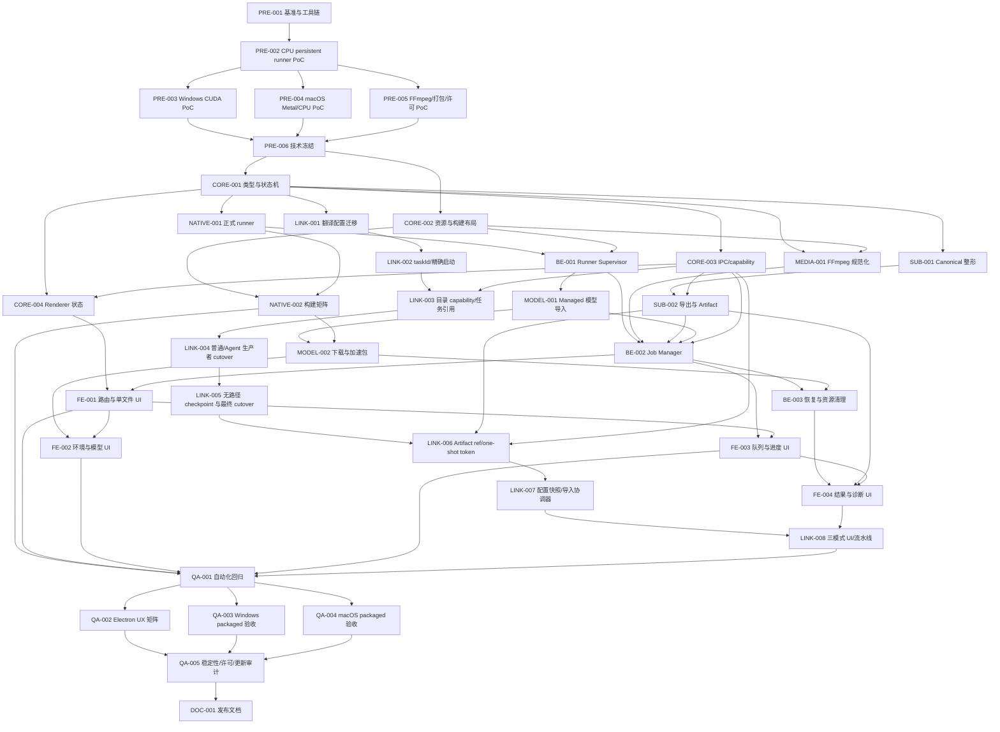

# 本地字幕转写工具 Execution Plan

> 日期：2026-07-16
>
> Feature Slug：`local-subtitle-transcriber`
>
> 对应设计文档：`docs/v0.2.11/local-subtitle-transcriber/local-subtitle-transcriber_final_design.md`
>
> 当前状态：`PRE-001` 进行中；清单/指标/clean-room 合同与只读工具链预检已建立，macOS arm64 报告 ready，真实样本、baseline 和 Windows 目标机证据待补齐
>
> 发布门禁：`PRE-001`～`PRE-006` 未全部通过前，不得开始正式 native/runtime/UI 大规模实现
>
> 2026-07-16 审查修订：补齐部分导出、会话 revision 重同步、resource job、runner 取消、无模型入队与 Agent/恢复消费者迁移；修正 pnpm/工具链事实，并把过大的 LINK 包拆为 8 个、总计 38 个工作包
>
> 2026-07-16 范围变更：macOS 只支持 arm64，删除 x64 产物/验收；FFmpeg/ffprobe 作为安装包内置运行时，系统 PATH 仅用于 PRE/开发 PoC

---

## 1. 每次开发会话的使用方式

### 1.1 开始前

每次实现会话必须按顺序完成：

1. 阅读 `docs/v0.2.11/README.md` 和 `docs/v0.2.11/v0.2.11_iteration_execution_plan.md`。
2. 完整阅读 Final Design 和本 Execution Plan，不能只依赖聊天摘要。
3. 阅读 `.agents/skills/fusionkit-pitfall-guard/references/index.md`，至少检查 `FK-PIT-0021`、`FK-PIT-0022` 与 `FK-PIT-0023`；涉及持久化、preload、capability、i18n、Electron 视觉验证时，再读取对应条目。
4. 检查第 7 节进度台账，只认领一个可在单次会话闭环的工作包；跨两个包时必须说明它们为何不可拆分。
5. 运行 `git status --short`，确认用户已有改动并限定本次文件范围；不得用 `git add -A` 混入无关修改。
6. 在编辑前明确本次工作包、预期改动文件、验证命令、不涉及范围和已知外部依赖。
7. 原生相关工作先执行工具链预检；缺少 CMake、编译器、CUDA、Xcode、签名身份或目标机器时，只记录事实，不伪造验证结果。
8. 若需要变更 JS 依赖或 lockfile，必须先确认 `pnpm --version`；本仓库当前兼容基线为 pnpm `8.7.0`、lockfile v6。优先直接使用 `node_modules/.bin/*` 做验证；版本不是 8.x 时使用 `corepack pnpm@8.7.0 ...`，不得让新 pnpm 改写 `pnpm-lock.yaml`。

### 1.2 实施中

- Final Design 是产品与架构合同，本计划是工作包与交接合同；实现发现两者不可同时满足时先停下，更新设计或新增 `feat/` / `fix/` 文档。
- 每个工作包优先形成可运行的纵向切片，不留下无消费者的空接口、永远返回 mock 的“已验证”状态或只在开发目录可运行的路径。
- 原生模型、下载缓存、构建产物、测试媒体、用户路径和真实 API Key 不进入 Git；只提交源码、固定版本/哈希的 manifest、可再分发许可证、脱敏 fixture 和结果摘要。
- 所有外部进程必须由 Electron main 持有句柄；禁止 shell 拼接命令，禁止 renderer 提交 executable/path/backend flags。
- 新增用户可见文案必须同步四种 locale，并同时通过 locale parity 与 source-usage 检查。
- 本地字幕工具与现有 `/tools/audio/transcriber` 的 route、Store、type、IPC、runtime、配置和测试必须保持独立。

### 1.3 结束前

1. 运行工作包定义的验收命令，并记录精确命令、通过数量、目标平台和未覆盖项。
2. 更新第 7 节台账的状态、日期、文件、验证、实施记录和未决问题。
3. 在 `local-subtitle-transcriber_implementation_records/` 新增实施记录；没有记录不得标为 `已完成`。
4. 如改变产品合同，同步更新 Final Design；验收新增需求写入 `feat/`，回归或缺陷写入 `fix/`。
5. 检查 `git diff --check`、`git status --short`，确认没有模型、二进制、媒体、路径、令牌或临时文件被纳入提交。
6. 若启动 Vite、Electron、runner、FFmpeg、测试服务器或下载任务，结束前逐一关闭并确认无残留进程。
7. 只有实现、测试、文档、台账和实施记录全部闭环时才标记 `已完成`；真实硬件/签名验收未完成时不得用 mock 或开发机构建替代。

---

## 2. 状态规则

工作包状态只允许使用：

- `未开始`
- `进行中`
- `已完成`
- `阻塞`
- `废弃`

定义：

- `未开始`：尚未产生该包的实现或验证产物；阅读和计划不算实施。
- `进行中`：已产生代码、PoC 或验证结果，但尚未满足全部验收口径。
- `已完成`：代码/PoC、测试、文档、实施记录和全部必需平台验证已经闭环。
- `阻塞`：存在明确外部阻塞，例如缺少目标硬件、签名身份、可分发许可结论或关键上游能力；必须写明解除条件。
- `废弃`：设计更新后明确不再实施，台账必须记录替代工作包或终止原因。

禁止因为“代码已写完”“本机能运行”或“测试使用 fake runner 通过”就把需要真实 GPU、packaged app、签名/公证或许可证结论的工作包标为完成。

---

## 3. 当前基线与前置事实

计划建立时确认的仓库事实：

| 项目 | 当前状态 | 对计划的影响 |
| --- | --- | --- |
| Electron 打包 | `electron-builder.json` 仅包含 `dist-electron`、`dist`，无 `extraResources` | 必须先设计 sidecar/FFmpeg staging 和 packaged path resolver |
| 原生源码 | 仓库当前无 CMake/native runner 目录 | PRE 阶段先验证工具链和上游 pin，再建立正式目录 |
| 当前审查工作站 | macOS arm64；Node 20.19.5、pnpm 8.7.0、CMake 4.4.0、Apple Clang 21.0.0、Xcode 26.6/Metal compiler、FFmpeg/ffprobe 8.1.2 均通过预检 | macOS arm64 PRE-001 工具链报告已 ready；Homebrew GPL/full FFmpeg 只作开发 PoC，不能替代未来 bundled 资源、许可、签名、公证或真实 runner/Metal 证据 |
| Windows/CUDA 工具链 | 当前工作站不是 Windows，未安装/验证 MSVC、CUDA 或 NVIDIA 目标硬件 | PRE-003 必须在合格 Windows x64 NVIDIA 环境独立验收，不能沿用 macOS 报告 |
| 发布版媒体运行时 | 尚未选择可再分发 FFmpeg/ffprobe 构建，也未接入 `extraResources`/runtime manifest | PRE-005/PRE-006 冻结来源、许可与 staging；CORE-002/NATIVE-002 实现打包门禁；packaged 模式禁止 PATH/用户 executable fallback |
| 包管理器 | 当前 `pnpm --version` 为 `8.7.0`，lockfile 为 v6；`package.json` 尚未声明 `packageManager` | 依赖变更固定使用 pnpm 8.7.0；普通验证优先使用 `node_modules/.bin/*`，PRE-001 记录是否需要单独工作包固化 Corepack 元数据 |
| CI | 当前没有 `.github/workflows/` | native 构建矩阵需在 PRE-006 决定使用 GitHub Actions 还是受控本地发布脚本 |
| Electron 实例模型 | `electron/main/index.ts` 已持有 single-instance lock，但同一进程可创建多个 `BrowserWindow/webContents` | ResourceJob/model/runner/GPU queue 使用 app 级单例和全局锁；task/capability/event 仍须按 owner session 隔离 |
| Audio IPC | 已有 sender-bound capability、固定 preload helper 和 channel policy | 复用安全模式与测试方法，不复用 `audio:*` namespace 或 registry |
| 字幕翻译配置/路径 | 配置分散于 Store、页面 state、localStorage 和 `useModelStore`；现有任务直接携带 `originFileURL`/`targetFileURL` | LINK-001～005 必须收敛配置所有权、引入无路径 source/target/checkpoint ref，并分阶段切换所有生产者/消费者；自动交接不能跨页偷读状态，也不能把 token 换回 renderer raw path 迁就旧字段 |
| 字幕翻译任务身份 | 现有队列主要以 `fileName` 定位 | LINK-002 必须引入稳定 `taskId` 和明确 import receipt，避免启动同名旧任务 |
| Agent/恢复消费者 | `src/agent/tool-executor.ts`、`src/agent/recovery-batch.ts`、`RecoveryDialog.tsx`、`src/renderer/subtitle.ts` 与 `electron/main/translation/*` 仍直接消费 `outputURL`、`originFileURL`、`targetFileURL` 或 `checkpointPath` | LINK-003 先加 capability/ref 与 legacy adapter；LINK-004 迁移新建任务生产者，LINK-005 完成恢复消费者和回滚测试后才可删除旧路径值 |

这些事实不是永久假设。任何工作包修改它们时，必须把结果写回台账和实施记录。

---

## 4. 不得违反的实施约束

1. 新工具固定为字幕分类的 `/tools/subtitle/local-transcriber`，不得塞进现有 AudioTranscriber 或 `audio:*` IPC。
2. 本地模型、GPU backend 和 sidecar 不得表示为远端 Audio API profile/provider/assignment。
3. `window.localSubtitleApi` 只暴露固定方法和精确 public allowlist；preload-only 授权 channel 留在私有闭包。
4. renderer 不得获得或提交真实媒体路径、模型绝对路径、临时 WAV 路径、任意 executable 或任意命令行参数。
5. capability 绑定 `webContents.id` + preload 私有 `ownerSessionId`、资源类型、允许操作和过期时间；reload/navigation/frame destroy 立即失效，SPA 卸载失败的 revoke 必须保留句柄并有界重试。
6. 正式 runner 必须使用固定版本 JSONL 协议、唯一 command id、`cancel.targetRequestId`、event seq、terminal exactly-once、最大帧长、backpressure、超时和结构化错误；inference 阻塞期间控制读取仍须可响应，不得解析 stock CLI 人类日志作为唯一合同。
7. GPU 队列首版并发固定为 1，同批次复用模型；不得每个文件重新启动并加载 `large-v3`。
8. 时间轴只使用整数毫秒；SRT/LRC 必须由自有 formatter 生成、parse-back 验证并原子提交。
9. 模型不进安装包，必须下载或导入到 `userData`，经过大小、SHA-256 和 runner load smoke 后才是 ready。
10. renderer 只持久化 `modelId`；main 把它解析为 managed file。已有 GGML `.bin` 必须经校验后复制或显式移动到 managed models 目录，不得把任意外部绝对路径登记为运行时模型。
11. 安装、应用启动和打开工具页不得急切下载或加载推理模型；只有下载/导入 load smoke 或批次开始可触发 `load_model`，smoke 后释放，任务模型按 model/backend 跨任务驻留并在切换、空闲、资源不足、最后一个活动 owner 结束、应用退出或更新时卸载。单窗口结束不得误杀其他 owner 的任务。
12. 内置下载清单由版本化 allowlisted manifest 控制。首版计划验证 `large-v3`、`large-v3-q5_0`、`large-v3-turbo`，`large-v3-turbo-q5_0` 为 PoC 候选；其他型号在进入 manifest 和真实验收前不得宣称受支持或可一键下载。
13. 模型、VAD 与可选 accelerator pack 不进默认安装包；packaged app 内的 runner 和经 PRE-006 审计的 FFmpeg/ffprobe 必须位于 asar 外，由版本化、签名覆盖且含 platform/arch/size/SHA-256/licenseRef 的 manifest 校验。packaged 模式不能回退 PATH、Homebrew、Chocolatey、注册表或用户选择的 executable。
14. 推理默认离线；除模型/加速包下载外不发网络请求，普通 Store/session/log/crash artifact 不记录媒体/字幕内容、完整路径、API Key、下载 header 或完整命令行；翻译恢复内容的唯一例外严格按第 29 条处理。
15. 参考 AGPL 项目只做 clean-room 行为研究，不复制其 GUI、输出器、字幕切分器、WhisperX 或配置代码。
16. 自动翻译默认关闭；只有当前批次明确选择 `enqueue_and_start_translation` 才可产生 API 费用。
17. 自动翻译只能启动本次 `SubtitleTranslationImportReceipt.addedTaskIds`；`fileName` 只用于展示，幂等去重使用 main 签发的 opaque `handoffKey`，禁止调用 `startAllTasks()` 影响旧队列。
18. 翻译配置、导入或执行失败不得回滚已导出的字幕，也不得把本地转写 `completed` 改成 `failed`。
19. 生成任务的 artifact、导入和输出目录 capability 必须在翻译运行时保持不透明；不得为了填充旧 `originFileURL`/`targetFileURL` 而在 renderer 解包为 raw path。
20. 用户可见长诊断必须可换行并约束内部 ScrollArea；含长内容的弹窗使用 `ScrollableDialog`。
21. Electron 视觉证据必须等待 preload loading 完全退出，并检查 1080×786、786×540、明暗主题和四语言。
22. 工作包结束不得遗留 Vite/Electron/runner/FFmpeg/下载进程、`.partial`、临时 WAV 或未撤销 capability。
23. 多格式导出至少一个成功时统一为 `completed + partial`，全部失败才是 `failed`；取消不得删除已 commit artifact，不能另造未进入共享 schema 的“部分完成”状态。
24. draft capability 在 batch commit 时原子转移为 task lease；SPA 路由切换不取消 committed task，renderer 必须用单调 revision snapshot 重同步，reload/window owner 结束才按合同取消。
25. 模型/VAD/accelerator 安装只能提交 allowlisted `resourceId`，并有可查询/取消/重同步的 resource job；renderer 不得提交 URL、下载路径或可执行参数。
26. `enqueue_translation` 无 profile 时必须创建显式 `needs_configuration` task binding；所有 start 入口只接受 ready binding，禁止用空 API 字段伪装可执行任务。
27. LINK-003 完成后仍保留只供既有消费者使用的 legacy path adapter；LINK-004 迁移普通/Agent 新建任务，只有 LINK-005 再迁移 RecoveryDialog、renderer events 和 main recovery 后，才可删除旧 `outputURL`/`checkpointPath` 暴露。
28. 不得因 `requestSingleInstanceLock()` 已存在就省略 owner 校验或资源并发锁；同一 app 内多个 webContents 共享 app-scoped model/download/runner manager，但 task、token、snapshot 和 event 必须 owner-bound。
29. 本地转写 Store/session/log/crash artifact 不得保存字幕正文；已显式启动翻译的 v2 `manifest_fragments` 是唯一内容持久化例外，只保存恢复所需字幕分片且不得含媒体字节、raw path、token/capability 或密钥。enqueue-only 不创建 checkpoint。
30. runner/FFmpeg/ffprobe 必须使用 allowlisted 最小 environment 与受控 cwd，不继承 Electron/Agent 的 API Key、authorization header、代理凭据或其他 secret；自定义模型 load smoke 使用短生命周期验证 runner。
31. macOS 只生成和加载 arm64 runtime；macOS x64 在资源解析前返回 `unsupported_architecture`，不提供 Rosetta、CPU artifact 或用户自备 runner fallback。
32. builder staging 缺 runner、FFmpeg、ffprobe、manifest 或 license/source-offer 证据时必须失败；运行时缺失、损坏或启动失败分别返回 `media_runtime_missing` / `media_runtime_invalid` / `media_runtime_launch_failed`，在 batch commit 前禁用入队并保留草稿、设置、模型与已导出字幕。

---

## 5. 推进顺序与依赖图

### 5.1 总体原则

1. 先证明“能准确、稳定、可合法分发地运行”，再冻结 production 架构。
2. 再冻结类型、状态机、协议、资源路径和 IPC 安全边界。
3. 先关闭单文件 CPU → 标准 SRT 的最小闭环，再扩展 GPU、模型下载、LRC、批量 UX。
4. 字幕翻译配置迁移和精确入队可在本地 runtime 稳定后并行，但最终只能通过 typed artifact handoff 集成。
5. 自动化和 Electron UI 验收先于真实 packaged GPU/Metal 矩阵；所有门禁通过后才同步发布文档。

### 5.2 依赖图



### 5.3 允许并行的范围

- `PRE-003`、`PRE-004`、`PRE-005` 可在 `PRE-002` 后由不同目标机并行，但必须使用同一 engine/model/sample/metrics manifest。
- `CORE-001` 与 `CORE-002` 可在 `PRE-006` 后并行。
- `MEDIA-001`、`SUB-001`、`LINK-001` 可在 shared contract 冻结后并行，禁止彼此直接导入私有模块。
- `FE-001` 可先搭可测试壳层，但不能用 mock ready 状态冒充 runtime 已完成。
- `QA-003` 与 `QA-004` 可并行；`QA-005` 必须等二者和 Electron UX 矩阵都有真实结果。

---

## 6. 里程碑与最小闭环

### 6.1 里程碑

| 里程碑 | 达成条件 | 未达到时禁止 |
| --- | --- | --- |
| M0 技术可行性冻结 | `PRE-001`～`PRE-006` 完成，engine commit、runner protocol、模型格式、FFmpeg/加速包来源和平台结论已记录 | 禁止开始 production runner、完整页面或发布配置 |
| M1 合同与安全骨架 | `CORE-001`～`CORE-004`、`NATIVE-001` 完成，fake runner/IPC/capability 测试通过 | 禁止让 renderer 直接访问路径或任意 channel |
| M2 单文件最小闭环 | `BE-001`、`MEDIA-001`、`SUB-001`、`SUB-002`、`MODEL-001`、`BE-002`、`FE-001` 完成，本地导入模型 → 单音频 → CPU runner → SRT 原子导出 → reveal 成功 | 禁止宣称批量/GPU/LRC/自动翻译可用 |
| M3 本地转写功能完整 | `NATIVE-002`、`MODEL-002`、`BE-003`、`FE-002`～`FE-004` 完成，批量、取消、模型管理、SRT/LRC 和错误隔离闭环 | 禁止接入自动外部翻译 |
| M4 烤肉流水线闭环 | `LINK-001`～`LINK-008` 完成，三种模式和精确启动合同通过 | 禁止默认或范围不明地启动翻译队列 |
| M5 自动化与 UX 候选 | `QA-001`、`QA-002` 完成，TS/native tests、四语言、宽窄窗口、明暗主题和 a11y 通过 | 禁止进入真实发布签名矩阵 |
| M6 发布候选 | `QA-003`～`QA-005`、`DOC-001` 完成，Windows/macOS packaged app、许可、更新、稳定性和发布文档闭环 | 禁止合并发布分支或对外标记 stable |

### 6.2 第一个端到端纵向切片

第一个可运行切片只包含：

```text
用户选择 1 个音频文件
  → preload 授权为 sender-bound file token
  → main 使用受控 FFmpeg 规范化为 16 kHz mono PCM16
  → 已导入且验证过的 PRE-006 allowlisted 模型由 persistent CPU runner 加载
  → 返回 canonical segments
  → 自有 formatter 生成标准 SRT
  → parse-back + 原子写入
  → renderer 显示 completed 并可在文件夹中显示
```

该切片明确不包含模型联网下载、CUDA/Metal、LRC、逐词字幕、批量并发、翻译交接或完整视觉精修。开发/CI smoke 可使用 PRE-006 明确允许的较小测试模型降低成本，但它不能替代 `large-v3` 的准确度、性能与发布验收；产品切片不得用未进入 manifest 的任意模型。先用它验证权限、协议、进程、时间轴和文件提交，再扩展功能。

### 6.3 首版发布闭环

首版发布必须额外具备：

- Windows x64 NVIDIA CUDA/CPU fallback 与 macOS arm64 Metal/CPU fallback 的真实 packaged 验收；macOS x64 只验证稳定拒绝，不生成发布产物。
- `large-v3`、至少一个量化/快速模型、VAD 模型的下载/续传/校验/删除和本地 GGML 导入。
- 音频与视频批量处理、模型复用、取消、runner crash、OOM、磁盘不足和逐文件失败隔离。
- 标准 SRT、标准行级 LRC、parse-back、原子写与冲突策略。
- `export_only`、`enqueue_translation`、`enqueue_and_start_translation` 三种模式。
- 完整许可证清单、资源签名/公证、更新兼容、模型保留和隐私说明。

---

## 7. 进度台账

| ID | 状态 | 完成日期 | 依赖 | 标题 | 关键变更文件 | 验证 | 实施记录 | 未决问题 |
| --- | --- | --- | --- | --- | --- | --- | --- | --- |
| PRE-001 | 进行中 | — | — | 基准语料、工具链与 clean-room 证据基线 | `docs/v0.2.11/local-subtitle-transcriber/poc/*`、`scripts/local-subtitle/benchmark/*` | Node tests 16/16；结构校验 0 error/8 pending warning；严格门禁按预期 9 errors；macOS arm64 报告 ready；macOS x64 稳定拒绝 | `docs/v0.2.11/local-subtitle-transcriber/local-subtitle-transcriber_implementation_records/2026-07-16_PRE-001_evidence-baseline.md` | 需选择并审计 5 个真实语料、补 reference/model hash；仍需 Windows CPU/CUDA 目标机报告 |
| PRE-002 | 未开始 | — | PRE-001 | CPU persistent runner 与 JSONL PoC | `native/local-subtitle-runner/*`、PoC tests | CMake build/ctest、重复 load/transcribe/abort、协议日志 | — | `whisper.cpp` commit 尚未冻结 |
| PRE-003 | 未开始 | — | PRE-002 | Windows x64 CPU/CUDA 准确度与性能 PoC | benchmark records、Windows build scripts | CER/WER、RTF、RAM/VRAM、重复加载、取消 | — | 需要目标 NVIDIA 机器和 CUDA 分发结论 |
| PRE-004 | 未开始 | — | PRE-002 | macOS arm64 Metal/CPU fallback PoC | benchmark records、mac build scripts | arm64 Metal/CPU backend、RTF、内存、签名后执行、x64 稳定拒绝 | — | 工具链已 ready；仍需 runner/model、签名/公证身份与 packaged-like PoC |
| PRE-005 | 未开始 | — | PRE-002 | Bundled FFmpeg、sidecar staging、签名/公证与许可证 PoC | `electron-builder.json` spike、runtime/license manifest | packaged no-PATH smoke、缺失/损坏/错误架构/启动失败、非 ASCII/长路径、二进制来源审计 | — | 尚未选定可再分发构建；当前系统 GPL/full FFmpeg 不能作为发行结论 |
| PRE-006 | 未开始 | — | PRE-003/004/005 | PoC 评审与 production 技术冻结 | Final Design、PoC decision record、pinned manifests | 五项设计问题全部有证据与 go/no-go 结论 | — | 任一核心目标失败则阻塞后续，不静默换 Python 引擎 |
| CORE-001 | 未开始 | — | PRE-006 | domain、状态机、事件、错误与 runtime schema | `src/type/localSubtitle.ts`、`src/type/localSubtitleIpc.ts`、tests | full/partial outcome、error manifest、revision/generation、state/schema round-trip、tsc | — | 需冻结 protocol/model manifest version 与上限 |
| CORE-002 | 未开始 | — | PRE-006 | 资源 manifest、路径 resolver 与构建 staging 合同 | `electron/main/local-subtitle/resource-path.ts`、resource manifest、staging scripts、`.gitignore` | dev/packaged path tests、manifest hash smoke | — | 只冻结 staging 合同；正式 `extraResources` 接线延后到 NATIVE-002 |
| CORE-003 | 未开始 | — | CORE-001 | preload、IPC、文件/目录 capability 安全边界 | preload policy、`electron/main/local-subtitle/ipc.ts`、authorization tests | complete fixed API、public/internal channel、owner、TTL、draft→task lease、revoke、path containment | — | 不复用 audio registry；禁止 resource URL/path 输入 |
| CORE-004 | 未开始 | — | CORE-001/003 | Renderer 偏好 Store、事件 reducer 与 cleanup retry | `src/store/tools/subtitle/useLocalSubtitleTranscriberStore.ts`、runtime service/tests | persist partialize、subscribe→snapshot revision reconcile、stale generation、revoke retry、SPA remount | — | token/任务不得持久化，listener 不归页面组件独占 |
| NATIVE-001 | 未开始 | — | PRE-006/CORE-001 | 正式 whisper.cpp runner 与版本化 JSONL 协议 | `native/local-subtitle-runner/*` | ctest、partial frame、唯一 id/target cancel、seq/terminal、backpressure、模型复用、abort、stdout purity | — | 上游引入方式必须可复现并保留 MIT notice |
| NATIVE-002 | 未开始 | — | NATIVE-001/CORE-002 | 三类原生 artifact、runtime manifest 与 builder 接线 | native build scripts、resource manifests、`electron-builder.json`、可选 workflow | win-x64 CPU/CUDA、mac-arm64 Metal/CPU build + packaged smoke + SHA manifest | — | 签名凭据不得进入仓库；staging 缺失必须在打包前明确失败 |
| BE-001 | 未开始 | — | NATIVE-001/CORE-001/002 | Runner Supervisor、握手、模型驻留与崩溃恢复 | `electron/main/local-subtitle/runner-supervisor.ts`、tests | fake/real runner、timeout、crash、late event、kill fallback | — | stderr 需脱敏且有界 |
| MEDIA-001 | 未开始 | — | CORE-001/002 | FFprobe/FFmpeg 媒体规范化 | `electron/main/local-subtitle/media-normalizer.ts`、tests | 格式矩阵、进度、音轨、取消、损坏输入、临时清理 | — | packaged 模式不得回退 PATH |
| SUB-001 | 未开始 | — | CORE-001 | Canonical transcript 与字幕整形 | `electron/main/local-subtitle/subtitle-post-processor.ts`、fixtures | CJK/Latin、重叠、空文本、长 cue、整数毫秒 golden tests | — | 不复制 AGPL 切分算法 |
| SUB-002 | 未开始 | — | SUB-001/CORE-003 | SRT/LRC 导出、原子写和 Artifact Registry | exporters、artifact registry、tests | parse-back、目录 reservation/overwrite、full/partial/none-success、commit 前后取消、artifactRef owner/expiry/revoke/retry | — | 增强 LRC 不得自动交接 |
| MODEL-001 | 未开始 | — | BE-001/CORE-002 | 模型 manifest、managed 本地导入与 load smoke | model manager、model manifest、import ResourceJob、tests | header/size/hash/load、import progress/cancel、CTranslate2 拒绝、复制原子性 | — | 不接受任意外部路径作为运行时 modelId |
| MODEL-002 | 未开始 | — | MODEL-001/NATIVE-002 | 下载续传、VAD、删除、磁盘和 accelerator pack | download manager、accelerator manager、ResourceJob download adapters、tests/UI service | Range/no-Range、`.part`、SHA、job cancel/reconcile、并发锁、busy delete、签名 | — | 下载源与 redistributable 结论需固化 |
| BE-002 | 未开始 | — | BE-001/MEDIA-001/SUB-002/MODEL-001/CORE-003 | Job Manager、批量队列、进度、取消和失败隔离 | job manager、IPC registration、session snapshot、tests | 状态机、draft→task lease、单 GPU 串行、revision reconcile、批次级错误、partial outputs、owner cleanup | — | 不支持中途断点续跑；SPA 离页不取消 committed batch |
| BE-003 | 未开始 | — | BE-002/MODEL-002 | 会话 manifest、启动清理、资源水位和诊断 | cleanup/recovery/diagnostics modules、tests | crash restart、orphan temp、OOM、disk full、app quit/update | — | 只恢复诊断摘要，不伪装续跑 |
| FE-001 | 未开始 | — | CORE-004/BE-002 | 工具注册、route、i18n 与单文件 SRT 纵向 UI | `App.tsx`、router、toolMeta、locales、page/store | route/meta、单文件 completed/reveal、四语言、tsc、Vite build | — | 复用真实 `ToolConfigPanel`/`ToolField` 等组件；与 Audio category/route 独立 |
| FE-002 | 未开始 | — | FE-001/MODEL-002/BE-001 | 环境探测、设备与模型管理 UI | LocalSubtitleTranscriber components、services | executable probe、真实 backend、resource job CRUD/cancel/reconcile、长诊断 containment | — | 不展示不可更新的 verified 状态 |
| FE-003 | 未开始 | — | FE-001/BE-002 | 文件授权、批量队列、进度与取消 UI | drop zone、queue/task components、store/tests | identity 去重、音轨 probe、SPA remount snapshot、stale event、cancel race、窄窗口、键盘操作 | — | GPU 并发固定 1 |
| FE-004 | 未开始 | — | FE-003/BE-003/SUB-002 | 预览、结果操作、错误详情与手动交接入口 | preview/result/error dialogs、tests | reveal/copy/retry、partial outputs、ScrollableDialog、overflow | — | 手动交接由 LINK-007 接通 |
| LINK-001 | 未开始 | — | CORE-001 | 字幕翻译当前配置 Store 与分阶段无损迁移 | `useSubtitleTranslatorConfigStore.ts`、translator page/legacy adapter、migration tests | 双 import order、幂等、失败重试、live rehydrate、raw path 保留到 LINK-005 全消费者切换 | — | API Key 仍归 `useModelStore`；旧 `outputURL` 不是授权 |
| LINK-002 | 未开始 | — | LINK-001 | 稳定 taskId、execution binding、批量回执与精确启动 | subtitle types、queue service/store/tests | taskId、ready/needs_configuration、handoffKey 幂等、同名隔离、start ids only、late event、日志脱敏 | — | 本包不改目录授权；禁止自动调用 `startAllTasks()` |
| LINK-003 | 未开始 | — | LINK-002/CORE-003 | 字幕翻译目录 capability 与无路径任务引用 | main adapter/picker/registry、subtitle types/tests | capability 引入、registry authority、target ref resolve/rotate、generated/legacy schema isolation | — | 建立新合同但保留 legacy adapter 和 `outputURL` 到 LINK-005 |
| LINK-004 | 未开始 | — | LINK-003 | 普通页面与 Agent 新建任务生产者 cutover | translator page/store、`src/agent/tool-executor.ts`、task factories/tests | 新任务 target ref、taskId queue ops、Agent queue 回归、legacy new-entry isolation | — | 恢复扫描仍保留旧适配到 LINK-005；不得删除 `outputURL` |
| LINK-005 | 未开始 | — | LINK-004 | 无路径 checkpoint、恢复消费者兼容与最终 cutover | checkpoint/recovery discovery、Agent recovery tools、RecoveryDialog、renderer events、main translation/types/tests | v2 manifest_fragments、checkpointRef、Agent recovery/page import、v1 conversion、atomic recovery、legacy rollback/remove | — | 全消费者通过前不得删除 `outputURL`/旧 path；恢复 target 必须重新授权 |
| LINK-006 | 未开始 | — | LINK-005/SUB-002/CORE-003 | Artifact ref 与 one-shot import token | local artifact handoff service、main/preload contracts、tests | ref read/reveal/handoff、safe ref rotation、token TTL/one-shot、content snapshot/clear | — | 不创建 taskId/target handle，不导入翻译 Store |
| LINK-007 | 未开始 | — | LINK-006/LINK-002 | 翻译配置快照、任务级 capability、导入协调器与回执闭环 | `generatedSubtitleImportCoordinator.ts`、candidate factory、translator queue/store、tests | readiness、ready/needs_configuration、ID/key/handle binding、snapshot secrecy、receipt/ownership、release retry、exact start | — | 私有快照/capability 不持久化 |
| LINK-008 | 未开始 | — | LINK-007/FE-004/BE-002 | 三种后处理模式和逐文件流水线 | local page/store/coordinator wiring、i18n/tests | 三模式、格式选择、费用提示、partial failure、exact start | — | 默认必须为 `export_only` |
| QA-001 | 未开始 | — | NATIVE-002/BE-003/FE-001～004/LINK-008 | 自动化、边界与现有 Audio/Subtitle/Agent 回归矩阵 | `test/local-subtitle/*`、现有 audio/subtitle/translation/agent tests | tsc、i18n、目标回归与全量 vitest、Vite test build、native ctest | — | 依赖链隐含全部 CORE/MEDIA/SUB/MODEL/LINK 包；fake runner 不能替代 packaged 验收 |
| QA-002 | 未开始 | — | QA-001 | Electron 四语言/主题/宽窄窗口/a11y 验收 | e2e、截图与验收记录 | loading 完全退出、无 overflow、radio/keyboard/dialog/diagnostics | — | 结束前清理所有进程 |
| QA-003 | 未开始 | — | QA-001/NATIVE-002/MODEL-002 | Windows x64 packaged CUDA/CPU 验收 | Windows release artifacts、验收记录 | 无系统依赖 smoke、auto 预解析 CPU/禁止静默 fallback、长任务、安装/卸载/更新 | — | 需要目标 NVIDIA 硬件与签名 installer |
| QA-004 | 未开始 | — | QA-001/NATIVE-002/MODEL-002 | macOS arm64 Metal/CPU packaged 验收 | mac arm64 release artifacts、验收记录 | 签名、公证、Gatekeeper、Metal/CPU、bundled FFmpeg、可执行位、更新、x64 稳定拒绝 | — | 需要 arm64 签名/公证身份；不再需要 x64 目标机 |
| QA-005 | 未开始 | — | QA-002/003/004 | 稳定性、隐私、许可、更新与回滚审计 | soak reports、license notices、privacy/update docs | 1h+ 媒体、批量 crash/OOM/disk、资源清理、日志扫描、升级降级 | — | 所有第三方二进制必须有来源/版本/哈希/许可 |
| DOC-001 | 未开始 | — | QA-005 | README、CHANGELOG、隐私、第三方清单与发布说明 | docs、README、CHANGELOG、notices | links、版本/能力声明与真实 QA 一致、`git diff --check` | — | 不把未验收 backend 写成已支持 |

---

## 8. 工作包详情

### PRE-001：基准语料、工具链与 clean-room 证据基线

目标：先建立可重复、可审计的比较方法，不让后续 PoC 各用不同媒体、参数或统计口径。

实施范围：

- 建立脱敏样本 manifest：日/英/中、BGM、静音、噪声、非 ASCII 路径、短文件和 1 小时以上长文件；不能提交的真实媒体只记录稳定 hash、时长、许可/来源和本地保管说明。
- 固定 faster-whisper-GUI 基线参数、目标语言、模型标识和输出；只记录可观察结果，不复制代码或明文 token。
- 定义 CER/WER、cue 边界偏差、RTF、RAM/VRAM、首次/再次加载、取消延迟、包体的采集 schema。
- 新增工具链预检脚本，报告 CMake、编译器、CUDA、Xcode/Metal、FFmpeg、架构和可用磁盘，不自动安装或修改系统。
- 预检同时记录 Node、`pnpm --version`、lockfileVersion 和 `package.json.packageManager`；当前兼容基线为 pnpm 8.7.0 + lockfile v6，检查脚本不得运行 install 或改写 lockfile。
- 建立第三方候选清单：whisper.cpp、模型、VAD、FFmpeg、CUDA runtime；每项记录来源、版本候选、许可证和待确认问题。

验收口径：同一 manifest 可在 macOS arm64、Windows x64 CPU/CUDA 运行；macOS x64 返回稳定 `unsupported_architecture`；缺失工具/样本会明确失败；仓库不含受限媒体、模型、二进制或凭据。

### PRE-002：CPU persistent runner 与 JSONL PoC

目标：证明自有 sidecar 能稳定握手、加载一次模型、连续转写多个文件并可取消。

实施范围：

- 选择候选 whisper.cpp commit，但在 PRE-006 前标记为候选而非 production pin。
- 实现最小 `hello/load_model/transcribe/cancel/unload/shutdown` JSONL；stdout 只输出协议，stderr 仅受控诊断。
- 覆盖分片 stdin/stdout、request correlation、未知消息、协议不匹配、超长 frame、模型加载失败和正常退出。
- 用 CPU 对同一模型连续处理至少两个样本，记录第二次任务不重载模型的证据和取消延迟。

验收口径：ctest 通过；输出可被独立 parser 消费；不依赖 stock CLI 文案；异常时不留下子进程。

### PRE-003：Windows x64 CPU/CUDA PoC

目标：验证 Windows NVIDIA 加速、CPU fallback 和可分发依赖边界。

实施范围：

- 同一 runner protocol 下构建 CPU/CUDA 候选，使用同一完整 `large-v3` 和样本 manifest。
- 记录 GPU 型号、驱动、CUDA 依赖、实际 backend、RTF、RAM/VRAM、准确度、加载时间和取消。
- 验证 CUDA 不可用、DLL 缺失、显存不足时的可识别错误与显式 CPU fallback，不允许假 GPU 成功。
- 比较 CUDA runtime 随包、可选 accelerator pack、系统前置依赖三种路径的包体、许可、签名和失败面。

验收口径：声明支持的 NVIDIA 机器 RTF < 1；CER/WER 相对基线不恶化超过 2 个百分点；形成明确分发建议。

### PRE-004：macOS arm64 Metal 与 CPU fallback PoC

目标：证明 macOS arm64 优先使用 Metal，并在同一架构内给 CPU fallback 定义诚实边界。

实施范围：

- 在 arm64 packaged-like bundle 中验证 Metal backend、模型加载、转写、取消和模型复用。
- 在同一 arm64 runner 中禁用/不可用 Metal 后验证显式 CPU fallback、性能提示和 backend 证据；显式 Metal 或 commit 后故障不得静默回退。
- 验证签名后 runner 的可执行位、动态库解析、Gatekeeper 行为和资源路径。
- 验证 macOS x64 在资源解析前返回 `unsupported_architecture`，且构建目录和发行清单均不存在 x64 artifact。
- 使用与 Windows 相同的样本与指标 schema。

验收口径：arm64 日志和 probe 明确显示实际 Metal/CPU backend；Metal 不可用时 auto 在 commit 前可见地解析 CPU，显式 Metal 不降级；macOS x64 稳定拒绝且无发布产物；性能不足必须进入产品提示。

### PRE-005：Bundled FFmpeg、sidecar staging、签名与许可证 PoC

目标：证明开发态与 packaged app 都能使用受控资源，而不是偶然调用系统 PATH。

实施范围：

- 筛选可再分发 FFmpeg/ffprobe 构建，记录 configure flags、许可证、源码获取方式、版本和 SHA-256。
- 用 `extraResources` spike 验证 Windows x64/macOS arm64 资源布局、`${arch}` 产物名、可执行位、签名/公证顺序。
- 定义版本化 runtime manifest，覆盖 runner/动态依赖/ffmpeg/ffprobe 的 `kind`、platform、arch、backend、相对路径、size、SHA-256、版本和 licenseRef；manifest 随签名应用发布。
- builder 前置门禁验证目标平台的 runner、ffmpeg、ffprobe、manifest、许可证与源码获取证据，缺一项即失败，不生成残缺安装包。
- 覆盖 mp3/wav/flac/aac/m4a/mp4/mkv/mov/webm、多个音轨、非 ASCII/长路径、损坏/零时长输入。
- packaged smoke 临时移除/隔离系统 FFmpeg/CUDA PATH，证明资源解析没有隐式依赖；再分别模拟缺文件、错 hash、错架构和无法启动，验证入队前返回三个稳定 `media_runtime_*` error。
- 错误 UI/合同只允许检查更新、repair/reinstall 和脱敏详情，保留草稿、设置、模型与已导出字幕；禁止 PATH 修改指引和任意 executable picker。

验收口径：能在没有系统 FFmpeg 的机器从安装产物内启动 runner、ffmpeg 与 ffprobe；build-time 缺件会失败，runtime 损坏在 batch commit 前被阻断且修复行为可操作；许可清单可审计；当前 GPL/full 系统 FFmpeg 不被直接当作发行资源或用户前置条件。

### PRE-006：PoC 评审与 production 技术冻结

目标：把 PoC 证据转成唯一 production 决策；这是后续全部实现的硬门禁。

实施范围：

- whisper.cpp commit/获取方式、runner protocol v1、编译器和平台 build flags。
- Windows x64 CUDA/CPU、macOS arm64 Metal/CPU 的支持矩阵和 fallback 文案；macOS x64 固定为 unsupported。
- FFmpeg 来源/许可、资源 staging、签名/公证和 artifact naming。
- 模型/VAD manifest schema、首发模型集合、下载源、大小和 SHA-256 获取流程。
- 性能/准确度/包体结果，以及未达门槛时的 go/no-go 或设计变更。

验收口径：Final Design 与 decision record 无矛盾；五项推荐问题都有证据。失败时标记 `阻塞` 并提出设计变更，不得静默切换到 Python faster-whisper 或弱化 macOS GPU 目标。

### CORE-001：domain、状态机、事件、错误与 runtime schema

目标：先冻结跨 renderer/main/runner 的共享语义，防止各层重复解释状态和参数。

实施范围：

- 定义 immutable local batch config snapshot、model/backend、batch/task、canonical transcript、分离的 import/start post-action 状态、artifact、错误、进度事件和 IPC result。
- 定义 `completed + full|partial` 及逐格式 artifact result：至少一个格式 commit 为 completed，全部失败才 failed，首个 commit 后取消不得回滚产物。
- 事件 envelope 固定 `batchId/taskId/generation/revision`，session snapshot 与事件来自同一权威状态；错误 code 使用一个版本化 manifest，至少收敛 backend/media/artifact/configuration 等文档中已出现的 code。
- 区分 runner `runtime_*` 与 bundled FFmpeg/ffprobe `media_runtime_missing`、`media_runtime_invalid`、`media_runtime_launch_failed`；media runtime 错误必须在 batch commit 前返回并阻止入队。
- 为 request/event 建立运行时 schema，拒绝未知字段、任意 path、任意 executable 和未知 backend flag。
- 冻结 IPC frame、媒体/字幕 artifact 字节数、cue/segment 数、diagnostics 长度和 batch 文件数上限；首版单文件 duration/cue end 上限固定为 `99:59:59.999`，更长输入返回 `limit_exceeded`。错误返回稳定 code，UI 在选择/启动前展示可操作限制。
- 状态机以纯函数实现并测试全部允许/拒绝迁移；事件携带 task generation，旧事件必须丢弃。
- 错误分为用户稳定 code 与受控 diagnostics；定义单文件错误、批次级错误和可重试性。

验收口径：types、schema、full/partial/none-success、稳定 error manifest、revision/generation、state transition 和序列化 round-trip 测试通过；`audio:*` 类型不被导入或扩展。

### CORE-002：资源 manifest、路径 resolver 与构建 staging 合同

目标：统一开发态和 packaged 路径，确保模型/二进制/许可证不会误进 asar 或 Git。

实施范围：

- 建立 `resolveLocalSubtitleResourcePath()` 和只读、版本化 runtime artifact manifest；manifest 覆盖 kind/platform/arch/backend/relativePath/byteSize/SHA-256/version/licenseRef，并处于应用签名覆盖内。
- 设计 `build/local-subtitle-resources/` 临时 staging；`.gitignore` 精确忽略构建/下载产物，保留 manifest 与许可证源码。
- 冻结未来 `electron-builder.extraResources` 的 staging 输入和 `${arch}` artifact naming，但本包不启用依赖尚不存在二进制的正式映射；实际 builder 接线由 NATIVE-002 在 artifact 可生成后完成。
- 验证 manifest version、protocol、platform/arch/backend、文件大小、SHA、签名覆盖、licenseRef 与可执行位；packaged resolver 只能从 `process.resourcesPath` 解析，禁止 PATH 和任意 executable fallback。
- staging/build preflight 要求目标平台 runner、ffmpeg、ffprobe、manifest 和许可证/源码获取证据齐全，缺失、错误架构或 hash 不符时让打包命令失败。

验收口径：dev/packaged resolver 单测通过；缺失/错架构/错 hash/无许可引用立即失败；macOS x64 返回 `unsupported_architecture`；系统安装或用户选择的同名工具无法绕过校验；业务代码无散落 `process.cwd()` 或相对资源路径。

### CORE-003：preload、IPC 与 capability 安全边界

目标：建立独立 `local-subtitle:*` 信任边界。

实施范围：

- 新增 exact public channel policy；legacy generic `ipcRenderer` 拒绝整个受保护 namespace。
- main/preload 私有握手为当前 document/frame 签发 `ownerSessionId`，只保存在 preload 闭包；固定方法用 `webUtils.getPathForFile()` 获取路径并通过私有 channel 授权，公共调用只能传 token，不能自填 owner/session。
- 文件、输出目录、artifact ref/import token 分 registry，绑定 owner/TTL/allowed operations；路径 resolve 后检查 containment，并覆盖 symlink/junction/reparse 风险。batch commit 原子把 draft capability 转为 task lease，普通页面 cleanup 不能撤销 active lease。
- 固化首版完整 fixed API：media probe、input/output revoke、managed resource list/install/cancel/delete、session snapshot、enqueue/retry、batch/task cancel、remove、artifact read/reveal/handoff 和 task/resource event；resource install 只接受 manifest `resourceId`，不接受 URL/path。
- renderer cleanup queue 同时处理 rejected Promise、`ok:false` 和幂等 `revoked:false`，SPA 卸载后继续有界重试。

验收口径：首版 UI 承诺的 fixed API 均有 schema/policy 测试；内部/prefix-confusable channel 和任意 resource URL/path 均被拒绝；跨 webContents/session、reload/navigation 后重放、过期、重复消费、draft→task lease 半提交、目录逃逸和失败 revoke 测试通过。

### CORE-004：Renderer 偏好 Store、事件 reducer 与 cleanup retry

目标：只持久化安全偏好，把会话任务和权限句柄留在内存。

实施范围：

- Store 仅 partialize 模型 ID、device preference、语言/VAD/质量/整形/格式和安全显示名；初始提示词等自由文本只进入当前 draft/batch 内存，不持久化。
- task queue、File、真实路径、token、segments、stderr 和临时路径不持久化。
- renderer runtime service 先订阅再读取 session snapshot，用 revision 合并离页期间事件；事件 reducer 处理 generation、重复/乱序 revision、取消 race、partial completion 和 post-action 独立状态。
- capability 清理由 renderer service 持有，不依赖单一页面组件生命周期。

验收口径：rehydration 不恢复任务/token；subscribe→snapshot 期间发生事件、SPA 离页终态、重复/倒序 revision 和旧 generation 无法覆盖新任务；cleanup 重试和 TTL 结束行为可测。

### NATIVE-001：正式 whisper.cpp runner 与版本化 JSONL 协议

目标：把 PoC 收敛为最小、可测试、可维护的 production sidecar。

实施范围：

- 只实现 PCM 输入、probe、load/unload、transcribe、progress/segment、abort 和 shutdown；字幕格式留给 TypeScript。
- 固定 engine commit/build metadata/protocol version，握手返回实际 capability。
- JSONL parser 有最大 frame、UTF-8 校验、stdout purity、唯一 request id、`cancel.targetRequestId`、单调 event seq、terminal exactly-once 和错误枚举；stderr 限长脱敏。
- stdin 控制读取与 inference 解耦，转写阻塞期间仍可处理 cancel/shutdown；stdin/stdout 队列有界并尊重 backpressure，不能因 segment 消费变慢无限增长。
- 单进程单任务，跨任务模型驻留；abort 超时后由父进程强杀。

验收口径：native unit/integration tests 覆盖所有命令和异常；重复 command id 拒绝、cancel 精确命中 target、控制线程在 inference 中响应、每请求只有一个 terminal、慢消费者触发 backpressure 而不爆内存；相同模型连续任务不重载，进程退出无 orphan thread。

### NATIVE-002：原生构建矩阵与 artifact manifest

目标：生成可重复的 win-x64 CPU、win-x64 CUDA、mac-arm64 Metal/CPU 三类 artifact。

实施范围：

- build script 固定 toolchain、flags、engine commit 和输出目录；禁止从开发机随机复制 DLL。
- 每个 artifact 生成版本、平台、架构、backend、依赖、大小、SHA-256 和 license manifest；macOS arm64 artifact 明确声明 Metal 与 CPU capability，不生成 x64 artifact。
- 若采用 CI，新建最小权限 workflow，签名凭据只来自 secrets；否则提供可审计本地 release script 和双人复核清单。
- 在 staging 后执行 runner `hello/probe` smoke，再交给 electron-builder。
- 在 staging 流程稳定后才更新 `electron-builder.json` 的 `extraResources` 和 `${arch}` artifact name；打包前置脚本必须同时检查 runner、FFmpeg/ffprobe、manifest 和 license/source-offer 证据，不能生成缺 runtime 的“成功安装包”。

验收口径：三类 artifact 均可复现并与 manifest 匹配；macOS x64 和其他错误架构不会被打包或加载。

### BE-001：Runner Supervisor

目标：Electron main 安全地管理 runner 生命周期、模型驻留和故障恢复。

实施范围：

- 直接 `spawn()`，不经 shell；使用 allowlisted 最小 environment 和受控 cwd，完成 handshake 后才接受任务。
- 解析任意 chunk 边界的 JSONL，按 request id 分发；未知/迟到/超大消息进入稳定错误。
- 管理 loaded model/backend、空闲卸载、模型切换、graceful cancel → kill fallback 和 crash restart；应用启动与只打开工具页时保持 unloaded，直到受控 load smoke 或批次实际需要模型。
- batch commit 前按 signed manifest + runner probe 解析 actual backend；显式 CUDA/Metal 不降级，auto commit 后的 GPU load/OOM/crash 也不静默切 CPU，只返回可由用户确认的新 CPU generation CTA。
- 窗口销毁执行 owner-scoped release/cancel；只有无其他活动 owner、应用退出或更新安装时才 shutdown app-scoped runner。cleanup 可重入，技术详情脱敏且有界。

验收口径：fake runner 覆盖卡死、乱码、stdout 污染、协议错、late event、crash、probe/执行 backend mismatch 和禁止静默 fallback；另覆盖冷启动/打开页面不触发 `load_model`、首任务加载、相同 model/backend 后续任务不重载、切换/空闲/窗口与应用退出卸载；真实 runner smoke 通过。

### MEDIA-001：FFprobe/FFmpeg 媒体规范化

目标：把声明支持的音视频稳定转换为 runner 唯一 PCM 输入。

实施范围：

- 使用 manifest 解析的 ffprobe/FFmpeg；禁止 packaged 模式回退 PATH。
- 工具页 probe 与 batch commit 前验证 bundled media runtime generation；缺失、manifest/arch/hash/signature 无效、启动失败分别映射三个稳定 `media_runtime_*` code，阻止新任务入队并保留草稿与用户数据。
- probe 时长/音轨/codec，返回受控 streamId + default/language/title/codec/channels 摘要；容器字符串去控制字符并限制字段/总长度，不返回原始 selector。`auto` 优先唯一 default，否则首轨并提示，用户可逐文件覆盖。main 在执行前把 streamId 与同一 authorized file identity/最新流表重新校验，再转 16 kHz mono PCM16 WAV。
- 解析 `-progress`，关闭 stdin；使用 UUID 临时名、超时、取消、输出 WAV header/采样率/通道/时长校验。
- 失败/取消/启动清理删除 temp；错误区分 probe/decode/unsupported/disk/cancel。

验收口径：在隔离系统 FFmpeg 的 packaged app 中，格式矩阵、无音轨、唯一/多个/无 default、多音轨逐文件覆盖、超长/控制字符 metadata、伪造/陈旧 streamId、文件替换、损坏输入、非 ASCII/长路径、取消和超期 temp 清理全部通过；内置资源缺失/损坏/错架构/不可启动在入队前失败，用户不能通过选择 executable 绕过。

### SUB-001：Canonical transcript 与字幕整形

目标：建立与引擎无关的稳定字幕时间轴。

实施范围：

- segment/word 统一整数毫秒，trim whitespace，按 CJK/Latin 和标点做全新 split/merge。
- 文本换行统一为 LF，拒绝 NUL/结构破坏控制字符并限制 cue 内换行/字符数，保留合法 Unicode。
- 丢弃 trim 后空 cue；整个 transcript 无非空 cue 时返回 `no_speech_detected`，不导出空文件、不触发 handoff。
- 强制 `start>=0`、`end>start`、单调；轻微重叠裁剪，无法修复则结构化失败。
- 对照 source duration 验证 cue；PRE 冻结尾部 rounding tolerance，阈值内 clamp 并记 warning，超限或 clamp 后非正时长则失败。
- 词时间戳优先；字符比例估时只作显式 `estimatedTiming` fallback。
- 记录整形 preset 和参数，使用 clean-room golden fixtures。

验收口径：0、59.999、1h+、`99:59:59.999`、越界 100h、duration 尾差阈值内 clamp/阈值外拒绝、CRLF/CR/NUL/控制字符、部分空 segment、全静音/全空 transcript、长词、重叠、缺词时间戳和多语言 fixtures 通过。

### SUB-002：SRT/LRC 导出、原子写与 Artifact Registry

目标：从同一 canonical transcript 独立提交可回读产物。

实施范围：

- SRT `HH:MM:SS,mmm`、UTF-8 no BOM；标准行级 LRC 为首版交接格式，`startMs` 固定向下量化到 10ms，同标签 cue 保序且不合并/丢失，parse-back 比较量化值。
- 每种格式写 `.partial`、flush/close、parse-back、冲突策略、atomic rename；一格式失败不删除另一格式。
- 目录级 reservation/mutex 在 commit 前重新决定 index/overwrite leaf；overwrite 不能先删除旧文件。覆盖全部成功、部分成功、全部失败，以及首个 artifact commit 前后取消的终态合同。
- Artifact Registry 仅 main 保存真实路径、file identity、size 和 SHA-256，发放 owner-bound、operation-checked、可撤销的 session `artifactRef`；result clear/window destroy/app exit/TTL 时回收。
- 增强逐词 LRC 标记为不可自动交接。

验收口径：SRT/LRC golden（含 9/10/11ms、分钟进位、1h+、重复 LRC 标签）/parse-back/冲突/overwrite 旧文件保护、full/partial/none-success、commit 前后取消和原子失败测试通过；artifactRef 跨 owner、过期、撤销、文件替换/symlink、hash/size 变化、重复 read/reveal/handoff 请求和清理受控，renderer 无路径。

### MODEL-001：模型 manifest、managed 导入与 load smoke

目标：在联网下载前先建立可信 `modelId → managed file` 关系，服务 M2 纵向切片。

实施范围：

- 定义 model manifest version、engine compatibility、size/hash、语言能力、量化说明和 VAD 依赖。
- 本地导入 GGML 时检查 header/架构/大小/磁盘；默认复制，选择移动需显式确认，但仍先受管临时复制、SHA 校验、runner load smoke 并释放、原子提交，全部成功后才删除源文件，失败保留源文件。
- 导入立即返回可查询/取消的 `ResourceJob`，通过 session revision event 报告 copy/verify/load-smoke/commit；SPA 离页可重同步，取消或 owner 结束不留下受管临时副本。MODEL-002 复用并扩展同一 job primitive，不另造下载状态机。
- 原子提交后只持久化 `modelId` 并只从 managed file 运行；导入前展示默认复制造成的预计新增磁盘占用，原始外部路径不进入 Store、任务 snapshot 或运行时合同。
- 明确拒绝 faster-whisper/CTranslate2 目录、损坏模型、未知架构和任意运行时路径。
- list/probe 不能仅凭文件存在返回 ready。

验收口径：成功复制、显式移动、移动提交前任一失败仍保留源文件、原文件在成功复制导入后移动/删除、损坏、hash 错、空间不足、取消、同名冲突和 CTranslate2 误选测试通过；renderer/persisted state 只出现 `modelId`，load smoke 后无驻留模型。

### MODEL-002：下载、VAD、删除与 accelerator pack

目标：完成数 GB 资源的可靠生命周期。

实施范围：

- 提供由用户单次操作发起的内置模型下载 CTA；安装、首次启动和只打开工具页不得自动下载。
- HTTPS allowlisted manifest、每跳 redirect 重新校验 scheme/host/上限且不跨 host 转发敏感 header；Range 续传绑定 URL + ETag/Last-Modified/expected size，validator 变化或不支持 Range 时丢弃旧 `.part` 安全重头开始；完成后做大小、SHA、load smoke、释放模型、原子提交。
- manifest 首版计划验证 `large-v3`、`large-v3-q5_0`、`large-v3-turbo`；`large-v3-turbo-q5_0` 是否进入首发清单由 PoC 决定。其他 Whisper GGML 型号只有在 manifest 来源/哈希、runner 兼容和质量验收完成后才能显示为内置支持。
- 下载并发锁、进度、取消、重试、磁盘预检和启动时孤儿 `.part` 清理；模型/VAD/accelerator 共用可查询的 ResourceJob 状态机和 revision event，SPA 离页/返回可重同步，owner session 结束按 commit 边界取消或安全完成/回滚。
- VAD 与 accelerator pack 使用独立资源类型/manifest；可执行 pack 还需签名/来源校验。
- accelerator archive 在不可执行 staging 中按内置文件 manifest 解包；拒绝 absolute/`..`/symlink/junction/reparse/重复 leaf/未知文件、zip bomb 和单项/总量超限，每个文件复核 hash，probe smoke 后原子提交，验证前不得进入 DLL search path。
- busy model 不可删除；删除失败不把 manifest 标记为已删除；不静默删除更新后仍兼容的模型。

验收口径：冷安装/首次启动/打开页面无隐式下载；用户发起后 Range/no-Range、ETag/size 变化、恶意/循环 redirect、断网、篡改、同/跨 webContents 并发锁、`resource_busy` 不泄露他方 job、owner event 隔离、job cancel/commit 边界、SPA snapshot 重同步、磁盘不足、busy delete、pack 签名失败、archive traversal/symlink/duplicate/zip-bomb/unknown-file 和旧 pack 回滚测试通过；下载 UI 只展示当前发布 manifest 的型号且准确说明量化/速度取舍。

### BE-002：Job Manager、批量队列与失败隔离

目标：串联授权、媒体、模型、runner、整形和导出，形成单 GPU 串行批处理。

实施范围：

- task identity 使用 UUID + authorized file identity，不按文件名去重。
- 批次启动时冻结成员列表、model manifest/hash、device/language/preset/VAD/整形/输出/冲突/handoff 设置；custom 模式持有 main-owned batch output lease，source 模式按任务从 authorized file identity 派生/校验父目录写入目标。commit 在同一事务中把 draft input/output refs 转成 task leases；失败时保持 draft 所有权或逆序回滚。等待任务只读 snapshot，运行中新增文件进入新 draft batch，配置中途修改只影响新批次。
- 状态机逐阶段发事件和 stageProgress；总体权重只供 UI，不反写真实阶段。
- 每批复用模型；文件失败继续后续，runner/model/disk 等批次错误按合同暂停或终止等待项。
- cancel 处理 media/runner/export race；旧 generation 事件丢弃；partial outputs 明确展示。
- owner/window lifecycle 只释放该 owner 的 input/output token、task temp 和任务；app lifecycle 再统一关闭 child process。若其他 owner 仍有活动任务，单窗口 cleanup 不得关闭共享 runner。
- Job Manager 提供 revisioned session snapshot；SPA route unmount 不取消 committed batch，renderer reload/ownerSession 结束才取消。页面返回后的 subscribe→snapshot reconcile 不得漏掉终态。

验收口径：单文件和批量、draft→task lease 各失败点、配置中途修改、原 snapshot 重试/当前配置新 generation、模型 hash/custom lease 失效、source 多父目录与单目录不可写隔离、失败隔离、取消 race、模型切换、batch-level failure、partial outputs、app-scoped FIFO 跨 owner 隔离、单 owner 关闭不影响其他任务、SPA 离页/返回 revision reconcile、reload owner cleanup 测试通过。

### BE-003：会话摘要、启动清理、资源水位与诊断

目标：补齐长任务在 crash、OOM、磁盘不足和重启后的诚实行为。

实施范围：

- 会话 manifest 只保存 version、task/batch id、脱敏 display name、阶段/终态、格式、backend/build、时间与稳定错误 code；不得保存 source/output/model/temp path、token/capability、字幕内容、segment/word、命令行或 API Key。未完成任务标记 interrupted，不声称断点续跑；重启摘要不提供 reveal/自动交接。
- 启动清理 orphan temp/`.partial`/过期 token/download；已成功 artifact 保留。
- 监控可用磁盘、进程退出、模型占用和内存水位；错误详情限制长度并隐藏路径/内容。
- app quit/update/window destroyed 的 cleanup 可重入且有超时。

验收口径：模拟 crash、强杀、OOM、disk full、cleanup 再入和启动恢复；manifest/log 扫描无 path/token/content/key，受控 temp 根清理不接受 manifest 任意路径，重启摘要无失效 artifact action，且无进程/临时文件/capability 泄漏。

### FE-001：工具注册、route、i18n 与单文件 SRT 纵向 UI

目标：新增独立字幕工具入口，不改变现有远端 ASR 行为。

实施范围：

- 新增 tool key/meta/tone/route/menu/locales 和 `LocalSubtitleTranscriber` 页面目录。
- 复用仓库实际存在的 `ToolDetailLayout`、`ToolConfigPanel`、`ToolField`、`ToolFileDropZone`、`ToolRadioButtonGroup`；目录输入可复用 `ToolOutputPathPicker` 视觉壳，但不复用 raw-path 行为，不复制视觉 CSS。
- 页面先展示可执行 runtime probe 结果；未实现能力不显示虚假 ready。
- 接通 M2 所需的最小单文件流程：选择文件、选择已 managed-import 的模型、开始、阶段/进度、completed、reveal；批量和完整结果面板留给 FE-003/FE-004。
- 新增 route/meta 测试和四语言 source-usage coverage。

验收口径：新路由独立；AudioTranscriber 代码与 `audio:*` 合同无变化；四语言无 raw key，宽窄页面无横向溢出。

### FE-002：环境、设备与模型管理 UI

目标：让用户知道当前真实 backend、模型状态和下一步操作。

实施范围：

- 展示 runner/protocol/FFmpeg/platform/arch/backend probe；区分 CUDA/Metal/CPU 与 fallback 原因。
- 开始前展示 auto 的 `resolvedBackend`；GPU commit 后失败只提供用户确认的 CPU 新 generation，不把失败任务静默显示为 CPU 成功。
- 模型下载/导入/校验/取消/删除/磁盘占用；下载由用户单次操作发起，默认复制导入前展示预计新增占用，错误 CTA 可操作。
- resource job 的进度/取消/失败/commit 状态由 fixed API 驱动；离页返回后从 snapshot 补齐，不能只靠页面内 Promise 或 toast。
- 质量预设、模型说明和量化取舍不夸大；CTranslate2 目录给明确格式提示。
- 长 hash/path/error 在 block surface 换行；长内容弹窗使用 ScrollableDialog。

验收口径：真实 probe 驱动 UI；打开/离开页面只 probe、不下载且不触发 `load_model`；所有异步状态可取消/重试；内置型号与 manifest 一致，自定义导入不被误标为内置支持；长诊断不撑破 Radix ScrollArea。

### FE-003：文件授权、批量队列、进度与取消 UI

目标：完成多媒体批量操作与逐任务状态展示。

实施范围：

- 多文件选择/拖拽、授权中/失败、identity 去重、输出目录 capability。
- 多音轨任务显示 main probe 摘要和逐文件 Radio 选择；默认选择有明确提示，键盘可操作，不能输入任意 FFmpeg stream selector。
- 任务卡显示文件名、时长、阶段、stageProgress、总进度、backend、格式、耗时和错误摘要。
- 取消当前、移除等待、重试失败、清理完成；GPU 并发不提供无效调节。
- 路由卸载时 token 进入 cleanup retry queue，不能只清 UI。
- 路由卸载只回收 draft refs；已提交 task lease 和任务继续运行。返回页面先重同步 session snapshot，再展示增量事件。

验收口径：普通点击/键盘、批量部分授权失败、stale event、cancel race 和窄窗口通过 Electron 测试。

### FE-004：预览、结果、错误详情与手动交接入口

目标：完成产物操作并让失败可诊断、可恢复。

实施范围：

- 预览分页/摘要、复制纯文本、在文件夹中显示、按格式展示 partial success；纯文本由 shared parser 的 `ArtifactTextResult.plainText` 提供，不在组件内正则剥标签。
- 手动“一键送入字幕翻译”先提供入口和状态，实际 coordinator 由 LINK-007 接通。
- 错误主文案、CTA、折叠技术详情、重试；不得展示完整路径/命令/header。
- 长列表/详情使用 ScrollableDialog，验证 Header/Footer 固定和内部无水平溢出。

验收口径：artifact 过期、reveal 失败、partial format、copy/retry 和超长 diagnostics 场景可用。

### LINK-001：字幕翻译当前配置 Store 与分阶段无损迁移

目标：先收敛字幕翻译配置所有权，并为后续目录 capability 切换准备可回滚迁移；本包结束时现有字幕翻译行为不能中断。

实施范围：

- 新建 translator-owned config Store，收敛 slice/custom length、语言、输出模式/目录展示值、冲突策略、并发分片和双语模式；Store 不持久化 capability token 或 raw path。
- 在 Store hydrate 前执行幂等迁移，读取现有 `subtitle-translator-*` key；对 `useSubtitleTranslatorStore.outputURL` 只派生脱敏 label 和 `needsDirectoryAuthorization`，不得复制 raw path。
- 为避免本包单独落地时破坏现有手动翻译，旧 `outputURL` 暂由显式 legacy adapter 继续提供当前行为；只有 LINK-003 完成新 target ref、LINK-004 切换普通/Agent 新建任务，且 LINK-005 把 RecoveryDialog、renderer events、checkpoint/recovery 和 main translation 消费者全部切换并通过回滚测试后，才能删除该源值。旧路径在任何阶段都不能被自动交接当成授权。
- API Key/model assignment 仍由 `useModelStore` 管理，绝不复制到持久化 config Store。
- SubtitleTranslator 页面除 legacy output-path adapter 外迁移为该 Store 的唯一 UI 消费者，行为和默认值不变；此时 `custom` 自动交接仍保持禁用。
- 提供显式 `ensureHydrated()`/readiness 读取合同；消费者在 migration 完成前只能得到 `configuration_not_ready`，不能读初始化默认值。

验收口径：两种 module import order、hydrate 前读取、旧数据缺失/损坏、写失败、二次迁移、same-session retry/live rehydrate 全覆盖；新 Store 无 token/raw path，迁移失败保留旧行为且不误标完成，字幕翻译原回归通过。旧 `outputURL` 的最终清理由 LINK-005 在全消费者 cutover 后验收，不能提前宣称完成安全切换。

### LINK-002：稳定 taskId、批量回执与精确启动

目标：先消除 `fileName` 身份歧义，并建立可被后续安全交接调用的幂等批量入队和精确启动合同。

实施范围：

- `SubtitleTranslatorTask` 增加稳定 `taskId`；普通/历史恢复任务由受控 factory 创建 ID，内部导入 API 可接收后续由 main 签发的候选 ID。UI 继续显示 fileName，但 queue operation、取消、进度和 active-task tracking 全部使用 ID。
- 把当前必填的 `apiKey/apiModel/endPoint` 收敛为 `ready | needs_configuration` discriminated execution binding。enqueue-only 可以无 profile 入队并展示待配置；所有单个/批量/Agent/自动 start 入口在发 effect 前统一验证 ready，不能让空字符串任务进入 main。
- 批量 add 接受带 opaque `handoffKey` 的内部候选任务，以它做同一交接的幂等去重；key reservation 与 queue insert 原子提交，入队前失败不占 key，已提交但回执丢失时同 owner/snapshot 的精确重试返回原始不可变回执且不再次 start，同 key 不同 task/content/owner 则拒绝。`fileName`、source label 和 target label 都不得作为身份。当前包用受控 fixture 验证该合同，真实 handoffKey 由 LINK-007 签发；删除任务不能在同一 receipt/snapshot scope 内清除幂等记录。
- 批量 add 返回 added/skipped/duplicate receipt；`startTasks(taskIds)` 只处理 receipt 中的 NOT_STARTED 任务并遵守并发/WAITING，返回 started/waiting/not-started/start-failure 明细。三个状态 ID 集合必须两两不交且并集等于 `addedTaskIds`，failure 只能引用 not-started 项。
- 保留用户手动 `startAllTasks()` 行为，但内部自动交接入口在类型和测试上只能调用 `startTasks(taskIds)`。
- 移除完整 task/translator 对象日志，对 API Key、字幕内容和错误详情做结构化脱敏。

验收口径：同名不同任务、ready/needs_configuration、所有 start 入口拒绝待配置任务、绑定 profile 后启动、同一 taskId/handoffKey 重试、入队前失败重试、commit 后回执丢失、删除后自动重试、receipt 集合不变量、partial add、精确 start、并发满、取消/进度 late event、旧恢复任务和原队列不被启动测试通过；日志扫描无完整 task、API Key 或字幕内容。本包不改目录授权，现有字幕翻译回归必须保持通过。

### LINK-003：字幕翻译目录 capability 与无路径任务引用

目标：在不依赖自动交接 coordinator 的前提下，先让字幕翻译运行时支持 main-only 目录解析、generated source 标记和显式 legacy adapter；本包只建立底层合同，不切换全部生产者，也不删除旧值。

实施范围：

- 新目录选择器由 main 直接签发 sender-bound capability，renderer 只保存内存 token 与 label；定义供后续生产者使用的 `authorized_directory` target ref。target handle 绑定 owner/taskId/写操作/会话租约，终态、删除、窗口销毁或超时撤销。
- 增加不带 token/path 的 `generated_content` source marker 和互斥 schema。main 维护 authoritative task-ref registry；已登记 generated `taskId` 的 source/target 以 registry 为准，renderer 伪造 discriminant、替换 token 或回填 path 一律拒绝。
- 翻译执行适配层解析 target ref 并写入；输出 leaf/stem 由 main registry 或严格 sanitizer 提供，拒绝分隔符、`.`/`..`、控制字符、设备名和超长名称，最终 resolve 后再次做 containment/symlink 检查。renderer、Zustand devtools、日志和回执只看到 token/label。历史手动/恢复 path 兼容分支与 generated registry 严格隔离，不能接收已登记 generated taskId。
- 为未终态任务提供 `reauthorizeTaskTarget(taskId)`：仅同 owner 可经固定 picker 原子轮换同一任务的 handle，成功后撤销旧 handle，不能改 `taskId`/`handoffKey`。
- 本包保留显式 `legacy_path_v1` adapter 与旧 `outputURL`，普通页面、Agent 和恢复消费者仍通过受控 adapter 保持原行为。legacy branch 不得接收 main 已登记的 generated `taskId`，也不得被自动交接调用；新任务生产者切换由 LINK-004 完成，最终删除由 LINK-005 完成。

验收口径：目录 capability 签发/写失败/回读失败/重启重选、同任务原子 reauthorize、跨 owner/终态/换绑拒绝、旧 handle 撤销、generated registry 权威校验、恶意/设备/超长文件名、target containment/symlink、互斥 schema、generated 与 `legacy_path_v1` 分支隔离、租约过期/撤销测试通过；普通页面、Agent/恢复流仍由显式 adapter 工作且无回归。

### LINK-004：普通页面与 Agent 新建任务生产者 cutover

目标：只迁移会创建新字幕翻译任务的生产者，让新任务统一使用 taskId、source/target ref 和 ready/needs_configuration binding；恢复协议继续留给下一包。

实施范围：

- SubtitleTranslator 页面、task factory、queue store/service 和编辑/取消/进度操作全部以 `taskId` 为身份；手动文件选择与输出目录选择通过 fixed preload/main capability 构造 source/target ref，不再创建新的 `originFileURL`/`targetFileURL` 任务。
- 迁移 `src/agent/tool-executor.ts` 的新建字幕翻译任务路径及相关 schema/prompt/confirmation/tests：Agent 只能消费 main 固定 picker、用户确认扫描或 main-owned selection receipt 签发的 `subtitleSelectionRef`/target ref，不能把任意 renderer 路径直接塞进新任务；现有 convert/extract 工具不在本包扩权。
- main translation adapter 对新 task ref 做 authoritative registry 校验；renderer events 使用 `taskId`，同名任务互不影响。`legacy_path_v1` 只保留给历史恢复/尚未迁移的 recovery flow，不再接受普通或 Agent 新建任务。
- `outputURL` 继续留在 legacy recovery adapter，不能删除或当作新目录授权；自动 `custom` 仍保持禁用。

验收口径：手动/Agent 新建任务无 raw source/target path、同名任务隔离、编辑/取消/进度/完成均按 taskId、跨 owner/伪造 ref 拒绝、现有 Agent queue 行为与翻译回归通过；RecoveryDialog/历史恢复仍能通过 legacy adapter 工作，旧 `outputURL` 未提前删除。

### LINK-005：无路径 checkpoint、恢复消费者兼容与最终 cutover

目标：在新建任务生产者切换稳定后，迁移字幕翻译恢复合同及剩余消费者，避免把 checkpoint path/token 持久化或返回 renderer，并在验证完成后安全结束旧 `outputURL` 生命周期。

实施范围：

- checkpoint schema 升级为显式 version；新生成任务只能写无路径的 v2 `manifest_fragments`，不得写 source/target path、capability 或 API Key，未知 version 明确拒绝。
- renderer 任务使用 owner/document-session-bound `checkpointRef`，不使用 `checkpointPath`；main 的固定恢复文件选择/扫描入口只返回展示名、完成度、输入模式和脱敏摘要。
- 跨重启由用户重新选择/扫描 manifest 以签发新 ref，并通过 LINK-003 重新授权 target；恢复写入可选择新目录，但不能从 v1 `outputDir` 静默续权。
- 历史 v1 manifest 的 path 只允许 main 在兼容读取中用于定位旧恢复数据，不返回 renderer；能转换为 fragments 的先转换，不能安全转换时要求重新导入。完成/删除/reload/window destroy 撤销 checkpointRef。
- v2 checkpoint 写入、completed/remaining recovery artifact 和 manifest 更新保持原子；crash 在任一写入点都能回到上一份有效 manifest。
- checkpoint 仅在任务实际 start 后创建；最终译文原子提交成功后删除含 fragments 的内容 checkpoint 并只留脱敏完成摘要，失败/取消保留以供恢复，用户删除任务时同步清理。清理失败可重试且不能删除最终译文。
- 逐一迁移 `src/agent/tool-executor.ts` 的恢复扫描分支、`src/agent/recovery-batch.ts`、`src/agent/tool-schemas.ts`、Agent prompt/confirmation、`RecoveryDialog.tsx`、`src/renderer/subtitle.ts` 与 `electron/main/translation/*`：任务/事件以 `taskId` 定位，main 固定 picker/用户确认扫描只返回 opaque `recoveryScanId`/`checkpointRef`，Agent 不再从 Store 的 raw `outputURL` 拼 roots、接受任意 `checkpointPaths` 或把路径回传 renderer。
- 对仍需读取历史 v1 文件的 main-only compatibility reader 保留显式 versioned 分支；renderer/Agent 只能看到 ref 和脱敏摘要。所有新建任务必须走 ref/capability，不能继续生成 legacy path task。
- 所有消费者、双 import order、写入/回读失败和 same-session live rehydrate 验证通过后，才从旧 Store partialize/localStorage 删除 `outputURL` 并关闭 `legacy_path_v1` 新建入口；任一步失败保留旧值、回滚 UI cutover、保持自动 `custom` 禁用。

验收口径：v2 round-trip、无 path/token/key 扫描、checkpointRef 跨 owner/reload/过期/撤销、重启重签、target 重新授权、v1 可转换/不可转换/未知版本、manifest 原子写 crash、页面/Agent/RecoveryDialog/renderer/main 全消费者回归、旧值删除失败回滚与 live state 同步矩阵通过；持久化扫描确认新 schema 无 raw path，历史 v1 文件仅由 main-only reader 访问。

### LINK-006：Artifact ref 与 one-shot import token

目标：先完成本地字幕产物的安全读取和一次性交接边界，不在本包读取翻译 Store、创建配置快照或入队。

实施范围：

- `artifactRef` 可在同会话内用于有界 `readArtifactText` 预览/复制、reveal 和重试；每次 read/handoff 都先以 no-follow/containment 方式复核 identity/size/SHA、UTF-8、格式、cue 数和固定最大字节数。
- completed task 仍在同一 main session 时，session snapshot 复用有效 ref；仅对已过期 ref 在复核 identity/size/hash 后清理旧 entry 并补发新 ref。renderer 无 refresh-by-path 入口，task remove/owner end 后不再补发。
- `handoffArtifact` 把不可变内容快照放入新的 owner-bound、短 TTL、one-shot `translationImportToken` 内存记录。消费成功或失败后 token 都不可复用，消费阶段不再重读文件路径，消费结果只包含已校验字幕内容、格式、展示名和 main-private artifact identity，不返回真实路径。
- `handoffArtifact` 公开结果只返回 token/expiry；私有 consume primitive 在 main 内得到已校验内容快照、格式、展示名和 artifact identity，任何 identity/path 都不跨 renderer。它不提前生成 `taskId`、`handoffKey` 或 target handle，避免留下没有消费者的候选任务资源；LINK-007 通过 fixed coordinator 调用该私有 primitive。
- ref/token registries 分离；result clear、window destroy、owner session 结束、TTL 或消费后按各自合同清理，revoke/release 幂等。

验收口径：artifact read/reveal/handoff 的 owner、过期、撤销、同 session snapshot 安全轮换、task remove 后拒绝、changed/too large/invalid UTF-8/cue 上限、token 内容快照、消费后清零、跨 owner/过期/重放/非法 LRC 和日志/持久化无 path 测试通过；本包不导入 subtitle Store，也不产生翻译任务或 target handle。

### LINK-007：翻译配置快照、导入协调器与回执闭环

目标：在不共享 Store、路径或密钥的前提下，把 LINK-006 的一次性字幕内容交给已经具备安全任务引用的字幕翻译模块。

实施范围：

- translator-owned coordinator 先等待 config/model Store readiness，再在批次开始原子冻结安全配置、`ready | needs_configuration` execution binding、私有 model fields（仅 ready）和 `handoffMode`，返回 discriminated prepare result、脱敏 summary + opaque snapshotId；超时返回 `configuration_not_ready`，不得使用默认值。enqueue-only 可为 needs_configuration，auto-start 必须 ready。`importArtifact` 不接收 `autoStart`，只能执行 snapshot 冻结模式。`custom` 目录从当前 capability 派生 snapshot-bound batch lease，只能在同 owner/窗口存活/批次 active 时有界续期，并设最大墙钟寿命。
- main-private candidate factory 只在同时持有有效 one-shot token 与 snapshot 时生成绑定的 `taskId`、`handoffKey` 和 target handle；协调器不得替换 ID/handle，候选未入队或异常时立即撤销。
- `source` 输出模式由 main 根据私有 artifact 父目录派生任务级 target capability；`custom` 必须使用 LINK-003 当前会话仍有效的 translator-owned directory capability，不能把旧 `outputURL` 重新授权。
- 私有快照只在内存，绑定批次/owner/TTL；完成、取消、窗口销毁或超时释放，release 失败进入有界 cleanup retry。release 只撤销 snapshot/batch lease/未转移候选，不得误撤销 receipt `addedTaskIds` 已拥有的 target handle。
- import 构造任务、费用估算和 receipt；只有 receipt `addedTaskIds` 获得 handle 所有权，duplicate、入队前构造失败、异常或取消的候选 handle 立即撤销。入队后的估算/启动失败必须保留任务与 handle，记录 `notStartedTaskIds`/`startFailures`，且不调用外部 API。手动交接在点击时创建新快照。生成任务一旦启动，checkpoint 强制使用自包含 `manifest_fragments`；跨重启恢复必须重新授权目标目录。

验收口径：配置/目录中途修改不影响批次快照；enqueue snapshot 可为 needs_configuration 且所有 start 入口拒绝，绑定后可启动；snapshot 无法通过 payload 篡改为 auto-start，失败预检不产生 snapshot；长任务 batch lease 有界续期、最大寿命和过期提示正确；候选 ID/key/handle 不可换绑；duplicate、partial add、入队前异常和协调器取消后无 orphan handle；release retry 可收敛；入队后估算/启动失败保留任务并准确归入 `startFailures`；renderer 永远看不到 source/target raw path；密钥、path 和 capability 不进入持久化/log；恢复缺少自包含输入时明确要求重新导入。

### LINK-008：三种后处理模式与逐文件流水线

目标：完整实现只导出、自动入队、自动入队并执行。

实施范围：

- 两个依赖开关映射唯一三态；默认 `export_only`，禁止“未入队但自动开始”。
- 批次启动前显示翻译配置摘要；auto-start 还需有效 profile/API Key 和外部费用提示。prepare 失败时只能修复后重试，或由用户明确改选较低权限模式并创建新 snapshot，不能静默降级。逐文件精确估算/启动失败时保留 `NOT_STARTED` 任务并展示结构化原因，不能误报为已启动。
- `handoffFormat` 为单选且必须属于当前启用的标准输出；多格式默认 SRT、可选标准 LRC，增强 LRC 禁用并解释。所选格式失败时不以另一成功格式静默替代，所选格式成功则不被其他格式失败阻断。
- 每文件导出后立即交接；只启动 receipt `addedTaskIds`，失败保留本地 completed 和手动重试。
- 本地批次取消只阻止未来交接，不取消已提交给字幕翻译器的任务；取消/import commit 竞态以原子 receipt 为界，已提交 taskId 必须在本地结果中可见。
- 批次开始按“draft 输入校验 + 模型锁/输出 lease 暂存 → translation prepare → local snapshot commit”事务执行；任一步失败逆序释放 start-scoped lock/lease/snapshot，draft input refs 回归 draft 所有权而非泄漏或无故丢失，成功后才进入 active 和产生费用授权语义。
- 完成卡可查看翻译任务；import 成功但 start 失败时只能查看/重试已有 taskId，不重新导入。无需自动导航，也不清空/启动原有队列。`enqueue_translation` 的回执和模式说明明确“仅当前会话”，重启后尚未启动的导入任务不恢复，但导出的 SRT/LRC 保留并可重新导入。

验收口径：三模式、批次 prepare/commit 各故障点与逆序回滚、显式降级/禁止 payload 升级、格式单选/不可用/多格式部分成功、配置缺失、duplicate、token 过期、部分导入、cancel/import commit 竞态与已转移任务所有权、import/start 独立状态与 CTA、已删除 translationTaskId 查询/显式新交接、估算/start failure receipt、未启动任务重启丢弃、进行中任务以 fragments + 重新授权恢复、原队列隔离和费用授权测试通过。

### QA-001：自动化、边界与现有功能回归

目标：用自动化证明合同闭环，并验证独立性没有破坏 Audio/Subtitle 现有功能。

实施范围：

最低命令：

```text
node_modules/.bin/tsc --noEmit
node scripts/check-i18n.mjs
node scripts/check-i18n-usage.mjs
node_modules/.bin/vitest run test/local-subtitle src/store/tools/subtitle src/services/subtitle src/agent test/translation test/audio
node_modules/.bin/vite build --mode=test
ctest --test-dir <native-build-dir> --output-on-failure
git diff --check
```

另需静态/合同断言：local 文件不得导入 Audio API profile/runtime；`audio:*` 与 `local-subtitle:*` channels 互斥；公开 preload 不可调用内部授权 channel。

验收口径：上述命令全部通过，新增测试必须实际覆盖 local runtime、opaque translation refs 和现有 Audio/Subtitle 回归；跳过项必须有外部原因、负责人和后续真实验收工作包，不能用 fake runner 代替 native 或 packaged 结果。

### QA-002：Electron UX、i18n 与 accessibility 矩阵

目标：验证真实 preload/Electron 环境中的交互和布局。

实施范围：

矩阵：四语言 × 明/暗主题 × 1080×786/786×540，至少覆盖无模型、模型下载、配置、批量运行、部分失败、长诊断、三种翻译模式。

必须检查：

- `.app-loading-wrap` 和 `#app-loading-style` 已移除后才截图/测量。
- document、主 ScrollArea、Dialog viewport 均无水平溢出。
- 786×540 的配置/工作区证据滚动实际目标元素（`scrollIntoView`），等待两帧后截图；不得用无效的 `window.scrollTo()`，并确认两张图内容不同、固定标题栏/底部导航未遮挡目标。
- Radio/按钮组普通点击、roving tabindex、方向键和需要的 Home/End。
- ScrollableDialog 的 Header/Footer 固定、内容滚动、长诊断换行。
- 路由离开/返回后无 listener/token 泄漏；结束前无 Vite/Electron/runner/FFmpeg 残留。
- committed batch 与 resource job 在路由离开后继续按合同运行，返回页面通过 revision snapshot 补齐离页状态；draft capability 被回收，active task lease 未被误撤销。

验收口径：矩阵每个必测状态都有 loading 退出后的截图/测量或键盘记录；四语言无缺键/硬编码，宽窄窗口无关键控件裁剪，a11y 操作与 cleanup 全部通过。

### QA-003：Windows packaged CUDA/CPU 验收

目标：在真实 installer 中验证 NVIDIA 加速和无 GPU fallback。

实施范围：

验收范围：安装路径含空格/非 ASCII、系统 FFmpeg 未安装或 PATH 隔离、bundled ffmpeg/ffprobe 缺失/损坏/无法启动、CUDA pack 缺失/损坏、CPU fallback、large-v3 长媒体、批量取消、OOM、更新后模型保留、卸载策略、签名和 artifact arch 命名。

验收口径：签名 packaged app 在目标 NVIDIA 机器显示真实 CUDA backend 且达到准确度/RTF 门槛；`auto` 在无 GPU/CUDA pack 时于 commit 前明确解析为 CPU，显式 CUDA 或 commit 后 GPU 故障不静默降级。安装、更新、取消、资源清理和无系统依赖 smoke 全部通过后，才可声明 Windows GPU 支持。

### QA-004：macOS arm64 packaged Metal/CPU 验收

目标：在签名/公证后的 arm64 DMG/ZIP 验证 Metal 和同架构 CPU fallback。

实施范围：

验收范围：Gatekeeper、可执行位、只含 arm64 artifact、Homebrew FFmpeg 未安装或 PATH 隔离、bundled ffmpeg/ffprobe 缺失/损坏/无法启动、Metal/CPU probe、长媒体、取消、模型保留、更新兼容、macOS x64 稳定拒绝和 crash cleanup。

验收口径：公证后的 arm64 packaged app 在没有系统 FFmpeg 时通过 Gatekeeper、显示真实 Metal backend 并达到准确度/RTF 门槛；`auto` 在 Metal 不可用时于 commit 前明确解析为 CPU，显式 Metal 或 commit 后故障不静默降级。内置媒体运行时异常在入队前给出 repair/update/reinstall CTA 并保留用户数据；macOS x64 不生成包且返回 `unsupported_architecture`。签名、可执行位、取消和 cleanup 全部通过后才可声明 macOS 支持。

### QA-005：稳定性、隐私、许可、更新与回滚审计

目标：完成发布前非功能门禁。

实施范围：

- 1h+ 媒体、混合格式批次、连续模型切换、runner crash、强制退出、断网下载、磁盘不足和多次取消 soak。
- 扫描新本地字幕 Store/session manifest、生成字幕翻译任务/checkpoint、相关日志和 crash artifacts：本地转写侧不得出现字幕正文或媒体字节；已启动翻译的 v2 `manifest_fragments` 只允许出现恢复所需字幕文本，且不得含完整路径、capability/token、密钥/header/模型 token。验证 enqueue-only 不创建 checkpoint、任务终态/删除的保留清理策略，并确认 LINK-005 全消费者 cutover 成功后 legacy `outputURL` 已从持久化移除。历史手动翻译恢复清单的 path 兼容分支单独列入已有行为审计，不能被误报为本功能生成的新数据。
- 核对 runner/whisper.cpp/model/VAD/FFmpeg/CUDA/构建工具的来源、版本、SHA、许可证、notice 和源码获取说明；确认 repair/update/reinstall 不删除 `<userData>` 草稿偏好、模型或已导出字幕。
- 从无功能版本升级、同版本更新、再降级：旧版忽略新 userData，不删除数 GB 模型；协议不兼容时阻止任务并给迁移 CTA。

验收口径：数据损坏/丢失、路径或凭据泄漏、越权访问、错误调用外部 API、跨任务误启动、不可取消的资源泄漏、目标平台无法启动等发布阻断问题全部清零；非阻断限制进入产品文案和 release notes，不以“已知问题”掩盖数据或安全风险。

### DOC-001：发布文档同步

目标：让文档只声明真实验收过的能力。

实施范围：README、CHANGELOG、隐私说明、第三方 notices、模型/加速包下载说明、硬件矩阵、磁盘需求、错误恢复、卸载/模型保留和 Final Design/Execution Plan 台账；明确用户无需安装 FFmpeg，且不要提供任意 executable/path 配置入口。

验收口径：所有链接存在；版本/平台/模型/性能声明与 QA 记录一致；不记录本地路径、真实样本内容、凭据或未发布下载 URL。

---

## 9. 验证矩阵与质量门槛

| 层级 | 必测内容 | 不能替代它的验证 |
| --- | --- | --- |
| Pure TS | schema、full/partial 状态机、revision reducer、时间轴、formatter、queue reducer、execution binding、config migration | Electron 截图 |
| Electron main | IPC owner/schema、resource resolver、spawn、media/model/job/artifact lifecycle | renderer mock |
| Preload | exact allowlist、private authorize、legacy namespace guard、listener mapping | TypeScript channel union |
| Native | JSONL frame、唯一 id/target cancel、seq/terminal/backpressure、模型 load/reuse、progress/segment/abort、CPU/CUDA/Metal build | fake runner |
| Integration | file token → media → runner → canonical → SRT/LRC → artifact | 单个 formatter test |
| Translation link | snapshot、ready/needs_configuration、one-shot token、path-free generated source、opaque target/checkpoint ref、Agent/恢复消费者、main-only path resolve、receipt、exact start、failure isolation | 手动 `addTask()` 或把 token 换成 renderer raw path 后适配旧字段 |
| UI | 四语言、主题、宽窄、键盘、长诊断、loading 后截图 | plain browser |
| Packaged | asar 外资源、签名/公证、无系统依赖、更新 | dev server |
| Performance | CER/WER、RTF、RAM/VRAM、load/cancel、1h+ soak | 短 synthetic fixture |
| Security/privacy | 路径逃逸、跨 owner/document session、reload 重放、日志/持久化扫描、下载篡改 | happy path |
| License | 每个实际发布 artifact 的来源、版本、flags、SHA、notice | 上游项目首页许可证 |

性能门槛沿用 Final Design：完整 `large-v3` 的 CER/WER 相对当前 faster-whisper-GUI 基线不恶化超过 2 个百分点；声明支持的 GPU 目标机 RTF < 1；SRT/LRC 100% parse-back。若 PoC 证明门槛不合理，只能通过设计评审调整，不能在实施记录中悄悄放宽。

---

## 10. 发布门禁、停止条件与回滚

### 10.1 Go/No-Go 门禁

- **G0 技术门禁**：PRE-006 未通过即 No-Go。尤其 macOS Metal、Windows CUDA 分发或许可证任一无解时，先更新设计。
- **G1 安全门禁**：新本地字幕或生成任务交接中存在 renderer raw path、generic internal IPC、跨 owner token 或任意 executable 注入即 No-Go。
- **G2 数据门禁**：时间轴不可回读、full/partial 结果无法判定、原子写会破坏旧文件、取消会删除已提交产物或单文件失败会删除其他产物即 No-Go。
- **G3 费用门禁**：默认会调用外部翻译、auto-start 可启动旧任务、待配置任务能绕过 start 校验、配置摘要与实际 snapshot 不一致即 No-Go。
- **G3.5 路径授权门禁**：生成任务的 source/target path 进入 renderer、持久化 raw path/capability、从旧 `outputURL` 静默扩权、或 Agent/恢复消费者未切换就删除兼容值即 No-Go。
- **G4 发布门禁**：任一声明平台没有签名 packaged 真实验收、依赖系统 PATH 或第三方 notice 不完整即 No-Go。

### 10.2 停止并回到设计的条件

- whisper.cpp 无法在目标平台满足准确度/性能或稳定 abort。
- Windows CUDA 只能依赖不可合法/稳定分发的系统状态。
- macOS arm64 实际未使用 Metal。
- FFmpeg/模型/VAD/accelerator pack 没有可审计来源、哈希或许可证方案。
- 要实现自动翻译必须共享 Store、持久化密钥或调用 `startAllTasks()`。
- 兼容现有字幕任务必须把一次性 token/capability 解包为 renderer 可见 raw path，或必须用历史路径静默换取新授权。
- packaged app 无法可靠区分 protocol/arch/backend，或更新会静默删除模型。

### 10.3 回滚原则

- 因新工具拥有独立 route/Store/IPC/runtime，可在发布候选阶段移除入口或整包回滚，不修改现有远端 ASR 数据。
- 回滚应用版本不得自动删除 `<userData>/local-subtitle/models`；旧版可忽略，新版再次安装时重新校验。
- 字幕翻译 config migration 在兼容窗口内保留旧 key；目标写入未验证前不得破坏源数据。
- 下载/模型 schema 升级保留 manifest version；无法兼容时标记 unavailable 并给迁移/重新下载 CTA，不静默猜测。
- 已原子提交的字幕属于用户产物，任何取消、失败、升级、降级或卸载默认不得删除。

---

## 11. 实施记录模板

每个工作包使用：

````markdown
# 工作包 <ID>：<标题>

## 基本信息

- 日期：
- 状态：进行中 / 已完成 / 阻塞 / 废弃
- 对应执行计划工作包：
- 目标平台/硬件：

## 本次认领边界

- 包含：
- 不包含：

## 本次实现内容

-

## 修改文件

-

## 接口、状态或数据结构变化

-

## 安全、隐私与许可证检查

- 路径/capability：
- 日志/持久化：
- 第三方来源与许可：

## 验证结果

执行命令：

```text

```

结果：

- 通过：
- 未运行及原因：
- 真实硬件/packaged 范围：

## 产生的证据

- benchmark/fixture/截图/日志摘要路径：
- 不应提交的本地产物位置与清理结果：

## 未完成事项与风险

-

## 下一步建议

-
````

---

## 12. 下一步建议

下一次实现会话继续 `PRE-001`：使用已建立的严格门禁补齐样本/参考 baseline 哈希、许可证据和 Windows CPU/CUDA 目标机报告；macOS arm64 工具链报告已经 ready，无需再安装 PRE-001 工具。

不要直接下载并提交模型，不要先画完整页面，也不要把当前系统 PATH 中的 GPL/full FFmpeg 当作发行资源或未来用户前置条件。严格清单和三个目标 profile 预检全部通过、`PRE-001` 标记完成后，再进入 `PRE-002` 的 CPU persistent runner PoC。
