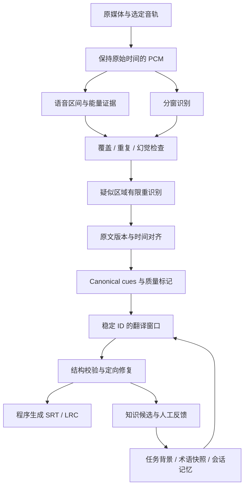

# FusionKit 字幕质量改进：FineSub 源码评审与实施建议

日期：2026-09-05。阶段：分析评审，方案尚未实施。

> 进度说明：本文保留首次评审基线，后续实现与验收见各阶段记录。阶段 9～11 已作为 `9a4c2ea` 提交并获得用户阶段认可。第十二阶段 T-SEG-01/02 已停止比例切轴和无依据短句合并；T-SEG-03 系列未获得合格新增时间正例，04A 已将保留父段时间的分隔恢复接入 Windows CUDA 日语默认转写，实际开头恢复 6 处分隔，并完成完整问题音频及对照素材实跑；尚未解决全部连写和内部句界时间。按用户决定暂不为较大模型增加适配。见[需求](phase12-sentence-boundaries/requirements.md)、[设计](phase12-sentence-boundaries/design.md)、[任务](phase12-sentence-boundaries/tasks.md)和[局部资格记录](phase12-sentence-boundaries/records/2026-09-05_T-SEG-03C_local_boundaries.md)。

FusionKit 基线：`fdd5e9d`，`package.json` 版本 `0.3.0`。文档沿用现有 `docs/v0.2.11` 功能目录，不代表版本发布安排。

参考快照：`C:/Users/Administrator/Documents/GitHub/temp/subtitle_tools/finesub-main`，`VERSION=0.5.0`；目录没有独立 `.git`，不声称其等于某个远端提交。用户提供的 `temp/subtitle/_tools/finesub-main` 在本机不存在。

本文区分三种结论：**源码事实**、**由源码推断的风险**、**待音频验证的设计建议**。已做用户授权目录的只读字幕/声学抽查（第 8.1 节），没有听审或 ASR A/B，不把方案目标写成已达到的准确率。

用户补充：**优先低声 / 耳语 / ASMR、停顿较多**；当前使用完整 **large-v3**，开启 **Silero VAD v6.2.0**。用户明确禁止修改 NAS 中的文件，本轮读取遵守此约束。

## 1. 结论与优先顺序

值得学习，而且能够沿着 FusionKit 现有架构分阶段落地。FineSub 的价值在于把音频证据、识别补救、时间对齐、翻译约束和知识更新连成闭环。

建议优先完成两个闭环：

1. **转写质量闭环**：找出应有语音却没有识别结果的区域，以及疑似幻觉、重复和时间异常；针对区域重识别；保留无法确定的片段供复核。
2. **翻译质量闭环**：原字幕条目和时间轴由程序管理；模型获得真实来源的上下文、术语和风格规则；结果经过覆盖校验；本次发现以可追溯候选进入知识库。

保留当前 `whisper.cpp`、本地任务队列、原生资源管理和字幕产物交接。对用户的 ASMR 场景，优先弱语音召回、无文本区复核和停顿边界；随后通过小样本决定是否增加第二 ASR 和独立对齐器。人声分离的优先级低于这些项目。

本轮交付是可供设计和开发接续的评审方案。没有修改业务代码、安装模型或调用付费模型；不把方案建议当成已确认的新功能需求。

## 2. FusionKit 已有能力及具体缺口

| 编号 | 源码事实 | 对用户问题的影响 | 定位 |
| --- | --- | --- | --- |
| F-01 | 已有 30 秒 PCM 分窗、5 秒重叠、最多 3 层分裂重试及窗口所有权合并 | “加分窗、加 VAD、加重试”已不足以描述下一步，需要改善触发证据和候选选择 | `src/type/localSubtitle.ts:9`；`electron/main/local-subtitle/production-executor.ts:641` |
| F-02 | 完整时长的合法空响应，被标为 `no_speech` 并接受；判断不接收独立的声学语音区间 | 如果 ASR/VAD 漏掉真实语音，当前应用层缺少发现它的依据。这里是机制缺口，不等于已定位某份音频的根因 | `subtitle-post-processor.ts:558`、`:597`、`:1003` |
| F-03 | 重复退化门槛是规范化相同文本连续至少 8 条、跨度至少 15 秒，两者同时满足 | 两三条复读、句内复读、近似改写的复读，不由这一规则识别；跨窗完全重复另有合并规则，不能说全部未处理 | `src/type/localSubtitle.ts:30`；`subtitle-post-processor.ts:961`、`:1214` |
| F-04 | 解析并保留了 `averageLogProbability`、`noSpeechProbability`；后处理仅校验其数值合法性 | 应用层尚未将这些信号与音频证据结合，识别“时间合法、内容不可信”的片段；上游引擎自身仍有解码阈值 | `server-contract.ts:397`；`subtitle-post-processor.ts:871`、`:2421` |
| F-05 | 生产请求统一 `token_timestamps=false`；长句拆分按文本长度比例分配时间，并标记 `estimatedTiming` | 字数比例无法表现停顿和不均匀语速，是拆句后音文错位的可解释风险。现有 VAD 词轴保护不能直接取消 | `server-contract.ts:267`；`subtitle-post-processor.ts:1415`、`:1544` |
| F-06 | 顺序和并发翻译都传上一片**原文**；SRT/LRC prompt 都把它标为 previous translated content | 来源标注错误，且没有上一片已采用译名、译法和人物关系的可靠延续 | `electron/main/translation/class/base-translator.ts:449`、`:522`；`srt-translator.ts:87`；`lrc-translator.ts:82` |
| F-07 | SRT 翻译的 `postProcess` 原样返回模型文本；通用翻译路径主要检查非空。LRC 有格式清洗 | SRT 缺条、多条、序号和时间戳被修改，缺少与源条目逐一对应的硬校验。LRC 格式清洗同样不能证明逐条覆盖 | `srt-translator.ts:127`；`base-translator.ts:804`；`lrc-translator.ts:111` |
| F-08 | 字幕翻译按源字幕 token 数分片；未见字幕专用知识检索、会话摘要、候选知识写回 | 有相邻原文背景，但缺少有预算、有状态的 harness；非常小的分片更容易失去指代和整句语境 | `electron/main/translation/constants.ts:12`；两个格式翻译器的 `splitContent` |
| F-09 | 长文本翻译已实现 `SemanticMemory`、术语优先级、memory patch 校验和预算管理 | FusionKit 并非完全没有记忆基础；可以提取纯逻辑复用，避免把整个长文本任务服务接进字幕队列 | `electron/main/text-translation/memory/` |

以上省略目录的转写文件均位于 `electron/main/local-subtitle/`；翻译格式文件位于 `electron/main/translation/class/`。

当前配置默认 `large-v3-q5_0`、自动语言、VAD 开、beam=5、temperature=0、最短静音 500 ms。资源目录已经同时支持量化和完整 `large-v3`。用户明确使用完整 `large-v3`，因此量化不是这次已知配置的解释；也无须再建议通过切换完整 large-v3 解决当前问题。

## 3. FineSub 哪些值得学习，哪些需要重新验证

| 能力 | 参考实现的实际机制 | FusionKit 的采用方式 |
| --- | --- | --- |
| 漏转写检测 | `recognition/transcribe.py` 用 VAD 区间与转写区间的交集评估覆盖，触发 beam / 分段救援，比较补救前后覆盖 | 学习“在没有字幕的区域检查遗漏”；覆盖率是定位线索，不能证明文字正确，也不能用加长字幕伪造召回 |
| 抑制幽灵字幕 | 人声分离、能量轨、Silero 辅助、语速/词置信度/对齐异常、第二模型复核共同参与 | 建立多证据质量判断；不只看 `no_speech_prob`，不依靠单一短语黑名单 |
| 精细对齐 | `fw-refine` 依赖补丁版 CTranslate2，做词时间修正和原始时间映射 | 与当前 `whisper.cpp` 不是参数级兼容；独立验证对齐方案后再接入 |
| 翻译窗口 | `chunking.py` 区分待处理行与只读前文；校验源 ID；失败带结构化错误修复 | 用稳定 cue ID、只读上下文和程序导出，让模型专注译文 |
| 连贯性 | 串行保留建议/词条传递；并行冻结阶段上下文后再执行，有明确质量取舍 | 显式区分“连贯优先”和“速度优先”，不假装并发窗口已经知道前窗译文 |
| 知识库 | SQLite 版本、条目/别名检索、任务反馈、来源证据、冲突与修订；默认读取但通常不自动写回 | 采用快照、作用域、候选和修订机制；先实现本地术语/人物/风格，不照搬社区共享和完整 Agent 工具链 |
| 人工反馈 | 区分“命中、注入、出现在结果、被人工确认/推翻” | 模型反复沿用某译名不等于独立证据，避免自我强化错误 |

参考项目也有边界：

- `docs/vad-asr.md` 明确记录 aligned 输出可能重叠，部分对齐坍塌只报警；文案中的“精确到帧”不是对所有素材的实测保证。
- `asr-stabilize.md` 的部分日语套话处理依赖其语料先验；真实结束语、歌曲副歌和主播复述可能被这类规则误伤。
- 原音与分离人声的能量分布不同。参考项目的能量阈值为其流水线标定，不能复制数值用于 FusionKit 原音。
- 参考默认 ASR 是 `large-v3-turbo`，当前 FusionKit 默认为量化 `large-v3`；直接比较成品不能区分模型、预处理、对齐和 LLM 纠错的贡献。
- 本地快照 README 声明代码自 0.5.0 起为 GPL-3.0-or-later、prompt 为 CC BY-SA 4.0；prompt 目录许可还残留“其余代码 MIT”的旧说明。本方案引用方法并独立设计，不复制其代码或 prompt。若后续引入具体文件，按具体版本单独核对归属与许可。

## 4. 建议的生产链路



`raw → corrected source → canonical cues → translated cues` 分层保留来源关系。纯翻译不会反向改写原始 ASR；原文纠错产生新 revision，受影响的对齐和译文需要重新生成。

### 4.1 转写：先建立独立于“识别有没有返回文本”的证据

新增 main 进程拥有的 `SpeechEvidence`，包含原始音轨/PCM 身份、检测器版本、参数、原时间域中的语音区间和能量摘要。应覆盖整个音频，也记录被首轮 VAD 排除的区域。

状态至少区分：`speech_detected`、`no_speech_supported`、`unknown`。空 ASR 响应本身只能说明“没有识别到文本”，不能单独生成声学无语音结论。检测器不可用时展示能力降级，不输出虚构的语音覆盖指标。

VAD 也会漏低声、短促应答和耳语。因此“首轮 VAD 删掉 + 首轮 ASR 没返回”不是两份独立证据。保留原音能量、宽松检测候选或不同模型复核路径；能量高同样不等于有人说话。

ASMR 专项应保留语音与非语言声音的区别：呼吸、耳部动作声、环境声不强行转成台词，确有字词的轻声回应应保留。不能用普通会议语音的固定响度门槛裁掉安静内容。首版实验比较 VAD 默认参数与更宽松的短语音长度、阈值和边界 padding；具体数值由相同片段的漏识别/误识别对照决定，不直接把“降低阈值”写成质量修复。

现有 `media-normalizer.ts:1568` 会把选定音轨重采样并混成 16 kHz 单声道。对双耳录音记录左右电平、混合后变化及声道差异；只有存在损失证据时才做较强声道或声道独立重识别对照。逐帧硬切较响声道会制造不连续，不能用作默认混音策略。本轮样本未发现严重声道抵消。

检测器接入有实际工程缺口：当前 `/inference` 结果没有独立 VAD interval 清单。先检查固定版本可分发的结构化接口；上游 `whisper.h` 有 VAD C API，但这不等于 Node 已能直接调用。按原生资源机制做一个小范围接口验证，再决定受控进程桥接或独立 VAD 运行时，避免直接解析人类日志。

### 4.2 质量策略：硬错误与可疑内容分开处理

| 类型 | 证据组合 | 动作 |
| --- | --- | --- |
| 合同或时间损坏 | 非有限时间、负时长、越界、错误时间域 | 继续按现有硬门处理，不能导出为正常成品 |
| 可能漏转写 | 语音区间没有识别覆盖；VAD 被排除区仍有值得检查的声学证据 | 定位具体区域，扩展上下文后重识别；保留未解决区间 |
| 可能幻觉 | 低语音证据 + 异常重复/不可能语速/较差解码指标 | 复核，不因一个阈值或一句套话直接删除 |
| 两三次复读 | 相近音频位置的相同/近似文本、句内周期重复、跨窗重复证据 | 先判定是否指向同一段音频；真实连续复述保留 |
| 时间不可靠 | 边界靠近裁切处、词不在父段内、稀疏长轴、不同候选严重分歧 | 重新取上下文、做对齐或标记估算；禁止复制文本填满时长 |

现有 8 条/15 秒规则保留为严重退化检测，新增较敏感的“复核提示层”。直接把硬阈值改为 2，会把口头重复和副歌当作错误。

识别指标不是概率校准后的正确率。`avg_logprob` 的聚合口径、VAD 行为和模型版本必须随证据记录；`compression_ratio` 不能假定当前服务端已提供。上游 server 的 `temperature` 输出是请求参数，也不能据此准确统计内部 fallback 次数。

### 4.3 补救：改变证据或窗口条件，限定资源预算

建议首轮沿用现有分窗，在可疑区域选择补救动作，而不是全片重复计算：

1. 扩展区域前后各 1 秒上下文，在停顿附近重新切片；额外区域只用于理解，最终通过统一的来源/边界合并规则处理。
2. 固定已可信的语言，清空可能误导的初始提示；首选低温。当前默认已为 beam=5，不能把“把 beam 改成 5”算成新补救能力。
3. 有被 VAD 误删迹象时，仅对可疑区域做更宽松 VAD 或关 VAD 的对照识别。不能全片关 VAD 后无条件采纳更长文本。
4. 高成本模式下，调用另一识别模型或原音/分离人声对照，生成候选；以声学支持、来源一致性和质量规则比较，不能只选字数更多的结果。
5. 仍不确定则保留复核标记；被删除/替换的候选有来源、原因和可恢复原文。

建议初始产品预算：每个可疑区域最多 2 次**额外**识别；整任务额外识别音频时长上限为源时长的 25%。二者共用一个 task budget，嵌套分裂不能另开无限预算。达到上限以“待复核”完成质量阶段，结构损坏仍失败。这些是待样本校准的产品建议，不是已验证阈值。

### 4.4 时间轴：识别时间、对齐时间和显示时间分别保存

- 所有阶段明确 `timelineDomain=original_media`；时间转换保存 sample offset 或分段映射，不能用全局偏移修复删静音形成的非线性错位。
- 当前 v1.9.1 的 VAD 路径继续使用映射后的 segment 时间；不能直接开启词时间替换现有正确段轴。
- 有可信词级对齐时，按停顿、标点、字数、读速和时长断句；按发音位置分配边界。
- 没有可信词轴时保留段轴，并明确 `timingKind=estimated`。稀疏一句话只出现一次，剩余静音没有字幕是正常现象。
- 原文纠错后再对齐；强制对齐不会纠正错误文本，也不能证明字幕内容在音频里存在。对齐失败时保留原段和复核提示。
- 视频帧量化只属于最终导出表现；毫秒格式或帧取整不等于帧级准确。无视频帧率的音频不显示“精确到帧”。

## 5. 翻译 harness：从上下文到知识更新

### 5.1 先把模型输出从 SRT 时间轴中解耦

程序解析源字幕，分配稳定 `cueId`。ID 以源文档身份和条目出现位置绑定，不能只用时间或文字作 key：合法重复台词及相同时间的 LRC 行都可能存在。

V1 纯翻译协议为每条 cue 返回一次译文；模型不返回时间戳、不重排源条目、不决定删除、合并或插入字幕。程序据原 cue 导出单语或双语字幕，原文行也取自源数据。先解决完整性，再把“纠错重分句”作为独立模式设计。

以下为 FusionKit 独立设计的示意协议，人物和台词均为虚构：

```json
{
  "windowId": "w-004",
  "translations": [
    { "cueId": "c-00121", "text": "蕾娜，你先走。" },
    { "cueId": "c-00122", "text": "我马上就来。" }
  ],
  "memoryPatch": {
    "sceneSummary": "说话者让蕾娜先离开。",
    "evidenceCueIds": ["c-00121", "c-00122"]
  },
  "termCandidates": [],
  "reviewNotes": []
}
```

本地校验：期望 ID 集合逐一覆盖、每条一次、没有未知 ID、译文非空、语言和保护标记约束、长度限制。缺/重/未知 ID 是硬错误；语义、专名一致性和读速是复核信号，不误报为确定的内容错误。

返回不完整时，将具体错误与上次结果交给同一窗口修复；最多 2 次结构修复尝试，并计入任务已有总调用预算。预算不足时缩小待处理窗口，复用已经提交的有效结果。上下文摘要或知识候选无效时忽略辅助块并警告，不浪费已有效的译文。

现有单一重试所有者、实际用量统计、并发 `allSettled`、原子写入和恢复产物清理继续复用。新修复流程不得在适配器层再开启一套重试。

### 5.2 六类上下文分开标注

| 上下文 | 来源与用途 | 建议限制 |
| --- | --- | --- |
| 任务背景 | 用户填写作品、主播、角色、场景；给每个任务拍快照 | 初始上限 1,000 tokens |
| 已确认术语 | 作用域和语言对匹配；明确固定译法及别名 | 检索后最多 1,500 tokens；禁止整库注入 |
| 原文前后文 | 前窗尾部和后窗开头；帮助理解跨句指代 | 两侧分别最多 500 tokens；只读，不进入输出 ID 集 |
| 已提交译文 | 串行时上一窗口经过结构校验的译文摘录 | 最多 500 tokens；不能标为人工核准 |
| 会话记忆 | 场景摘要、人物指代、暂定译法、未决点，均关联来源 cue | 最多 800 tokens；只由已提交窗口更新 |
| 质量线索 | ASR 疑似误听、估算时间、候选分歧 | 只给当前窗口相关条目；不是新台词来源 |

这些是预算上限，不是每窗必须填满。源正文可先沿用常规 3,000 tokens，再按**完整序列化请求**、最大输出和模型上下文上限收缩窗口；包含 system、全部上下文、JSON 包装及双语需求的输出开销。不能继续只对正文计费或估算。

提示词由有版本的规则、输出契约、语言规则、风格和资料块组合。可信规则与字幕/检索资料分栏，资料里出现的命令当作台词或资料，不改变任务。没有音频的调用明确采用纯文本纠错边界：遇到可疑误听先保留/标注，不凭故事背景编出台词。

### 5.3 连贯与并发有明确语义

**连贯优先**：同文件串行；每个已提交窗口产生有限的记忆 patch，下一窗读取。跨场景或长停顿降低短期上下文影响；错误窗口不推进记忆。

**速度优先**：任务背景、术语和全局摘要冻结成同一个 snapshot，再并发翻译；各窗可读相邻原文。全部已启动请求结束后，按窗口顺序汇总候选和检查术语分歧；只对冲突范围做校对。不会给并发窗口伪造“上一片译文”。

同文件知识不在并发请求中争抢写入。跨文件可复用已确认术语，但“今天某场对话里他指谁”的临时记忆不跨文件自动传播。

### 5.4 知识库模型与学习策略

条目建议字段：`id / revision / scopeId / sourceLanguage / targetLanguage / kind / canonicalSource / aliases / preferredTarget / notes / status / origin / evidenceRefs / updatedAt`。

- `kind`：术语、人物、风格、易错提示。
- `status`：`candidate / confirmed / rejected / retired`。用户固定译法以 `locked` 属性保护。
- `origin`：人工输入、人工修订导入、模型提议。模型自报高置信不自动变为人工确认。
- `evidenceRefs`：源任务、源 revision、cue ID、人工改动或外部资料引用；不把一次生成和它的多次转述算成多份证据。
- `scopeId`：作品/游戏、主播、项目；明确“通用”作用域。匹配优先级：本任务锁定 > 项目确认 > 作品/主播确认 > 通用确认 > 本任务候选。

首版用 main 单写者管理版本化 JSON：快照和候选随一个 revision 原子提交，UI 和并发翻译只读快照。设置条目上限（建议每库 5,000 条）并在达到上限时提示整理，不能静默丢条目。跨进程写锁、海量全文检索或共享协作出现时，再迁移 SQLite；不为首版增加一套 native addon 打包依赖。格式预留 schemaVersion、不可变 ID、迁移入口和导入导出。

产品提供三种行为：关闭知识库、读取已确认知识、读取并积累候选。默认读取已确认知识；候选可自动收集，不在后台覆盖跨任务的已确认译法。结果页允许批量确认、修改和拒绝候选。每条变更有前后版本，可撤销。

允许本任务里的暂定译名帮助后续窗口保持一致，但始终标记其来源和暂定状态。用户修订是更强证据；本次模型的风格不能通过自动总结悄悄变成永久风格。这样“越用越好”才有可靠的反馈来源。

### 5.5 断点恢复与两工具交接

每个翻译任务固定 `sourceRevision / promptVersion / contextSnapshotId / knowledgeRevision / modelConfigSnapshot`。每个窗口记录实际请求摘要、上下文版本和已提交的记忆 patch；失败恢复读取原快照。修改术语或风格生成新的任务修订；用户显式选择重译受影响窗口，不能静默把同一个文件前后切成不同规则。

扩展现有 `artifact-handoff.ts` 和 `generatedSubtitleImportCoordinator.ts` 的类型化交接：除了字幕产物引用，传递 cue revision、背景/术语快照引用和质量报告引用。可选音频引用仍由 main 解析，不给 renderer 原始路径，也不让两工具共享可变 Store。

单独导入 SRT/LRC 仍可使用文本 harness。音频缺失时显示“文本翻译”；有本地产物引用也不代表应自动发送音频到供应商。多模态纠错由用户选择该能力后才执行，并只发送相关片段。

## 6. 用户实际能感受到的变化

尽量在现有两个工具页面完成：

- 转写结果显示“已恢复的疑似漏识别、仍待复核的区间、估算时间的字幕”；点击条目可播放前后约 2 秒并查看候选，选择保留、替换或重识别此段。
- 翻译配置增加“背景说明、术语库、风格、连贯/速度”；常用内容可保存为项目预设，源音频的初始提示仍与翻译提示分开。
- 结果页集中显示译名冲突、疑似误听和新术语候选；支持一次确认一批，不要求每个窗口人工干预。
- 有结构错误时给出具体窗口和缺失 cue；知识写回失败时保留成功译文并可重试候选入库；用户取消时不提交未验证结果。
- 转写未解决内容问题时可导出明确标注的复核草稿，结果状态不是“质量校验通过”。格式、合同损坏不能当作有效草稿导出。

沿用 ToolDetailLayout、ToolPanel、ScrollableDialog 和现有持久化来源；新增前端交互在 Electron 中验证，包括中文/英文、空态、失败态和恢复态。

## 7. 实施批次与落点

下表是建议拆分，全部尚未实施。正式开发时沿用项目的 Final Design / Execution Plan 台账补齐需求及任务；这份评审不替代接口设计和实际验收。

| 批次 / 建议任务 | 交付 | 主要代码落点 | 验收要点 |
| --- | --- | --- | --- |
| P0 / SQ-01 | 修正上下文语义，区分 sourceContext / committedTranslationContext | `translation/class/base-translator.ts`、两格式翻译器 | 两窗录制请求，验证标签与实际数据一致；串行/并发不同语义 |
| P0 / SQ-02 | 稳定 cue 模型、结构化翻译协议、本地时间轴导出 | `translation/`、`src/type/subtitle.ts`、现有字幕解析/导出工具 | 漏条/重条/改时间不能被提交；合法相同时间和真实重复仍保留；SRT/LRC 单双语兼容 |
| P0 / SQ-03 | 质量证据和诊断类型；真实问题小样本基线 | `local-subtitle/subtitle-post-processor.ts`、`src/type/localSubtitle.ts`、测试及诊断脚本 | 明确“合法输出”与“声学正确”不同；保留当前 VAD 词轴限制 |
| P1 / SQ-04 | 结构化语音检测接入及覆盖缺口检测 | `local-subtitle/media-normalizer.ts`、新增 evidence service、资源 manifest | 原音存在语音但 ASR 为空的夹具能进入复核；声学无语音不强迫造字幕 |
| P1 / SQ-05 | 可疑区域补救、候选比较、重复复核层 | `production-executor.ts`、`server-contract.ts`、后处理器 | 预算严格有界；恢复内容有原位置；真实复述不被硬删 |
| P1 / SQ-06 | 背景/风格/作用域术语库及检索快照 | 字幕 main 服务、`src/type/`、字幕配置 Store 和页面 | 新任务命中已确认译名；不相关游戏、语言对不串库；人工词条不被覆盖 |
| P1 / SQ-07 | 会话记忆、两种调度、恢复一致性 | `translation/checkpoint.ts`、任务工厂、配置快照、token estimate | 重启后相同快照继续；并发结果按序提交；辅助失败不吞掉成功译文 |
| P1 / SQ-08 | 质量复核入口及知识候选确认 | 两工具页面、类型化产物交接、main 所有权 | 一次转写→翻译保留来源；文本导入无音频仍可用；局部重试和批量确认可操作 |
| P2 / SQ-09 | 原音/人声分离 A/B 与可选增强包 | 本地资源管理、音频预处理服务 | BGM 场景有实证收益；耳语、气声、远处对白没有被分离器吞掉 |
| P2 / SQ-10 | 对齐器和第二 ASR 原型，各自独立验收 | 独立 runtime adapter、质量服务、产物类型 | 平台/模型/时间域明确；内存、耗时、下载体积实测；不替换现有可用平台 |
| P2 / SQ-11 | 选择性多模态纠错 | 现有模型 runtime 能力扩展、片段能力引用 | 只在能力已选定且支持时调用；缺音频不捏造原文；修改原文后重对齐 |

表内 `translation/` 与 `local-subtitle/` 省略前缀 `electron/main/`。

**第一批可交付范围建议**：SQ-01～SQ-03。随后实现 SQ-04～SQ-08 构成两工具的质量闭环。SQ-09～SQ-11 根据同一小样本的收益决定顺序，不将整套 Python/CUDA 环境列为首批前置条件。

运行时选择：当前 `whisper.cpp` 继续覆盖 CPU / Windows CUDA / macOS Metal；faster-whisper 或 WhisperX 可作为可选实验对象。FineSub 的 patched CT2 和分离链有额外依赖与硬件范围，不能当作可直接跨平台替换的轻量库。WhisperX 官方也列出对齐词典、重叠讲话和语言模型限制。

## 8. 如何证明“质量提升一个档次”

先用总计约 20～40 分钟、6～8 个片段建立一次可复用对照，不要求建立大型语言基准才能开发。优先用户现有失败素材，另留少量未参与调参的片段。

优先覆盖：耳语/低声、短促回应、长停顿稀疏语音、双耳左右移动、非语言动作声、真实重复与识别复读、25 秒附近跨窗句；另保留清晰对话和有 BGM 的少量负例。首轮挑出 20～30 处问题区间并听审，不把 Whisper/FineSub/第二模型的输出直接当 ground truth。

| 指标 | 方法 | 建议验收目标（待素材确定后冻结） |
| --- | --- | --- |
| 漏转写 | 人工标注的语音内容/事件中，完整遗漏的数量及位置 | 失败样本的完整遗漏下降至少 50%；清晰语音对照没有新增整句遗漏 |
| 幻觉 | 人工确认无相应语音的字幕及无语音区文本量 | 问题样本幻觉条数下降至少 50%；改善不能靠误删真实对白换取 |
| 重复 | 区分真实复述与无声学依据的复读 | 已标注复读不再自动作为正常结果提交；合法复述保留 |
| 文本准确性 | 对关键片段校对后计算 CER/WER，保留专名单独评分 | 在相同语言归一化规则下比较；不只用字幕覆盖时长替代准确率 |
| 时间边界 | 人工边界与字幕起止偏差，分估算轴和对齐轴统计 | 清晰片段目标中位数 ≤150 ms、P95 ≤400 ms；先测基线再确认，不承诺逐帧正确 |
| 翻译完整性 | 源 cue 与最终输出 ID/时轴比较 | 纯翻译 100% 覆盖；程序持有的时间戳零改动 |
| 译名一致性 | 至少 20 组跨窗口专名/角色/指代；含同名不同作用域负例 | 锁定词条全部符合；不相关词条零强制替换；无法判断的语义项人工复核 |
| 知识学习 | 人工纠正一处，下一任务再出现；同时加入错误模型候选 | 已确认知识生效；候选不能覆盖确认条目；撤销后下一任务恢复旧版本 |
| 成本与体验 | 同一设备/模型记录 RTF、峰值内存、追加推理时长、LLM 全部调用 tokens | 标准路径无异常区时不增加第二遍全片 ASR；补救符合任务预算；计入失败和修复调用 |

对照顺序：A 当前完整链路；B 只改善现有 ASR；C 在同一原文上比较新旧翻译；D 可选分离/第二模型/对齐。一次改变一类因素，防止把 LLM 编写得更流畅误认成听写更准确。

本轮验证已运行：

```powershell
.\node_modules\.bin\vitest.cmd run test/local-subtitle/subtitlePostProcessor.test.ts test/local-subtitle/serverContract.test.ts test/translation/base-translator.test.ts test/translation/base-translator-runtime.test.ts --reporter=dot
```

结果：4 个测试文件、109 个测试通过。首次沙箱启动被 esbuild 目录访问权限阻止；通过自动审批后在沙箱外运行同一命令通过。没有启动 Vite/Electron 常驻服务，没有执行真实媒体 ASR 或付费模型请求。这些测试验证当前合同和恢复机制，不证明音频识别率。

### 8.1 用户素材的只读抽查

从用户指定 NAS 目录选择一组同名音频及 LRC。下表使用匿名样本编号；包含精确路径的报告和分析脚本只留在已忽略的 `test-results/subtitle-quality-review/`，不将媒体或字幕正文写入跟踪文档。

| 项目 | 样本 01 | 样本 02 |
| --- | --- | --- |
| 原音 | 216 秒；48 kHz、双声道、float PCM | 2,734.657 秒；48 kHz、双声道、float PCM |
| 声学分析范围 | 全部 216 秒 | 第 600～720 秒，共 120 秒 |
| LRC 时间行 / 不同开始时间 | 105 / 54 | 905 / 458，整份 LRC 统计 |
| LRC 生成器标记 | FasterWhisperGUI | FasterWhisperGUI |
| 100 ms 窗口算术单声道 RMS 中位数 | −31.73 dBFS | −45.61 dBFS |
| 低于 −50 dBFS 的窗口比例 | 34.31% | 42.33% |
| 非极低能量窗口中，单声道相对较响声道的变化中位数 | 0 dB | −0.57 dB |
| 混合后比较响声道低超过 10 dB 的窗口 | 0 | 0 |

本次声道统计用 `(L+R)/2` 作诊断基准，不冒充生产重采样的逐字节输出。非极低能量窗口定义为至少一个声道 RMS > −50 dBFS，仅用于描述混音，不能当作语音检测阈值。

样本 02 的参考字幕中，15:38～16:40、31:19～31:41 附近存在连续相同文本候选，适合作为后续听审切片；这可能是真实复述，也可能是识别复读，本轮不裁定。该 LRC 最长两个起点间隔为 111.63 秒；LRC 没有结束时间，不能由起点间隔推出真实漏转写。

**证据范围**：字幕标记来自 FasterWhisperGUI，不能作为 FusionKit 故障复现，更不是人工真值。声学统计说明选中片段包含大量低电平内容，不能证明这些窗口有语音、被 Silero 过滤或存在幻觉。真正的 VAD/无 VAD A/B 和听审仍应使用相同音频区间。

读取工具只使用 ffprobe 元数据、ffmpeg 标准输出和文件只读访问；分析前后两组源文件 size/mtime 未变，LRC SHA-256 未变。没有向 NAS 写入任何文件。报告为 `sample-report.json`（样本 01）及 `trk02-report.json`（样本 02）。

## 9. 假设与待补充信息

- A-01：本轮按“评审并提供方案”执行；业务功能保持现状，随后按所选批次进入详细设计。
- A-02：通用字幕能力继续支持多语言及现有本地平台；按用户补充，低声 / 耳语 / ASMR 为第一优先级，游戏实况作为后续扩展场景。
- A-03：声学分析默认本地执行；云端音频纠错是独立的可选能力。
- Q-01（部分已答）：模型为完整 large-v3，开启 Silero VAD v6.2.0；具体失败任务的初始提示、强制/自动语言和设备尚未核实。
- Q-02（部分已答）：ASMR 优先；用户已提供 NAS 只读目录，完成两组抽查。所选字幕标记为 FasterWhisperGUI，尚无确定来源的 FusionKit 失败产物用于一对一复现。
- Q-03：高质量增强的可接受耗时、磁盘和内存成本是多少？在选择分离器/第二 ASR 之前用原型实测确认。

## 10. 参考定位

FusionKit：

- [分窗/模型/VAD 固定合同](../../../src/type/localSubtitle.ts)
- [生产请求与重试](../../../electron/main/local-subtitle/production-executor.ts)
- [server 字段与解析](../../../electron/main/local-subtitle/server-contract.ts)
- [质量门、合并与估算轴](../../../electron/main/local-subtitle/subtitle-post-processor.ts)
- [翻译调度](../../../electron/main/translation/class/base-translator.ts)
- [SRT 翻译](../../../electron/main/translation/class/srt-translator.ts)、[LRC 翻译](../../../electron/main/translation/class/lrc-translator.ts)
- [已有长文本语义记忆](../../../electron/main/text-translation/memory/semantic-memory.ts)
- [语义补丁与冲突保护](../../../electron/main/text-translation/memory/memory-patch.ts)
- [原生字幕交接](../../../electron/main/local-subtitle/artifact-handoff.ts)、[翻译导入协调器](../../../src/services/subtitle/generatedSubtitleImportCoordinator.ts)

FineSub 本地参考根为本文开头记录的目录；重点文件：

- `src/finesub/speech/recognition/transcribe.py`：覆盖检测、重识别与时间映射。
- `src/finesub/speech/postprocessing/stabilization.py`：多信号标记、第二模型证据及清理。
- `src/finesub/llm/output_protocol.py`：源条目覆盖、重复/未知引用校验。
- `src/finesub/llm/stages/correction/{context,commit}.py`：连续性和窗口恢复。
- `src/finesub/llm/knowledge/node/{apply,signals}.py`：版本写入和反馈证据。
- `docs/{vad-asr,asr-stabilize,llm_harness_behavior,knowledge}.md`：机制、参数背景和已知限制。

外部一手核对：

- [whisper.cpp v1.9.1 server 源码](https://github.com/ggml-org/whisper.cpp/blob/v1.9.1/examples/server/server.cpp)：确认该版本参数和输出语义。
- [whisper.cpp v1.9.1 C API](https://github.com/ggml-org/whisper.cpp/blob/v1.9.1/include/whisper.h)：VAD 与实验性 DTW 接口，不能视为现成 Node 接口。
- [faster-whisper 官方项目](https://github.com/SYSTRAN/faster-whisper)：候选运行时定位。
- [WhisperX 官方技术说明与限制](https://github.com/m-bain/whisperX#limitations-)：候选对齐器的能力边界。
- [FineSub 项目](https://github.com/caca2331/finesub)：项目定位；本次细节以本地 0.5.0 快照为准。

本方案按项目避坑要求保留 VAD 时间域保护、不用删除复读掩盖漏识别、不把 parse-back 或 GPU 就绪当成内容正确，也不把广泛 benchmark 与整套新运行时变成开发前置条件。
