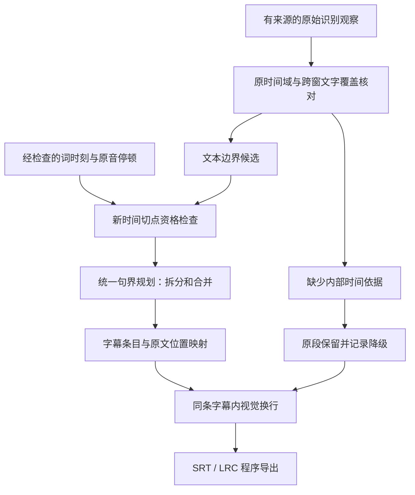

# 第十二阶段：句界、标点与时间依据重整——设计

日期：2026-09-05。基线 `9a4c2ea`；[需求基底](requirements.md)。本设计包含分期实施内容，T-SEG-01/02 已落地，后续时间能力与句界恢复尚待实现。当前改动见[首批实施记录](records/2026-09-05_T-SEG-01-02_preserve_raw_boundaries.md)；以下根因表描述修改前基线。

## 1. 已确认的原因

| 层 | 本例事实 | 结论 |
| --- | --- | --- |
| 原始 ASR | 2.50～16.59 秒连续 28 字、16.59～24.96 秒连续 38 字，均没有句读标点 | 原始句界信息不足已发生在模型输出，formatter 没有删掉这些标点 |
| 拆段 | `ceil(14090/7000)=3`；`ceil(8370/7000)=2`，即使文字未超长也强制拆 | 本例触发因素是时长上限，不是 42 字行长或 84 字条目上限 |
| 切文本 | `partitionText` 以接近平均字数为主，标点仅减 0.25 分；`Intl.Segmenter` 只使用 grapheme 模式 | Unicode 字符完整不等于词句完整；有标点也不能保证优先选真正句界 |
| 分配时间 | `assignProportionalTimings` 用每部分字符数占比分配原段时长 | 7.029、12.061、20.775 秒没有对应独立声学测量 |
| 再合并 | 本轮 `shortCueMergeCount=0`；通常情况下 `joinCueText` 仍会对 CJK 使用空分隔 | 不能把本例归咎于短句合并；但裸拼接是另一项仍需修正的规则 |
| LRC | 直接输出 canonical 起点；内换行换为空格，毫秒向下量化到百分秒 | 7.029 → 7.02 是格式投影；主要误差已在 canonical 之前产生 |
| 验证 | 当前测试强调时长/字数上限、字符守恒、Unicode 与 parse-back | 未覆盖“合法日语句界”和“新增切点来自哪里”，通过测试不能证明可读性 |

主要定位：`electron/main/local-subtitle/subtitle-post-processor.ts:1426`、`:1496`、`:1555`、`:1631`、`:1660`；`server-contract.ts:424`；`subtitle-formats.ts:74`、`:257`；`test/local-subtitle/subtitlePostProcessor.test.ts:1144`。行号对应本轮基线。

这是两个因果层叠加：原始 ASR 没有给出充分句界，当前整形器又主动制造了错误切点。上阶段处理输入音量和较长 cue 被合并的问题，并未替换这套拆分设计。`estimatedTiming=true` 只记录了风险，没有消除用户导出成品中的错误。

## 2. 参考项目：学什么，不能据此推断什么

本地参考实际位于 `C:/Users/Administrator/Documents/GitHub/temp/subtitle_tools/`。文件名中的下划线不是目录分隔符。

- `faster-whisper-GUI-main` 标记 GUI 0.8.5、faster-whisper 1.1.0。`faster_whisper_GUI/transcribe.py:231` 调用模型并转交解码参数，`seg_ment.py:6` 保留 segment 的原始文字和时间；`transcribe.py:624` 在没有 words 时直接导出段文本，有 words 时可输出增强 LRC。这个普通路径没有 FusionKit 的 7 秒字符比例重切。库版本标记和当前参考源码不能反推用户历史运行的模型、参数或是否用过其他处理。
- FineSub 0.5.0 的 `src/finesub/speech/postprocessing/segmentation.py` 与 `docs/segmentation-split.md` 使用词流、停顿、标点与有界动态规划，允许跨 ASR 段接缝重新组织；没有词时间时，`_ensure_minimum_word` 把整段保留为明确标记的单个合成单元，并没有捏造内部词时刻。这里值得学习的是分层与证据条件，不是照抄参数或其测试分数。
- faster-whisper 上游支持词时间并在 VAD 后用分段映射还原原始时间，适合作为 Q-01 候选；“有 word 字段”不自动等于日语完整词或准确发音边界。[官方实现](https://raw.githubusercontent.com/SYSTRAN/faster-whisper/master/faster_whisper/transcribe.py)、[时间映射](https://raw.githubusercontent.com/SYSTRAN/faster-whisper/master/faster_whisper/vad.py)。
- Whisper 的日语 token 分组可按 Unicode 解码单位产生，仍需要词/短语边界保护；不能打开词时间戳就宣布日语断句完成。[上游 tokenizer](https://raw.githubusercontent.com/openai/whisper/main/whisper/tokenizer.py)。
- 当前固定 whisper.cpp 请求/时间域约束继续保留。不能直接把 VAD 请求的 `token_timestamps` 改成 true，也不能用一个固定偏移量修复删静音后的词轴。[固定版本 server](https://raw.githubusercontent.com/ggml-org/whisper.cpp/f049fff95a089aa9969deb009cdd4892b3e74916/examples/server/server.cpp)。

## 3. 选择的总体方案

先建立统一句界计划，再做显示换行和格式投影；“哪里能断”和“在那里断的收益”分开。保留 ASR 文字与时间证据，读速/行长不能创造证据。

第一批先让默认后处理停止制造本例的三处词中截断，不新增模型请求。这是能单独验收的改进，但长原段仍缺少标点时不能称本阶段全部完成。

第二批在限定输入上选定可用的时间来源，然后接入同一规划器，解决缺少句界的长段。接口先定义“需要什么证据”，不预先承诺尚未测试的引擎质量。Q-01 结束后必须确定采用路径或写明两者未通过；不继续无上限试参数。

## 4. 内部数据与操作边界

实施细化（T-SEG-01/02）：第一期仅消费已经通过主进程时间域、覆盖与原文检查的段级观察。`cue-boundary-planner.ts` 直接生成一段对应一条的计划，保留起止、全文 grapheme 范围和显示行范围；没有关系证据的相邻段全部保持分开，包括英文短段。实际词轴 producer 尚未选型，`speech-timing-evidence.ts` 与内部重分句能力延至 T-SEG-04/05，避免先造无消费者的接口。视觉换行第一期仅使用原有空白/标点边界，找不到时允许超建议行长；不推断缺失标点。任务快照由 main 记录 `sentence_readable_v2`，原生 HTTP/公共 IPC 不增加能力。

新结构先留在 main，不把原始路径、音频或大块词轴送入公共 IPC。现有 canonical 继续由主进程形成。

| 结构 | 必需字段与约束 |
| --- | --- |
| `SourceRun` | `id`、`revision`、原始 `text`、有序 `observations`；观察含窗口身份、原始段序号、原媒体 `startMs/endMs`；保留原文，不对源文本 NFKC 后再回填 |
| `TextSpan` | `runId`、`startGrapheme`、`endGrapheme`，半开区间；建立一次 grapheme 到 UTF-16 索引映射，不混用两类下标 |
| `BoundaryCandidate` | `offset`、`kind=sentence/clause/lexical/unknown`、`evidenceRefs`；可选 `timeAnchor`；没有时间来源的文本标点不能自带时间点 |
| `TimeAnchor` | `domain=original_media`、原始 PCM 身份、producer/version、源词/段引用、`leftEndMs/rightStartMs`；两端顺序、媒体范围及词文字位置必须通过检查 |
| `CuePlanItem` | 有序 `sourceSpans`、`startMs/endMs`、`timingKind=native_segment/aligned/segment_fallback`、`boundaryRefs`、限定标点插入；不由自由文本重建源文 |
| `BoundaryReport` | 策略版本、切分/合并原因、原段保留数、未解析句界数、增加的推理次数；用于任务说明与验收，不写进字幕台词 |

拟定 `sentence_readable_v2` 为新的整形策略身份，与原生 server HTTP 合同分开。第一期 canonical 字段仍使用现有 schema；来源细节保留在主进程报告。需要公开新增字段时单独升级严格验证和桥接合同，不使 renderer 通过任意字段伪造词轴。

必须保留三个不变量：

1. 每个被接受源文位置按顺序且恰好消费一次；跨窗同一观察的去重先有音频重叠与文字映射证据。归一化指纹只能用于比较，不能当成精确覆盖证明。
2. 排版只能插入白名单分隔或换行；原有标点、数字、专名和符号不可删除。句界恢复不能通过“剥离所有标点后一样”掩盖原有标点被误改。
3. 新 cue 时间引用锚点；无锚点只允许原段回退。不能把父段长度均摊给子句，不能把后半句一并提前到父段起点。

## 5. 候选边界与统一规划

### 5.1 先判断资格

- grapheme 完整只提供最低 Unicode 安全。日语用语言分词产生候选，再结合功能词附着、标点及上下文；`Intl.Segmenter('ja', word)` 可作候选生成器，但不能单独当语义真值。
- 原文句末标点、分句标点是文本证据；模型原段接缝是已有时间观察；词间停顿是声学线索。长停顿不自动证明 VAD 两侧是两个完整句子，也不能从空 ASR 反推静音。
- 给“そ／うだ”“誰／だ”“そな／た”建立明确禁止断点的回归样例；同时用人名、数字、助动词、英文单词和结合字符反例防止只修这三个字符串。
- 新的时间条目切点必须同时有允许的文本边界和已验证时间锚点。只有标点没有内部词轴时可改善显示分隔，仍保留原段时间。

### 5.2 再选择组合

使用有界动态规划同时选择拆分与合并。评分采用明确优先顺序：违反文字覆盖/时间证据/词内禁切的候选不可用；在其余候选中先减少被拆坏的语义单元及跨越有证据的长停顿，再比较显示目标溢出与条目碎片数，最后比较行长均衡。不得再用 0.25 的标点奖励去与字符平均距离竞争。

计算块最多 60 秒或 2048 个候选文本单元；单条候选最多向前考察 256 个允许断点，达到界限时在已有安全锚点处分块；没有可用锚点则整段回退，不在数组下标处强切。复杂度界是工程上限，不声称该剪枝保证全局数学最优。

ASR 段接缝是可保留的原时间观察，不自动成为必须断句点；跨段重组须保持所有源位置引用。跨 root window 的文字取舍仍先由已有覆盖与重复规则处理，若结果存在未决冲突，不把两套候选拼成一句。

### 5.3 短句连接与标点

连接关系必须显式为：

| 关系 | 处理 |
| --- | --- |
| 同一个词/短语的续接，且来源和时间支持 | 按语言连接，日文可无空格；不得在两个完整独立回答间使用此关系 |
| 已确认的分句或独立短句 | 默认保持分隔；同 cue 时保留原标点，无原标点时用一个空格作为中性分隔 |
| 未知 | 保留已有条目，不主动裸拼接 |

第一版不依赖新云端模型恢复标点。优先消费 ASR 自身的句读；没有标点时，只有文本边界和原音停顿共同支持的地方才插入中性空格。不能按“每遇到だ就补句号”等正则猜句。问号、句号的语义恢复与词句重识别分别验收；如果 Q-02 表明现有本地来源仍不够，登记具体残留样例，不能把一整串无分隔长句算作完整通过。

未来独立标点模型只能返回 `{offset, insert}` 操作，`insert` 属于配置允许的标点集合；回放原文产生结果，不接受自由改写文本。此扩展不作为第一期实现前置。

## 6. 时间来源的限定选型

| 路径 | 要验证的价值 | 主要代价与限制 | 选择规则 |
| --- | --- | --- | --- |
| A：现有 whisper.cpp 独立非 VAD 局部词轴候选 | 复用原生资源，在保留静音的短窗口获得文本位置与时间；仅同文映射通过的片段用于断句 | 复解码可能改变文字；词轴质量仍待测；必须与原 VAD 上下文隔离，不能偷开现有 VAD token 开关 | 若三个输入的目标句界和时间检查都通过且无新漏词/音效误报，优先选依赖较少的 A |
| B：faster-whisper 本地候选 | 同一条识别路线输出段、标点及映射词轴，直接检验用户参考路线的可行性 | 新模型格式、Python/CTranslate2/CUDA 资源；目前不能假定与用户历史 GUI 输出相等，也不能假定适用于 Metal | A 未通过而 B 通过时，选择受管 Windows 能力并补生产资源任务；不全平台切换 |

输入固定为：本次 0～55 秒、既有 B 30 秒、B-noise 18 秒。每条候选每个输入一次，不复制参考文字作为 prompt 或固定答案；参数、模型与版本固定后运行。词句变化按独立 ASR 候选记账，不混入标点补丁。第一轮不把不同候选的少量正确词人工拼成一种不存在的默认模式。

检查：每个实际产生的新增句界有文本与时间依据；词在父区间内、顺序与覆盖一致；长静音恢复正确；B 不丢掉已改善主体，B-noise 不增加词；首次词跨度过长、零时长、窗口边缘敏感和不同文本均明确拒绝使用对应锚点。结构检查通过后还需试听所用新切点，不能以强制对齐成功证明台词存在。

如果两个候选均通过，比较新增实测耗时、峰值内存/显存、安装资源和平台覆盖，以满足质量门后的低成本路线优先。如果都不通过，保留第一期的确定性修复、记录 Q-01 未解决；下一次只针对失败原因修改方案，不虚报完整改善。

2026-09-05 首轮选型后的限定补充（T-SEG-03A）：A 在 B 样本出现跨数秒的词轴，在 B-noise 输出重复文字；B 的开头恢复了句读及正时长词轴，B-noise 为空，但 B 只剩“すべすべでしょ”，遗漏已认可的前缀。两者均未通过首轮完整质量门。B 首轮未包含 FusionKit 已有低音量保护，因此仅补验证与当前生产输入保护的兼容性：复用已保存、校验源哈希的 `phase10/production-limited/B.wav`、`B-noise.wav` 及实际增益记录，增益生效时使用既有 1000 ms VAD padding。模型、解码参数、VAD threshold/min silence 不变，最多两次额外推理；开头增益为 0，复用首轮结果。不继续搜索参数。仍漏词、出现假词或时间结构失败则保留原段方案，登记具体下一修复目标；不得用拼接不同候选文本通过测试。

faster-whisper 的 GPU 与打包边界以官方资料为准：[CTranslate2 硬件支持](https://opennmt.net/CTranslate2/hardware_support.html)。独立强制对齐也有语言模型和无法对齐文本的限制，因此 WhisperX 不作为本轮默认叠加依赖。[WhisperX 官方限制说明](https://github.com/m-bain/whisperX)。

若选 B，不复用 GGML 模型路径或把新 engine 冒充 `whisper_cpp`；须增加版本化能力、受管资源、下载/删除/验证与取消清理任务。Q-01 得出 B 后，先把其资源清单、协议和具体任务回写本设计再实现；不能藏在一个“添加适配器”任务内。非 Windows 保持当前引擎和安全后处理。

用户补充实际 GUI 模型后的选型扩展（2026-09-05，T-SEG-03B）：只读使用用户提供的 CTranslate2 float32 模型目录。该模型 `model.bin` 约 6.1745 GB，配置的 alignment heads、语言 ID、suppress IDs 与本轮官方 FP16 候选不同，不能把全部差异归因于体积。使用同一用户模型分别以明确 `float16`、`float32` 计算，逐组串行处理既定三个样本，最多六次推理；保留全部结果。缺少特征提取配置时，根据模型公开的 `n_mels` 在实验进程内配置，不写回用户目录。记录实际 compute type、模型身份、输出文字/词轴、耗时及内存观测。FusionKit 目前的 whisper.cpp GGML 引擎不能直接装载 CTranslate2 的 model.bin，实际产品支持须依结果展开受管资源与适配任务。

用户确认实际 compute type 为 float16，并授权查看运行中的 GUI。窗口版本为 0.7.6 / faster-whisper 1.0.1；只读保存配置显示 VAD 最小静音 2000 ms、最小语音 250 ms、word timestamps 关闭等差异。补充同一模型的 3 次配置代理对照，实验仍使用 faster-whisper 1.2.1，不冒充旧 GUI 原运行环境。全部 17 次推理已结束，完整结果见[选型记录](records/2026-09-05_T-SEG-03_timing_selection.md)。

### 6.1 选型结论与用户决定

A 的长词跨度、非语言片段复读以及 B 的低声漏词均阻止直接自动采用。B 加既有增益保护后仍发生误词及音效添词；用户模型在 FP16/FP32 下三个样本文字和段时间一致，开头还有 3 个零时长词。结构校验成功不能单独证明发音存在，更不能把不同候选的正确部分手工拼成通过结果。

用户模型与官方候选有相同的 1046 个张量名称和形状；二者浮点数据分别按 FP32/FP16 存储，解释约两倍文件体积。没有比较数值权重是否相同，也没有证明任意素材都不受精度影响。用户据此决定暂不为该较大模型增加产品适配；本阶段取消这项额外工作，保留实验记录供追溯。

### 6.2 下一步：现有引擎的局部增强资格（T-SEG-03C）

保留当前主识别与低音量保护，只针对已有有效源文中缺句界的局部片段评估增强。先使用本轮保存响应形成反例与设计，不新增模型或资源：增强文字不能直接替换主源文；同文映射、原时间域、合法词区间、长停顿和词内接缝分别设门。存在字词差异、零时长或不可解释的长跨度时，拒绝对应增强并保留原段；标点插入也必须能回放到原文位置，不用去标点后的全文相等代替精确覆盖。

本任务必须先明确能否从现有响应构造一个符合全部规则的可用正例，以及哪些开头句界仍无可靠证据。没有正例则记录阻碍，不先接入一个只会回退的生产分支。需要进一步局部推理时先根据具体失败原因写出输入、固定参数、正反例与最多 3 次请求预算，再执行；禁止重新跑一轮精度或 GUI 参数排行榜。T-SEG-04 以该资格结论为前置，不以本轮 B 开头观感更好作为替换引擎的依据。

### 6.3 T-SEG-03C 执行细化与预算

已保存 A 的第二原段对应文本可通过“只插入标点”的逐位置回放；第一原段有增漏字，必须拒绝整体增强。第二原段的候选原生段界与词轴分开检查：不消费零时长词，也不把同一响应远处无关的坏词自动视为任意原生段界无效。只有切点左右的完整词区间、源文本边界以及独立窗口稳定性都通过，才列为可试听候选；仍不自动宣称时间正确。

本轮先验证已有响应，然后固定增加 **2 次**本机现有 large-v3 / CUDA 非 VAD 请求：已保存开头 `window-1.wav`（原音 0～30 秒）与从同一只读开头 PCM 裁出的 14～26 秒。两者用于核对同一文字位置的段界是否随窗口变化；不使用参考台词作 prompt。沿用 A 的 beam 5、temperature 0、无历史上下文、token timestamps 开启；独立非 VAD 服务，不与生产 VAD 状态混用。B/B-noise 负例使用已保存原始响应，不新增推理；这轮总上限 3 次中余下 1 次不默认消费，不因质量差重跑。

离线资格工具位于 `scripts/local-subtitle/benchmark/local-boundary-evidence.mjs` 及对应 Node 测试。精确映射按 grapheme 消费原文，原有空格、标点及重复次数不可删除；仅候选额外出现的限定标点可作为插入操作。候选组需要包含整个父段源文，不取最长相同子串抹去差异。切点不得落入原文的语言分词内部；只消费原生段界，不从字数或 token 跨度推算新时间。边界左右直接相邻词必须有正时长、在各自段内，词文字与段精确覆盖；首版诊断限制相邻词跨度 ≤2 秒、词间间隔 ≤1 秒、词与原生接缝偏差 ≤300 ms，任一失败列为拒绝原因。两个独立窗口在同一源文位置的原生段界差 ≤300 ms 才列为稳定候选；这些数值是保守拒绝门，不能校准发音真值。试听前 `automaticAcceptance` 始终为 false。

### 6.4 T-SEG-03C 结果与分隔优先接线

两次固定请求已完成。0～30 秒复核保留 18.42 秒原生接缝，和原 0～55 秒的 18.44 秒接近；但 14～26 秒裁窗变成一整段，对应“私”的词起点是 19.18 秒且零时长。这不是合格时间正例，不能只选择有利的前两份结果忽略第三份。T-SEG-04 时间 producer 不进入实现。

另一个独立结果是：第二原段的全文在三份观察中都能逐位置覆盖。长窗中的原生段界与裁窗中的句号，在同一源位置支持短句分隔；三份观察还支持同一逗号。离线预览因此只插入 1 个 `、` 和 1 个空格，父段起止均不变。第一原段不能完整匹配、低声候选存在文字差异、无词片段没有已接受源文，均无插入。这个结果只支持分隔恢复的局部正例，不支持所有句界或全轨质量通过。

工具只允许整份候选组的所有文字映射到连续源位置；裁窗有上下文时，上下文文字也要全部匹配，且目标原段被完整覆盖。输出仍从原文回放插入操作；不取 LCS、不省略差异字词。比较采用 grapheme 下标，保留已有空格/标点。原段内部的边界由所有提供且覆盖该原段的观察共同支持；相同标点一致时保留该标点，原生段界与标点不一致时仅用空格。缺失时间的标点不升级为时间锚点。ICU 日语分词会把“そなた”拆成单字，所以追加单假名/依附词起点拒绝门，不能单独信任 word segmentation。

新增 T-SEG-04A，先实现 R-SEG-02 的不改时间分支，再恢复 T-SEG-04 的时间能力工作：主进程候选仅供原文位置插入，失败保留源文和父段；不增加用户模型适配。实现前展开 producer、生命周期预算、插入消费者三处契约，仍限每根窗口一次额外请求并与恢复共享总预算。生产候选必须固定非 VAD 身份，与原 VAD 服务隔离，取消/错误不可发布中间产物；本轮开启词时间的实验不能代替正式无词时间请求验证。离线多窗口一致性是验证证据，不意味着可以在生产中为每段追加三次请求。若单候选加已有来源证据无法达到同等插入约束，则不默认启用并记录原因。

T-SEG-04A 的实跑至少覆盖同一开头、既有低声/无词负例与一个独立片段，实际默认导出的插入范围和剩余问题必须记账。不得以只增加两处分隔就宣布整段或本阶段修复完毕。完整新分句时间仍待 Q-01 解决。

### 6.5 T-SEG-04A 生产接线合同

实跑后的同任务修订：完整父段匹配使开头前部的识别差异连带阻止后部一致短句恢复。增加受限的局部全文映射：当没有覆盖整个父段的候选组时，允许一个连续、完整的原生段组精确匹配父段内部至少 12 个 grapheme；选择唯一最长匹配，歧义拒绝。候选组内部仍不得跳字、改字或删除标点/空格。只恢复匹配范围内部的分隔，范围两端不插入、不切时；未匹配前后文原样保留。不是 LCS，不从有差异的单个原生段中抽取相似字串，也不允许通过短口头语匹配引入分隔。此修订只扩展文字消费者，沿用同一份已保存候选，新增测试和实际应用复跑后才作为结果。

用户要求连续推进到可验收阶段，本轮串行完成三处强耦合实现并进行真实样本验证：

1. Supervisor 增加只对现有 batch pin 开放的非 VAD 分隔候选 lease。仍持有原模型/VAD/加速包的资源 pin；只能从同一 pin 的原始加载配置派生移除 VAD 的身份，不能指定另一个模型、路径、后端或资源。活跃主 lease 或请求存在时拒绝切换；旧 VAD 进程先退出，新非 VAD 进程才加载。普通 acquire 与 VAD 请求/加载身份检查保持严格；后续主任务按原 pin 再次加载正确模式。
2. 主进程 `cue-separator-restorer.ts` 返回保留父段时间、只插入分隔的 cue。首版仅 Windows CUDA 日语原文转写，原段至少 6 秒、12 字且缺少句末分隔；完整候选组必须逐字匹配，优先覆盖整个父段，局部采用遵守本节修订。匹配在根窗口全文中不唯一则拒绝。只消费原生段界/句读，不请求词时间。词内、单假名/依附词起点拒绝；敬语前缀“お/ご”紧接汉字时允许在整个前缀之前消费分隔。原文标点/空白不删除。生产单候选由已接受主识别提供文字约束，离线多观察不作为生产承诺。
3. 生产执行器先完成主识别与原段规划，再集中补充，避免每窗反复加载 VAD。每根窗口最多一次补充，仅当该根窗口主识别没有使用恢复/子窗/原音重试时允许，和已有恢复共用额外请求配额。只给完全位于已验证根窗且与其原段全文相同的待修复 cue 发请求；使用原始 PCM，保持现有文件品牌、前后身份验证、响应 epoch 与 generation 防串线。补充响应不成为主识别 attempt，不参与词句替换或时间规划。

固定生产候选参数沿用主请求 beam/temperature/language/prompt，`vad=false`、`token_timestamps=false`；正式序列化及 HTTP 合同负责传参，不再用实验脚本的自由字段。补充错误或 30 秒超时停止当前增强轮；超时迟到成功不消费，连续两窗没有插入时停止。无匹配 cue 保留原文，取消及文件/资源清理失败沿用任务的终止语义。保留原有输出事务，补充期间不写最终字幕。

初始实跑验证固定 4 个短输入：开头 0～30 秒、B、B-noise、已认可独立序章首 30 秒；每个一次正式候选请求，不调参数。随后用实际执行器验证完整 55 秒开头及独立序章，补充请求仍受每根窗最多一次和恢复互斥约束。句界时间能力继续阻塞，本批不新增 cue 或重排时间。若正式请求不能产生有用的保文插入，不启用只会空转的默认路径。

### 6.6 T-SEG-04B 实跑发现的任务间原生状态隔离

最终五任务批次的完整问题音频为 61 条，单独运行是 63 条；分隔消费者不能改变条数，因此追加固定顺序探针（开头→既有低声→既有音效→同一开头，再用新进程运行开头），共 5 次请求。相同 PCM 和字段在复用进程中出现尾句文字及 20 ms 时间变化，新进程恢复最初结果。证据支持进程复用顺序相关，尚未定位原生张量/解码器内部的具体状态。

核对固定 commit 的上游 server 后，每次 HTTP 请求会复制默认参数，`no_context` 默认开启；VAD 也调用 reset。因此不能直接断言是 padding 或 prompt 遗留，更不能用修改这些默认值掩盖问题。保留原模型和参数，本批增加 Windows CUDA VAD 主任务的“新推理状态”获取：若当前同身份进程已经处理过请求，则在任务开始前退役并重建；刚加载且尚未推理的进程直接使用。同一文件内的窗口继续复用服务，资源 pin、取消和清理仍严格。

验证：Supervisor 证明请求过的进程不能跨该类任务复用、新加载服务不重复启动、活跃 lease 阻止重置、非隔离调用仍正常复用；执行器证明生产条件开启隔离。随后重复五素材真实应用批次，完整音频应与独立运行产物逐字逐时间一致，低声/无词对照继续通过。重载成本按每文件一次记录，不改变 ASR 参数或以关掉温度恢复换取表面一致。

### 6.7 T-SEG-03D/03E：分清普通词区间与 DTW 词内点

03D 固定两个不同起点裁窗仍出现普通词边缘 540/600 ms 漂移，这条裁窗搜索结束。03E 使用现有模型与运行时的独立 DTW 模式（禁用 flash attention），取得两处跨三个固定裁窗差异 20/40 ms 的词内点；该数值衡量稳定性，不表示字幕起点误差。完整证据、失败对照及 29 项审计测试见 [03E 记录](records/2026-09-06_T-SEG-03E_dtw.md)。

离线审计允许完整连续原生段组精确且唯一映射到父段内部；组内错词不抽取，重复匹配不靠时间强选。普通词区间和 DTW 点分别检查；后者不得伪装成发音起止，也不能以标点时间补足。三个观察产生两处实验分句，原实际 SRT 全文按位置保留。用户于 2026-09-06 对两处均反馈 aligned，已完成这两个字幕出现时间的听校。此结果尚未进入生产；T-SEG-04/05 按[正式接线范围](records/2026-09-06_T-SEG-03E_listening_acceptance.md)展开，不将三次重跑作为默认每窗成本。

### 6.8 T-SEG-04/05 正式单候选接线

范围为同一模块两个强耦合任务，串行实施。仅 Windows CUDA、large-v3、日语原文、开启 VAD 的主任务启用 DTW 候选。其他模型保留 04A 分隔路径。原主源与低声恢复保持不变；根窗已发生恢复则不给增强请求，仍最多一次额外请求。DTW 候选替代现有分隔候选，不叠加请求。沿用 30 秒截止和连续两窗无变化停止。

加载模式 `dtw_large_v3` 固定派生 `--dtw large.v3 --no-flash-attn`，与普通非 VAD 模式及 VAD 主源严格区分；仅从同一 batch pin 派生，资源仍被保护。请求显式选择同模式，只保留单独的 DTW token 点（10 ms 转 ms），不开放原普通词起止；响应点缺失或非法时不授权切点。正式参数沿用任务 beam/temperature/prompt 与温度恢复，不把实验 temperature_inc=0 偷渡为生产默认。

消费者复用完整连续候选组唯一映射、原段归属及日语词界保护。仅候选原生段界或句末标点提供语义切分候选（逗号只恢复分隔）；该位置须落在匹配组内部。相邻词必须有递增、原音窗口内的 DTW 点，点间隔 80～2500 ms（已听校的第二处相邻词内点相距约 1900 ms；原拟 1500 ms 上限会误拒该正例，故按现有证据修订）；整个匹配组不得有缺失/倒序词点。右侧词内点作为候选字幕出现时间，不能声称发音起点。拆后每条至少 600 ms，最多 8 个内部切点，原父段外边界不变；不通过则仅恢复可用分隔。原文源位置不增删、不以示例短句或固定时间硬编码。上述阈值为首批保守实施选择，须经实际正反例和全轨复核，不能当作跨语料精度保证。

涉及 server-process-contract/server-contract/server-http-client/server-supervisor 的模式和点合同、cue-separator-restorer 的统一增强计划、production-executor 的有界接线及对应测试。实现后更新策略身份以区分新增切分。验证顺序和最终阶段限制沿用听校验收记录。

## 7. 显示限制、降级和兼容

- `7000 ms / 84 chars / 42 chars` 保留为默认显示目标。原 `maxCueDurationMs/maxCueChars/maxLineChars` 的历史持久化键可继续读取，任务必须记录新策略版本；产品标签分别改为“建议单条时长”“建议单条字数”“建议每行字数”，说明“优先保持句意和时间依据，部分条目可超过建议值”。不暗改用户保存数值。
- 格式硬限制继续使用 `LOCAL_SUBTITLE_LIMITS` 的 4096 字/条、1024 字/行、4 行/条及文件上限。软目标无法满足时不得通过虚构时间段满足它；确实超出硬限制且不能形成合法产物时返回 `limit_exceeded`。
- 视觉换行只作用于已确定的一个 cue；在词/短语边界处分行，允许超出建议行长。LRC 将同 cue 视觉换行投影成单空格；SRT 保留 LF。长句是否需要不同时间条目已在此前完成，不由 formatter 决定。
- 时间数据缺失/无效、增强超时：原始有效段进入 `segment_fallback`；任务完成说明为“有 N 段保留原始分段，尚未确认内部句界”。只有结构化计数进入任务详情，不把调试日志暴露给用户。没有有效原文仍沿用 `no_speech_detected`；真正取消进入 cancelled，不触发回退导出。
- 提示显示在现有任务详情与高级参数说明，不新增质量工具页面。任务排队、运行、取消、失败、完成动作沿用现有入口。四语言检查及真实 Electron 验证覆盖说明可见、长文换行、重试与取消状态。
- 低音量处理和原音回退继续有效；Q-01 若更换解码路径，须重新证明 B/B-noise 的结果，不能把旧引擎改善自动视为新路线的改善。
- 翻译仅消费最终已导出的稳定 cue 及其 ID。历史字幕或旧翻译检查点不因新策略自动修改。

## 8. 不采用的修法

| 修法 | 不足 |
| --- | --- |
| 把 7 秒调成 15 秒 | 本轮实际回放确实消除三个硬切，但变回两条缺标点长串，起点仍不能分别对应各短句 |
| 只提高标点权重 | 无标点长段没有可选句界，时间仍不能按比例分配 |
| 每条末尾补句号或 CJK 全加空格 | 会把残词包装成句子，或破坏一个词；段内部多句仍无法恢复 |
| 关闭 VAD | 已有非语言音效幻觉反例；这不是分句算法修复 |
| 直接使用 VAD 的 token 时间 | 固定 runtime 的压缩时间域问题未解决，会重引累计错轴 |
| 让翻译模型同时修时间和台词 | 本地转写单独使用时仍坏，且破坏已建立的翻译结构合同 |
| 完整切换引擎或增加对齐器后继续使用旧整形器 | 旧整形器仍能把更好的原始结果切坏；必须先替换错误规则 |

## 9. 代码落点与需求追踪

以下包含已完成和后续实现落点；原段规划、后处理与设置文案已在 T-SEG-01/02 修改，受限 DTW 点 producer 与原段内消费已接入；跨父段统一规划仍未完成。T-SEG-03 系列的离线审计与正式 04/05 接线分别留有记录。

| 文件/范围 | 责任 | 需求 |
| --- | --- | --- |
| `electron/main/local-subtitle/cue-boundary-planner.ts`（已新增）及 `subtitle-post-processor.ts` | 原文位置映射、候选资格、统一规划、原段回退，移除比例切时与默认 CJK 裸合并 | R-SEG-01、R-SEG-02、R-SEG-04、R-SEG-05 |
| `electron/main/local-subtitle/cue-separator-restorer.ts`（当前整合；暂不另建 speech-timing-evidence.ts） | 时间来源合同、原始时间映射、锚点可用性检查 | R-SEG-03、R-SEG-04、R-SEG-05 |
| `server-contract.ts`、`server-supervisor.ts`、`production-executor.ts` | 仅在能力选型通过后接入有界候选，现有 VAD 保护继续生效 | R-SEG-03、R-SEG-07 |
| `src/type/localSubtitle.ts`、`src/type/localSubtitleIpc.ts`、本地转写配置与任务详情 | 策略身份、显示目标解释、降级计数、配置兼容；新增公开字段同步严格校验 | R-SEG-01、R-SEG-06 |
| `electron/main/local-subtitle/subtitle-formats.ts` 与 artifact handoff | 同计划 SRT/LRC 投影，交接稳定条目；按问题证据决定是否需要改 formatter | R-SEG-06 |
| `test/local-subtitle/`、`src/type/`、配置/页面测试、四语言 locale | 语言边界、证据缺失、实际导出、配置兼容及回归 | R-SEG-01～R-SEG-07 |
| `scripts/local-subtitle/benchmark/` | 无私有素材的试验驱动；私有音频/转写仍写 `test-results` | R-SEG-03、R-SEG-07 |

## 10. 验收门

机器规则不是听感正确性的替代：首先证明已知三处错误切法为零、字符与原有标点覆盖无变化、每个新起止可追踪、两个格式使用同一结果，再听校默认导出文件。

完整阶段提交前检查本文件列出的全部真实素材。开头五组内容均可区分，不要求机械五条；句中突然断字、无分隔连写、后续完整短句被提前数秒展示均为失败。参考中的字词差异由听感单列记录，不强行通过修改台词去匹配参考。

时间验收先标出可听清的边界范围，标注来源为新一轮原音听校；旧听校包的自由前后拖动和参考 LRC 起点不转成真值。采用新时间依据的开头关键起点须落入标注范围外扩 300 ms 内，且不得新增超过 1 秒的明显提前/滞后；听不清的边界列为未决，不纳入精准对齐通过项。这些为本阶段提议门槛，尚未达到或由用户听校确认。

原阶段 A/B/C、B-noise 和独立全轨用于检查新漏词/复读/音效误报；报告所有回退及残留样例。最终需要实际打包应用点击转写生成 SRT/LRC、接入翻译协议回归，并在人工验收处停下。

### 6.9 已有部分标点的长段（T-SEG-05 续批）

现有 `needsLocalSubtitleSeparators` 把含任意 `。！？!?` 的整段排除，导致后半段连句和既有句末证据永远无法进入 DTW 消费。将“需要补分隔”与“需要规划时间”资格分开：原有纯文本路径不变；DTW 路径仍需日文平假名、至少 6000 ms、12～1024 个 UTF-16 单元、无显示换行；允许已有句末标点。带引号或括号的新增资格段暂保留原段，待配对结构规划实现后再放行，防止把引用内部问号当作外层句界。

代码落点沿用 `cue-separator-restorer.ts`、`production-executor.ts` 和两项对应测试。执行器仅在既有 Windows CUDA full large-v3 DTW 能力条件下扩大资格。保留根窗额外请求 ≤1、恢复共享预算、两次无变化停止、30 秒 deadline、源文精确连续整段组映射和相邻 token 点检查。候选中的新增标点不得挡住原有标点的精确消费；测试覆盖已有标点、部分标点、错词、非法时间、引号保护和原路径兼容。

验证顺序：消费者和执行器正反例 → 实际 Electron 开头/全轨/独立片段/低声/音效批次 → SRT/LRC 逐字与时间回读、源件身份保护。新增实际时间只报告为待听校候选，不能继承 19300 ms 的人工认可。若实际没有可用收益，保留诊断结果并收束，不继续扫参数。

本批实跑决策：六素材验证没有发现“扩大已有标点长段请求资格”的实际新增句界。因此不为这些段单独发起额外请求；仅当同根窗已有旧资格的无句末标点长段需要增强时，复用其候选响应规划同窗已标点长段。保留消费者修复，不把无实证收益的推理开销默认扩大。

继续同一 T-SEG-05 消费者修复：ICU 会把部分日语指示代词逐假名切碎，单假名保护因此拒绝完整词首。限定识别闭合词类 `(こ|そ|あ|ど)+(れ|ちら|なた)` 与地点代词 `ここ/そこ/どこ/あそこ`，且后接明确助词 `(は|が|を|に|へ|と|も|の|で|から|まで|より)`；仅将完整代词的起始位置补充为词界。仍须原生句界/标点候选、完整连续段组唯一同文映射和有效 DTW 点，不能由这条词法规则生成句界或时间。禁止放行代词中间的 `なた`、`ちら`、`れ`，以及无后接助词的未识别假名串。用同词族正例和词内/近似拼写反例验证，复用既有响应先看效果，再重跑默认应用；无新增模型请求预算。

### 6.10 跨窗异文重复：T-SEG-05A 待实施设计约束

用户于 2026-09-06 指出 25～31 秒同次发言被两条异文重复呈现。只读原始响应与 `mergeAcceptedWindows` 核对：前窗 0～30 秒在 24.960～30.000 输出残缺变体，后窗 25～55 秒在原音 26.350～31.230 输出完整句。核心区间在 27.500 秒交界；当前投影仅裁时间、保留整段文字，现有完整指纹/后缀前缀精确重叠不足以解决本例异文，因而两份观察都存活。27.500 秒是窗口归属线，不是这句话的语义或发音边界。

下一批先明确同次发言的证据与源观察选择合同，再改 `subtitle-post-processor.ts` 的跨窗仲裁及对应测试；如需有界原音接缝复核，先写清执行器共享预算与取消合同，不能静默新增重试。保存两份原始观察、公共音频范围及冲突取舍，不以“文本类似”“后一条更长”单独删前一条，也不要求纯句界插入器删掉已经接受的文字。完整句一次呈现即可满足本例组织要求，不必为约 29 秒强造切点。新时间需在原音证据上验证。

回归必须同时覆盖：本例不同写法/不完整前缀；同一窗口内真实重复；不同时间真实复述；短语相似但内容不同；跨窗正常续句；证据不足的回退；已通过四处分句与低声/音效控制。T-SEG-05A 当前未开始开发，本节是实施约束及诊断结论，不宣称已存在可自动仲裁的算法。

### 6.11 T-SEG-05A 限定接缝复核（实施前）

先运行一个固定的 20～40 秒原音窗口，完整覆盖已报告 25～31 秒台词，使用现有 large-v3 / CUDA / 非 VAD DTW 正式候选字段；再运行既有音效负例一次。仅用于决定第三份观察能否支持选择完整句，不调参数/换裁剪直到得到想要答案。原文件只读。已有两个主窗口存在时间重叠和异文，单凭这些不足以删字；要求额外观察与被选择完整句精确对应，并排除复核范围内存在两次同文发言。

本轮目标为有界接缝证据与真实生产接线；如果固定复核没有合格正例，则保留诊断和拒绝结果，不能用相似度阈值强行删去前段。正式接入前将依据实测填写精确资格、原音时间与预算合同。沿用用户连续推进授权，先写设计再开发。

固定复核结果与设计修订：20～40 秒返回单段“ん?なんだ どうしたのって何がだ”，原音 24.920～31.300。与后窗有汉字/假名差异，初定“第三份观察全文等于后窗”不成立；不继续换参数。本轮改用明确的双侧精确锚点资格：第三份观察的最长精确前缀覆盖前窗至少 75% 且 ≥6 字，最长精确后缀覆盖后窗至少 75% 且 ≥8 字；两锚点在第三份观察上至少重叠 2 字，必须覆盖其全文，且两个锚点在整个复核窗口各只出现一次。本例前缀为“んなんだどうし”，后缀为“どうしたのって何がだ”。这用于判定同次发言；最终保留后窗已接受的完整文字，不采用复核产生的其他台词、不拼接两份文字。

正式范围进一步限定：仅 Windows CUDA full large-v3 日语 VAD；相邻未经恢复/拆分的根窗，前窗最后一段触及窗口末端 ≤100 ms，后窗第一段延伸超过该末端 ≥600 ms，且离后窗末端 ≥2 秒。前段开始在公共区间起点前后限定范围内，双方原始时间相交，投影后的两条必须原文/起止唯一匹配并相邻。前文 ≥8、后文更长且 ≤128 个比较字符；相同全文或前文已是后文完整前缀留给原有规则。本轮不开放通用模糊相似度去重。

复核使用公共区间起点前 5 秒至终点后 10 秒（边缘按相邻窗范围裁剪，最长 20 秒）；每文件最多 2 处，使用右根窗一次额外请求，与质量恢复/分隔请求共享，30 秒 deadline，不重试。先处理接缝，再用原有预算处理其余分隔。同一 lease 串行，原 PCM 无增益。复核中只能有一个原生段与冲突原音范围相交，其起止与原两观察外包范围各差 ≤400 ms；有效 DTW 词点须完整覆盖文本、顺序正常并落在冲突范围外扩 400 ms 内。以上是拒绝门，不把原生段界当成准确声学真值。

决策输出保留右段文字，外边界沿用前段原起点与后段原终点，不添加新的内部时间；决策对象携带前/后/复核三份来源。保留的字幕计划与源观察仲裁分开；持久任务降级说明仍属 T-SEG-06。本批代码落点增补 `cue-overlap-resolver.ts`、`production-executor.ts` 及对应测试；主后处理的既有去重规则不修改。任何证据不足或可恢复的可选推理失败均保留原两条，取消/清理失败仍中止，不能静默成功。

实施时明确辅助窗口是独立观察，不伪装成右根窗的 split retry：它有自己的 windowKey/rootWindowKey，预算归属单列为右根窗键。复核结果仅交给接缝仲裁，绝不加入主转写 retry graph；复用的质量校验仍要求窗口身份合法。独立候选的 DTW 词点还需至少两个，首末点跨度 ≥600 ms，以拒绝全部坍缩在一个时间的伪证据。

第一轮实际应用捕获了原生请求顺序副作用：接缝复核先于原有分隔请求时，虽然本例重复消失，既有 DTW 分句文字/时间发生变化，不能作为通过结果。最终执行顺序修订为原有分隔请求在前、接缝复核在后；资格/右根窗预算仍预留，原来的请求序列不被新复核前插。保存第一轮实际产物供追溯，最终构建必须重跑六素材并按“仅移除本例重复观察”逐字逐时间比较，不能以变化更丰富为由收下副作用。

第二轮实际验证保留了原有四处分句，但后置复核因继承同模式原生状态而不再通过既定证据门，系统保守保留重复。最终需隔离复核的推理状态：在原有分隔全部完成后释放 lease，每个接缝复核通过带 freshInferenceState 的 pinned separator lease 运行。复用已有 fresh epoch 机制；未请求的实例仍可复用，已用实例重建，资源 pin 保留。每处仍只推理一次，不改变裁剪/参数/文本匹配门。代价是有合格接缝时至多两次额外模型加载；这是可测的状态隔离成本，不把同模式进程默认当成无状态函数。增补代码落点 `server-supervisor.ts` 与该模块回归测试。
