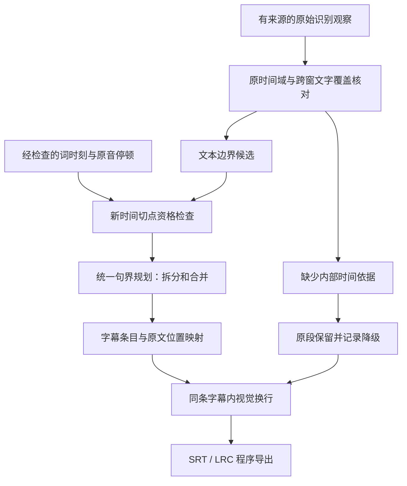

# 第十二阶段：句界、标点与时间依据重整——设计

日期：2026-09-05。基线 `9a4c2ea`；[需求基底](requirements.md)。本文为待实现设计，现有产品行为以[实证记录](records/2026-09-05_T-SEG-00_diagnosis.md)为准。

## 1. 已确认的原因

| 层 | 本例事实 | 结论 |
| --- | --- | --- |
| 原始 ASR | 2.50～16.59 秒连续 28 字、16.59～24.96 秒连续 38 字，均没有句读标点 | 原始句界信息不足已发生在模型输出，formatter 没有删掉这些标点 |
| 拆段 | `ceil(14090/7000)=3`；`ceil(8370/7000)=2`，即使文字未超长也强制拆 | 本例触发因素是时长上限，不是 42 字行长或 84 字条目上限 |
| 切文本 | `partitionText` 以接近平均字数为主，标点仅减 0.25 分；`Intl.Segmenter` 只使用 grapheme 模式 | Unicode 字符完整不等于词句完整；有标点也不能保证优先选真正句界 |
| 分配时间 | `assignProportionalTimings` 用每部分字符数占比分配原段时长 | 7.029、12.061、20.775 秒没有对应独立声学测量 |
| 再合并 | 本轮 `shortCueMergeCount=0`；通常情况下 `joinCueText` 仍会对 CJK 使用空分隔 | 不能把本例归咎于短句合并；但裸拼接是另一项仍需修正的规则 |
| LRC | 直接输出 canonical 起点；内换行换为空格，毫秒向下量化到百分秒 | 7.029 → 7.02 是格式投影；主要误差已在 canonical 之前产生 |
| 验证 | 当前测试强调时长/字数上限、字符守恒、Unicode 与 parse-back | 未覆盖“合法日语句界”和“新增切点来自哪里”，通过测试不能证明可读性 |

主要定位：`electron/main/local-subtitle/subtitle-post-processor.ts:1426`、`:1496`、`:1555`、`:1631`、`:1660`；`server-contract.ts:424`；`subtitle-formats.ts:74`、`:257`；`test/local-subtitle/subtitlePostProcessor.test.ts:1144`。行号对应本轮基线。

这是两个因果层叠加：原始 ASR 没有给出充分句界，当前整形器又主动制造了错误切点。上阶段处理输入音量和较长 cue 被合并的问题，并未替换这套拆分设计。`estimatedTiming=true` 只记录了风险，没有消除用户导出成品中的错误。

## 2. 参考项目：学什么，不能据此推断什么

本地参考实际位于 `C:/Users/Administrator/Documents/GitHub/temp/subtitle_tools/`。文件名中的下划线不是目录分隔符。

- `faster-whisper-GUI-main` 标记 GUI 0.8.5、faster-whisper 1.1.0。`faster_whisper_GUI/transcribe.py:231` 调用模型并转交解码参数，`seg_ment.py:6` 保留 segment 的原始文字和时间；`transcribe.py:624` 在没有 words 时直接导出段文本，有 words 时可输出增强 LRC。这个普通路径没有 FusionKit 的 7 秒字符比例重切。库版本标记和当前参考源码不能反推用户历史运行的模型、参数或是否用过其他处理。
- FineSub 0.5.0 的 `src/finesub/speech/postprocessing/segmentation.py` 与 `docs/segmentation-split.md` 使用词流、停顿、标点与有界动态规划，允许跨 ASR 段接缝重新组织；没有词时间时，`_ensure_minimum_word` 把整段保留为明确标记的单个合成单元，并没有捏造内部词时刻。这里值得学习的是分层与证据条件，不是照抄参数或其测试分数。
- faster-whisper 上游支持词时间并在 VAD 后用分段映射还原原始时间，适合作为 Q-01 候选；“有 word 字段”不自动等于日语完整词或准确发音边界。[官方实现](https://raw.githubusercontent.com/SYSTRAN/faster-whisper/master/faster_whisper/transcribe.py)、[时间映射](https://raw.githubusercontent.com/SYSTRAN/faster-whisper/master/faster_whisper/vad.py)。
- Whisper 的日语 token 分组可按 Unicode 解码单位产生，仍需要词/短语边界保护；不能打开词时间戳就宣布日语断句完成。[上游 tokenizer](https://raw.githubusercontent.com/openai/whisper/main/whisper/tokenizer.py)。
- 当前固定 whisper.cpp 请求/时间域约束继续保留。不能直接把 VAD 请求的 `token_timestamps` 改成 true，也不能用一个固定偏移量修复删静音后的词轴。[固定版本 server](https://raw.githubusercontent.com/ggml-org/whisper.cpp/f049fff95a089aa9969deb009cdd4892b3e74916/examples/server/server.cpp)。

## 3. 选择的总体方案

先建立统一句界计划，再做显示换行和格式投影；“哪里能断”和“在那里断的收益”分开。保留 ASR 文字与时间证据，读速/行长不能创造证据。

第一批先让默认后处理停止制造本例的三处词中截断，不新增模型请求。这是能单独验收的改进，但长原段仍缺少标点时不能称本阶段全部完成。

第二批在限定输入上选定可用的时间来源，然后接入同一规划器，解决缺少句界的长段。接口先定义“需要什么证据”，不预先承诺尚未测试的引擎质量。Q-01 结束后必须确定采用路径或写明两者未通过；不继续无上限试参数。

## 4. 内部数据与操作边界

新结构先留在 main，不把原始路径、音频或大块词轴送入公共 IPC。现有 canonical 继续由主进程形成。

| 结构 | 必需字段与约束 |
| --- | --- |
| `SourceRun` | `id`、`revision`、原始 `text`、有序 `observations`；观察含窗口身份、原始段序号、原媒体 `startMs/endMs`；保留原文，不对源文本 NFKC 后再回填 |
| `TextSpan` | `runId`、`startGrapheme`、`endGrapheme`，半开区间；建立一次 grapheme 到 UTF-16 索引映射，不混用两类下标 |
| `BoundaryCandidate` | `offset`、`kind=sentence/clause/lexical/unknown`、`evidenceRefs`；可选 `timeAnchor`；没有时间来源的文本标点不能自带时间点 |
| `TimeAnchor` | `domain=original_media`、原始 PCM 身份、producer/version、源词/段引用、`leftEndMs/rightStartMs`；两端顺序、媒体范围及词文字位置必须通过检查 |
| `CuePlanItem` | 有序 `sourceSpans`、`startMs/endMs`、`timingKind=native_segment/aligned/segment_fallback`、`boundaryRefs`、限定标点插入；不由自由文本重建源文 |
| `BoundaryReport` | 策略版本、切分/合并原因、原段保留数、未解析句界数、增加的推理次数；用于任务说明与验收，不写进字幕台词 |

拟定 `sentence_readable_v2` 为新的整形策略身份，与原生 server HTTP 合同分开。第一期 canonical 字段仍使用现有 schema；来源细节保留在主进程报告。需要公开新增字段时单独升级严格验证和桥接合同，不使 renderer 通过任意字段伪造词轴。

必须保留三个不变量：

1. 每个被接受源文位置按顺序且恰好消费一次；跨窗同一观察的去重先有音频重叠与文字映射证据。归一化指纹只能用于比较，不能当成精确覆盖证明。
2. 排版只能插入白名单分隔或换行；原有标点、数字、专名和符号不可删除。句界恢复不能通过“剥离所有标点后一样”掩盖原有标点被误改。
3. 新 cue 时间引用锚点；无锚点只允许原段回退。不能把父段长度均摊给子句，不能把后半句一并提前到父段起点。

## 5. 候选边界与统一规划

### 5.1 先判断资格

- grapheme 完整只提供最低 Unicode 安全。日语用语言分词产生候选，再结合功能词附着、标点及上下文；`Intl.Segmenter('ja', word)` 可作候选生成器，但不能单独当语义真值。
- 原文句末标点、分句标点是文本证据；模型原段接缝是已有时间观察；词间停顿是声学线索。长停顿不自动证明 VAD 两侧是两个完整句子，也不能从空 ASR 反推静音。
- 给“そ／うだ”“誰／だ”“そな／た”建立明确禁止断点的回归样例；同时用人名、数字、助动词、英文单词和结合字符反例防止只修这三个字符串。
- 新的时间条目切点必须同时有允许的文本边界和已验证时间锚点。只有标点没有内部词轴时可改善显示分隔，仍保留原段时间。

### 5.2 再选择组合

使用有界动态规划同时选择拆分与合并。评分采用明确优先顺序：违反文字覆盖/时间证据/词内禁切的候选不可用；在其余候选中先减少被拆坏的语义单元及跨越有证据的长停顿，再比较显示目标溢出与条目碎片数，最后比较行长均衡。不得再用 0.25 的标点奖励去与字符平均距离竞争。

计算块最多 60 秒或 2048 个候选文本单元；单条候选最多向前考察 256 个允许断点，达到界限时在已有安全锚点处分块；没有可用锚点则整段回退，不在数组下标处强切。复杂度界是工程上限，不声称该剪枝保证全局数学最优。

ASR 段接缝是可保留的原时间观察，不自动成为必须断句点；跨段重组须保持所有源位置引用。跨 root window 的文字取舍仍先由已有覆盖与重复规则处理，若结果存在未决冲突，不把两套候选拼成一句。

### 5.3 短句连接与标点

连接关系必须显式为：

| 关系 | 处理 |
| --- | --- |
| 同一个词/短语的续接，且来源和时间支持 | 按语言连接，日文可无空格；不得在两个完整独立回答间使用此关系 |
| 已确认的分句或独立短句 | 默认保持分隔；同 cue 时保留原标点，无原标点时用一个空格作为中性分隔 |
| 未知 | 保留已有条目，不主动裸拼接 |

第一版不依赖新云端模型恢复标点。优先消费 ASR 自身的句读；没有标点时，只有文本边界和原音停顿共同支持的地方才插入中性空格。不能按“每遇到だ就补句号”等正则猜句。问号、句号的语义恢复与词句重识别分别验收；如果 Q-02 表明现有本地来源仍不够，登记具体残留样例，不能把一整串无分隔长句算作完整通过。

未来独立标点模型只能返回 `{offset, insert}` 操作，`insert` 属于配置允许的标点集合；回放原文产生结果，不接受自由改写文本。此扩展不作为第一期实现前置。

## 6. 时间来源的限定选型

| 路径 | 要验证的价值 | 主要代价与限制 | 选择规则 |
| --- | --- | --- | --- |
| A：现有 whisper.cpp 独立非 VAD 局部词轴候选 | 复用原生资源，在保留静音的短窗口获得文本位置与时间；仅同文映射通过的片段用于断句 | 复解码可能改变文字；词轴质量仍待测；必须与原 VAD 上下文隔离，不能偷开现有 VAD token 开关 | 若三个输入的目标句界和时间检查都通过且无新漏词/音效误报，优先选依赖较少的 A |
| B：faster-whisper 本地候选 | 同一条识别路线输出段、标点及映射词轴，直接检验用户参考路线的可行性 | 新模型格式、Python/CTranslate2/CUDA 资源；目前不能假定与用户历史 GUI 输出相等，也不能假定适用于 Metal | A 未通过而 B 通过时，选择受管 Windows 能力并补生产资源任务；不全平台切换 |

输入固定为：本次 0～55 秒、既有 B 30 秒、B-noise 18 秒。每条候选每个输入一次，不复制参考文字作为 prompt 或固定答案；参数、模型与版本固定后运行。词句变化按独立 ASR 候选记账，不混入标点补丁。第一轮不把不同候选的少量正确词人工拼成一种不存在的默认模式。

检查：每个实际产生的新增句界有文本与时间依据；词在父区间内、顺序与覆盖一致；长静音恢复正确；B 不丢掉已改善主体，B-noise 不增加词；首次词跨度过长、零时长、窗口边缘敏感和不同文本均明确拒绝使用对应锚点。结构检查通过后还需试听所用新切点，不能以强制对齐成功证明台词存在。

如果两个候选均通过，比较新增实测耗时、峰值内存/显存、安装资源和平台覆盖，以满足质量门后的低成本路线优先。如果都不通过，保留第一期的确定性修复、记录 Q-01 未解决；下一次只针对失败原因修改方案，不虚报完整改善。

faster-whisper 的 GPU 与打包边界以官方资料为准：[CTranslate2 硬件支持](https://opennmt.net/CTranslate2/hardware_support.html)。独立强制对齐也有语言模型和无法对齐文本的限制，因此 WhisperX 不作为本轮默认叠加依赖。[WhisperX 官方限制说明](https://github.com/m-bain/whisperX)。

若选 B，不复用 GGML 模型路径或把新 engine 冒充 `whisper_cpp`；须增加版本化能力、受管资源、下载/删除/验证与取消清理任务。Q-01 得出 B 后，先把其资源清单、协议和具体任务回写本设计再实现；不能藏在一个“添加适配器”任务内。非 Windows 保持当前引擎和安全后处理。

## 7. 显示限制、降级和兼容

- `7000 ms / 84 chars / 42 chars` 保留为默认显示目标。原 `maxCueDurationMs/maxCueChars/maxLineChars` 的历史持久化键可继续读取，任务必须记录新策略版本；产品标签分别改为“建议单条时长”“建议单条字数”“建议每行字数”，说明“优先保持句意和时间依据，部分条目可超过建议值”。不暗改用户保存数值。
- 格式硬限制继续使用 `LOCAL_SUBTITLE_LIMITS` 的 4096 字/条、1024 字/行、4 行/条及文件上限。软目标无法满足时不得通过虚构时间段满足它；确实超出硬限制且不能形成合法产物时返回 `limit_exceeded`。
- 视觉换行只作用于已确定的一个 cue；在词/短语边界处分行，允许超出建议行长。LRC 将同 cue 视觉换行投影成单空格；SRT 保留 LF。长句是否需要不同时间条目已在此前完成，不由 formatter 决定。
- 时间数据缺失/无效、增强超时：原始有效段进入 `segment_fallback`；任务完成说明为“有 N 段保留原始分段，尚未确认内部句界”。只有结构化计数进入任务详情，不把调试日志暴露给用户。没有有效原文仍沿用 `no_speech_detected`；真正取消进入 cancelled，不触发回退导出。
- 提示显示在现有任务详情与高级参数说明，不新增质量工具页面。任务排队、运行、取消、失败、完成动作沿用现有入口。四语言检查及真实 Electron 验证覆盖说明可见、长文换行、重试与取消状态。
- 低音量处理和原音回退继续有效；Q-01 若更换解码路径，须重新证明 B/B-noise 的结果，不能把旧引擎改善自动视为新路线的改善。
- 翻译仅消费最终已导出的稳定 cue 及其 ID。历史字幕或旧翻译检查点不因新策略自动修改。

## 8. 不采用的修法

| 修法 | 不足 |
| --- | --- |
| 把 7 秒调成 15 秒 | 本轮实际回放确实消除三个硬切，但变回两条缺标点长串，起点仍不能分别对应各短句 |
| 只提高标点权重 | 无标点长段没有可选句界，时间仍不能按比例分配 |
| 每条末尾补句号或 CJK 全加空格 | 会把残词包装成句子，或破坏一个词；段内部多句仍无法恢复 |
| 关闭 VAD | 已有非语言音效幻觉反例；这不是分句算法修复 |
| 直接使用 VAD 的 token 时间 | 固定 runtime 的压缩时间域问题未解决，会重引累计错轴 |
| 让翻译模型同时修时间和台词 | 本地转写单独使用时仍坏，且破坏已建立的翻译结构合同 |
| 完整切换引擎或增加对齐器后继续使用旧整形器 | 旧整形器仍能把更好的原始结果切坏；必须先替换错误规则 |

## 9. 代码落点与需求追踪

以下是后续实现落点，本轮均未修改。

| 文件/范围 | 责任 | 需求 |
| --- | --- | --- |
| `electron/main/local-subtitle/cue-boundary-planner.ts`（拟新增）及 `subtitle-post-processor.ts` | 原文位置映射、候选资格、统一规划、原段回退，移除比例切时与默认 CJK 裸合并 | R-SEG-01、R-SEG-02、R-SEG-04、R-SEG-05 |
| `electron/main/local-subtitle/speech-timing-evidence.ts`（拟新增） | 时间来源合同、原始时间映射、锚点可用性检查 | R-SEG-03、R-SEG-04、R-SEG-05 |
| `server-contract.ts`、`server-supervisor.ts`、`production-executor.ts` | 仅在能力选型通过后接入有界候选，现有 VAD 保护继续生效 | R-SEG-03、R-SEG-07 |
| `src/type/localSubtitle.ts`、`src/type/localSubtitleIpc.ts`、本地转写配置与任务详情 | 策略身份、显示目标解释、降级计数、配置兼容；新增公开字段同步严格校验 | R-SEG-01、R-SEG-06 |
| `electron/main/local-subtitle/subtitle-formats.ts` 与 artifact handoff | 同计划 SRT/LRC 投影，交接稳定条目；按问题证据决定是否需要改 formatter | R-SEG-06 |
| `test/local-subtitle/`、`src/type/`、配置/页面测试、四语言 locale | 语言边界、证据缺失、实际导出、配置兼容及回归 | R-SEG-01～R-SEG-07 |
| `scripts/local-subtitle/benchmark/` | 无私有素材的试验驱动；私有音频/转写仍写 `test-results` | R-SEG-03、R-SEG-07 |

## 10. 验收门

机器规则不是听感正确性的替代：首先证明已知三处错误切法为零、字符与原有标点覆盖无变化、每个新起止可追踪、两个格式使用同一结果，再听校默认导出文件。

完整阶段提交前检查本文件列出的全部真实素材。开头五组内容均可区分，不要求机械五条；句中突然断字、无分隔连写、后续完整短句被提前数秒展示均为失败。参考中的字词差异由听感单列记录，不强行通过修改台词去匹配参考。

时间验收先标出可听清的边界范围，标注来源为新一轮原音听校；旧听校包的自由前后拖动和参考 LRC 起点不转成真值。采用新时间依据的开头关键起点须落入标注范围外扩 300 ms 内，且不得新增超过 1 秒的明显提前/滞后；听不清的边界列为未决，不纳入精准对齐通过项。这些为本阶段提议门槛，尚未达到或由用户听校确认。

原阶段 A/B/C、B-noise 和独立全轨用于检查新漏词/复读/音效误报；报告所有回退及残留样例。最终需要实际打包应用点击转写生成 SRT/LRC、接入翻译协议回归，并在人工验收处停下。
