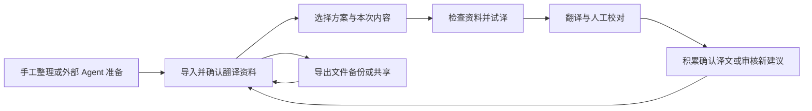

# FusionKit 字幕 AI 翻译增强设计 V3

> 从「选资料、试译、校对」到可维护、可交换的翻译知识。

日期：2026-09-14

范围：字幕工作台、独立字幕 AI 翻译工具、应用级翻译资料管理、外部知识文件协议。

状态：后续开发设计，尚未实现；文中的界面、协议及工具名称为拟议契约，不代表当前应用已支持。

基础：[V2 设计](./FusionKit_AI_Translation_Design_V2.md)及本地代码基线 `2d0e8ae`。保留 V2 作为讨论背景；本功能后续以本篇的产品决策为设计基线。协议发布前以本篇为规范草案，发布后以同版本 Schema、语义校验器和兼容性样例为唯一机器契约。

## 阅读导航

| 读者 / 目的 | 建议阅读 |
| --- | --- |
| 理解产品、判断是否易用 | §1–§4：目标、概念、使用流程和界面 |
| 开发翻译增强 | §5–§7：生效规则、执行链路、校对积累 |
| 开发知识管理和导入导出 | §8–§10、附录 A/B：管理、文件协议、导入事务、字段与示例 |
| 制作供外部 AI Agent 使用的 Skill | §11、附录 A/B：工作流、交付要求和文件契约 |
| 排期、实现和验收 | §12–§14：代码落点、分期、验收与效果评测 |

## 1. 产品目标与关键决策

### 1.1 要解决的问题

字幕翻译的质量问题不只有「模型不够强」：不知道作品背景导致指代错误，同一专名反复换译法，把主播习惯施加给游戏角色，长视频前后用语不一致，人工改过的译文无法复用，资料越来越多却不知道哪些真正生效。

本设计提供一个本地闭环：



用户不需要理解 RAG、向量索引、Prompt 编译或置信度校准，就能完成常见任务。资料维护者和开发者仍能看到具体条件、来源、版本与使用记录。

### 1.2 本版确定的决策

| 问题 | 本版决策 |
| --- | --- |
| 平时如何组织 | 按人物、作品、领域查看资料；一个资料集可以关联多个对象 |
| 翻译时如何使用 | 选方案或选内容资料，程序只取本次相关且可用的条目 |
| 知识如何携带 | 一个自包含的 UTF-8 JSON 文件，扩展名 `.fktk.json`；首版不依赖 ZIP、外链附件或云服务 |
| Markdown 的角色 | 人类可读报告、资料预览和模型输入的呈现方式；不是唯一事实来源或正式导入协议 |
| 什么属于知识 | 背景、术语、表达习惯、参考译文、翻译规则；可连同风格和方案一起导出 |
| 谁能批准知识 | 本机用户的明确操作；外部文件只能携带来源声明，不能替接收者授予信任 |
| 如何学习 | 默认关闭自动积累；用户开启后，仅明确确认的译文直接积累，AI 推导另进待审核 |
| 如何提升质量 | 先解决范围、术语、上下文、格式与校对闭环，再依据评测增加检索复杂度 |
| 两个翻译入口 | 共用独立的知识能力契约，各自保留输出格式、生命周期与恢复实现 |
| 是否需要云 | 不需要。无账号、同步、在线资料市场、云知识库或远程检索服务的前置依赖 |

### 1.3 非目标

首版不做模型微调、自动说话人识别、任意关系图谱、网页自动订阅、向量数据库、自动合并多方知识分支、无审核的机器译文回灌，以及根据模型自报分数自动批准规则。保留扩展能力，但不为这些能力提前堆建基础设施。

资料检索、管理、校验和导入导出离线可用。调用用户配置的远程翻译模型仍需要网络；「本地知识」不代表相关资料永不发送到模型。

## 2. 统一概念：让用户只记住必要的名称

### 2.1 产品词汇

| 用户看到的名称 | 含义 | 示例 |
| --- | --- | --- |
| 内容对象 | 在讲谁、哪个作品、哪个领域；内部称 `Subject` | 某主播、某游戏、前端开发 |
| 资料集 | 可以独立维护、选择、分享的一组条目；内部称 `Collection` | 游戏官方译名、个人译名、某系列校对记录 |
| 资料条目 | 一条背景、术语、表达习惯、参考译文或规则 | `checkpoint → 存档点` |
| 翻译风格 | 希望译文如何表达 | 自然口语、克制书面语 |
| 翻译方案 | 可复用的资料选择、风格与要求 | 某游戏实况 · 日译简中 |
| 本次要求 | 这次希望怎么译 | 保留原文的反问语气 |
| 内容说明 | 这次在讲什么 | 此片段从角色争论之后开始 |
| 待审核 | 尚未决定是否采用的导入或学习建议 | 从校对稿提取出的新术语 |
| 知识包 | 用于交换或备份的文件 | `game-x-ja-zh-Hans.fktk.json` |

「知识包」是文件容器，可以装一个或多个资料集，不是必须再维护的一级文件夹。用户不需要先创建包才能录入术语。UI 用「参考译文」，工程中可用「翻译记忆 / TM」。

### 2.2 关系与所有权

```text
内容对象：游戏 X ──关联──┐
内容对象：主播 A ──关联──┼─ 资料集：A 的游戏 X 实况资料
                       │    ├─ 背景
                       │    ├─ 术语
                       │    └─ 参考译文
                       └─ 资料集：游戏 X 通用译名

翻译方案 ──引用── 资料集 + 内容对象角色建议 + 风格 + 翻译要求
知识包   ──携带── 所选资料、完整依赖及可选方案
执行快照 ──冻结── 本次解析后的内容、版本、范围和实际使用记录
```

每条条目唯一归属一个资料集；在多个对象页出现只是关联视图，不复制多份。对象与资料集的关系不自动启用资料；分类标签也不充当使用条件。

例如，人物 A 与游戏 X 都关联同一句参考译文，并不表示仅选择 A 时就应该使用它。能否使用由条目范围决定（§5）。

### 2.3 五类条目的边界

| 类型 | 回答的问题 | 能做什么 | 不能暗含什么 |
| --- | --- | --- | --- |
| 背景 `context` | 这段内容在讲什么 | 提供消歧事实、场景说明、被转述的说法 | 角色台词必然是真实事实 |
| 术语 `term` | 这个词在这里怎么译 | 专名、别名、指定译法、保留原文 | 全语种通用、反向翻译也成立 |
| 表达 `expression` | 原文这类说法是什么语气 | 解释反讽、习惯表达及合适例译 | 原文没说也给每句添加口癖 |
| 参考译文 `memory` | 相近语境下，确认过怎么译 | 少量句对帮助措辞与一致性 | 相似度高就可以直接覆盖新译文 |
| 翻译规则 `rule` | 遇到明确条件时怎么处理 | 保留敬称、人称处理等明确约束 | 执行脚本、改字幕协议、调用外部工具 |

人物的「说话习惯」默认属于表达资料；「请忠实保留原文已有的口吻」属于风格/规则。描述不会自动变成指令。首版参考译文只作参考，即使原文完全一致，也不绕过当前术语、语境和输出校验直接粘贴。

## 3. 用户使用路径

### 3.1 第一次使用：不建资料也能翻译

1. 导入字幕，选择模型与目标语言。
2. 方案默认「不使用资料增强」，风格默认「忠实自然」（对应现有翻译原则，不额外启用知识规则）。可直接开始。
3. 在「翻译资料」旁提供「导入知识包」和「新建资料」；说明为「帮助统一人名、术语和作品背景」。
4. 导入完成后提供「用于本次翻译」。这只修改当前草稿，不自动修改应用默认方案。

增强功能不阻碍原有翻译。默认界面不出现资料版本、检索 K 值、Embedding 或必须填写的来源表单。

### 3.2 准备一个长期系列

1. 在「翻译资料」创建作品，录入少量必要背景和术语，或导入外部 Agent 生成的知识包。
2. 选择需要的资料集和一个风格；可以将人物加入内容对象，但需要进一步声明角色。
3. 对当前文件明确说话范围：单人内容、已有说话人映射或选中字幕范围；未知时保持未知。
4. 试译一段有专名、长句、多人对话的片段，查看原译对照和命中资料。
5. 满意后保存方案。方案可以记住「建议 A 为说话者」，不能把当前文件的 cue ID 或「全片都是 A」的确认复制到下一文件。
6. 后续打开新文件，选择方案，确认本次内容和说话范围后开始。

### 3.3 翻译、校对与积累

1. 点击「检查资料」得到冲突与预算摘要；开始翻译时也执行同一检查，不强迫用户先点一次。
2. 翻译完成后按「待校对」「术语疑点」「全部」查看结果。机器完成与人工确认分别标记。
3. 用户编辑并保存是一次修订；「确认译文」是明确接受当前源文/译文版本的另一个操作。
4. 已开启「积累确认译文」且选定目标资料集时，确认动作写入参考译文。未开启时只确认字幕。
5. 「从已确认片段提取资料」独立操作，先显示片段数量和模型，再生成待审核建议；不让一次确认隐式触发多次付费模型调用。
6. 批量确认明确显示数量、筛选范围和积累目标，不用「任务完成」或「导出成功」代替确认。

### 3.4 分享与恢复

分享：选择资料集 →「导出知识包」→ 默认只带可用资料和必要依赖 → 检查来源摘录/参考译文 → 保存文件。

备份：选择「备份全部翻译资料」→ 包含候选、归档、风格、方案和通用偏好模板 → 保存文件 → 在新安装中导入，预览后批量确认需要恢复使用的资料。

备份的承诺是恢复知识内容与组织关系；不包含模型密钥、字幕文件本体、任务断点、全部历史执行快照，也不代表整应用备份。原设备的审核记录作为来源说明保留；新设备由当前用户重新授予使用信任。

## 4. 信息架构与交互设计

### 4.1 入口与页面组织

新增应用级入口「翻译资料」，两个字幕工具的资料区均可直达。首版不重排整套工具导航。

管理页顶层只有三个视图：

| 视图 | 主要内容与动作 |
| --- | --- |
| 资料 | 按内容对象浏览，按类型/资料集/语言/状态筛选；录入、导入、导出 |
| 方案与风格 | 复用方案、基础风格、通用翻译偏好；复制与编辑 |
| 待审核 | 导入待确认、提取建议、证据变动；对照、采纳、拒绝 |

资料视图：左侧为对象列表，主区为条目列表，详情按需打开侧栏。提供「全部资料」和「未关联对象」。资料集通过筛选器及管理菜单维护，不再并列一套树形导航。对象类型保持人物、作品、领域、其他四类；标签是浅层补充。

列表主信息为「原词/标题 → 译法/摘要」，次信息为语言、范围、状态、来源。来源与版本详情展开后看，避免每一行都放十个徽标。状态不能只靠颜色表达。

新建术语最少填写原词和译法；语言继承当前资料集推荐值，范围继承当前对象，保存前显示摘要。继承只是表单初值，保存时必须实体化为条目字段；以后改资料集默认语言不重解释旧条目。

### 4.2 翻译配置的渐进展开

```text
模型            [现有模型选择器]
翻译方向        [日语 → 简体中文]
翻译方案        [游戏 X 实况方案 ▾]  [保存为方案]

翻译资料        [游戏 X] [主播 A]    [调整]
                使用 2 个资料集 · A 的说话范围尚未确认
翻译风格        [忠实自然 ▾]
本次翻译要求    [可选：希望如何表达……]
本次内容说明    [可选：这段内容在讲什么……]

▸ 更多设置：资料集、角色与范围、通用偏好、确认后积累

检查摘要        8 条术语命中 · 3 条参考译文 · 1 项需处理
                [查看详情] [试译所选片段] [开始翻译]
```

初次进入时不显示伪造的命中数量，显示「检查后显示」。对象标签只表示选用意图；展开摘要显示实际资料集和未映射的角色。

「调整」面板允许选择资料集，列出每个集的语言和用途。选一个对象时推荐关联资料集，用户确认后把具体集 ID 存入配置；对象以后新增资料集不自动扩大原方案。

学习默认关闭；展开后选择「关闭」「确认后保存参考译文」，后者必须显示唯一写入目标。AI 提取由结果页单独触发。

### 4.3 试译、计划预览与问题处理

试译优先使用当前选中字幕；未选择时使用开头最多 20 条，并提示可以改选。试译创建独立临时结果，不写正式译文轨、不确认、不积累；显示真实调用用量。正式任务重新检查配置；只允许用户明确「采用试译结果」且源文/配置/快照均匹配时另行设计复用，首版不实现自动复用。

实际使用详情以「总览 → 批次/字幕 → 来源条目」逐层展开：

- 将发送的要求、核心背景、术语、参考译文及其适用字幕。
- 估算输入、输出预留、模型限制；顺序模式尚未生成的前序译文只显示预留，实际发送记录再展示内容。
- 被排除的原因和计数；可以按 ID 搜索特定条目为何未生效，不持久化每个批次对全库的笛卡尔积。
- 术语冲突直接并排显示原词、译法、作用范围、来源与受影响字幕。可仅本次禁用一条或明确选择译法；修改资料另走编辑操作。

阻止开始的情况：适用范围内两个强制译法无法确定、必需要求超预算、资源缺失导致方案不完整、语言需要明确、文件/配置版本过期。普通参考资料缺失或人物未映射时跳过并提示；不能因为没用上可选人物规则就阻止所有翻译。

批量翻译逐文件展示检查结果，可显式选择「仅开始可执行的 N 个文件」。同一批次中某文件的问题不能伪装为全批成功，也不能将该文件角色映射套给其他文件。

### 4.4 管理与导入中的错误状态

| 状态 | 页面行为 |
| --- | --- |
| 空资料 | 解释用途，提供导入、新建及一份明确标记的虚构示例 |
| 搜索无结果 | 保留筛选条件，提供清除筛选，不显示新手引导替换整个页面 |
| 资料停用/归档 | 从新任务候选中排除；现有方案显示影响摘要和修复入口 |
| 导入格式错误 | 给出文件名、JSON 路径、原因和修复提示；本地原数据不变 |
| 同 ID 内容冲突 | 展示差异，默认保留本地；可跳过、明确更新或另存副本 |
| 提交失败 | 保留导入预览与选择，明确是否已提交；可幂等重试 |
| 后台索引/积累失败 | 条目/字幕已保存的事实保持；显示局部重试，不让整个界面禁用 |
| 预览期间内容变化 | 作废旧提交令牌，刷新差异后重选，不悄悄覆盖 |

### 4.5 与 FusionKit 现有 UI 的一致性

采用[项目 UI 约定](../../.agents/skills/fusionkit-ui-design/references/visual-contract.md)：`ToolDetailLayout`、`ToolPageHeader`、`ToolPanel`、`ToolField`、`ToolConfigDisclosure`、`ScrollableDialog`。视图 Tab 沿用 `ClipPathTabs` 的 rounded/smoothCorners/sm；参数选择器保留其原语义。

面板正文以 12px 内边距、字段组 16px、工作区间 12px 为基线；列表正文自然换行、顶部对齐。桌面宽度足够时对象列表/主表/详情并列；窄窗口收起详情为受控侧栏，对象选择器折叠，主列表保留有效宽高。底部操作区不能遮挡最后一行；不套多层滚动表单。

导入/积累操作状态由页面控制器持有，不随侧栏收起、窗口变窄或 Dialog 退出动画丢失。键盘可搜索、选择、进入详情、取消并返回原焦点；异步更新不抢焦点。后续实现必须用真实 Electron 验收长词条、长来源、多人范围、深浅主题、窄窗口及四种 UI 语言；本篇没有将静态草图视作视觉验收。

## 5. 什么资料在什么时候生效

### 5.1 四个相互独立的维度

| 维度 | 规则 |
| --- | --- |
| 保存在哪里 | 应用本地资料仓库；保存于全局不表示全局生效 |
| 属于谁/什么 | `aboutSubjectIds` 用于关联展示；标签不限制翻译 |
| 什么时候使用 | 已选资料集 + 语言 + 主体角色 + 字幕范围 + 条目状态/本地信任 |
| 属于哪个版本 | 规划任务时冻结，恢复读原快照；新资料不改变旧任务 |

### 5.2 主体角色和字幕范围

人物/作品被选中后，绑定为「当前主题」「说话者」「被提及对象」。角色都是当前任务事实，不从资料名称自动推断。

主体条件采用 `requiredSubjects` 数组，**数组内全部满足（AND）**。每个条件指定主体和角色；`present` 表示该主体在当前 cue 范围内以任一已绑定角色存在。OR 场景首版分成两条范围明确的条目，不做规则表达式编辑器。

例：「主播 A 在游戏 X 中使用的专属昵称」：

```json
{
  "languagePair": { "source": "ja", "target": "zh-Hans" },
  "requiredSubjects": [
    { "subjectId": "subj-a", "role": "speaker" },
    { "subjectId": "subj-game-x", "role": "topic" }
  ],
  "condition": { "mode": "none" }
}
```

这里的 ID 只用于局部逻辑说明；完整文件使用附录 A 的 UUID。只选游戏 X、只提到 A、或 A 的说话范围未知，均不满足该条件。反之，人物姓名术语可使用 `present`，从而在被提及时帮助译名，但不会启动该人物的口吻。

绑定的文本范围在本地使用稳定 cue ID 集或可靠 speaker key；「全文说话者」须由用户在每个新文件明确确认。范围内读到游戏对白、联动或插入片段时允许设置例外。两个人物被重叠绑定为同一 cue 的确定说话者时，相关人物规则进入范围冲突，不能取最后一个。

编译必须保留 `entry → applicableCueIds`；批次混合说话者也不能把人物规则写成对全批生效的全局指令。角色/原文语义修改导致相应计划失效。

### 5.3 自然语言条件不能假装已经被机器验证

条目可带条件：`none`（没有额外条件）、`advisory`（仅作语义提醒）、`requires_confirmation`（本次需要用户确认）。如「仅适用于游戏 v2 的竞技模式」应进入最后一种，计划中显示条件卡片；用户确认具体 cue 范围后才生效，确认仅保存在任务快照。

术语义项 `sense` 帮助解释，但不是可执行谓词。同形词有多个可能适用义项时：如果都是建议译法，可作为有条件参考；如果涉及不同强制译法，必须确定范围/义项后执行。不能凭模型临时猜出一个义项，就声称强制冲突已解决。

### 5.4 语言与方向

知识文件使用规范化 BCP 47 标签，如 `ja`、`en`、`zh-Hans`、`zh-Hant`。所有条目必须声明准确语言对；首版不支持隐式通配、反向术语或自动简繁转换。语言对未知/混合时，只对已解析为对应语种的字幕使用相关知识，其余跳过并提示。

两个旧入口的语言标识由适配器映射。现有 `ZH`/`zh` 不能被静默当成所有中文变体：无增强时保留旧行为；新建增强配置要求选定简体/繁体，已知的迁移默认必须在摘要中可见。自由语言名称无法映射时仍可普通翻译，但不使用无法匹配的资料。

### 5.5 配置优先级不是一条覆盖所有内容的链

| 类别 | 处理规则 |
| --- | --- |
| 字幕结构与模型输出协议 | 应用固定规则，任何资料/风格都不能覆盖 |
| 目标语言 | 结构化配置为准，自由文本冲突提示修改 |
| 强制术语/规则 | 必须先满足范围、信任和冲突检查；与自由风格矛盾时不静默降级 |
| 表达风格 | 本次明确设置 > 方案 > 通用偏好；同层同维度矛盾必须明确选定 |
| 背景、表达与记忆 | 仅为证据/参考，不得增加原文没有的内容 |

首版不以资料集排列顺序暗定权威。两个同范围强制术语不同译法时必须明确本次选择或修订资料。优先译法之间冲突也应提示；没有用户选择时不强行加入互相矛盾的映射。

已确认术语优先于旧参考译文中的用词。被选中的同形强制术语，即使来源自称「官方」，也不能无条件覆盖用户本地修订。通用偏好仅影响字幕翻译，不扩散到文本翻译、文件名翻译或应用 Agent。

## 6. 翻译质量的执行链路

### 6.1 从配置到请求

```text
读取当前文件与增强配置
  → 解析语言、方案、资料选择和角色范围
  → 冻结可使用资源及本地采纳状态
  → 按候选批次、逐 cue 过滤适用条目
  → 按类型匹配/检索，保留来源与适用 cue
  → 去重和处理结构化冲突
  → 按完整请求预算分配内容；必要时缩小批次并重新匹配
  → 生成可解释清单与工具专属请求
  → 模型执行、协议检查、质量提示、修订提交
  → 用户校对确认后进入独立积累链路
```

### 6.2 首版检索策略

| 资料 | 选择方式 | 预算紧张时 |
| --- | --- | --- |
| 应用协议、语言、明确要求 | 固定加入 | 不截断；最小请求仍放不下则报错 |
| 适用且已确认的核心背景 | 固定、有长度上限 | 不静默丢弃；让用户缩短或取消核心标记 |
| 命中强制术语、强制规则 | 词面命中 + 范围检查 | 不被 Top-K 挤掉 |
| 相邻原文 | 受控的前后完整 cue，帮助断句/指代 | 优先保留有限邻近信息，不把整片原文注入 |
| 优先术语、补充背景、表达 | 词面/短语匹配与相关性排序 | 丢弃低相关项并记录 |
| 参考译文 | 先语言/范围过滤，再精确和字符片段相似检索 | 默认最多 3 条/批、允许 0 条；数值是初始策略，需评测 |
| 已提交的前序机器译文 | 仅顺序执行可用，明确未人工确认 | 低可信、可削减；并发不依赖未完成结果 |

英文按词边界处理，日中采用明确的字符/短语策略；不把空格分词当作全语言规则。NFC 规范化用于词面匹配；不默认使用可能混淆全半角/语义的 NFKC。术语分别支持完整词与字面短语，不开放任意正则。大小写规则必须存储，别名沿用同一策略。

FK-TK/1 的 `literal_phrase` 为 NFC 后的连续字面匹配，不删空白或标点；`whole_term` 额外要求命中两侧是文本边界或非 Unicode 字母/组合标记/数字/连接标点。日中连续文本推荐 literal_phrase，不把词边界失败自动降成更宽松匹配。忽略大小写时使用非 locale 特化的 Unicode case folding，算法/Unicode 版本固定在编译策略版本中；运行时升级不能重解释旧快照。表达的 sourcePhrase 首版采用 NFC、区分大小写的字面匹配。

相同位置的长短术语命中先判断是否兼容；「名称」与「名称扩展」的强制译法互斥时产生重叠冲突，不能简单用最长命中吞掉短术语。记忆排序同分按稳定 ID 决定顺序，避免数据库/并发顺序使预览漂移。当前待翻译 cue 自己的答案、试译结果及测试集答案不得成为隐式检索样例。

核心背景仅允许 `fact`/`reported` 且经本机采纳；不确定背景不能标记核心。被转述的话必须带转述标签。资料 `ready` 不保证内容真实，强制/核心的提升仍来自用户明确选择。

### 6.3 预算与成本

预算以工具最终 HTTP 请求的同一序列化路径估算，包含系统协议、结构化字段、转义、ID/保护标记、知识、当前字幕、输出预留及估算余量。主进程适配器负责 Token 估算，不在共享纯逻辑中假设两个输出协议字节相同。

先减低相关参考，再减可选上下文，再缩小批次；每次缩批重新检索和检查冲突。始终保留完整 cue 和条目，不切半个 JSON、字幕单元或规则。最小请求无法容纳时，显示「本次必要资料超出模型上下文」，提供减少核心背景、缩短要求或更换模型入口。

估算不是供应商实际 usage。单独记录翻译、试译、可选 AI 提取的请求数和实际用量；供应商未返回时显示未知。不得承诺「用了知识必然省 Token」或未经评测的质量提升百分比。

### 6.4 输出检查与结果侧体验

| 检查 | 失败行为 |
| --- | --- |
| 精确 ID 覆盖、重复/未知 ID、文本类型、大小、标记和格式约束 | 按原工具机制拒绝批次提交，使用其唯一有界重试拥有者 |
| 确定命中的强制术语未采用/保留原文失败 | 保留结构合法译文并标记待复核；不算人工确认，不用全文字符串替换修补 |
| 目标语言疑点、漏译/幻觉/语气漂移疑点 | 显示诊断及来源，不宣称自动检测完备 |
| 超长行、阅读速度或跨 cue 可读性问题 | 可给提示；翻译增强不擅自改时间轴、拆合 cue 或重排文件 |

语义检查与格式检查分离：合法 JSON 不代表好译文。首版不默认再调用一次模型检查全片；提供人工定点重译，显示将使用的资料和成本。人工已有译文被重译替换前必须显式选择范围；新结果仍待校对。

术语校验必须只检查其适用 cue 和确认义项。屈折变化等无法确定的情况标记「疑点」，不将简单子串检查包装为全语言正确性证明。

### 6.5 快照与恢复

每个计划保存 `snapshotId`、编译/检索策略版本、源文与配置摘要、语言对、角色和条件确认、解析后的风格/要求、条目不可变内容及摘要、冲突决策。每批保存实际使用条目与 cue 映射、预算舍弃原因，以及发送前冻结的动态前序参考。

恢复使用原资源快照和已持久化的请求输入，不重新读当前资料库。保存引用却覆盖旧条目内容，不满足这个要求。因存储损坏找不到快照时进入明确的恢复错误，只能修复或显式创建新计划。

并发任务共享同一冻结环境；未审核机器输出不能按 worker 完成先后注入别的批次。顺序模式按原文顺序提交后才更新低可信前序参考；失败批次不推进。新增知识只影响新计划。

快照证明输入可追溯，不保证外部模型逐字复现。资料快照属于长期追溯数据；不能借用旧工具完成后应删除的恢复临时文件来唯一存放它。

## 7. 校对、积累与审核

### 7.1 状态与本机信任分开

条目内容有 `candidate / ready / needs_review / rejected / archived` 生命周期。本机另存针对**准确版本与内容摘要**的采纳记录：手工确认、用户采纳导入、确认字幕产生的直接记忆；不存在从文件字段直接读取的本机批准位。

默认可信检索要求：`ready` + 本机已采纳 + 资料集选中 + 范围/语言满足。外部包中 `ready` 的条目导入暂存区仍显示「待确认导入」。候选可以完整保存和分享，但不能因信任整个文件就跳过候选审核。

| 事件 | 可以自动做什么 | 不能自动做什么 |
| --- | --- | --- |
| AI 翻译完成 | 保存未确认译文 | 写可信记忆、批准新术语 |
| 用户编辑并保存 | 保存修订，原确认失效 | 认为用户已最终认可 |
| 用户确认当前译文 | 若积累已启用，写一条准确范围的直接句对 | 将句中陈述推导为真实背景 |
| AI 从确认片段抽术语/口吻 | 生成独立候选并带证据 | 继承原句的人工批准 |
| 外部知识包导入 | 校验、差异预览、暂存 | 信任自带 `ready`、作者或模型自评分 |
| 用户采纳导入条目 | 对选中版本记录本机信任 | 信任同作者未来所有更新 |

### 7.2 确认译文的可靠写入

确认操作必须绑定 sourceRevision/sourceHash、目标译文版本/摘要、准确 cue/片段映射、语言、写入目标和当时授权。确认提交与学习事件持久化在工具自己的事务中完成；资源写入经应用级服务异步消费，不引入跨工具数据库事务。

幂等键包含 `tool + document/sessionId + alignmentId + sourceDigest + targetDigest + destinationCollectionId`。目标资料集改变属于新的明确写入选择。消费者重新检查当前确认仍有效和授权未撤销，才写直接记忆。事件重试、重启、重复点击不能生成重复句对。

积累失败不回滚已保存字幕，显示「译文已确认，资料积累待重试」。撤销确认与写入可能竞态，必须由有版本检查的消费/失效事件最终使旧记忆不可用，不能只在按钮回调里删一条记录。

独立字幕工具若尚无可持久化的逐句确认/编辑能力，不得以「翻译成功」补位。必须先实现最小校对确认会话，或仅提供原文+人工校对文件的对齐确认流程；能力不足时隐藏自动积累入口并说明原因。

### 7.3 外部校对稿与证据

外部文件先做原译对齐预览。稳定 cue ID + 同版本是优先证据；没有稳定 ID 时结合原文、时间与顺序，不能单靠相同行号。一对一明确配对才能直接积累；拆合并片段保留多对多映射和整体源/译内容，需逐片段确认，不伪造逐 cue 一一对应。

证据区显示出处、片段、说话人是否确定、作品/版本、确认来源和已有冲突。模型自评 0.99、多次重复生成、检索到同一句机器输出，都不算独立证据。网页只能说明来源内容，不自动证明推断为真。

### 7.4 审核动作与失效传播

待审核支持采纳、编辑后采纳、只保留参考译文、修改范围、拒绝、合并为新版本。批量采纳只作用于明确选中的低风险集合；涉及强制规则覆盖、主体范围扩大或冲突的条目从快捷批量集合剔除，单独确认。

确认原句后来修改/撤销：旧直接记忆停止用于新任务；其 AI 派生条目标记 `needs_review`。编辑被引用的来源摘录同样触发依赖资料复核，不能以「条目正文没改」保留原信任。已独立人工批准的规则不静默删除，但显示证据变化，并在复核前暂停用于新计划。批量变化需预览影响范围。

维护 `evidence → derivedEntry` 与 `entryVersion → taskSnapshot` 索引，支持「此条资料影响过哪些任务」及显式重译。历史字幕和快照不跟着资料改写。

## 8. 本地资料管理与维护

### 8.1 常用维护能力

首版必须支持对象/资料集/条目的新建、搜索、编辑、复制、停用/归档、来源查看；支持语言/类型/状态筛选、重复与冲突检测、受影响方案/任务查询，以及导入导出。编辑条目生成新修订，旧版本不可变；更新整个资料集推荐语言不改已有条目。

复制为新条目/资料集使用新 ID，可保留来源说明。按名称相同不能自动合并对象，不同作品里同名角色必须可并存。合并对象需显示并改写关联与范围，再重新校验冲突。

默认删除动作为归档。永久清除是独立操作，先列出方案、证据、索引、历史版本和任务快照影响；运行/可恢复任务仍引用时阻止或要求先结束相关生命周期。普通归档说明「历史记录仍保留」，永久清除不能仅删列表索引。

对象、资料集、风格、方案和偏好模板使用可移植的 `archived` 标记；条目用自身生命周期表达归档。归档对象会暂停需要该对象条件的资料；归档资料集会暂停其中所有条目；归档风格/方案不再供新任务选择。关联视图不因此删掉条目。取消归档是显式操作并重新检查依赖和本机信任；备份恢复保持这些标记，不复活停用内容。

### 8.2 本地存储设计

主进程拥有版本化资料仓库，先采用不可变 generation 文件 + current 指针 + 可重建索引。路径建议 `userData/translation-knowledge/`，不放入旧字幕工具或工作台私有数据目录。

存储层负责条目修订、本机采纳、导入记录、学习事件消费状态和快照内容；导出 DTO 不直接等于磁盘对象。索引损坏可以重建，不能把检索缓存当唯一数据源。单个大资料集可内部分片，但对外仍是同一个文件协议。

原子发布包含暂存、全量校验、持久化和 current 指针切换；保留上一有效 generation。进程崩溃或 Windows 替换失败后，读取者只能见到旧完整版本或新完整版本。发布已完成而确认持久化失败时保留提交身份并报告不确定，不能盲目重试制造副本。跨平台故障注入是验收要求，不以使用 `rename` 一词作为可靠性证明。

模型密钥、进程对象、路径能力令牌不写入知识包或执行快照。来源网页只存 URL 与必要摘录，导入和翻译不会自动访问 URL。模型数据区使用严格序列化，Markdown/HTML 展示不得执行脚本或加载外部图片。

## 9. 知识文件协议 FK-TK/1

### 9.1 文件形式与发布约束

协议名：FusionKit Translation Knowledge，简称 **FK-TK**。文件扩展名 `.fktk.json`，媒体类型使用标准 `application/json`，编码 UTF-8，导出无 BOM；导入允许 UTF-8 BOM 后立即移除。文件必须是单个 JSON 对象，无注释、重复键、NaN、尾随逗号或代码围栏。

`format = "fusionkit.translation-knowledge"`，`schemaVersion = 1`。协议版本独立于应用版本和本篇 V3。附录 A 为 v1 字段定义，附录 B 为可解析完整示例；不依赖任何未发布的在线 Schema URL。

第一阶段交付时必须同时提供：JSON Schema Draft 2020-12、本地语义校验器、正反例、CLI 和 Skill 引用副本。发布后 v1 含义不变；新增会影响翻译行为的字段/枚举升级到新 schemaVersion，并提供显式迁移。旧应用遇到未知版本拒绝提交，不尝试「尽量导入」。

所有核心对象默认拒绝未知字段。只有命名空间化 `extensions` 允许非执行性扩展；未知扩展原样保留并参与摘要，但不参与翻译/权限判断。不能用扩展绕开核心协议或把未来行为塞给老应用执行。

### 9.2 包含哪些内容

| 顶层字段 | 内容 |
| --- | --- |
| `format` / `schemaVersion` | 格式标识和协议版本 |
| `package` | 本次导出身份、名称、版本、用途、作者声明、时间与共享声明 |
| `subjects` | 内容对象 |
| `collections` | 资料集，包含关联对象和可选表单默认语言 |
| `sources` | 来源描述和必要证据摘录；不是网络抓取任务 |
| `entries` | 五类知识条目，包含当前内容、范围、状态、来源/派生引用 |
| `styles` | 风格预设，引用明确的规则条目 |
| `recipes` | 可复用翻译方案，不携带当前文件的 speaker/cue 确认 |
| `preferenceTemplates` | 可选择导入的通用偏好模板，不自动写入当前设置 |
| `extensions` | 可选非执行性扩展元数据 |

`purpose=share` 与 `purpose=backup` 使用同一结构与导入流程，差异只在导出选择策略。备份包含所有当前记录（包括待审核/归档）以及这些记录需要的证据修订闭包；不承诺全部历史修订时间线和历史任务恢复。以后的完整应用备份属于另一个契约。

### 9.3 身份、修订与完整引用

所有实体 ID 使用小写 UUID v4；由应用/Agent 本地生成，不取文件名、名称、条目位置或内容 hash。首次实体 `revision=1`，同一作者流的更新保留 ID 并递增修订；改名不改 ID。UUID 只是身份，不证明作者权威。

同一个文件中，每个实体的当前记录只能有一个；历史证据另存 `sources` 中的摘录/摘要，不在同一数组重复 ID。跨类型也不允许 ID 重复。实体引用在文件内必须完整且类型匹配，不通过本机已有资料或网络补齐缺项。

导出资料集/方案时，递归携带必要主体、来源、风格规则和方案引用资料集。界面先显示依赖增加的数量，用户可改为只导出资料、取消方案。为满足闭包而带入整个引用资料集时，必须明确显示其条目数量和隐私影响，不能暗中附上全部私人记忆。

`derivedFrom` 引用父条目的 ID、revision 和内容摘要，属于溯源声明，允许父条目正文不随包共享；但必须有一个随包 `source` 保存足够理解该推断的脱敏证据摘录。它不作为使用依赖或本机批准凭证。普通结构引用不允许这种例外。

内容摘要由应用/校验工具按 RFC 8785 JSON Canonicalization Scheme + SHA-256 计算。实体摘要包括该实体所有内容（含 ID、revision、extensions），不含外置本机信任；字段顺序和文件空白不改变摘要。不能用不同语言的随意 `sort_keys` 冒充完整 JCS。Agent 不需要手算摘要；涉及 `derivedFrom` 时由校验工具生成/核对。

包 revision 与实体 revision 独立：重新打包不能抬升所有条目修订。更大的版本号或更新的时间都不构成自动覆盖依据。字段/引用变化必须新修订，受影响的本机信任重新确认。

### 9.4 导出默认与隐私

分享默认仅导出本机已采纳且 `ready` 的选中条目及其必要依赖；参考译文默认不选，用户勾选后展示数量和摘录。候选、归档可显式纳入并保留状态；不能通过分享导出把候选改成 ready。

备份默认包含全部五类条目、对象、资料集、来源、风格、方案和偏好模板。原机审核说明可通过来源声明带走，不包含可让接收者直接信任的授权凭证。用户可生成一份人类可读 Markdown 概览，但正式往返只通过 JSON。

绝对路径、API key、账号凭据、临时 token、私有任务路径永不输出。包含字幕摘录的来源使用显示名与内容摘要；可能敏感的摘录不因路径已去掉就视为匿名。导出预览支持去除私人摘录，但若去除导致候选失去必要证据，则须一并排除该条目或降为 `needs_review` 的导出副本，不能篡改本机原条目。导出中实际修改的实体必须使用新 ID，并重新映射引用；保留来源说明，不制造同 ID/同修订不同内容。

### 9.5 协议校验顺序与初始限额

依次执行字节限制 → UTF-8/JSON 解析 → Schema → ID/引用完整性 → 语言/范围/类型语义 → 条目冲突与信任预览。不要把远程内容交给模型来「修复 JSON」后直接入库。

初始产品限额为单文件 32 MiB、全部实体合计 20,000、单文本字段 32 KiB UTF-8、嵌套深度 32、单个 extensions 64 KiB。来源长文应摘要后分条，不塞整本书。限额是实现与可用性起点，不是性能承诺；协议 Schema 与校验器共享常量，错误返回实际/允许值。未来资源限额可提高，字段语义变化仍须升协议版本。

字符串按 UTF-8 字节做附加限额检查；日期为有效 RFC 3339 UTC 时间，整数必须是正的 JS 安全整数。引用与 JSON 路径检测覆盖整包，限制错误输出最多前 100 项并给总数，防止大错误列表撑坏 UI。路径/URL 只为证据文本，不开放本地文件读取指令或网络副作用。

## 10. 导入、更新与备份恢复语义

### 10.1 导入是两步事务

```text
选择文件 / 拖入
  → 主进程校验并生成只读暂存区
  → 显示内容、依赖、来源、差异、风险和错误
  → 用户选导入项与冲突策略
  → 生成绑定文件摘要和本地 generation 的 importPlanId
  → 用户执行「保存待审核」或「导入并采用所选可用资料」
  → 检查本地版本未变，原子提交新 generation
  → 生成导入收据，提供「用于本次」和「查看资料」
```

选择范围发生变化时重新计算闭包。引用被跳过/另存副本/保留本地版本时重新解析并校验全部受影响的风格与方案；不能让方案仍指向已跳过的 ID。严格格式错误整包拒绝，业务冲突可以在预览中解决；不存在一边读文件一边逐条写库的导入。

`importPlanId` 绑定 owner、文件摘要、库 generation、用户决策和短期有效期。提交期间修改本地资料或换文件则计划过期。重复提交先查询已提交收据，再检查未提交计划的 generation，避免把成功提交后的正常版本推进误判为失败；同一计划返回同一收据。崩溃后根据已发布 generation/操作 ID 判断结果，不能依赖 renderer 内存去重。

### 10.2 冲突矩阵

| 情况 | 默认处理 | 显式可选操作 |
| --- | --- | --- |
| ID 不存在 | 新增待审核；ready 条目可由用户本次采纳 | 不导入 |
| 同 ID、同修订、同内容摘要 | 跳过，不重复、不改变现有信任 | 查看原条目 |
| 同 ID、同修订、不同内容 | 身份冲突，保留本地 | 另存副本；不直接覆盖相同修订 |
| 同 ID、不同修订、不同内容 | 显示差异，保留本地；版本高不自动获胜 | 明确采用外部版本或另存副本 |
| 不同 ID、语义完全/近似重复 | 提示，不按相似度自动合并 | 保留两份或选本地条目并映射依赖 |
| 文件未包含本地已有条目 | 不删除、不归档 | 删除必须单独操作 |
| 外部 archived/rejected 覆盖本地 ready | 保留本地，显示停用影响 | 明确采用停用状态 |
| 更新扩大范围/变更强制译法 | 从快捷批量采纳中排除 | 查看影响后单独确认 |

选择外部不同修订覆盖本地时，保留其导入原件用于溯源，并以本地 `max(localRevision, incomingRevision)+1` 发布新修订与新采纳记录；引用只按 ID 指向当前记录，历史证据按修订/摘要保存。选择副本时生成新 ID，包内依赖图统一重映射，最后再次校验。

没有共同基线时首版不做字段级三方自动合并。更新后的条目不能继承旧摘要对应的本机信任。相同内容重复导入也不能复活用户已经停用/撤销的条目。

### 10.3 恢复和撤销

备份恢复同样先预览，可以批量采用备份中 ready 的条目；candidate/needs_review/rejected/archived 保持不可用。方案和通用偏好模板可以恢复到管理列表，但是否设为默认、是否打开学习积累，须在本机单独操作。

知识导入回执记录新增、更新、跳过、冲突、状态和本机采纳数量。提供撤销本次导入：生成补偿修订/归档，仅对导入后未被再次编辑的条目自动补偿；已有后续编辑或新引用的条目先展示冲突。不能直接回滚整个数据库 generation 删除其他工作的修改。

资料恢复后到新文件翻译，必须重新绑定说话范围。备份包不包含本机执行快照，因此不会恢复历史任务断点，也不会把旧任务私有 cue 条件装成通用规则。

## 11. 供外部 AI Agent 使用的 Skill

### 11.1 交付目标

提供独立、可拷贝的 `fusionkit-translation-knowledge` Skill。外部 Agent 不需要启动 FusionKit、访问本机私有仓库、持有应用 token 或连接云知识服务，就能根据用户要求输出可校验的文件。

本次只设计 Skill 契约，不安装 Skill，也不将本文当作已实现的导入器。Skill 应在 FK-TK/1 的 Schema/校验器完成后随第一阶段一起发布，避免先分发无法导入的协议示例。

建议交付目录（后续开发产物）：

```text
fusionkit-translation-knowledge/
  SKILL.md
  references/
    protocol-v1.md                  # 字段、语义、版本策略
    knowledge-v1.schema.json         # 与应用校验使用的同版本 Schema
    research-and-evidence.md         # 来源、歧义、事实与推断的处理
  examples/
    minimal.fktk.json
    multi-subject.fktk.json
    update.fktk.json
  scripts/
    validate.mjs                    # 随包可运行，不要求安装 FusionKit
```

校验器须打包依赖，声明最低运行时，并与应用语义校验使用同一规范模块及一致性样例。不能只在 Skill 里粘一份随时间漂移的简化校验器。Skill 更新时列出支持的 schemaVersion 和自身版本；遇到用户现有更高协议文件，提示使用相应工具，不降级丢字段。

### 11.2 Agent 工作流

1. **理解需求**：确认作品/人物/领域、版本/平台、源/目标语言与变体、用途、用户首选译名，以及是否有现成知识包需要增量更新。可根据已明确的信息继续，关键同名歧义才询问。
2. **限定范围**：先做可用的小资料集。优先稳定人名、作品术语、必要背景；没有字幕材料就不编造「确认译文」。只被提及的人物不产出全局口吻规则。
3. **准备来源**：在工具和用户授权允许时搜索网页，优先官方本地化/原始资料，再参考可靠二手资料；记录 URL、访问时间、适用版本和必要摘录。搜索摘要与模型记忆不能标成「已核对原文」。
4. **区分内容**：人物说法标 `reported`，未证实内容标 `uncertain`；用户指定译法可记录为 `user_note`，不能伪称官方。冲突来源保留差异，无法消歧则生成候选或省略，不填模型概率骗过审核。
5. **结构化**：创建对象、资料集、来源和条目，设置精确语言对/角色/条件；先写候选。强制规则只有明确用户要求时才建议，仍需接收应用确认。
6. **更新已有文件**：保留已存在实体 ID；真正修改才提升 revision；新增实体使用新 UUID。未知扩展原样保留。不因重新生成排序就重建整包身份，更不能凭条目消失表达删除。
7. **本地校验**：运行同版校验器，修复 JSON、引用、语言、条件和冲突问题；它只能证明协议和已知语义约束，不证明网页内容属实或翻译质量。
8. **交付**：输出一个 `.fktk.json`，另附简短准备报告，列出范围、来源、尚未解决的疑点、候选/规则数量及实际校验结果。报告不塞进可执行指令字段。

无浏览器/搜索能力时，可以基于用户提供的资料生成包，但须说明未联网核对；没有可用校验运行时仍可输出草稿，并明确「未运行校验」，不能伪造通过记录。

### 11.3 可供用户复制的准备指令

> 使用 fusionkit-translation-knowledge Skill，为我准备「作品 X，指定版本」的日语到简体中文字幕翻译资料。优先整理人物姓名、常用专名和必要背景；已有中文官方译名优先，争议项保留来源和候选状态。人物习惯只在原文确有相应表达且说话人已确认时生效，不添加口癖。根据可访问的可靠来源核对，输出 FK-TK/1 的 `.fktk.json` 和简短说明；不要虚构参考译文、审核记录或资料来源。若我给了旧包，在原 ID 上更新并说明差异。

这段指令不代替 Skill 的 Schema 和校验器。协议文档不需要包含某个 Agent 产品的专有配置，使 Codex 等支持 Skill 的工具均可使用。

### 11.4 CLI 的拟议行为

```text
node scripts/validate.mjs path/to/game-x.fktk.json --json
```

退出码：0 = 无结构/语义错误（可能有警告），1 = 文件内容无效，2 = 工具/IO 错误。默认只读，不改文件、不访问网络、不导入应用。机器结果结构为 `valid`、`schemaVersion`、`errors[]`、`warnings[]`、`stats`；每项诊断含稳定 code、JSON Pointer path、可读 message。非法引用/条件等报错误；潜在译法冲突报 warning 并说明相关资料集/方案，允许官方与个人译名并存。只有实际任务同时启用、范围相交且命中相应原文时，冲突才阻止该任务；不能给出离线全局无冲突保证。

工具明确区分「协议合法」「来源已核对」「本机已采纳」三件事。校验通过并不授予后两者。

## 12. 与当前工程的衔接

### 12.1 已核对的实现事实

以下是本次静态代码核对结果；没有运行翻译实验或 UI 验收。

| 当前位置 | 已有能力 | 本设计需要增加 |
| --- | --- | --- |
| [`translation-contract.ts`](../../src/subtitle-studio/translation-contract.ts) | 工作台严格 Zod 配置，`instructions`、语言、批次/输出上限，checkpoint v1 | 独立增强配置版本、快照引用和错误分类；不能给 strict 对象偷塞新字段 |
| [`translation-planner.ts`](../../electron/main/subtitle-studio/translation-planner.ts) | 前后原文、顺序前序机器译文、完整序列化请求估算 | 增强解析、逐 cue 使用映射、预算反馈循环、知识清单 |
| [`translation-service.ts`](../../electron/main/subtitle-studio/translation-service.ts)、[`translation-recovery.ts`](../../electron/main/subtitle-studio/translation-recovery.ts) | 批次提交、恢复、用量；AI 结果写 `unreviewed` | 快照生命周期、结果疑点、版本化确认与学习事件 |
| [`StudioTranslation.tsx`](../../src/pages/Tools/Subtitle/SubtitleStudio/StudioTranslation.tsx) | 模型/语言/要求、单文件和批量规划界面 | 共用增强配置区、逐文件范围与资料检查；不把暂存 Dialog 状态当文档偏好 |
| [`subtitleTranslationPrompt.ts`](../../src/utils/subtitleTranslationPrompt.ts) | 旧入口区分原文与前序机器译文；`cues/lines` 输出协议 | 独立增强适配，不导入工作台类型 |
| [`useSubtitleTranslatorConfigStore.ts`](../../src/store/tools/subtitle/useSubtitleTranslatorConfigStore.ts)、[`checkpoint.ts`](../../electron/main/translation/checkpoint.ts) | 旧入口配置版本、任务恢复 | 显式迁移、旧任务不自动继承新知识、补齐确认能力 |
| [`automatic-translation.ts`](../../electron/main/subtitle-studio/automatic-translation.ts)、[`batch-service.ts`](../../electron/main/subtitle-studio/batch-service.ts) | 自动/批量入口与生命周期 | 全入口用同一解析语义，每个文件保留自己的冻结范围 |

工作台的源/译结构允许受控换行和内联保护标记；旧入口要求 cue 内文本行数/顺序保持。增强层不能统一输出协议来抹掉这个差异。两个入口的增强语义一致，不意味着逐字同译或请求完全一致。

现有 `reviewStatus` 字段不是完整人工确认功能的证明。本次读取的翻译服务只证明 AI 结果标为 unreviewed；校对提交、撤销确认、学习事件必须作为新增交付验收。

### 12.2 新增独立能力域

建议新增以下模块，命名以实施时目录约定为准：

```text
src/translation-knowledge/          # Schema、DTO、范围/冲突/检索/编译纯逻辑
electron/main/translation-knowledge/# 仓库、导入导出、快照、本机采纳、学习消费
electron/preload/translation-knowledge-api.ts  # 自有 allowlist 与 owner 校验
src/components/translation-knowledge/         # 共用配置表单，不读取工具私有 Store
src/pages/TranslationKnowledge/               # 资料、方案与待审核管理页
```

依赖方向：两个字幕域 → 中立知识契约/服务；中立服务不能反向 import 任一工具。工具适配器将各自 cue 转成中立文本单元，将自己的持久确认事件转成学习输入。模型调用、输出校验、字幕持久化和恢复继续由各工具负责，外部文件不获得这些能力。

中立接口至少包括：`validatePackage`、`planImport/commitImport`、`exportPackage`、`resolveEnvironment`、`selectBatchKnowledge`、`compileKnowledge`、`recordUsage`、`consumeConfirmedPair`。它们是职责名称，不要求一次建立巨大框架。纯编译输出结构化要求/参考及 cue 映射，由工具适配器放入自己的请求位置；不假设拼接几个 Markdown 标题就形成安全边界。

### 12.3 必须保留的项目边界

工作台[现有架构](../features/subtitle-studio/architecture.md)和[依赖清单](../../scripts/subtitle-studio/boundaries.json)禁止依赖旧字幕实现，包括旧 `src/utils/subtitle*`。因此不能直接把旧提示构造器接进工作台，也不能在「共享层」转发旧 Store/IPC。

应用级知识能力需要作为新的中立基础设施逐文件审查并加入真实依赖检查；不能放开整个目录或降低禁止规则来让检查通过。执行旧字幕移除演练，证明保留工作台和知识管理仍可运行。ASR 冻结副本、来源清单及转写链路不属于本次改造目标。

前序参考的来源、顺序提交、并发冻结和预算共用遵循[上下文来源避坑记录](../../.agents/skills/fusionkit-pitfall-guard/references/keep-subtitle-context-provenance-explicit.md)。知识快照持久化不得破坏现有任务完成后的恢复产物清理。

### 12.4 迁移与能力协商

- 旧 `instructions` 保持原含义，映射为本次要求；新语境单独字段，不猜测拆分旧自由文本。
- 未配置增强的任务保持旧行为；旧恢复任务不自动套新全局偏好/资料，提供显式「使用新方案重译」。
- 新 checkpoint 与文档扩展必须版本化并提供旧数据读取路径；不修改旧 checkpoint 的既有含义。
- 手动、批量、定时、自动转写后翻译、应用 Agent 发起和恢复都需要入口矩阵验收；未支持的调用方明确能力不足，不能静默无增强执行用户选择的方案。
- 资料读取、当前任务配置、学习写入和外发给模型分别记录授权范围。将导入方案设为默认或启用学习不由知识包自动触发。

## 13. 分阶段开发与交付门槛

协议与最小产品闭环先行，不以云能力、向量检索或完整 AI 学习为前提。阶段编号仅表示依赖和交付顺序，不承诺日历时间；每阶段实施前再细化任务和真实代码写集。

| 阶段 | 范围 | 必须交付的可观察结果 |
| --- | --- | --- |
| P0：协议与最小资料闭环 | FK-TK/1、校验器、来源/状态/范围、资料 CRUD、导入预览/原子提交/导出、Agent Skill | 外部 Agent 生成包 → 应用导入 → 导出 → 空白资料库再导入；内容与引用等价，信任不伪造 |
| P1：资料驱动翻译 | 背景/术语/规则、基础风格/方案、两个入口适配、范围、检查与试译、预算、快照/恢复 | 同一方案在两个入口生效，人物不串、强制冲突可处理、恢复不漂移；表达/记忆即使暂未参与检索也完整保存和导出，能力提示明确 |
| P2：校对与可信记忆 | 两入口确认能力、确认句对积累、表达/参考译文检索、待审核、撤销与失效传播 | 改正的字幕可在后续相关内容中参考；重复事件不重复写，修改/撤销后不继续用旧确认 |
| P3：降低维护成本 | 可选 AI 提取、外部稿对齐完善、资料合并助手、长资料/混合检索实验 | 提取结果带证据且先待审核；效果评测通过才启用复杂检索 |

P0 必须完整理解和往返保存 v1 所有类型。P1 尚不执行的类型不可无提示丢弃，预览显示「当前版本暂不使用」。若应用无法安全保留未知协议字段则整体拒绝，不称为部分兼容。

**第一个纵向切片**：导入一个虚构作品和三条术语 → 预览并采纳 → 工作台选择资料并试译 → 检查输出 → 导出同一资料 → 新仓库导入验证。随后在 P1 完成旧入口、全入口矩阵与恢复，才称双入口支持。

每阶段交付都包括实际 UI 自检和失败恢复，不把交互打磨全部推到最后。P0/P1 协议结构检查和模型请求测试可用固定样例；真实质量提升必须等 §14 的人工评测证据，不能凭单元测试宣称。

## 14. 验收与翻译效果评测

### 14.1 可追踪验收项

| ID | 场景 | 通过条件 | 阶段 |
| --- | --- | --- | --- |
| AC-01 | 无知识资料的新用户 | 可沿原路径翻译；增强为空不报缺资料错误 | P1 |
| AC-02 | 外部 Agent 生成完整文件 | 同版 CLI 与应用给出一致结构/语义结果；不依赖在线资源 | P0 |
| AC-03 | 五类型与方案的导出再导入 | 当前内容、状态、证据、引用、未知非执行扩展等价；本机信任单独处理 | P0 |
| AC-04 | 缺引用/重复键/同 ID 多条/未知版本/超限 | 可定位错误，原库零变化，无隐式联网 | P0 |
| AC-05 | 包自称 ready、官方或已审核 | 未经本机采纳不进入可信检索；候选不被批量信任抬升 | P0/P1 |
| AC-06 | 同 ID 同内容重复导入/重复提交 | 不增重复记录、不改变撤销状态；返回稳定收据 | P0 |
| AC-07 | 高修订覆盖、同修订不同内容、缺失本地条目 | 按 §10.2 预览；不自动覆盖或删除 | P0 |
| AC-08 | 导入途中崩溃、磁盘满、Windows 替换失败 | 旧/新完整提交可判定，保留有效数据；可重试不重复 | P0 |
| AC-09 | 副本导入/跳过依赖/保留本地 | 全部引用重映射后再校验，无悬空方案 | P0 |
| AC-10 | 双入口同方案 | 相同内容条件选择同语义资料，各自 ID/行/标签协议保持 | P1 |
| AC-11 | A/B 联动、人物只被提及、说话人未知 | 仅已确认 cue 使用 speaker 规则；无凭空口癖 | P1/P2 |
| AC-12 | 多主体 AND 与有条件规则 | 任一必要条件未满足即不生效，确认只限本次范围 | P1 |
| AC-13 | 同形/重叠强制术语冲突 | 执行前可定位并解决，不按排序随机择一 | P1 |
| AC-14 | 简繁/方向/混合语言 | 不自动反转或跨变体；无法匹配的 cue 明确跳过资料 | P1 |
| AC-15 | 强制内容加最小 cue 超预算 | 明确阻止，不截断规则；预览估算与请求序列化一致 | P1 |
| AC-16 | 改资料后恢复、并发顺序打乱 | 原快照保持，动态上下文可追溯；不读取后来机器结果 | P1 |
| AC-17 | 手动/批量/定时/自动/Agent/恢复入口 | 使用同一增强语义，逐文件范围隔离；未支持显式报错 | P1 |
| AC-18 | 资料中夹带改协议/调用工具文本 | 不执行工具或改变固定协议；恶意输出被既有验证器拒绝 | P1 |
| AC-19 | 强制术语未采用但输出结构正确 | 保存待复核结果并定位 cue，不自动文本替换或标人工通过 | P1 |
| AC-20 | 保存、确认、提取三个动作 | 信任与费用行为符合 §7；AI 提取始终新候选 | P2/P3 |
| AC-21 | 积累失败/事件重试/确认撤销竞态 | 字幕不丢、不重复记忆，旧证据最终停止新任务使用 | P2 |
| AC-22 | 外部校对稿拆合/错位 | 未经确认对齐不写可信句对，不用文件名 final 推定正确 | P3 |
| AC-23 | 归档/清除/撤销导入 | 方案影响可见、历史追溯边界明确，不回滚其他人的后续编辑 | P0/P2 |
| AC-24 | 长内容/窄窗口/四语言/深浅主题 | 列表、弹窗、错误、范围映射可操作；异步结果不随布局丢失 | 各阶段 |
| AC-25 | 工作台依赖边界与旧字幕移除演练 | 中立模块无反向旧依赖，保留工具可独立运行 | P1 |

### 14.2 如何证明翻译真的变好

建立有授权的固定字幕评测集，覆盖日→简中、英→简中、日→繁中，单人与多人、游戏/技术、专名/多义词、跨 cue 断句、反讽、自称、缺主语、长视频术语一致性，以及不应使用资料的负例。先准备约 12 个片段、合计至少 300 个 cue 作为试点评测规模；正式规模依据差异和成本调整，不将小样本收益外推到全部语言。

比较同源字幕、同模型和生成参数下的：A 原有翻译；B 增加背景/术语；C 再加风格；D 再加确认记忆。记录模型/日期/资料快照/检索版本。随机化盲评顺序，争议句复核；模型不可完全确定时对关键样本重复，报告波动。资料与记忆按作品/视频隔离，不能把评测答案先灌入知识库。

| 指标 | 定义与用途 |
| --- | --- |
| 严重错译/漏译/幻觉 | 按 cue 标注数量及严重性，单独报告人物归属错误 |
| 人工修改比例与校对耗时 | 需要实质修改的 cue / 总 cue；轻微标点和语义修改分开 |
| 术语一致性 | 适用且应命中的术语中正确使用比例；不把无关 cue 算进分母 |
| 资料误用率 | 不满足主体/义项/语言却引入译法的次数；这是硬约束重点 |
| 检索准确性 | 应选条目召回、无关条目引入，零相关时能否保持零引用 |
| 结构可靠性 | 协议失败/重试/缺 cue 数，不能以平均语义得分掩盖结构损坏 |
| 成本与时延 | 请求/Token/试译与提取成本、首结果和全任务耗时 |

发布门槛：确定性契约验收必须全部通过；硬负例中不能出现已知的范围泄漏或未经批准知识进入可信链路；真实样本不出现新增严重结构破坏。翻译质量结论必须报告各语言/场景的改善、退化和样本量。若实测不能证明某种增强有收益，就保持可选并修正检索/资料策略，不能通过缩掉负例或引入评测答案制造提升。

### 14.3 本篇交付与后续实施状态

本篇交付设计及可解析示例，不包含产品代码、发布版 Schema、导入器或已安装 Skill。已进行代码位置核对与文档内部检查；真实翻译质量、Electron 交互、故障恢复和正式 Schema 一致性属于后续开发验收。

后续运行项目命令前核对包管理器版本：当前锁文件为 `lockfileVersion: '6.0'`，按项目约定确认 pnpm 8.x 的具体版本，避免升级锁文件。每次验收结束关闭当次启动的前端/Electron 服务，保留用户原有实例。

## 附录 A：FK-TK/1 字段契约

以下 TypeScript 用于表达判别联合与必填字段，**不是运行时校验实现**。同版本正式 JSON Schema 要覆盖类型与基础限制；引用、语种匹配、状态、条件及冲突由语义校验器补充。所有标 `?` 的字段可省略，其余必填；空列表用 `[]`，无值省略可选字段，核心字段不使用 `null`；非执行性 extensions 可保存合法 JSON null。

### A.1 包、对象、资料集与来源

```ts
type UUID = string;       // 小写 UUID v4，文件内全局唯一
type Revision = number;   // 正的安全整数
type UTCDateTime = string;// 有效 RFC 3339 UTC，导出统一使用 Z
type LanguageTag = string;// 规范化 BCP 47；禁止 auto/und/mul 和通配符
type SHA256 = string;     // 64 位小写十六进制
type JsonValue = string | number | boolean | null | JsonValue[]
  | { [key: string]: JsonValue };
type Extensions = Record<string, JsonValue>; // 键为反向域名式命名空间

interface RecordBase {
  id: UUID;
  revision: Revision;
  extensions?: Extensions;
}
interface CatalogBase extends RecordBase {
  archived: boolean;      // 默认创建为 false；备份/导入须保留
}
interface LanguagePair {
  source: LanguageTag;
  target: LanguageTag;
}
interface KnowledgePackage {
  format: 'fusionkit.translation-knowledge';
  schemaVersion: 1;
  package: RecordBase & {
    name: string;
    description: string;
    purpose: 'share' | 'backup';
    createdAt: UTCDateTime;
    generator: { name: string; version?: string };
    author?: string;       // 声明，非经过验证的签名
    sharingNote?: string;  // 共享/来源权利说明，不是授权证明
  };
  subjects: Subject[];
  collections: Collection[];
  sources: Source[];
  entries: Entry[];
  styles: Style[];
  recipes: Recipe[];
  preferenceTemplates: PreferenceTemplate[];
  extensions?: Extensions;
}
interface Subject extends CatalogBase {
  kind: 'person' | 'work' | 'domain' | 'other';
  name: string;
  aliases: string[];
  tags: string[];
  description: string;
}
interface Collection extends CatalogBase {
  name: string;
  description: string;
  aboutSubjectIds: UUID[];
  defaultLanguagePair?: LanguagePair; // 仅新建表单默认，不重解释现有条目
}
interface Source extends RecordBase {
  kind: 'user_note' | 'web' | 'document' | 'reviewed_subtitle' | 'ai_proposal';
  title: string;
  excerpt: string;         // 必要证据摘录/用户原要求，不是整篇抓取正文
  url?: string;            // 只允许无凭据的 http/https，不自动访问
  accessedAt?: UTCDateTime;
  attribution?: string;    // 作者、出处/版本等声明
  contentDigest?: SHA256;  // 所引用原始文件/片段 UTF-8 字节摘要，须注明对象
  digestDescription?: string;
}
```

`web` 来源必须有 url/accessedAt，必须实际读过所声称核对的页面；协议只能检查格式，真实性由审核判断。`reviewed_subtitle` 必须在 excerpt/attribution 说明原译片段、确认来源和对齐情况；它依旧只是外部声明。`contentDigest` 与 `digestDescription` 成对出现，不将来源文件字节摘要和实体 JCS 摘要混为一谈。

所有数组的集合性 ID/别名/标签不重复；展示顺序保留，但不等于冲突优先级。名称/原词/译法/规则文本不能为空白；`description` 可为空。语言标签大小写按 BCP 47 规范化，`zh` 在知识语言对中必须进一步明确为 `zh-Hans` 或 `zh-Hant`；显式区域标签如 `zh-Hans-CN` 不自动等于 `zh-Hans`，v1 精确匹配。

### A.2 范围、证据与五种条目

```ts
type SubjectRole = 'present' | 'topic' | 'speaker' | 'mentioned';
type Condition =
  | { mode: 'none' }
  | { mode: 'advisory' | 'requires_confirmation'; text: string };
interface Scope {
  languagePair: LanguagePair;
  requiredSubjects: Array<{ subjectId: UUID; role: SubjectRole }>;
  condition: Condition;
}
interface Evidence {
  sourceId: UUID;
  support: 'direct' | 'inferred';
  note?: string;
}
interface DerivedFrom {
  entryId: UUID;
  revision: Revision;
  digest: SHA256;          // 原父条目完整 JCS 摘要
  evidenceSourceId: UUID; // 必须随包提供的来源；父条目正文可省略
}
type EntryState = 'candidate' | 'ready' | 'needs_review' | 'rejected' | 'archived';
interface EntryBase extends RecordBase {
  title: string;
  collectionId: UUID;
  aboutSubjectIds: UUID[];
  scope: Scope;
  state: EntryState;
  evidence: Evidence[];   // 至少一个来源；手工输入由应用创建 user_note
  derivedFrom: DerivedFrom[];
}
interface Match {
  mode: 'whole_term' | 'literal_phrase';
  caseSensitive: boolean;
}
type RulePayload = {
  dimension: 'register' | 'honorifics' | 'person_reference' | 'fidelity' | 'other';
  text: string;
  strength: 'required' | 'preferred';
};
type Entry = EntryBase & (
  | { kind: 'context'; payload: {
      text: string;
      assertion: 'fact' | 'reported' | 'uncertain';
      core: boolean;
    } }
  | { kind: 'term'; payload: {
      source: string;
      target: string;
      aliases: string[];
      sense: string;
      match: Match;
      strength: 'required' | 'preferred' | 'keep_source';
    } }
  | { kind: 'expression'; payload: {
      sourcePhrase: string; // 字面原表达，不是正则或规则代码
      interpretation: string;
      targetExamples: string[];
      mustNotInventOccurrences: true;
    } }
  | { kind: 'memory'; payload: {
      source: string;
      target: string;
      beforeSource?: string;
      afterSource?: string;
      alignment: 'one_to_one' | 'reviewed_segment';
      directReuseAllowed: false;
    } }
  | { kind: 'rule'; payload: RulePayload }
);
```

关键语义约束：

1. `requiredSubjects=[]` 表示没有主体限制，但仍受资料集选用、语言、本机信任限制；不是应用全局自动生效。
2. `speaker` 条件必须引用 person。表达有明确人物归属时必须有相应 speaker 条件；通用语言表达可无 speaker，但不能仅用 `aboutSubjectIds` 暗含人物专用限制。
3. 可移植 Scope 不含 documentId、cueIds、绝对路径或可执行条件。只适用于某一次文件的资料，在导出前需要转成明确的 `requires_confirmation` 场景条件，并创建可移植副本；否则排除并说明。任务私有绑定不进入知识协议。
4. `keep_source` 的 target 必须等于 source，含义为保留当前命中的原词/别名原样；别名只帮助命中，不替换成主词。`required` 的字面译法冲突和重叠按 §5/§6 处理。
5. 强制术语/规则不能仅依赖 `advisory` 场景条件：若额外场景决定强制生效，必须用 `requires_confirmation`；自然语言义项不能被当作已自动证明的条件。
6. `uncertain` 背景不得 `core=true`。模型提取产生的条目初始 candidate；除明确用户指定的建议之外，默认不建议 required/core。任何生命周期声明都不能替代本机采纳。
7. 参考译文必须有来源；`reviewed_segment` 的来源需说明确认过的片段对齐，不能擅自拆成一对一句子。它与 one_to_one 都不自动直贴答案。
8. `derivedFrom` 不能自引用；可见父链不能循环。同包父条目若修订与声明相同，摘要必须一致；若父条目当前为更新修订，保留历史来源摘录并提示证据已变化，不伪称仍是同版本。
9. `extensions` 中不得嵌入需要执行的规则、新语言通配语义或本机授权。导入器只保存和展示，不解释执行。

### A.3 风格、方案与偏好模板

```ts
interface Style extends CatalogBase {
  name: string;
  description: string;
  languagePair: LanguagePair;
  ruleEntryIds: UUID[]; // 至少一条 rule；完整包含其资料集/来源
}
interface Recipe extends CatalogBase {
  name: string;
  description: string;
  languagePair: LanguagePair;
  readCollectionIds: UUID[];
  subjectSuggestions: Array<{
    subjectId: UUID;
    role: 'topic' | 'speaker' | 'mentioned';
  }>;
  baseStyleId?: UUID;
  modifierStyleIds: UUID[];
  instructions: string;
  context: string;
  inheritGlobalPreferences: boolean;
  learningSuggestion: 'off' | 'save_reviewed';
  suggestedDestinationCollectionId?: UUID;
}
interface PreferenceTemplate extends CatalogBase {
  name: string;
  instructions: string;
}
```

风格只组合已定义的 rule，不能夹带任意系统 Prompt。文件允许风格引用 candidate 等尚不可用的规则，但导入预览显示该风格暂不可用；所有引用规则 ready 且本机采纳、相关对象/资料集未归档后，才可将此风格用于新任务。不能以「选择了风格」绕过条目审核。

风格引用规则的资料集必须在方案 readCollectionIds 中；UI 选风格时显示依赖并同步选择，不会隐式启用其他资料集。规则条目在所属集被选中时按自身范围生效；若同一资料集包含多套互斥风格，必须拆集，避免选择一种风格时连带激活另一种。

方案所有风格和写入目标引用必须在包内；写入目标不必是读取集。读取集可包含多种语言条目，但方案只用精确匹配语言对的条目；所选风格语言对必须与方案相同。`subjectSuggestions` 的 speaker 只接受人物，且永远不表示对新文件的确认。

`learningSuggestion=save_reviewed` 必须有建议目标；导入后实际学习仍关闭，直到用户本机启用。`off` 不允许带建议目标。方案不含模型密钥、外部路径、实际 cue 绑定或模型供应商配置；在本机选择模型。偏好模板须通过「应用到通用偏好」才能生效，不因导入被覆盖。

内置风格同样版本化进入快照；应用不得用更新后的内置文案重解释旧任务。导出使用内置风格的方案时，必须携带该风格与规则的可移植内容，不能留下外部安装才有的隐式依赖。

## 附录 B：完整知识包示例

这是一个只演示格式的虚构「游戏 X」知识包。内容来自示例用户约定，**不是任何真实作品的官方资料或翻译事实**。初始为 candidate，导入后需审核。它演示背景和术语；其他类型遵循附录 A，正式 Skill 还需提供覆盖所有类型的有效/无效样例。

```json
{
  "format": "fusionkit.translation-knowledge",
  "schemaVersion": 1,
  "package": {
    "id": "10000000-0000-4000-8000-000000000001",
    "revision": 1,
    "name": "游戏 X 英中字幕资料示例",
    "description": "虚构示例，仅用于验证文件协议与导入流程。",
    "purpose": "share",
    "createdAt": "2026-09-14T00:00:00Z",
    "generator": { "name": "FusionKit protocol example", "version": "1" },
    "author": "示例作者",
    "sharingNote": "示例文本，不包含真实作品设定或外部网页摘录。"
  },
  "subjects": [
    {
      "id": "20000000-0000-4000-8000-000000000001",
      "revision": 1,
      "archived": false,
      "kind": "work",
      "name": "游戏 X",
      "aliases": ["Game X"],
      "tags": ["协议示例"],
      "description": "仅用于演示译名范围的虚构作品。"
    }
  ],
  "collections": [
    {
      "id": "30000000-0000-4000-8000-000000000001",
      "revision": 1,
      "archived": false,
      "name": "游戏 X 自订资料",
      "description": "用户约定的背景与译名，等待本机确认。",
      "aboutSubjectIds": ["20000000-0000-4000-8000-000000000001"],
      "defaultLanguagePair": { "source": "en", "target": "zh-Hans" }
    }
  ],
  "sources": [
    {
      "id": "40000000-0000-4000-8000-000000000001",
      "revision": 1,
      "kind": "user_note",
      "title": "虚构示例的用户译名约定",
      "excerpt": "本示例讨论游戏中的保存进度机制。用户约定该语境下 checkpoint 译为存档点，不将这一约定推广到软件调试。",
      "attribution": "协议演示用用户说明；未声称官方来源。"
    }
  ],
  "entries": [
    {
      "id": "50000000-0000-4000-8000-000000000001",
      "revision": 1,
      "title": "示例场景说明",
      "collectionId": "30000000-0000-4000-8000-000000000001",
      "aboutSubjectIds": ["20000000-0000-4000-8000-000000000001"],
      "scope": {
        "languagePair": { "source": "en", "target": "zh-Hans" },
        "requiredSubjects": [
          { "subjectId": "20000000-0000-4000-8000-000000000001", "role": "topic" }
        ],
        "condition": { "mode": "none" }
      },
      "state": "candidate",
      "evidence": [
        { "sourceId": "40000000-0000-4000-8000-000000000001", "support": "direct" }
      ],
      "derivedFrom": [],
      "kind": "context",
      "payload": {
        "text": "用户说明：这份示例字幕讨论游戏中的保存进度机制。",
        "assertion": "reported",
        "core": false
      }
    },
    {
      "id": "50000000-0000-4000-8000-000000000002",
      "revision": 1,
      "title": "checkpoint：游戏保存机制",
      "collectionId": "30000000-0000-4000-8000-000000000001",
      "aboutSubjectIds": ["20000000-0000-4000-8000-000000000001"],
      "scope": {
        "languagePair": { "source": "en", "target": "zh-Hans" },
        "requiredSubjects": [
          { "subjectId": "20000000-0000-4000-8000-000000000001", "role": "topic" }
        ],
        "condition": {
          "mode": "requires_confirmation",
          "text": "该字幕片段确实讨论游戏保存进度机制。"
        }
      },
      "state": "candidate",
      "evidence": [
        { "sourceId": "40000000-0000-4000-8000-000000000001", "support": "direct" }
      ],
      "derivedFrom": [],
      "kind": "term",
      "payload": {
        "source": "checkpoint",
        "target": "存档点",
        "aliases": [],
        "sense": "游戏中的保存进度位置，不包含软件调试含义。",
        "match": { "mode": "whole_term", "caseSensitive": false },
        "strength": "preferred"
      }
    }
  ],
  "styles": [],
  "recipes": [],
  "preferenceTemplates": []
}
```

导入预期：1 个对象、1 个资料集、1 个来源、2 条候选；没有自动生效条目。用户审核采纳术语后，仍须在具体任务满足作品/语言和保存机制条件，才能使用该译法。再次导入原文件不得覆盖已经发生的本机审核修订。

## 附录 C：与 V2 的整理关系及资料依据

| V2 方向 | 本篇处理 |
| --- | --- |
| 主体、类型、范围分离 | 保留；对用户改用「内容对象/资料集/参考译文」，补齐默认操作路径 |
| Markdown 汇总 | 限定为展示/编译产物，明确 FK-TK/1 自包含 JSON 为交换格式 |
| 高置信学习 | 收敛为明确确认事件与独立候选；自动采纳不进入首版 |
| 云/RAG 延伸 | 去除云前置；本地过滤、词面检索、预算和解释优先 |
| 两工具共享增强 | 补充现有隔离边界与中立基础设施准入要求 |
| 导入导出 | 从方向建议补齐文件、版本、引用、冲突、信任、恢复、幂等和 Skill 契约 |
| 分阶段 | 将文件往返、校验器和外部 Skill 提前为 P0，避免资料只能困在本机内部 |

概念依据沿用 V2 中已列出的 DeepL context/术语区分、词面与语义检索互补、人工接受译文形成记忆等资料；本次没有重新联网核验这些研究或将其收益当作 FusionKit 实测效果。

协议实施参考：[JSON Schema Draft 2020-12](https://json-schema.org/draft/2020-12)、[RFC 8785 JSON Canonicalization Scheme](https://www.rfc-editor.org/rfc/rfc8785)、[RFC 5646 语言标签](https://www.rfc-editor.org/rfc/rfc5646)、[RFC 3339 时间格式](https://www.rfc-editor.org/rfc/rfc3339)。这些是实施规范引用，正式校验器仍须通过各自边界样例。
