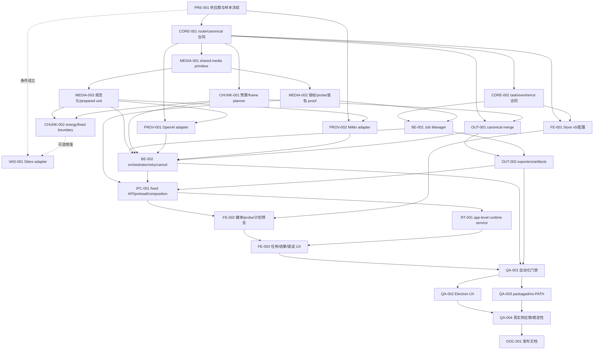

# 音频转文本工具增强 Execution Plan

> 创建日期：2026-08-30
>
> Spec 质量复审：2026-09-03
>
> Feature Slug：`audio-transcriber-enhancement`
>
> 对应设计文档：`docs/v0.3.1/audio-transcriber-enhancement/audio-transcriber-enhancement_final_design.md`
>
> 实施记录目录：`docs/v0.3.1/audio-transcriber-enhancement/audio-transcriber-enhancement_implementation_records/`
>
> 当前状态：`CP-SPEC-01` 已于 2026-09-03 获用户确认；`PRE-001` 因缺少真实供应商凭据阻塞，`VAD-001` 已废弃，其余 23 个顶层工作包未开始。基础发布链路使用 `pcm_energy_v1 + fixed_window`。

本文是工作包、进度台账和多会话交接合同，不重复定义产品行为。产品范围、OpenAI/MiMo route 合同、时间轴语义、输出格式、安全边界与错误语义以 Final Design 为准；若实现发现两份文档不能同时满足，必须先修订设计，再继续编码。

## 0. Spec-Driven 兼容模式

本功能在引入 `spec-driven-ai-coding` 前已经存在 `*_final_design.md` 和 `*_execution_plan.md`。按该 Skill 的入口规则继续使用旧格式，不再创建平行的 `brd.md`、`modules/*`、`task-list-overall.md`；否则同一需求会出现两个 source of truth。

- Final Design 第 1.6 节 `BR-01`～`BR-15` 是唯一需求基底。
- Final Design 第 5.1 节定义 `COMMON/MEDIA/PROVIDER/RUNTIME/UI/RELEASE` 六个模块边界。
- 本文第 7 节同时承担 task list overall 与状态台账职责；每个工作包就是一个可领取任务。
- Final Design 第 21 节是需求追踪矩阵和检查点记录。
- `CP-SPEC-01` 获用户确认前不得把任何工作包改为 `进行中`，不得修改业务代码。

---

## 1. 每次开发会话的使用方式

### 1.1 开始前

每次实现会话必须按顺序完成：

1. 完整阅读 Final Design 的文档治理、第 1.6 节需求基线、第 1.7 节假设/问题、第 5.1 节模块边界和本 Execution Plan，不能只依赖聊天摘要或上一会话实施记录。
2. 阅读 `.agents/skills/fusionkit-pitfall-guard/references/index.md`，再按工作包读取相关条目；至少覆盖本计划第 4 节列出的规则。
3. 检查 Final Design 的 `CP-SPEC-01` 已获确认，并检查第 7 节进度台账。一次只认领一个模块中的一个工作包；强耦合任务最多同时领取 3 个，必须先写明不可拆原因。
4. 运行 `git status --short --branch`，识别并保留用户已有修改；只暂存本工作包文件，禁止使用 `git add -A` 混入无关内容。
5. 核对工作包的“模块/关联需求/依赖/代码落点/验收/测试”。在编辑前把工作包状态改为 `进行中`，并在回复开头声明任务 ID、关联 BR、产出、文件范围、验收标准、测试和停点。
6. 若工作包依赖尚未完成，只能进行无歧义的准备或测试夹具工作；不得用临时复制合同、mock ready 状态或 renderer 私有常量绕过依赖。
7. 若需变更依赖或 lockfile，先确认 `pnpm --version`。仓库当前使用 pnpm 8.x 与 lockfile v6；普通验证优先直接调用 `node_modules/.bin/*`，不得让不兼容 pnpm 重写 lockfile。
8. 预估本包新增/修改超过 8 个文件或 300 行有效变更时，不得直接开工；先把它拆为 `<ID>A/<ID>B` 等可独立验证任务，并同步依赖图、台账、详情和 BR 覆盖。纯只读/命令型 QA 可以读取更多文件，但发现缺陷后必须新增 `FIX-*`，不能在 QA 包内跨模块修代码。

### 1.2 实施中

- Final Design 第 1.6 节是需求 source of truth，其他章节是设计合同；本计划只决定切包、顺序、验收与交接。
- 每个包必须保持单一职责。发现独立缺陷时新增 `FIX-*` 工作包和 `fix/` 文档，不把无关修复塞进当前包。
- 一个 Agent 在一次会话中只能修改当前模块的代码落点。需要改 COMMON 或其他模块时先走文档变更管理，不得顺手跨模块修复。
- 新增产品能力时优先闭合纵向可运行切片，不能留下永远使用 mock 的 handler、没有消费者的类型或只在开发机 PATH 下可运行的媒体流程。
- OpenAI 与 MiMo 共用 prepared-unit/canonical 基础设施，但必须保留各自 route contract 和 adapter；不得用 OpenAI 字段或响应假设实现 MiMo。
- 本地字幕工具只复用无业务语义的媒体 primitive。其 Job Manager、session、模型、字幕类型和 IPC namespace 必须继续独立。
- 所有供应商密钥、真实媒体、raw response、绝对路径、临时媒体、人工验收截图中的敏感内容和本机诊断不得进入 Git。
- 新增用户文案必须同步 `zh`、`zh-Hant`、`en`、`ja` 四种 locale，并通过 parity 与 source-usage 检查。

### 1.3 结束前

1. 运行工作包列出的必需验收，记录精确命令、通过数量、目标平台、fake/真实供应商边界和未覆盖项。
2. 在实施记录目录新增一份记录，使用第 10 节模板；没有实施记录不得标记 `已完成`。
3. 更新第 7 节台账的状态、完成日期、实际修改文件、验证结果、记录路径和遗留问题。
4. 如产品合同改变，同步修改 Final Design；验收新增功能写入 `feat/`，验收发现回归写入 `fix/`。
5. 运行 `git diff --check` 与 `git status --short`，确认没有媒体、密钥、路径、token、临时文件、打包二进制或用户改动被误纳入提交。
6. 若启动 Vite、Electron、fake server、FFmpeg/ffprobe 或真实供应商请求，结束前关闭所有进程并等待 child `close`、请求和 cleanup 收敛。
7. 只有代码、测试、文档、台账和实施记录全部闭环后才可标记 `已完成`；真实供应商或 packaged 平台门禁不能被 fake server 或开发态构建替代。
8. 按关联 `BR-*` 的验收标准逐条记录结果；实现偏离设计时先升级 Final Design 版本并更新需求/追踪矩阵，再改代码。

---

## 2. 状态规则

工作包状态只允许使用：

- `未开始`
- `进行中`
- `已完成`
- `阻塞`
- `废弃`

定义：

- `未开始`：尚未产生该包的实现或正式验证产物；阅读、分析和计划不算实施。
- `进行中`：已有代码、PoC、测试或记录，但尚未满足全部完成条件。
- `已完成`：本包实现、必需测试、实施记录、台账和约定平台证据全部闭环。
- `阻塞`：存在明确外部阻塞，例如目标平台、真实账号额度、签名身份、可分发资源或上游合同缺失；问题列必须写明解除条件。
- `废弃`：设计更新后明确不再实施，问题列必须记录替代包或终止依据。

补充规则：

- `VAD-001` 是条件包。若 `PRE-001` 证明无合适 official surface，应通过设计修订把它标为 `废弃` 或移入后续版本；`pcm_energy_v1` 与 `fixed_window` 仍须完成基础链路。
- `DOC-001` 可以提前建立草稿，但只有 QA 证据齐全并且文档没有超额声明后才能标记 `已完成`。
- 工作包需要多个 checkpoint 时保持 `进行中`，每个 checkpoint 都写实施记录；不得为了显示进度拆出没有独立验收价值的伪完成包。

---

## 3. 当前基线与计划假设

计划建立时确认以下仓库事实：

| 项目 | 当前状态 | 对计划的影响 |
| --- | --- | --- |
| 现有音频转写 | 已有 `audio-file`、OpenAI/MiMo adapter、audio IPC/service/Store/page 与 fake provider 测试 | 采用渐进迁移；在 task API 全链路切换前保留 legacy `audio:transcribe`，但新页面不得同时走两条文件转写路径 |
| Provider registry | `src/lib/audio-provider-registry.ts` 已承载部分 route 能力 | `CORE-001` 扩展为唯一 route 约束来源；renderer、main、adapter 不再各自维护 MIME/size/response format 表 |
| MiMo adapter | 现有 `mimo-chat-audio-adapter.ts`，使用 Chat Completion 语义 | `PRE-001` 与 `PROV-002` 必须验证独立合同；禁止假定兼容 OpenAI Transcriptions API |
| 本地字幕媒体能力 | `electron/main/local-subtitle/media-process.ts`、`media-normalizer.ts` 与 packaged runtime 已有成熟逻辑 | `MEDIA-001` 只抽取可证明无业务语义的 process/runtime/probe primitive；先保持本地字幕回归全绿，再接远程音频工具 |
| Shared media 目录 | 当前没有 `electron/main/media/` | `MEDIA-001` 可建立该目录，但不能把本地字幕 Job Manager、model 或 subtitle contract 移入其中 |
| 安全边界 | 已有 sender-bound capability、fixed preload 和 audio channel policy | 继续复用安全模式；文件/目录 capture 与内部 authorize/revoke 留在 preload-private channel |
| Electron 生命周期 | app 可有多个 `BrowserWindow/webContents`，SPA route 会反复挂载 | Job Manager 按 owner 隔离，app-level runtime service 跨 route 保持任务订阅；只有 owner release 才取消任务和撤销 capability |
| 输出配置 | 旧 Store 支持 provider-oriented `responseFormat` | `FE-001` 执行 Store v5 逐项迁移；新版 `outputFormat` 与 provider response contract 解耦 |
| 打包验证 | 仓库已有 Vite 三段 build、preload bundle 与 local-subtitle packaged/no-PATH 验证模式 | 所有媒体共享重构和 fixed bridge 改动必须复用这些门禁，浏览器测试不能替代 Electron/packaged 证据 |
| v0.3.1 文档 | 当前只有本功能 Final Design，没有版本级 README/总执行计划 | 每次会话直接以 Final Design、本计划、实施记录和坑位索引作为交接入口 |

这些是计划创建时的事实，不是永久假设。工作包改变其中任一项时，必须更新台账和实施记录；涉及产品合同时同步更新 Final Design。

---

## 4. 必读坑位与不得违反的实施约束

### 4.1 工作包路由到项目坑位

| 工作范围 | 开始前至少阅读 |
| --- | --- |
| route/model/provider | `resolve-asr-constraints-from-route-model`、`keep-subtitle-model-retries-bounded-and-single-owned` |
| shared media/native process | `keep-local-subtitle-transcription-separate-from-remote-audio-asr`、`bundle-native-media-runtime-instead-of-system-path`、`stream-native-progress-without-capture-overflow`、`bound-native-decode-output-before-post-validation` |
| VAD/时间轴 | `do-not-mix-vad-segment-and-compressed-word-timelines` |
| capability/输入/输出 | `promote-draft-selection-proofs-into-task-authority`、`derive-source-output-from-task-input-identity`、`retain-native-file-input-until-preload-authorization-settles`、`recover-original-explorer-sources-from-shell-temp-proxies` |
| Job Manager/cleanup | `cache-shutdown-promise-before-aborting`、`serialize-reentrant-session-event-delivery`、`do-not-short-circuit-later-shutdown-cleanup-phases`、`namespace-recovery-artifacts-by-task-identity` |
| preload/IPC/runtime service | `bundle-runtime-dependencies-in-sandboxed-preload`、`test-production-ipc-handler-composition`、`keep-preload-internal-ipc-out-of-public-invoke`、`retry-failed-capability-revocations-across-spa-navigation`、`coalesce-idempotent-runtime-probes-under-strict-mode` |
| Renderer/Store/progress | `keep-persisted-tool-config-as-the-ui-source-of-truth`、`run-cross-key-zustand-migrations-before-hydration`、`separate-media-format-from-audio-track-metadata`、`keep-route-preflight-out-of-active-media-admission`、`serialize-draft-and-task-media-admission`、`separate-stage-and-weighted-overall-progress`、`preserve-safe-task-diagnostics-across-ipc-sanitization` |
| build/visual QA | `use-the-root-vite-config-for-electron-build-validation`、`keep-pre-development-evidence-proportional-to-product-risk` |

若本功能出现可复现且不被现有条目覆盖的新坑，当前工作包必须先按项目 skill 模板新增或更新条目，再继续实现；不要把普通编码笔记伪装成坑位。

### 4.2 不得违反的约束

1. 不得把本地 Whisper、GPU/backend、本地模型或 local-subtitle Job Manager 纳入 `audio:*` 远程任务合同。
2. 不得让用户的 `txt/json/srt/vtt/lrc` 选择直接变成供应商 `response_format`。
3. 不得把 OpenAI 字段发送给 MiMo；MiMo 禁止 `response_format`、prompt、timestamp、server chunking 和多音频请求。
4. 不得按 raw file byte 或 10 MiB 估算 MiMo；必须精确检查十进制 Base64 字符预算，并同时应用 duration 与 2K 输出预算。
5. 不得把 MiMo `finish_reason=length/content_filter`、断流、缺 choice 或空文本提交为成功 checkpoint；`usage.seconds` 也不得用于 cue 时间轴。
6. 不得在 renderer 复制 route MIME/byte/duration/Base64/response output 约束，也不得让 renderer 生成 FFmpeg 参数、音频切点或 provider response contract。
7. 不得在 draft 授权阶段使用供应商单次 payload 上限拒绝大型源媒体；单次限制只应用于 task plan 和 prepared unit。
8. 不得把 ffprobe duration、HTTP 200、JSON schema 或字幕 parse-back 单独当成完整安全/内容覆盖证明。
9. 不得依赖系统 PATH、用户自备 FFmpeg 或开发机绝对路径；packaged app 只使用 manifest 校验的 bundled media runtime。
10. 不得累计完整 native stdout/stderr，按每个 FFmpeg chunk/PCM frame 跨 IPC 发布，或只 `kill()` 不等待 child `close` 就删临时目录。
11. VAD 与边界检测必须保存原 PCM frame interval；不得把删除静音后的压缩 word timeline 覆盖正确的原绝对时间。
12. overlap 去重只允许在相邻边界使用 core ownership/局部相似度；不得全局删除重复台词。
13. 无原生 timestamp route 可以输出显式 `estimated` 时间轴，但不得伪装为 provider segment/word 精度。
14. 任一必需 chunk 缺失时不得发布正常完成的 TXT/SRT/LRC；任务失败可以保留 main-private checkpoint，但不能静默导出部分结果。
15. renderer Store、公开 IPC、canonical JSON 和日志不得包含真实路径、API Key、token、native stderr、raw provider body、全文 transcript 或临时媒体路径。
16. 页面卸载不得取消已提交任务或释放其唯一 capability；app owner/window release 才执行 fence、abort 和清理。
17. shutdown 每个 phase 都必须执行并保留首错；composite shutdown Promise 必须先缓存，再触发 AbortController。
18. source output 必须从仍有效的 task input parent identity 私下派生；不得接受 renderer 传入的 parent path。
19. 首版输出使用 no-clobber index 与同目录 owned partial 原子发布；不得引入 path-only overwrite。
20. fixed preload 内部授权 channel 不得进入 public generic `invoke` allowlist；production main composition 必须有实际 handler 注册测试。
21. 自定义 OpenAI-compatible route 没有显式 upload contract 时必须 fail closed，不能继承内置 OpenAI 的乐观能力。
22. Silero 不得成为基础链路的开发前置；未证明 official surface 前不得新增自研 C++ bridge 或不明 native runtime。
23. Realtime captions 的 5 秒录音与静音语义继续走现有独立路径，不纳入长文件 Job Manager。
24. Electron 视觉验收必须等待全局 preload loading 退出，并覆盖真实 Windows picker/Explorer drag；浏览器 DOM 截图不能替代该门禁。

---

## 5. 推进顺序与依赖关系

### 5.1 总体策略

1. 先用有界证据冻结 OpenAI/MiMo route 和真实媒体 profile，不建立过度研究门禁。
2. 冻结 route/canonical/task 类型，再抽取 shared media primitive；首个编码包不改页面、不删除 legacy IPC。
3. 先闭环 `M4A/MP4 → MP3 prepared units → fake provider → TXT/canonical JSON` 的 main-only 纵向链路，再开放 SRT/LRC 和完整页面。
4. MiMo adapter 独立完成 Base64、finish reason、usage 与缩片重试合同；不能等 OpenAI 完成后用字段替换方式“兼容”。
5. `pcm_energy_v1` 与 `fixed_window` 是首版基础能力；Silero 是经过 `PRE-001` 决策的可插拔增强。
6. fixed IPC、app-level runtime service 和 renderer 状态都建立在 main Job Manager 已有稳定 snapshot/event 合同之后。
7. 自动化门禁通过后再做 Electron、packaged/no-PATH 和真实供应商矩阵；最后同步发布文档。

### 5.2 依赖图



### 5.3 可并行范围

- `MEDIA-001`、`CHUNK-001`、`OUT-001` 可在 `CORE-001` 后并行，但只能依赖共享公开类型，不能互相导入未冻结私有实现。
- `PROV-001` 与 `PROV-002` 可并行；两者必须使用同一 prepared-unit 输入和 canonicalizer 输出接口，各自维护请求/响应验证。
- `CHUNK-002` 与 `BE-001` 可在依赖完成后并行；前者不拥有 task/session，后者不实现语音边界算法。
- `FE-001` 可与 main pipeline 后半段并行，但不能提前改变页面执行路径或把未接通能力展示为可用。
- `QA-002` 与 `QA-003` 可在 `QA-001` 后并行；`QA-004` 必须消费两者证据。
- `VAD-001` 不在关键路径；它不能阻塞 energy/fixed 基础闭环、MiMo 兼容或首轮 UI 验收。

### 5.4 Agent 模块边界

| 模块 | 工作包 | 允许修改的主要范围 | 跨模块规则 |
| --- | --- | --- | --- |
| `COMMON` | CORE-001、CORE-002 | `src/lib/audio-provider-registry*`、`src/type/audio*` 与直接合同测试 | 其他模块只能消费已冻结类型；要改字段/错误码必须先回到 COMMON 包 |
| `MEDIA` | MEDIA-001～003、CHUNK-001/002、VAD-001 | `electron/main/media/*`、audio media/planner/detector 与对应 tests | 不导入 provider/page/session 私有模块；shared 抽取先保持 local-subtitle 回归 |
| `PROVIDER` | PRE-001、PROV-001、PROV-002 | audio adapters、route evidence、fake provider fixture | adapter 只接 prepared unit，不拥有跨请求 retry 或 exporter |
| `RUNTIME` | OUT-001/002、BE-001/002、IPC-001、RT-001 | main audio job/orchestrator/output、preload fixed API、renderer app service | 通过 COMMON schema 与 MEDIA/PROVIDER 接口集成；不修改页面表现或持久化偏好 |
| `UI` | FE-001～003 | audio Store/service/page/components 和四语言 audio locale | 不计算 payload/FFmpeg/route 私有字段；只消费 fixed API |
| `RELEASE` | QA-001～004、DOC-001 | 集成验证、Electron/packaged/真实供应商证据和发布文档 | 验收发现代码问题时新增归属模块的 `FIX-*`，不在 QA 内直接跨模块修复 |

并行开发时推荐一模块一分支。任何 Agent 只更新自己工作包所在的台账行；`COMMON` 合同未完成前，其他模块只能做只读调研或独立 fixture 准备。

---

## 6. 里程碑与纵向闭环

### 6.1 里程碑

| 里程碑 | 达成条件 | 未达到时禁止 |
| --- | --- | --- |
| M0 供应商与范围冻结 | `PRE-001` 完成，OpenAI/MiMo route、真实 MP3 profile、MiMo finish reason/usage/4–5 分钟策略和 Silero 决策有脱敏证据 | 禁止写死未经验证的 MiMo 字段、profile 或把 Silero 设为必需 runtime |
| M1 合同与媒体基础 | `CORE-001`、`CORE-002`、`MEDIA-001` 完成；route/canonical/task schema 与 shared native primitive 回归通过 | 禁止改页面执行路径或删除 legacy file-transcription IPC |
| M2 Main-only 最小闭环 | `MEDIA-002/003`、`CHUNK-001/002`、`PROV-001/002`、`OUT-001`、`BE-001/002` 完成；M4A/MP4 经 MP3、多片 fake provider、TXT/canonical JSON 通过 | 禁止宣称 SRT/LRC、离页恢复或真实 provider 已可用 |
| M3 输出与桌面闭环 | `OUT-002`、`IPC-001`、`RT-001`、`FE-001/002/003` 完成；fixed bridge、snapshot 恢复、五种输出和结果操作接通 | 禁止进入发布候选或移除 legacy IPC |
| M4 自动化与桌面候选 | `QA-001`、`QA-002` 完成；全量相关回归、四语言、宽窄窗口、键盘、picker/drag、导航和取消通过 | 禁止用浏览器测试替代 Electron 或对外声明完整 UX |
| M5 发布候选 | `QA-003`、`QA-004`、`DOC-001` 完成；packaged/no-PATH、真实 OpenAI/MiMo、长媒体、隐私/费用/清理与文档闭环 | 禁止标记 v0.3.1 stable 或删除兼容路径 |

### 6.2 第一个 main-only 纵向切片

第一个可执行切片必须保持窄范围：

```text
测试持有一个 M4A 或含单音轨的 MP4 capability
  → main probe 并冻结音轨/source identity
  → bundled FFmpeg 生成受 route 预算约束的 MP3 prepared units
  → fixed/energy frame planner 保留原绝对时间与完整 core coverage
  → fake OpenAI/MiMo adapter 顺序处理每个 unit
  → strict response validation 与 checkpoint
  → canonical TXT / schemaVersion:1 JSON
  → main-private artifact、bounded preview、no-clobber commit
```

该切片明确不包含完整页面、Silero、真实费用调用、SRT/VTT/LRC、provider raw JSON、并行请求或 legacy IPC 删除。它的目的，是尽早证明媒体转换、route 预算、多片、MiMo 独立合同、取消和 canonical 合并能在同一条真实 main 流程工作。

### 6.3 首版发布闭环

首版额外要求：

- 用户可选择常见音频和视频容器；多音轨经过显式选择或安全 auto policy。
- OpenAI 与 MiMo 均通过独立 adapter 和真实最小矩阵；MiMo 的 M4A 输入自动转为已验证 MP3 profile。
- 大于单次供应商预算的媒体可以重规划和多片处理，每个实际请求均低于 byte/Base64/duration/output 硬预算。
- `txt/json/srt/vtt/lrc` 都来自 canonical transcript，具备 golden fixture、parse-back 与原子 no-clobber 发布。
- 无原生 timestamp route 只输出 `estimated` 时间轴并展示请求数/费用提示；原生 segment/word route 保留对应 provenance。
- 页面导航后任务继续，返回后按 revision snapshot 恢复；窗口/owner release 与 app shutdown 完整清理。
- Windows packaged app 在隔离系统 PATH 时可 probe/转码/分片；计划支持的其他发布平台完成相同组件门禁。
- UI、日志、Store、IPC 和 canonical artifact 通过路径、密钥、token、raw body、stderr 与全文泄漏审计。

---

## 7. 进度台账

> 每个工作包完成后必须更新本表。日期使用 `YYYY-MM-DD`；文件、验证和问题写实际结果，不保留计划性占位描述。

| 工作包 | 模块 | 关联需求 | 状态 | 完成日期 | 依赖 | 目标 | 变更文件 | 验证 | 实施记录 | 问题 |
| --- | --- | --- | --- | --- | --- | --- | --- | --- | --- | --- |
| PRE-001 | PROVIDER | BR-01/03/04/06/11/15 | 阻塞 | — | — | 冻结 OpenAI/MiMo route、真实 fixture、MiMo 4/5 分钟 policy 与 Silero 决策 | fake provider fixture/tests、PRE 证据、设计/计划/记录 | fixture 1 file / 10 tests、tsc 通过；官方合同/runtime 审计完成；真实矩阵未运行 | `2026-09-03_PRE-001_provider-contract-freeze.md` | 解除条件：本机配置可用 OpenAI/MiMo 密钥、额度和非提交样本，完成真实矩阵 |
| CORE-001 | COMMON | BR-01/07/08/15 | 未开始 | — | PRE-001 | route upload/response/timestamp/billing 合同、canonical/output 类型和 pipeline limits | 计划：`src/lib/audio-provider-registry.ts`、`src/type/audio.ts` 及 tests | 计划：registry/type/fixture tests、tsc | — | renderer/main/adapter 必须共享单一 route definition |
| CORE-002 | COMMON | BR-10/11/12 | 未开始 | — | CORE-001 | task/event/snapshot/error/generation 状态合同 | 计划：`src/type/audioIpc.ts`、domain/state tests | 计划：schema/transition/sanitization tests、tsc | — | 先定合同，不接页面或 public handler |
| MEDIA-001 | MEDIA | BR-02/03/15 | 未开始 | — | CORE-001 | 抽取 verified media runtime/process/probe primitive 且本地字幕行为不变 | 计划：`electron/main/media/*`、local-subtitle adapters/tests | 计划：local-subtitle media 全回归、no-PATH/fault tests | — | 不迁移 local-subtitle Job Manager/model/subtitle contract |
| MEDIA-002 | MEDIA | BR-02/09/10/12 | 未开始 | — | MEDIA-001/CORE-002 | 通用媒体授权、probe、音轨选择 proof 与 task lease | 计划：`electron/main/audio/audio-file.ts`、media pipeline、tests | 计划：picker/drop/proxy、多音轨、changed identity、lease tests | — | draft 不应用 provider 单次 payload 上限 |
| MEDIA-003 | MEDIA | BR-03/04/15 | 未开始 | — | MEDIA-001/CORE-001 | route-driven 直传/转码 profile 与 prepared-unit 物化 | 计划：transcription media pipeline、shared media tests | 计划：WAV/MP3/M4A/视频、`-t/-fs`、size/disk/abort tests | — | prepared unit 必须在生成后复核实际 byte/Base64 预算 |
| CHUNK-001 | MEDIA | BR-04/09/15 | 未开始 | — | CORE-001 | upload/output/duration/request 预算与 frame-complete planner | 计划：`transcription-chunk-planner.ts`、tests | 计划：预算公式、core/overlap/首尾/短尾/有限重规划 tests | — | MiMo byte 预算按十进制 Base64；请求数上限 2,000 |
| CHUNK-002 | MEDIA | BR-05/06 | 未开始 | — | MEDIA-003/CHUNK-001 | `pcm_energy_v1`、`fixed_window` 与 smart fallback | 计划：`transcription-boundary-detector.ts`、tests | 计划：静音/无静音/后段语音/取消/原时间轴 tests | — | 不消费压缩 VAD word timeline |
| VAD-001 | MEDIA | BR-06 | 废弃 | 2026-09-03 | PRE-001/CHUNK-002 | 条件式 Silero detector adapter 与透明 fallback | PRE 证据、Final Design、Execution Plan | 仓库/runtime 静态审计：无 standalone official Electron surface | `2026-09-03_PRE-001_provider-contract-freeze.md` | 后续若引入 pinned official executor 重新立项；v0.3.1 使用 energy/fixed |
| PROV-001 | PROVIDER | BR-01/03/07/11 | 未开始 | — | CORE-001/MEDIA-003 | OpenAI prepared-unit adapter 与 response negotiation | 计划：`openai-audio-adapter.ts`、registry/fake server tests | 计划：GPT/Whisper/diarization、MIME、timestamp、413/retry tests | — | route 决定 response contract，不能按 provider 名称写死 |
| PROV-002 | PROVIDER | BR-01/03/04/07/11/15 | 未开始 | — | PRE-001/CORE-001/MEDIA-003 | MiMo Chat Completion prepared-unit adapter | 计划：`mimo-chat-audio-adapter.ts`、fake server tests | 计划：单音频、MIME/format、Base64、finish reason、usage/SSE tests | — | 禁止 OpenAI 专属字段；length 只触发当前 unit 缩片 |
| OUT-001 | RUNTIME | BR-05/07 | 未开始 | — | CORE-001/CHUNK-001 | response → canonical、原时间映射、overlap 合并与质量门禁 | 计划：`transcription-canonicalizer.ts`、tests | 计划：segment/word/estimated、边界重复、空响应、coverage tests | — | 不做全文去重；含语音 unit 的空文本必须失败 |
| OUT-002 | RUNTIME | BR-08/12 | 未开始 | — | OUT-001/BE-001 | 五种 exporter、parse-back、artifact/token/no-clobber commit | 计划：`transcription-exporter.ts`、artifact registry、tests | 计划：TXT/JSON/SRT/VTT/LRC golden、large preview、atomic tests | — | JSON 改为 canonical schemaVersion 1；不混入 raw response |
| BE-001 | RUNTIME | BR-10/11/12 | 未开始 | — | CORE-002/MEDIA-002 | Job Manager、owner/generation、session registry 与 cleanup 骨架 | 计划：`transcription-job-manager.ts`、lifecycle/tests | 计划：状态迁移、late event、owner release、shutdown/reentrancy tests | — | app singleton + owner isolation；route unmount 不取消 task |
| BE-002 | RUNTIME | BR-04/07/10/11 | 未开始 | — | BE-001/MEDIA-003/CHUNK-001/PROV-001/PROV-002/OUT-001 | orchestrator、checkpoint、单一 retry owner、重规划与取消 | 计划：`transcription-orchestrator.ts`、job integration/tests | 计划：分阶段 cancel、413/429/5xx/length、resume identity tests | — | checkpoint 绑定 route/source/prompt/profile identity |
| IPC-001 | RUNTIME | BR-09/10/11/12/13 | 未开始 | — | MEDIA-002/BE-002/OUT-002 | fixed audio task API、preload policy 与 production composition | 计划：`audioIpc.ts`、`electron/preload/*`、`audio/ipc.ts`、main wiring | 计划：public/private policy、preload bundle、production handler tests | — | 内部 authorize/revoke 不进 generic invoke allowlist |
| RT-001 | RUNTIME | BR-10/11/12 | 未开始 | — | IPC-001 | app-level task runtime service、subscribe-before-snapshot 与 cleanup retry | 计划：`audioTranscriptionRuntimeService.ts`、service tests | 计划：revision buffer、导航恢复、StrictMode、revoke retry tests | — | 服务归 app 生命周期，不归 route component 生命周期 |
| FE-001 | UI | BR-01/08/13/14 | 未开始 | — | CORE-001/CORE-002 | Store v5 迁移、配置 source of truth 与 route-aware controls | 计划：audio transcriber config/store、locale/tests | 计划：v4→v5 fixture、sanitize/hydration、i18n tests | — | 不持久化 prompt、token、正文、path 或 runtime snapshot |
| FE-002 | UI | BR-02/09/14 | 未开始 | — | FE-001/IPC-001 | 文件选择/拖放、媒体/音轨摘要、plan preview 与开始门禁 | 计划：AudioTranscriber page/model、service、locale/tests | 计划：probe identity、track select、preview race、admission tests | — | MiMo UI 不显示 prompt/timestamp/stream 等不支持能力 |
| FE-003 | UI | BR-08/10/11/12/14 | 未开始 | — | FE-002/RT-001 | 阶段进度、取消/重试、结果、诊断和 output-token 操作 | 计划：AudioTranscriber page/components/store/service/tests | 计划：stage/overall、导航恢复、preview bounds、a11y/i18n tests | — | usage.seconds 只作费用摘要；公开错误从固定 i18n 重建 |
| QA-001 | RELEASE | BR-01/02/03/04/05/06/07/08/09/10/11/12/13/14/15 | 未开始 | — | BE-002/OUT-002/FE-003 | 自动化合同、fake provider、回归与 build 门禁 | 计划：`test/audio/*`、相关 src/local-subtitle tests | 计划：聚焦 + 全相关 vitest、tsc、i18n、root build、preload | — | VAD-001 未纳入首版时必须验证 energy/fixed fallback |
| QA-002 | RELEASE | BR-02/09/10/11/12/14 | 未开始 | — | QA-001 | Electron 四语言、宽窄窗口、键盘、picker/drag、导航与取消 | 计划：E2E/截图/验收记录 | 计划：Windows Explorer、proxy、明暗主题、loading/overflow/process cleanup | — | 浏览器 DOM 证据不替代 Electron；媒体不进 Git |
| QA-003 | RELEASE | BR-03/06/12/15 | 未开始 | — | QA-001/MEDIA-001 | packaged/no-PATH、媒体 runtime、安装路径与平台组件验收 | 计划：packaged validators、验收记录 | 计划：Windows x64 与声明平台的 FFmpeg/ffprobe、hash/arch/fault tests | — | 需要真实打包产物；不能回退系统 PATH |
| QA-004 | RELEASE | BR-01/03/04/05/07/08/11/12/15 | 未开始 | — | QA-002/QA-003 | 真实 OpenAI/MiMo、长媒体、稳定性、隐私与费用矩阵 | 计划：脱敏验收记录；缺陷另建 FIX 包 | 计划：短 WAV/MP3、M4A→MP3、5 分钟密集、多片、cancel/soak/log audit | — | 需要用户可用账号/额度；不提交 audio、key、raw body |
| DOC-001 | RELEASE | BR-08/11/12/13/15 | 未开始 | — | QA-004 | README、CHANGELOG、release note、隐私/费用/格式说明 | 计划：发布文档与版本台账 | 计划：Markdown/link、manifest/license、diff check | — | 只陈述 QA 已证明的 route、平台、格式和时间轴质量 |

---

## 8. 工作包详情

以下每个工作包的完整任务定义由“第 7 节对应台账行 + 本节同名详情”共同组成：台账提供模块、关联需求、依赖、计划文件和测试，详情提供目标、实现要点、不涉及范围与完成条件。每包均以“新增/修改不超过 8 个文件且有效变更不超过 300 行”为认领预算，测试和 locale 文件计入文件数。若只读调研后确认超出，先拆包并更新本文，不得边实现边扩大范围。每包的模块与关联需求同时记录在标题下和第 7 节台账，二者必须保持一致。

### PRE-001：供应商合同、真实 fixture 与可选 VAD 决策

**模块 / 关联需求**：`PROVIDER` / BR-01、BR-03、BR-04、BR-06、BR-11、BR-15

**目标**

- 把 Final Design 中会随供应商变化的事实转成最小、可复核、脱敏的开发证据。
- 冻结 OpenAI/MiMo route matrix、MiMo MP3 profile、4 分钟 target/5 分钟 hard max 初始 policy，并决定 `VAD-001` 是否进入首版。

**实施范围**

- 记录官方 route/model/size/format/timestamp/finish reason/usage/rate/billing 依据和检查日期。
- 扩展 fake provider fixture，覆盖 MiMo `stop/length/content_filter`、空/断流/缺 choice、`usage.seconds` 与 Base64 边界。
- 用不进入 Git 的短 WAV、短 MP3、M4A→MP3、约 5 分钟高文本密度和至少一个多片样本做有界真实检查。
- 审计仓库 pinned runtime 是否存在可直接调用的官方 Silero surface；只验证能力，不先写 production bridge。

**不涉及**

- 不改页面，不建立完整 pipeline，不下载或提交大模型/媒体，不扩展供应商未文档化能力。

**完成条件**

- 证据能明确回答 MiMo 可接受的音频格式/编码、Base64 边界、2K 输出风险、finish reason 提交条件、usage 语义和 SSE 终态。
- `CORE-001` 所需 route values 已冻结；Silero 有明确“进入首版”或“保持可插拔 backlog”结论。

### CORE-001：Route、Canonical 与输出合同

**模块 / 关联需求**：`COMMON` / BR-01、BR-07、BR-08、BR-15

**目标**

- 建立唯一 route capability source 和稳定 `CanonicalAudioTranscript schemaVersion: 1`，把用户输出格式与供应商 response contract 解耦。

**实施范围**

- 扩展 registry 的 upload MIME/transfer/payload/duration/output/timestamp/server chunking/billing/rate-limit 字段。
- 增加 output format、timing provenance、canonical cue/word、prepared-unit/profile 与 pipeline limits 类型。
- 为 OpenAI 各模型家族、MiMo 和 unknown compatible route 建立 fail-closed tests。

**完成条件**

- renderer、main、adapter 均可从同一 route definition 派生能力；未知 model/route 不会乐观继承。
- canonical schema 和五种 output format 编译期/fixture 合同稳定，但本包不实现 exporter。

### CORE-002：Task、Event、Snapshot 与错误合同

**模块 / 关联需求**：`COMMON` / BR-10、BR-11、BR-12

**目标**

- 在实现 Job Manager 前冻结 generation/revision、状态机、progress、snapshot、公开错误和 fixed API request/response schema。

**实施范围**

- 定义 task 状态、stage、stage/overall progress、checkpoint eligibility、result summary、warning 与 safe diagnostics。
- 定义 `authorize/probe/preview/start/snapshot/subscribe/cancel/retry/output/clear` 的 typed schema，但不注册生产 handler。
- 增加非法状态迁移、late generation、字段边界和错误脱敏测试。

**完成条件**

- 所有公开 schema 有严格解析和有界字段；任意 Error、路径、URL query、header、stderr/raw body 被丢弃。

### MEDIA-001：Shared Verified Media Primitives

**模块 / 关联需求**：`MEDIA` / BR-02、BR-03、BR-15

**目标**

- 从本地字幕实现抽取 runtime resolver、bounded process runner 和 ffprobe parser，不改变本地字幕产品行为。

**实施范围**

- 建立 `electron/main/media/verified-media-runtime.ts`、`media-process.ts`、`media-probe.ts` 或等价通用目录。
- 通过薄 adapter 让 local-subtitle 继续消费相同语义；保持 command 构造、环境、cwd、timeout、abort/close、stdout/stderr cap 和 cleanup 合同。
- 迁移/复用现有 media tests，并补 no-PATH、runtime missing/invalid/arch/launch fault。

**完成条件**

- local-subtitle 相关测试先全绿；Audio 还没有 Job Manager 或页面依赖；shared 模块不导入任何 subtitle domain。

### MEDIA-002：通用媒体授权、Probe、音轨与 Task Lease

**模块 / 关联需求**：`MEDIA` / BR-02、BR-09、BR-10、BR-12

**目标**

- 允许用户选择常见媒体而不提前套用 provider 单次上限，并把 draft selection proof 安全提升为 task authority。

**实施范围**

- `authorizeMedia` 支持 picker/drop 与 Windows Explorer `%TEMP%` proxy 恢复；保留 `File` 直到 preload 授权 settle。
- probe 输出容器、duration、size 和脱敏 audio tracks；格式与音轨 metadata 分离。
- auto/explicit track selection 生成 opaque proof，绑定 owner、source identity、runtime generation 和 probe signature；task commit 原子转 lease。

**完成条件**

- 大源文件可以授权；无音轨、媒体变化、过期 proof、重复准入和 owner release 均有稳定结果。

### MEDIA-003：Route-driven 规范化与 Prepared Unit

**模块 / 关联需求**：`MEDIA` / BR-03、BR-04、BR-15

**目标**

- 将任意合规媒体变成 adapter 唯一可消费的 route-safe WAV/MP3 prepared unit。

**实施范围**

- 实现 direct/transcode 选择、音轨映射、受控 FFmpeg 参数、`-t/-fs`、磁盘预检、临时目录与实际输出复核。
- OpenAI 与 MiMo profile 均来自 route definition；MiMo 只生成 PRE 已验证的 WAV/MP3 MIME/format 组合。
- unit 带原媒体 frame interval、profile identity、实际 byte、MIME、duration 与 generation，不携带 renderer path authority。

**完成条件**

- WAV/MP3/M4A/FLAC/OGG/WebM 和 MP4/MKV/MOV fixture 可走预期 direct/transcode；取消/失败后无临时文件残留。

### CHUNK-001：预算模型与 Frame-complete Transport Planner

**模块 / 关联需求**：`MEDIA` / BR-04、BR-09、BR-15

**目标**

- 统一计算 route upload、duration、response output、memory、请求数和产品边界，并生成完整覆盖原 PCM 的 transport/request units。

**实施范围**

- 实现 multipart 和 Base64 预算；MiMo 编码前预测、编码后精确字符数和序列化后复核。
- 生成 core/overlap frame interval，覆盖首尾、短尾和无静音 hard cut；限制单次 15 分钟、MiMo 4/5 分钟、无 timestamp 30 秒与 2,000 requests。
- 对实际输出超预算、413 或 MiMo `length` 提供有限深度、只针对当前 unit 的重规划接口。

**完成条件**

- property/fixture tests 证明 core 无洞、无越界、顺序稳定；重规划终止且不会无限缩片或重复计费。

### CHUNK-002：PCM Energy 与 Fixed Boundary Detector

**模块 / 关联需求**：`MEDIA` / BR-05、BR-06

**目标**

- 提供不依赖 Silero 的首版 smart boundary，并始终保留原媒体绝对时间。

**实施范围**

- 定义 detector interface、interval schema 和严格校验；实现 `pcm_energy_v1`、`fixed_window` 与透明 fallback。
- 处理长静音、后段语音、连续演讲、极短声音、无 speech、取消和 detector failure。
- boundary 只影响切点，不删除时间；estimated cue 使用原 frame interval。

**完成条件**

- 后段语音时间不提前；fallback 的实际策略进入 plan/result summary；基础链路不依赖 `VAD-001`。

### VAD-001：条件式 Silero Adapter

**模块 / 关联需求**：`MEDIA` / BR-06

**目标**

- 在不改变基础 planner/time-domain 合同的前提下接入已经被 `PRE-001` 证明的官方 Silero surface。

**实施范围**

- 只写 detector adapter、资源解析/打包声明、取消、timeout、interval 校验和 fallback。
- packaged/no-PATH、版本/hash/license 与启动失败必须 fail closed 到 energy/fixed，而不是让任务不可用。

**完成条件**

- 真实 runtime fixture 与 packaged test 证明官方 surface 可调用；结果只包含原 PCM frame intervals。
- 若前置证据否定方案，先修订设计并将本包 `废弃`/后移，不创建自研替代 bridge。

### PROV-001：OpenAI Prepared-unit Adapter

**模块 / 关联需求**：`PROVIDER` / BR-01、BR-03、BR-07、BR-11

**目标**

- 让 OpenAI adapter 只接收 route-safe prepared unit，并按 model family 协商真实 response/timestamp contract。

**实施范围**

- 覆盖 GPT transcription、Whisper 与 diarization/未知 model 的输入、response 和 timestamp 差异。
- adapter 不切源媒体、不生成用户输出、不拥有跨请求 retry；仅校验单 unit request/response 并返回 provider result。
- 413、429/Retry-After、5xx、鉴权、余额、空/invalid response 分类清晰。

**完成条件**

- fake provider 断言每个请求 byte/MIME/model/字段正确；route constraint 变化无需修改 renderer 表。

### PROV-002：MiMo Prepared-unit Adapter

**模块 / 关联需求**：`PROVIDER` / BR-01、BR-03、BR-04、BR-07、BR-11、BR-15

**目标**

- 完整实现 MiMo `chat_completion_text`，确保使用 MiMo 模型不会因 OpenAI Transcriptions 假设而出错。

**实施范围**

- 单 `input_audio`、WAV/MP3 MIME 与显式 format、纯 Base64/data URL 规则、精确十进制字符预算。
- 非流式与现有 SSE 终态都必须复核 choice/content/finish reason；只有 `stop` 且非空才返回可提交结果。
- 返回 `usage.seconds` 供费用摘要，不生成 timestamp；402 不重试，429 尊重 `Retry-After`，5xx 交给 orchestrator 单一 retry owner。

**完成条件**

- fake/真实最小矩阵证明 `length` 只触发更短 unit、旧截断文本不落 checkpoint；请求中不存在 OpenAI 专属字段。

### OUT-001：Canonical Mapping、Overlap Merge 与质量门禁

**模块 / 关联需求**：`RUNTIME` / BR-05、BR-07

**目标**

- 把两类 provider result 统一映射到原媒体绝对毫秒时间轴，并在相邻边界安全合并。

**实施范围**

- provider relative seconds → integer ms → source offset；校验 word/parent segment 与 unit/core bounds。
- 无 timestamp route 根据短 boundary-aligned request 生成 `estimated` cue；MiMo usage 不参与时间轴。
- overlap 仅按相邻 core ownership/局部相似度仲裁；空语音、重复锁死、越界、缺 coverage 返回稳定错误。

**完成条件**

- native/estimated 两种 timeline fixtures、合法重复台词和边界重复均通过；没有全局字符串去重。

### OUT-002：Exporter、Artifact 与 Output Token

**模块 / 关联需求**：`RUNTIME` / BR-08、BR-12

**目标**

- 从 canonical transcript 生成五种格式，parse-back 后原子发布，并只向 renderer 暴露有界 preview 和 output token。

**实施范围**

- TXT LF/UTF-8、canonical JSON schema v1、SRT、VTT、标准行级 LRC formatter/parser/golden fixtures。
- display-only 私有 artifact、source/custom task-owned directory authority、同目录 partial、flush/close、parse-back、no-clobber index commit。
- output token owner/expiry/copy/save/reveal/clear；preview 与 artifact size cap。

**完成条件**

- LRC 量化、1h+、相同标签保序和 SRT/VTT 时间格式通过；取消不会删除已提交文件，失败 chunk 不发布最终结果。

### BE-001：Job Manager、Session Registry 与 Lifecycle

**模块 / 关联需求**：`RUNTIME` / BR-10、BR-11、BR-12

**目标**

- 建立 app singleton、owner-bound task、generation、状态机、revision event/snapshot 和可证明的资源清理骨架。

**实施范围**

- 一个 owner 最多一个活动文件转写任务；start/cancel/retry/clear 幂等语义。
- event 按 task 串行投递，支持 subscribe-before-snapshot reconciliation 和 late generation 拒绝。
- owner release/shutdown 依次 fence/abort、settle process/request、清 temp/checkpoint、清 capability、finalize registry；缓存 composite shutdown Promise。

**完成条件**

- 状态、重入、窗口 owner、shutdown 首错与后续清理 tests 通过；路由组件卸载不会结束 main task。

### BE-002：Orchestrator、Checkpoint、Retry、Replan 与 Cancel

**模块 / 关联需求**：`RUNTIME` / BR-04、BR-07、BR-10、BR-11

**目标**

- 把 media/planner/provider/canonicalizer 串成唯一生产执行器，确保重试、费用和取消只有一个 owner。

**实施范围**

- 顺序执行 prepared units，按阶段发布节流 progress；成功 chunk 写 main-private checkpoint。
- checkpoint 绑定 route、source、track、prompt、profile、planner/version identity；配置变化后只能重新开始。
- 处理 413、MiMo length、429、瞬时 5xx、fatal auth/balance/filter、cancel 和 late response；有限重试/重规划。

**完成条件**

- fake provider 多片 E2E 证明每个请求低于预算、成功 chunk 精确复用、失败 unit 只重做一次责任链；各阶段取消收敛无残留。

### IPC-001：Fixed API、Preload Policy 与 Production Composition

**模块 / 关联需求**：`RUNTIME` / BR-09、BR-10、BR-11、BR-12、BR-13

**目标**

- 把 main pipeline 以固定、最小、sender-bound API 暴露给 renderer，并证明生产启动确实注册全部 handler。

**实施范围**

- 实现 Final Design 第 11 节 fixed methods；内部 file/path capture、output picker 和 revoke 留在 preload 私有闭包。
- 升级 bridge version；preload bundle 只 externalize Electron 支持模块，public invoke 精确 allowlist。
- production composition 在创建窗口前安装共享 registry/job/output handler；测试不可只 mock 单个 handler。

**完成条件**

- preload shape/policy、sender/owner、invalid payload、production wiring、bundle validator 与三段 Vite test build 通过。

### RT-001：App-level Renderer Runtime Service

**模块 / 关联需求**：`RUNTIME` / BR-10、BR-11、BR-12

**目标**

- 让已提交任务跨 SPA route 持续订阅，并在返回页面时通过 revisioned snapshot 恢复，不重复 probe/start。

**实施范围**

- 服务启动时 subscribe-before-snapshot，buffer/reconcile revision；StrictMode 幂等初始化。
- Store 只保存有界 task summary，不持久化正文/token/path；route 只注册 view listener。
- preload capability revoke 同时处理 rejected Promise 与 `{ ok:false }`，失败进入有界 retry queue。

**完成条件**

- 页面离开/返回、event-snapshot race、buffer floor、terminal cleanup、owner reload tests 通过。

### FE-001：Store v5 Migration 与配置 Source of Truth

**模块 / 关联需求**：`UI` / BR-01、BR-08、BR-13、BR-14

**目标**

- 完成旧 responseFormat 到 output/timing/boundary 偏好的安全迁移，并让 route-aware 配置只从持久化 Store 读取。

**实施范围**

- 按 Final Design 第 15 节迁移 v4 values，逐项 sanitize；新增 `lrc`、timing/boundary/output location preferences。
- hydration 前执行跨 key migration，失败 fail closed；不持久化 prompt、runtime snapshot、media/task/output authority。
- route constraints 控制 language/prompt/timing 选项；MiMo 只显示 `auto/中文/English` 和真实支持字段。

**完成条件**

- legacy fixtures、重复 hydration、无效字段和 source-of-truth tests 通过；四语言配置文案齐全。

### FE-002：媒体选择、Probe、音轨与 Plan Preview

**模块 / 关联需求**：`UI` / BR-02、BR-09、BR-14

**目标**

- 建立从 picker/drop 到可解释执行计划的完整开始门禁，不让 route preflight 与 active media admission 竞争。

**实施范围**

- 显示文件/容器/音轨摘要，支持 auto/explicit track；追加/替换 draft 采用串行 authority 变更。
- 调用 `previewPlan` 显示 direct/transcode、多片、实际 boundary strategy、时间轴质量、预计请求/上传时长/费用确认。
- runtime、source proof、track、output capability、route contract 或硬上限不满足时给固定 CTA。

**完成条件**

- stale probe/preview 不覆盖新 draft；M4A+MiMo 显示转 MP3；active task 期间不会因重复 route preflight 误报资源上限。

### FE-003：Task Progress、结果、错误与输出操作

**模块 / 关联需求**：`UI` / BR-08、BR-10、BR-11、BR-12、BR-14

**目标**

- 呈现可恢复、可取消、可重试且不过度暴露内部实现的任务体验。

**实施范围**

- 区分 stage progress 与 weighted overall progress；`aria-live` 只播报简短阶段。
- 结果显示格式、timing quality、duration、cue/request 数和 warning；MiMo usage 只显示费用差异摘要。
- bounded 首尾 preview、复制全文、保存/显示文件、clear；失败卡从安全 error code 构建 i18n CTA。

**完成条件**

- 导航恢复不重复提交；取消/terminal race、checkpoint retry eligibility、长名称/诊断换行、窄窗口和键盘单测通过。

### QA-001：自动化与 Build 门禁

**模块 / 关联需求**：`RELEASE` / BR-01、BR-02、BR-03、BR-04、BR-05、BR-06、BR-07、BR-08、BR-09、BR-10、BR-11、BR-12、BR-13、BR-14、BR-15

**目标**

- 把 Final Design 第 17 节矩阵转为可重复执行的测试集合，并验证本地字幕与现有 Audio/Realtime 没有回归。

**实施范围**

- route/provider/media/planner/canonical/export/job/lifecycle/IPC/Store/service/page 的 focused tests。
- fake provider 记录实际 upload byte/MIME/model/fields，并覆盖 OpenAI/MiMo 成功、缩片、重试、失败、取消和 late response。
- local-subtitle shared media、现有 realtime recorded chunk、preload、i18n、TS 与三段 root Vite build 回归。

**完成条件**

- 第 9.1 节自动化命令全部通过；所有 skip 都有平台/真实凭据理由和后续 QA owner。

### QA-002：Electron UX 与 Windows 输入验收

**模块 / 关联需求**：`RELEASE` / BR-02、BR-09、BR-10、BR-11、BR-12、BR-14

**目标**

- 在真实 Electron 中验证桌面文件输入、任务生命周期、四语言和可访问性，不依赖浏览器模拟。

**实施范围**

- Windows native picker/Explorer drag、长路径 `%TEMP%` proxy、单/多音轨视频和大文件。
- 页面导航继续执行/返回恢复、取消/重试/费用确认、output token 操作、错误 CTA。
- 1080×786、786×540、明暗主题、四语言、键盘、Radio/Select、长文换行；等待 preload loading 结束再取证。

**完成条件**

- 验收记录列出实际 build、输入来源、状态/结果和未覆盖项；所有 Vite/Electron/FFmpeg 进程清理。

### QA-003：Packaged / No-PATH 媒体运行时验收

**模块 / 关联需求**：`RELEASE` / BR-03、BR-06、BR-12、BR-15

**目标**

- 证明发布产物使用受控 bundled FFmpeg/ffprobe，在目标安装环境缺 PATH 或资源损坏时有稳定行为。

**实施范围**

- Windows x64 packaged app 是必测；其他 v0.3.1 声明平台按 release target 执行同等组件矩阵。
- 覆盖正常 probe/transcode、多音轨、缺失/hash 错/错架构/无法启动、特殊安装路径、取消/close/temp cleanup。
- 检查资源来源、版本、hash、license 与 builder staging；不在 builder 阶段联网。

**完成条件**

- packaged/no-PATH 真实证据通过；开发态 PATH 成功不能替代失败项。

### QA-004：真实供应商、长媒体、稳定性与隐私验收

**模块 / 关联需求**：`RELEASE` / BR-01、BR-03、BR-04、BR-05、BR-07、BR-08、BR-11、BR-12、BR-15

**目标**

- 用最小付费矩阵确认 OpenAI/MiMo 兼容、长媒体分片、时间轴、费用提示、取消和隐私边界。

**实施范围**

- OpenAI 至少一个原生 timestamp route；MiMo 覆盖短 WAV、短 MP3、M4A→MP3、约 5 分钟高密度和一个多片任务。
- 大于单次预算的长 WAV/M4A、单/双音轨视频、长静音+后段语音、连续演讲、中/英/日人工边界检查。
- 记录脱敏 status/finish_reason/usage/request count/timing quality/parse-back；执行 cancel、Retry-After、余额/鉴权和有限 soak。
- 扫描日志、Store、IPC snapshot、artifact 和临时目录，确认无密钥、路径、raw body、stderr 或未授权正文泄漏。

**完成条件**

- 每个实际请求低于 route budget，MiMo 未发送 OpenAI 字段且无截断结果提交；输出保持原绝对时间并通过 parse-back。

### DOC-001：发布文档与能力声明

**模块 / 关联需求**：`RELEASE` / BR-08、BR-11、BR-12、BR-13、BR-15

**目标**

- 把已验证的媒体格式、供应商差异、输出格式、时间轴质量、费用/隐私和限制同步到用户文档。

**实施范围**

- README、CHANGELOG、v0.3.1 release note、隐私/费用说明和必要第三方 runtime notices。
- 明确 canonical JSON 与旧 raw JSON 的有意升级、SRT/VTT/LRC 的时间轴 provenance、MiMo 兼容范围和 estimated timing。
- 仅写 QA 证明的平台/route/profile；Silero 未完成时描述 energy/fixed smart boundary，不超额声明。

**完成条件**

- 文档链接、版本、manifest/license 和 `git diff --check` 通过；发布说明与实际 UI/route matrix 一致。

---

## 9. 验证矩阵与质量门槛

### 9.1 常规自动化命令

每个包先运行其 focused tests；`QA-001` 和发布前至少运行：

```text
node_modules/.bin/vitest run test/audio src/lib/audio-provider-registry.test.ts src/store/tools/audio src/services/audio
node_modules/.bin/vitest run test/local-subtitle/mediaProcess.test.ts test/local-subtitle/mediaNormalizer.test.ts test/local-subtitle/subtitleFormats.test.ts
node_modules/.bin/tsc --noEmit
node scripts/check-i18n.mjs
node scripts/check-i18n-usage.mjs
node_modules/.bin/vite build --mode=test
node scripts/check-preload-bundle.mjs
git diff --check
```

注意：根 `vite.config.ts` 只覆盖 renderer。凡是 main/preload 有变更，必须按仓库现有方式分别执行 renderer/main/preload 的 root-config test build；实施记录写出实际三条命令，不能只写“Vite build passed”。

### 9.2 工作包级门槛

| 范围 | 必须证明 |
| --- | --- |
| Route/provider | model-family 约束来自单一 registry；MiMo 请求/终态与 OpenAI 独立；真实值与 fixture 一致 |
| Media | 常见音视频 probe/track/normalize；输出前后 byte/duration/bounds；abort 等待 close；no-PATH/fault closed |
| Planner/VAD | 原 frame core 完整覆盖；Base64/multipart/output/duration 预算；重规划有限；后段语音不提前 |
| Canonical/export | segment/word/estimated provenance；局部 overlap；五种 golden/parse-back；atomic/no-clobber；无 partial success |
| Job/lifecycle | generation/revision、late event、单 retry owner、导航不取消、owner release/shutdown 全阶段收敛 |
| IPC/security | fixed API、内部 channel 隔离、sender/owner、production composition、preload bundle 与安全 diagnostics |
| Renderer | Store v5、route-aware controls、stale async guard、stage/overall、bounded preview、四语言/a11y/窄窗口 |
| Release | Electron picker/drag、packaged/no-PATH、真实 OpenAI/MiMo、费用/隐私、临时资源和进程清理 |

### 9.3 真实样本与凭据规则

- 样本、API Key、endpoint private query 和完整 response body 不进入 Git。
- 实施记录只保存格式、大小区间、时长、track 数、请求数、HTTP/finish reason、usage、timing quality、parse-back 和人工结论。
- 真实供应商测试必须有费用上限和明确停止条件；不得为了“更全面”无限扩大样本或并发。
- 若没有真实账号/额度，相关工作包保持 `阻塞`，解除条件写清楚；fake provider 结果仍可完成不依赖真实调用的前置包。

---

## 10. 发布门禁、停止条件与实施记录模板

### 10.1 Go / No-Go 门禁

发布前必须全部满足：

1. `VAD-001` 以外的工作包均为 `已完成`；`VAD-001` 必须是有证据的 `已完成` 或经设计修订后的 `废弃`/后续版本结论。
2. OpenAI 与 MiMo 真实最小矩阵通过，且 MiMo 没有 OpenAI 专属字段、截断文本提交或 Base64 预算误差。
3. 五种 exporter、canonical JSON schema v1、原时间轴、no-clobber/atomic commit 和 output token 门禁通过。
4. Electron 与 packaged/no-PATH 证据齐全；production handler、preload bundle、owner release 和 shutdown cleanup 有测试。
5. README/release note 只陈述真实验证范围，费用、estimated timing、JSON 兼容升级和隐私行为清楚。

### 10.2 停止并回到设计的条件

出现以下任一情况，当前包停止扩写实现并先修订设计：

- MiMo 官方/真实行为否定单音频、MP3 profile、finish reason 或 4/5 分钟初始 policy，且会改变用户能力或任务状态。
- 某 route 无法在不暴露路径/密钥或不复制约束表的情况下接入。
- shared media 抽取要求迁移 local-subtitle 业务状态、改变其外部行为或破坏 packaged runtime 合同。
- 无 timestamp provider 无法在请求数硬上限内生成可诚实标记的 estimated SRT/LRC。
- Silero 需要新增大体积/新许可/自研 native bridge，超出条件包的既定边界。
- 需要发布部分结果、raw provider JSON、overwrite 或多输出事务；这些都属于新的产品合同。

### 10.3 回滚原则

- legacy `audio:transcribe` 在新 fixed task API 完整切换和回归前保留；切换失败时页面可回滚到旧版本，但不能让同一提交同时调用两条路径。
- Store v5 迁移必须幂等且保留安全默认；迁移失败 fail closed，不写回半迁移数据。
- shared media 抽取使用薄 adapter，允许 local-subtitle 在独立提交中回退到原 module path，而不回滚远程工具的 domain code。
- provider adapter、Silero 与 exporter 都通过稳定接口接入；单个增强可关闭或回滚，不改变已提交 canonical artifact。
- 不用 `git reset --hard`、批量删除用户文件或覆盖用户输出作为回滚手段。

### 10.4 实施记录模板

实施记录文件名：

```text
docs/v0.3.1/audio-transcriber-enhancement/audio-transcriber-enhancement_implementation_records/YYYY-MM-DD_<WORK-PACKAGE-ID>_<short-slug>.md
```

模板：

```md
# 工作包 <ID>：<标题>

## 基本信息

- 日期：YYYY-MM-DD
- 状态：进行中 / 已完成 / 阻塞
- 模块：COMMON / MEDIA / PROVIDER / RUNTIME / UI / RELEASE
- 关联需求：BR-xx
- 对应设计：`audio-transcriber-enhancement_final_design.md` 第 <N> 节
- 对应计划：`audio-transcriber-enhancement_execution_plan.md` / `<ID>`
- 前置依赖：<IDs 与已验证状态>

## 本次认领边界

- 目标：
- 修改文件范围：
- 明确不涉及：
- 外部依赖/凭据/目标平台：

## 本次实现内容

- <按职责描述实际实现，不复制 diff>

## 修改文件

| 文件 | 变化 | 原因 |
| --- | --- | --- |
| `<path>` | <summary> | <reason> |

## 接口、状态或数据结构变化

- <route/schema/IPC/store/migration/compatibility；没有则写“无”>

## OpenAI / MiMo 兼容检查

- OpenAI route/model：<覆盖与未覆盖>
- MiMo request/response/finish reason/Base64/usage：<覆盖与未覆盖>
- Fake provider 与真实供应商边界：

## 安全、隐私与生命周期检查

- 路径/token/key/raw body/stderr：
- capability owner/expiry/revoke：
- cancel/child close/temp/checkpoint/output：
- packaged/no-PATH/许可：

## 验证结果

| 命令或场景 | 结果 | 证据/通过数 | 未覆盖原因 |
| --- | --- | --- | --- |
| `<command>` | 通过/失败/未运行 | <summary> | <reason> |

## 产生的证据

- Fixture/报告/截图/脱敏真实请求摘要：
- 不进入 Git 的本地证据位置与原因：

## 未完成事项与风险

- <必须有 owner、解除条件和后续工作包；没有则写“无”>

## Definition of Done

- [ ] 关联 BR 的验收标准逐条通过
- [ ] 生产路径无 TODO、FIXME、placeholder、mock、`console.log` 或 `debugger`
- [ ] 正常与异常路径均按合同验证
- [ ] focused tests、TypeScript、受影响 build/i18n 门禁通过
- [ ] 本模块 tasks/台账/record 同步且无跨模块未登记改动
- [ ] UI 包完成 Electron 五态/键盘/响应式自检；接口包完成正反例/权限/幂等验证

## 下一步建议

- 下一可领取工作包：`<ID>`
- 开始前必须复核：<合同/坑位/外部条件>
```

### 10.5 Spec 质量门与检查点记录

旧格式兼容模式不运行只识别 `brd.md/modules/tasks.md` 目录的 `check_spec.py`。本功能使用等价的机械检查：Final Design 的 15 个唯一 `BR-*` 必须全部出现在第 7 节台账和 Final Design 第 21.1 节；台账 25 个工作包必须各有同名详情、合法状态、已存在的依赖 ID、模块和关联需求。

| 质量门 | 结果 | 证据/待办 |
| --- | --- | --- |
| 需求门 | 已通过 | Final Design 第 1.5～1.7 节已包含单一角色/权限、BR-01～BR-15、优先级、可测 AC、范围外、具体边界、A-01～A-11、Q-01～Q-03；用户于 2026-09-03 确认 |
| 设计门 | 已通过 | Final Design 已包含代码落点、模块边界、数据模型、完整状态机、fixed IPC、错误/CTA、前端组件树/五态/交互/响应式/i18n/a11y、测试与风险；用户于 2026-09-03 确认 |
| 任务门 | 已通过 | 本文 25 个包均有模块、关联 BR、依赖、文件范围、实现要点、完成条件和验证；会话预算固定为 ≤8 files/≤300 LOC；用户于 2026-09-03 确认 |
| 完成门 | 进行中 | PRE-001 已有 fixture/证据/record，但真实供应商矩阵未通过，故保持阻塞；其他实现包尚未开始 |

| 检查点 | 状态 | 日期 | 结论 |
| --- | --- | --- | --- |
| `CP-SPEC-01` 需求/设计/任务确认 | 已完成 | 2026-09-03 | 用户确认 BR-01～BR-15、A-01～A-11、Q-01～Q-03、设计合同和 25 个工作包拆分；下一包为 `PRE-001` |
| `CP-DEV-01` 最小端到端链路 | 未开始 | — | M4A/MP4→MP3→多片 fake provider→TXT/canonical JSON 可演示后登记 |
| `CP-ACCEPT-01` 阶段验收 | 未开始 | — | 自动化、Electron、packaged 与逐 BR 人工清单完成后登记 |

---

## 11. 下一步建议

下一会话继续 `PRE-001`：从本机环境读取可用 OpenAI/MiMo 密钥，使用不进入 Git 的短 WAV/MP3、M4A→MP3、约 5 分钟高文本密度与多片样本补齐脱敏真实证据。全部通过后才能把 PRE 标为完成并领取 `CORE-001`；不得修改 AudioTranscriber 页面、不得接入 Silero，也不得把 MiMo 填入 OpenAI Transcriptions 请求模板。
